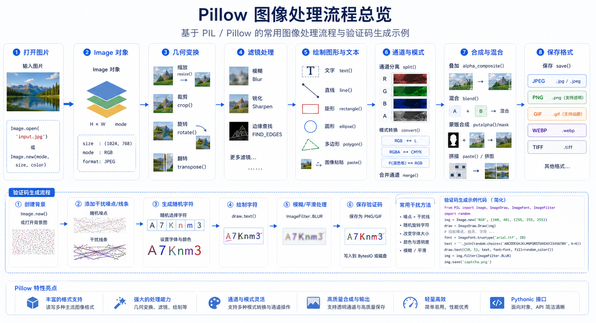

# Python Pillow 详解

## 简介

PIL：Python Imaging Library，已经是Python平台事实上的图像处理标准库了。PIL功能非常强大，但API却非常简单易用。

Pillow 是当前维护的 Python 图像处理库，本文锁定 12.3.0。处理外部图片前先限制文件大小和像素数，并把解码失败视为不可信输入错误。



## 安装

<!-- snippet: id=python-pillow-image-processing-01 mode=display python=3.12-3.14 deps=stdlib -->
```bash
python -m pip install Pillow
```

## 静态方法详解

### 图片打开与创建

| 方法 | 说明 | 示例 |
|------|------|------|
| `PIL.Image.open(fp, mode='r')` | 传入文件路径(str)，返回一个image对象 | `Image.open('test.jpg')` |
| `PIL.Image.new(mode, size, color=0)` | 创建新的图片 | `Image.new('RGB', (100, 100), (255, 0, 0))` |
| `PIL.Image.fromarray(obj, mode=None)` | 从数组中创建图片 | `Image.fromarray(array)` |
| `PIL.Image.frombytes(mode, size, data, decoder_name='raw', *args)` | 从二进制文件中创建图片 | - |
| `PIL.Image.fromstring(*args, **kw)` | 从字符串中创建文件 | - |
| `PIL.Image.frombuffer(mode, size, data, decoder_name='raw', *args)` | 从buffer中创建文件 | - |

### 图片混合与合成

| 方法 | 说明 | 示例 |
|------|------|------|
| `PIL.Image.alpha_composite(im1, im2)` | 混合两个图片 | - |
| `PIL.Image.blend(im1, im2, alpha)` | 通过对两个图片插值生成新的图片 | `blend(img1, img2, 0.5)` |
| `PIL.Image.composite(image1, image2, mask)` | 混合两个图片（带蒙版） | - |

### 其他静态方法

| 方法 | 说明 |
|------|------|
| `PIL.Image.eval(image, *args)` | 对图片应用表达式 |
| `PIL.Image.merge(mode, bands)` | 合并不同的bands为一个图片 |

## Image 对象方法

### 创建图片对象

<!-- snippet: id=python-pillow-image-processing-02 mode=compile python=3.12-3.14 deps=stdlib -->
```python
# 三种创建方式
img = Image.open('test.jpg')      # 从文件打开
img = Image.new('RGB', (100, 100))  # 创建空白图片
img = Image.fromarray(array)       # 从数组创建
```

### 图片基本操作

| 方法 | 说明 | 示例 |
|------|------|------|
| `Image.convert(mode=None, matrix=None, dither=None, palette=0, colors=256)` | 返回修改之后的副本 | `img.convert('L')` |
| `Image.copy()` | 复制该图片 | `img.copy()` |
| `Image.crop(box=None)` | 返回矩形的区域 | `img.crop((0, 0, 100, 100))` |
| `Image.resize(size, resample=0, box=None)` | 返回调整大小的图片 | `img.resize((200, 200))` |
| `Image.rotate(angle, resample=0, expand=0, center=None, translate=None)` | 旋转图像 | `img.rotate(45)` |
| `Image.thumbnail(size, resample=3)` | 生成缩略图（原地修改） | `img.thumbnail((100, 100))` |
| `Image.save(fp, format=None, **params)` | 保存图片 | `img.save('output.jpg')` |
| `Image.show(title=None, command=None)` | 展示图片 | `img.show()` |

### 图片信息获取

| 方法 | 说明 | 示例 |
|------|------|------|
| `Image.getbands()` | 返回图片的类型 | `img.getbands()` |
| `Image.getbbox()` | 计算非0的区域 | `img.getbbox()` |
| `Image.getcolors(maxcolors=256)` | 计算图片中的出现的颜色 | - |
| `Image.getdata(band=None)` | 返回这个图片的像素值 | - |
| `Image.getextrema()` | 获得最小和最大的像素值 | - |
| `Image.getpalette()` | 返回这个图片的调色板 | - |
| `Image.getpixel(xy)` | 返回指定像素的值 | `img.getpixel((0, 0))` |
| `Image.histogram(mask=None, extrema=None)` | 返回图片的柱状图 | - |
| `Image.size` | 返回图片尺寸 | `img.size` |
| `Image.format` | 返回图片格式 | `img.format` |
| `Image.mode` | 返回图片模式 | `img.mode` |

### 图片像素操作

| 方法 | 说明 |
|------|------|
| `Image.putpixel(xy, value)` | 更改指定位置的像素 |
| `Image.putdata(data, scale=1.0, offset=0.0)` | 复制像素 |
| `Image.paste(im, box=None, mask=None)` | 粘贴其他图片 |
| `Image.point(lut, mode=None)` | 点操作 |
| `Image.putalpha(alpha)` | 添加alpha层 |
| `Image.putpalette(data, rawmode='RGB')` | 添加调色板 |

### 图片滤镜与变换

| 方法 | 说明 |
|------|------|
| `Image.filter(filter)` | 使用过滤器过滤图片 |
| `Image.transform(size, method, data=None, resample=0, fill=1, fillcolor=None)` | 变形图片 |
| `Image.transpose(method)` | 翻转/旋转图片 |
| `Image.draft(mode, size)` | 根据模式调整大小 |

### 图片通道操作

| 方法 | 说明 |
|------|------|
| `Image.split()` | 分割成不同的bands |
| `Image.getchannel(channel)` | 返回单通道的图片 |
| `Image.tobitmap(name='image')` | 转换为bitmap |
| `Image.tobytes(encoder_name='raw', *args)` | 转化为二进制文件 |
| `Image.tostring(*args, **kw)` | 转化为字符串文件 |

### 其他方法

| 方法 | 说明 |
|------|------|
| `Image.alpha_composite(im, dest=(0, 0), source=(0, 0))` | 复合图片 |
| `Image.seek(frame)` | 跳转到指定帧 |
| `Image.tell()` | 返回当前框架的数字 |
| `Image.verify()` | 验证图片完整性 |
| `Image.fromstring(*args, **kw)` | 从字符串读取图片 |
| `Image.load()` | 加载图片到内存 |
| `Image.close()` | 关闭图片 |
| `Image.offset(xoffset, yoffset=None)` | 偏移图片 |
| `Image.quantize(colors=256, method=None, kmeans=0, palette=None)` | 量化颜色 |
| `Image.remap_palette(dest_map, source_palette=None)` | 重新调色 |

## 实用操作示例

### 图片缩放

来看看最常见的图像缩放操作，只需三四行代码：

<!-- snippet: id=python-pillow-image-processing-03 mode=compile python=3.12-3.14 deps=Pillow==12.3.0 -->
```python
from PIL import Image

# 打开一个jpg图像文件，注意是当前路径:
im = Image.open('test.jpg')

# 获得图像尺寸:
w, h = im.size
print('Original image size: %sx%s' % (w, h))

# 缩放到50%:
im.thumbnail((w//2, h//2))
print('Resize image to: %sx%s' % (w//2, h//2))

# 把缩放后的图像用jpeg格式保存:
im.save('thumbnail.jpg', 'jpeg')
```

> **说明**：`thumbnail()` 方法会原地修改图片，如果需要保留原图，先用 `copy()` 复制一份。

### 图片模糊效果

其他功能如切片、旋转、滤镜、输出文字、调色板等一应俱全。

比如，模糊效果也只需几行代码：

<!-- snippet: id=python-pillow-image-processing-04 mode=compile python=3.12-3.14 deps=Pillow==12.3.0 -->
```python
from PIL import Image, ImageFilter

# 打开一个jpg图像文件:
im = Image.open('test.jpg')

# 应用模糊滤镜:
im2 = im.filter(ImageFilter.BLUR)
im2.save('blur.jpg', 'jpeg')
```

### 生成字母验证码

PIL的`ImageDraw`提供了一系列绘图方法，让我们可以直接绘图。比如要生成字母验证码图片：

<!-- snippet: id=python-pillow-image-processing-05 mode=compile python=3.12-3.14 deps=Pillow==12.3.0 -->
```python
from PIL import Image, ImageDraw, ImageFont, ImageFilter
import random

def rndChar():
    """随机字母"""
    return chr(random.randint(65, 90))

def rndColor():
    """随机颜色1"""
    return (random.randint(64, 255), random.randint(64, 255), random.randint(64, 255))

def rndColor2():
    """随机颜色2"""
    return (random.randint(32, 127), random.randint(32, 127), random.randint(32, 127))

# 240 x 60:
width = 60 * 4
height = 60
image = Image.new('RGB', (width, height), (255, 255, 255))

# 创建Font对象:
font = ImageFont.truetype('Arial.ttf', 36)

# 创建Draw对象:
draw = ImageDraw.Draw(image)

# 填充每个像素:
for x in range(width):
    for y in range(height):
        draw.point((x, y), fill=rndColor())

# 输出文字:
for t in range(4):
    draw.text((60 * t + 10, 10), rndChar(), font=font, fill=rndColor2())

# 模糊:
image = image.filter(ImageFilter.BLUR)
image.save('code.jpg', 'jpeg')
```

> **说明**：我们用随机颜色填充背景，再画上文字，最后对图像进行模糊，得到验证码。

### 字体问题处理

如果运行的时候报错：

<!-- snippet: id=python-pillow-image-processing-06 mode=display python=3.12-3.14 deps=stdlib -->
```text
IOError: cannot open resource
```

这是因为PIL无法定位到字体文件的位置，可以根据操作系统提供绝对路径，比如：

<!-- snippet: id=python-pillow-image-processing-07 mode=compile python=3.12-3.14 deps=stdlib -->
```python
# macOS
'/Library/Fonts/Arial.ttf'

# Linux
'/usr/share/fonts/truetype/dejavu/DejaVuSans.ttf'

# Windows
'C:/Windows/Fonts/Arial.ttf'
```

## 常用滤镜一览

| 滤镜 | 说明 |
|------|------|
| `ImageFilter.BLUR` | 模糊 |
| `ImageFilter.CONTOUR` | 轮廓 |
| `ImageFilter.DETAIL` | 细节增强 |
| `ImageFilter.EDGE_ENHANCE` | 边缘增强 |
| `ImageFilter.EDGE_ENHANCE_MORE` | 深度边缘增强 |
| `ImageFilter.EMBOSS` | 浮雕效果 |
| `ImageFilter.FIND_EDGES` | 边缘查找 |
| `ImageFilter.SMOOTH` | 平滑 |
| `ImageFilter.SMOOTH_MORE` | 深度平滑 |
| `ImageFilter.SHARPEN` | 锐化 |

## 最佳实践

### 1. 使用上下文管理器

<!-- snippet: id=python-pillow-image-processing-08 mode=compile python=3.12-3.14 deps=Pillow==12.3.0 -->
```python
from PIL import Image

# 推荐写法
with Image.open('photo.jpg') as img:
    img.thumbnail((200, 200))
    img.save('thumbnail.jpg')
```

### 2. 合理的图片格式选择

| 场景 | 推荐格式 | 原因 |
|------|----------|------|
| 照片 | JPEG | 高压缩比，适合照片 |
| 图标/透明图 | PNG | 支持透明通道 |
| 网页图片 | WebP | 现代格式，更小体积 |
| 动图 | GIF | 支持动画 |
| 文档扫描 | PNG/TIFF | 无损压缩 |

### 3. 注意内存管理

<!-- snippet: id=python-pillow-image-processing-09 mode=compile python=3.12-3.14 deps=Pillow==12.3.0 -->
```python
# 大图片处理时注意内存
from PIL import Image

# 不要一次性加载多个大图片
img = Image.open('big_image.jpg')
img.verify()  # 先验证图片完整性
img = Image.open('big_image.jpg')  # 再重新打开
```

## 更多资源

要详细了解PIL的强大功能，请参考Pillow官方文档：

> **官方文档**：<https://pillow.readthedocs.org/>

---
