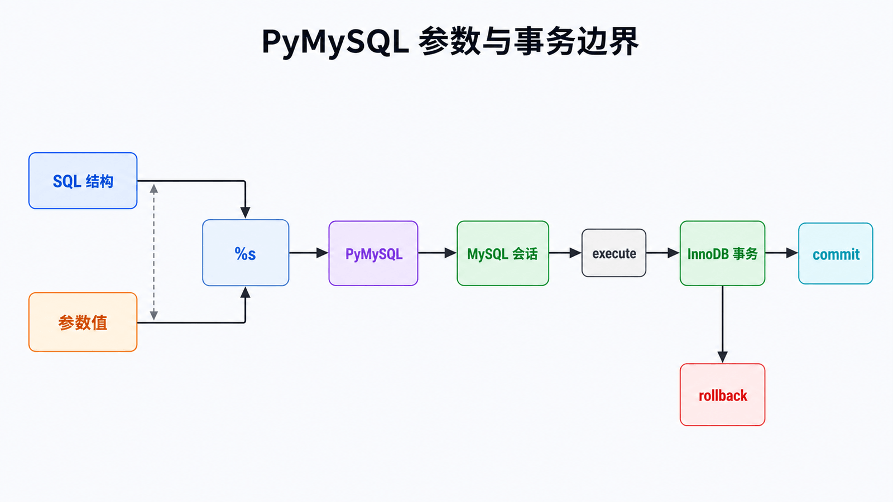

# Python PyMySQL 详解：参数绑定与事务边界

## 前置知识与学习目标

你需要理解 SQL 的 `SELECT`、`INSERT`、`UPDATE` 与数据库事务。本文只解决：**Python 发出多条 SQL 后，如何保证参数安全、资源释放和业务原子性？**

完成后你应能解释连接与游标的职责，正确使用参数绑定，并用 `commit()`/`rollback()` 定义订单写入的事务边界。

## 直觉：execute 成功不等于提交成功

PyMySQL 实现 Python DB-API 风格接口。连接代表一次数据库会话和事务上下文，游标负责发送语句与读取结果。默认关闭自动提交时，`cursor.execute()` 成功只表示语句在当前事务中执行，只有 `connection.commit()` 成功后其他事务才能稳定观察到结果。

<!-- figure-anchor:s49-f01 -->

## 查询与事务的调用链



调用链是：应用参数 → PyMySQL 参数编码 → MySQL 会话 → InnoDB 事务 → `commit` 或 `rollback`。SQL 文本结构与参数值必须分离；占位符 `%s` 由驱动处理，不是 Python 字符串格式化。

## 安全查询

```python
import pymysql
from pymysql.cursors import DictCursor

connection = pymysql.connect(
    host="127.0.0.1",
    port=3306,
    user="shop_app",
    password="从环境或密钥服务读取",
    database="shop",
    charset="utf8mb4",
    cursorclass=DictCursor,
    autocommit=False,
    connect_timeout=5,
    read_timeout=10,
    write_timeout=10,
)

with connection:
    with connection.cursor() as cursor:
        cursor.execute(
            "SELECT sku, stock FROM products WHERE sku = %s",
            ("A-001",),
        )
        row = cursor.fetchone()
        assert row is None or row["sku"] == "A-001"
```

单参数也必须写成一元元组 `("A-001",)`。参数绑定只保护**值**；表名、列名和排序方向不能作为普通参数传入。动态标识符应从固定白名单映射，不要拼接用户输入。

## 原子订单写入

```python
def reserve_stock(connection, order_id: str, sku: str, qty: int) -> None:
    if qty <= 0:
        raise ValueError("qty must be positive")

    try:
        with connection.cursor() as cursor:
            affected = cursor.execute(
                """
                UPDATE products
                   SET stock = stock - %s
                 WHERE sku = %s AND stock >= %s
                """,
                (qty, sku, qty),
            )
            if affected != 1:
                raise ValueError("unknown sku or insufficient stock")

            cursor.execute(
                "INSERT INTO reservations(order_id, sku, qty) VALUES (%s, %s, %s)",
                (order_id, sku, qty),
            )
        connection.commit()
    except Exception:
        connection.rollback()
        raise
```

输入是订单、SKU、数量；关键中间状态是库存更新影响行数；输出是“库存扣减与预留记录同时提交”。条件更新把检查与扣减合为一条原子语句，避免“先查库存、再更新”之间的竞态。`order_id` 应有唯一约束，以承接重试和幂等要求。

## 连接与失败边界

长生命周期服务应使用经过验证的连接池，而不是共享一个全局连接。连接断开后，驱动不能判断服务端是否已经提交；对写请求盲目重试可能重复写入，所以重试必须结合幂等键和数据库唯一约束。

批量写入可用 `executemany()`，但仍需控制批次大小、事务时长和错误定位。大结果集使用服务端游标可降低客户端内存，但会更久占用连接。

## 常见误区与适用边界

- 不要用 f-string、`%` 或 `.format()` 拼接 SQL 值。
- 不要把明文密码写入源码或命令行历史。
- `DictCursor` 便于按列名读取，但不是 ORM，也不会跟踪对象关系。
- 需要实体映射、关系加载和 Unit of Work 时使用 SQLAlchemy；只需少量明确 SQL 时 PyMySQL 更直接。

## 三道自检题

1. 为什么 `execute()` 成功后仍可能需要 `rollback()`？
2. 参数绑定能否安全替换列名？
3. 网络断开后为何不能直接重试一次写操作？

<details>
<summary>展开答案</summary>

1. 后续语句或提交仍可能失败，当前事务中的部分修改必须撤销。
2. 不能；参数只表示值，标识符必须来自受控白名单。
3. 客户端可能不知道服务端是否已提交，重试会产生重复副作用，需幂等键与唯一约束。

</details>

## 本篇总结

PyMySQL 的可靠使用围绕三条边界：SQL 结构与参数值分离、业务修改包含在明确事务中、连接失败通过幂等约束恢复。

## 下一篇衔接

数据库约束是最后防线，但越早拒绝无效输入越容易解释。下一篇用 Pydantic 在系统边界完成解析、验证、规范化与序列化。

## 资料来源

- [PyMySQL Examples](https://pymysql.readthedocs.io/en/latest/user/examples.html)
- [PyMySQL API](https://pymysql.readthedocs.io/en/latest/modules/index.html)
- [Python DB-API 2.0](https://peps.python.org/pep-0249/)
