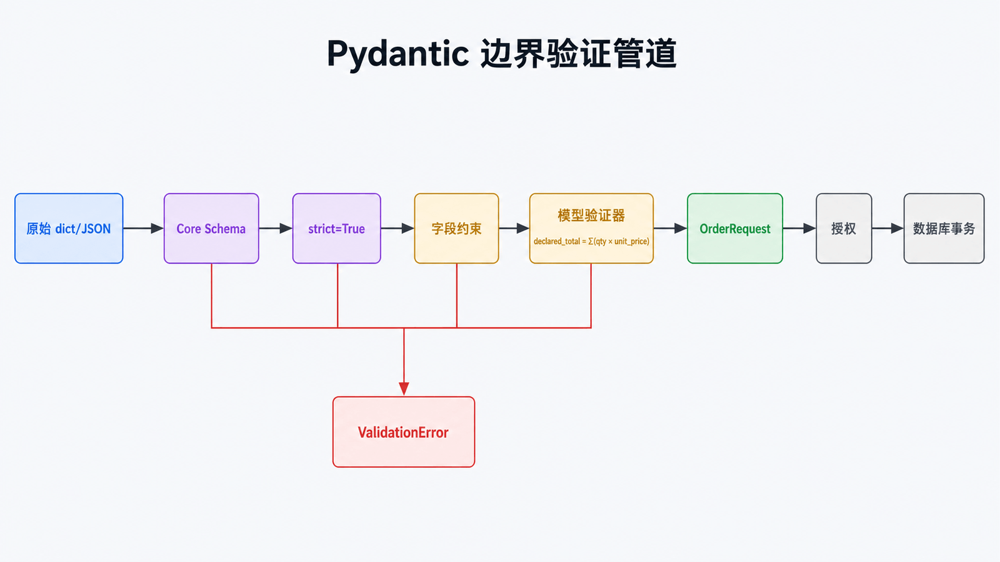

# Python Pydantic 详解：边界验证与序列化

## 前置知识与学习目标

你需要会写类型注解与类。本文只回答：**外部 JSON 如何变成满足业务不变量的 Python 对象，并在输出时避免泄露或语义漂移？**

完成后你应能区分类型转换与严格验证，选择字段验证器或模型验证器，并解释 `model_validate()`、`model_dump()` 与数据库模型的边界。

## 直觉：类型注解不会在运行时自动验数据

普通类型注解主要服务静态分析；Pydantic 根据注解构建运行时核心 Schema，输入依次经过解析、字段约束、字段验证器、模型验证器，成功后得到模型，失败则产生结构化 `ValidationError`。

<!-- figure-anchor:s50-f01 -->

## 从原始输入到可信模型



把 `dict` 当作不可信输入，把 Pydantic 模型当作通过当前 Schema 的边界对象。验证通过不代表数据已获授权，也不代表数据库写入成功；认证、权限、唯一约束和事务仍属于其他层。

## 最小订单模型

```python
from decimal import Decimal
from typing import Annotated

from pydantic import BaseModel, ConfigDict, Field, ValidationError, model_validator

PositiveQty = Annotated[int, Field(gt=0, le=100)]

class OrderLine(BaseModel):
    model_config = ConfigDict(extra="forbid", strict=True)

    sku: str = Field(min_length=1, max_length=32, pattern=r"^[A-Z0-9-]+$")
    qty: PositiveQty
    unit_price: Decimal = Field(ge=Decimal("0"), max_digits=10, decimal_places=2)

class OrderRequest(BaseModel):
    model_config = ConfigDict(extra="forbid", strict=True)

    order_id: str = Field(pattern=r"^O-[0-9]+$")
    lines: list[OrderLine] = Field(min_length=1, max_length=50)
    declared_total: Decimal = Field(ge=Decimal("0"))

    @model_validator(mode="after")
    def total_matches(self) -> "OrderRequest":
        calculated = sum((line.unit_price * line.qty for line in self.lines), Decimal("0"))
        if calculated != self.declared_total:
            raise ValueError(f"declared_total {self.declared_total} != {calculated}")
        return self

payload = {
    "order_id": "O-1001",
    "lines": [{"sku": "A-001", "qty": 2, "unit_price": Decimal("19.90")}],
    "declared_total": Decimal("39.80"),
}
order = OrderRequest.model_validate(payload)
assert order.lines[0].qty == 2
```

输入是原始映射；中间状态包含每个字段的解析和约束结果；输出是 `OrderRequest`。严格模式下字符串 `"2"` 不会被静默转换成整数 `2`，适合不希望宽松转换的 API 边界。

## 错误是结构化数据

```python
try:
    OrderRequest.model_validate({"order_id": "bad", "lines": [], "declared_total": 0})
except ValidationError as exc:
    for issue in exc.errors():
        print(issue["loc"], issue["type"], issue["msg"])
```

对外响应应保留字段路径与稳定错误码，同时避免回显密码、令牌或完整敏感输入。不要依赖错误英文文本做程序分支。

## 序列化边界

`model_dump()` 返回 Python 对象，`model_dump_json()` 生成 JSON。输出模型应与输入模型分离，使用 `include`/`exclude`、别名和专门响应模型控制字段；“字段没展示在前端”不等于“不会被序列化”。

从 ORM 属性创建模型时显式启用 `ConfigDict(from_attributes=True)`。Pydantic 负责边界数据，不负责数据库 Session、懒加载或事务。

## 常见误区与适用边界

- `Optional[T]` 表示值可为 `None`，不自动表示字段可省略；是否必填由默认值决定。
- 验证器应确定、快速、无外部副作用；数据库查询和网络调用放在服务层。
- `model_construct()` 跳过验证，只应用于已经可信且有性能证据的内部路径。
- Pydantic 不替代静态类型检查，也不替代数据库约束。

## 三道自检题

1. `strict=True` 改变了什么？
2. 跨字段总额校验为什么使用模型验证器？
3. 为什么输入模型与输出模型应分开？

<details>
<summary>展开答案</summary>

1. 禁止一部分宽松类型转换，使输入类型更接近声明类型。
2. 它依赖 `lines` 与 `declared_total` 多个字段的最终值。
3. 两个边界的允许字段不同，分开可防止内部或敏感字段意外泄露。

</details>

## 本篇总结

Pydantic 把边界契约变成可执行 Schema：解析、约束、跨字段不变量和序列化规则都可集中验证。可信模型仍需进入授权和事务层完成业务。

## 下一篇衔接

下一篇处理带命名空间和层级结构的 XML。我们会把“边界验证”延伸到 ElementTree 的标签解析、流式清理和 SAP Fiori XML 视图字段提取。

## 资料来源

- [Pydantic Models](https://docs.pydantic.dev/latest/concepts/models/)
- [Pydantic Validators](https://docs.pydantic.dev/latest/concepts/validators/)
- [Pydantic Strict Mode](https://docs.pydantic.dev/latest/concepts/strict_mode/)
- [Pydantic Serialization](https://docs.pydantic.dev/latest/concepts/serialization/)
