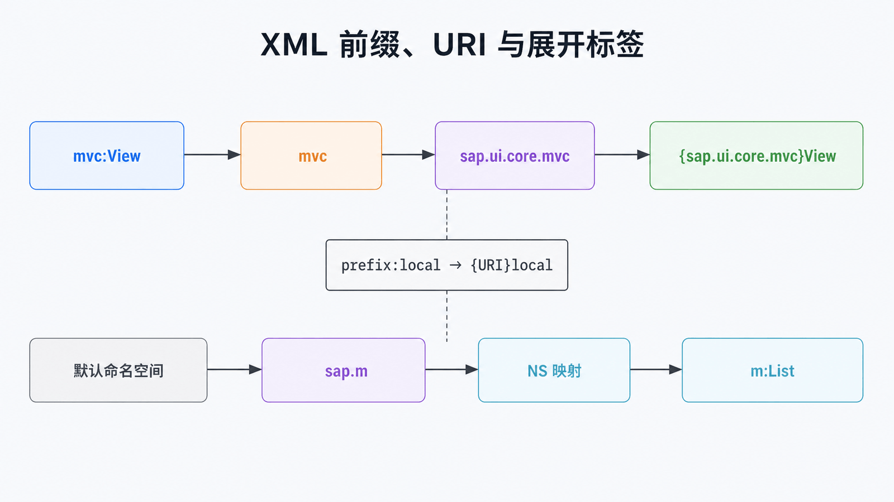
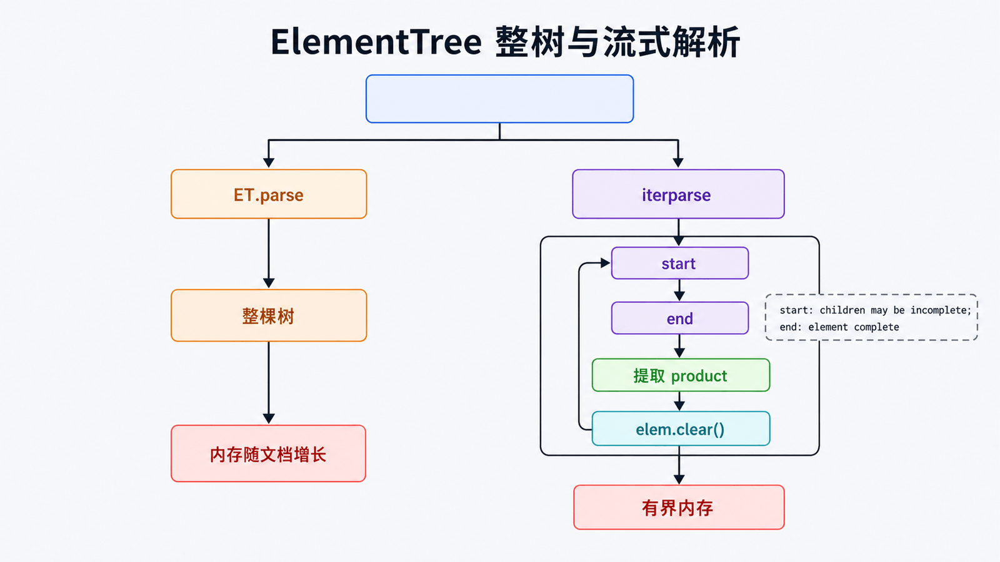

# Python SAP Fiori XML 解析：命名空间与流式处理

## 前置知识与学习目标

你需要理解 XML 元素、属性与自闭合标签。本文只解决：**如何在命名空间存在时准确定位 SAPUI5 XML View 节点，并在大文件中控制内存？**

完成后你应能解释 `{URI}local-name` 展开形式，使用命名空间映射查询，选择整树解析或 `iterparse()`，并识别不可信 XML 的安全边界。

## 直觉：前缀不是命名空间本身

XML 中 `mvc:View` 的 `mvc` 只是当前文档的别名，真正身份是命名空间 URI 与本地名的组合。ElementTree 会把它展开成 `{sap.ui.core.mvc}View`。因此不要靠字符串切割冒号判断元素类型。

<!-- figure-anchor:s51-f01 -->

## 命名空间如何进入 ElementTree



解析链是：XML 字节/文本 → 命名空间声明 → 展开标签 → Element 树 → XPath 子集查询 → 已校验的绑定记录。

## 最小 SAPUI5 XML View 示例

```python
from xml.etree import ElementTree as ET

XML = """
<mvc:View xmlns:mvc="sap.ui.core.mvc" xmlns="sap.m">
  <Page title="商品">
    <List items="{/Products}">
      <StandardListItem title="{Name}" description="{Price}" />
    </List>
  </Page>
</mvc:View>
"""

NS = {"mvc": "sap.ui.core.mvc", "m": "sap.m"}
root = ET.fromstring(XML)

assert root.tag == "{sap.ui.core.mvc}View"
list_node = root.find(".//m:List", NS)
if list_node is None:
    raise ValueError("missing sap.m List")

item = list_node.find("m:StandardListItem", NS)
if item is None:
    raise ValueError("missing StandardListItem template")

result = {
    "collection": list_node.get("items"),
    "title": item.get("title"),
    "description": item.get("description"),
}
assert result == {
    "collection": "{/Products}",
    "title": "{Name}",
    "description": "{Price}",
}
```

默认命名空间中的 `Page`、`List` 也必须使用我们自定义的 `m:` 前缀查询。这个前缀只存在于 Python 查询映射中，不要求与源 XML 使用相同名称。

## 整树、事件与流式解析



- `ET.fromstring()` / `ET.parse()`：构造整棵树，适合中小文件和需要父子关系的查询；
- `iterparse()`：边读边产生 `start`/`end` 事件，适合大 XML；
- `XMLPullParser`：由调用方主动 `feed()`，适合异步或分块输入。

```python
from xml.etree import ElementTree as ET

def iter_products(path):
    tag = "{urn:shop}product"
    for event, elem in ET.iterparse(path, events=("end",)):
        if elem.tag == tag:
            yield {"sku": elem.get("sku"), "name": (elem.text or "").strip()}
            elem.clear()  # 消费完成后释放子树
```

`iterparse()` 的 `start` 事件只保证看到了开始符号，属性可用但子节点和文本未必完整；提取完整元素通常使用 `end` 事件并及时 `clear()`。

## 安全与序列化边界

标准库文档明确提醒 XML 模块不适合直接处理恶意构造数据的所有场景。外部上传应限制字节数、嵌套深度和处理时间，禁用或避免外部实体能力；高风险场景评估 `defusedxml`。

写回 XML 时，`encoding="unicode"` 返回字符串，其他编码产生字节。属性顺序不应承载业务语义；需要签名或字节级比较时使用规范化流程，而不是普通 `write()` 输出。

## 常见误区与适用边界

- `find()` 的 Element 在旧式真值判断中可能因无子节点而为假；明确使用 `is None`。
- ElementTree 只支持 XPath 子集；复杂 XPath/XSLT 需求可评估 `lxml`。
- SAX/事件流节省内存，但状态管理更复杂；小文件无需机械使用流式解析。
- 解析 XML View 只能看静态声明，不能执行 SAPUI5 控制器或运行时绑定。

## 三道自检题

1. 为什么源 XML 的默认命名空间在查询中也需要前缀？
2. `iterparse()` 为何通常在 `end` 事件提取数据？
3. `elem.clear()` 解决什么问题？

<details>
<summary>展开答案</summary>

1. ElementTree 按 URI 展开标签，查询必须提供命名空间映射；Python 前缀只是查询别名。
2. 到 `end` 事件时元素的文本和子节点才完整。
3. 释放已处理子树，避免大文件解析时内存随元素数量持续增长。

</details>

## 本篇总结

XML 解析的关键不是遍历 API，而是正确的元素身份与生命周期：用 URI 处理命名空间，用 `end` 事件获得完整节点，用清理和资源限制守住大文件与不可信输入边界。

## 下一篇衔接

解析出的实体最终常进入关系数据库。下一篇用 SQLAlchemy 2.0 说明类型化映射、Session、Unit of Work 与关系加载，解释 ORM 在对象和 SQL 之间做了什么。

## 资料来源

- [Python ElementTree](https://docs.python.org/3/library/xml.etree.elementtree.html)
- [Python XML security](https://docs.python.org/3/library/xml.html#xml-security)
- [SAPUI5 XML Views](https://ui5.sap.com/#/topic/91f292806f4d1014b6dd926db0e91070)
