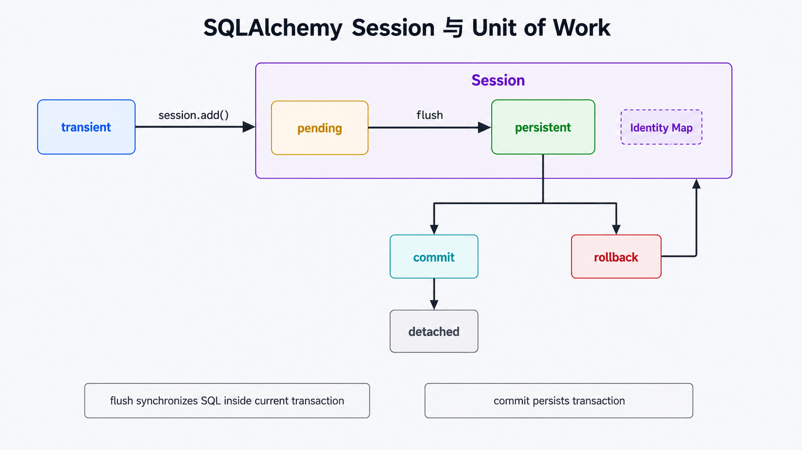
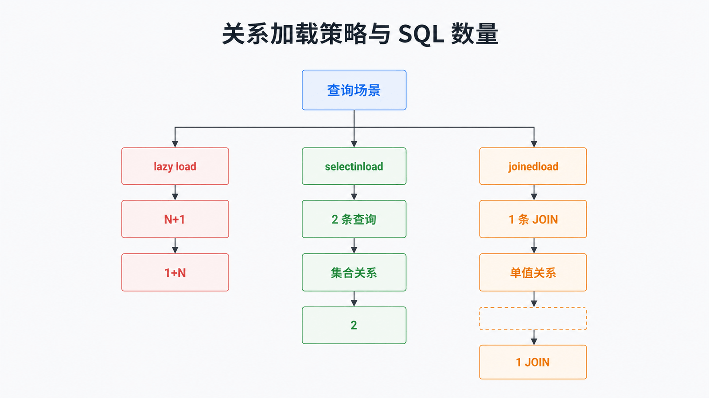

# Python SQLAlchemy ORM 详解：Session 与 Unit of Work

## 前置知识与学习目标

你需要理解表、主键、外键和事务。本文只回答：**Python 对象被修改后，SQLAlchemy 如何决定何时生成 SQL、何时提交，以及同一行在 Session 中为何只有一个对象身份？**

完成后你应能使用 SQLAlchemy 2.0 类型化声明，区分 `flush()` 与 `commit()`，并为一对多关系选择可预测的加载策略。

## 组件职责

- `Engine`：数据库方言与连接池入口，不代表某个业务事务；
- 映射类：描述 Python 属性与表列/关系的对应；
- `Session`：对象身份映射、变更跟踪和事务工作区；
- Unit of Work：在 flush 时按依赖顺序生成 `INSERT`、`UPDATE`、`DELETE`。

<!-- figure-anchor:s52-f01 -->

## 对象状态与事务调用链



典型状态为 transient（未加入 Session）→ pending → persistent → detached。`flush()` 把待变更同步到当前数据库事务，使主键等结果可用；`commit()` 提交事务。flush 失败后必须 rollback，不能继续复用失败事务。

## SQLAlchemy 2.0 类型化模型

```python
from __future__ import annotations

from decimal import Decimal
from sqlalchemy import ForeignKey, Numeric, String, create_engine, select
from sqlalchemy.orm import DeclarativeBase, Mapped, Session, mapped_column, relationship

class Base(DeclarativeBase):
    pass

class Order(Base):
    __tablename__ = "orders"

    id: Mapped[int] = mapped_column(primary_key=True)
    order_no: Mapped[str] = mapped_column(String(32), unique=True)
    lines: Mapped[list[OrderLine]] = relationship(
        back_populates="order",
        cascade="all, delete-orphan",
    )

class OrderLine(Base):
    __tablename__ = "order_lines"

    id: Mapped[int] = mapped_column(primary_key=True)
    order_id: Mapped[int] = mapped_column(ForeignKey("orders.id"))
    sku: Mapped[str] = mapped_column(String(32))
    amount: Mapped[Decimal] = mapped_column(Numeric(10, 2))
    order: Mapped[Order] = relationship(back_populates="lines")

engine = create_engine("sqlite+pysqlite:///:memory:")
Base.metadata.create_all(engine)
```

`Mapped[T]` 同时提供类型信息和映射语义；是否可空可由 `T | None` 推导，但关键约束仍建议显式审阅数据库 DDL。

## 一次 Unit of Work

```python
with Session(engine) as session:
    with session.begin():
        order = Order(
            order_no="O-1001",
            lines=[OrderLine(sku="A-001", amount=Decimal("39.80"))],
        )
        session.add(order)
        session.flush()
        assert order.id is not None

with Session(engine) as session:
    found = session.scalar(select(Order).where(Order.order_no == "O-1001"))
    assert found is not None
```

`session.begin()` 正常退出时提交，异常时回滚。数据库唯一约束仍是并发下防止重复订单的最终保证；“先查询不存在再插入”不能替代唯一约束。

## Identity Map 与关系加载



同一 Session 内，同一主键通常映射到同一个 Python 对象，便于变更跟踪，但 Session 不是全局缓存，也不是线程/协程间共享容器。Web 应用常采用“一次请求一个 Session”。

关系默认惰性加载可能产生 N+1 查询，并在 Session 已关闭后失败。对已知要展示的集合，使用 `selectinload()`；对单值或适合 JOIN 的关系可评估 `joinedload()`。加载策略应由查询场景决定，而不是全局设成“全部 eager”。

## 常见误区与适用边界

- `flush()` 不是 `commit()`；它仍可回滚。
- Session 持有数据库资源与对象状态，不要作为单例长期共享。
- ORM 降低重复映射代码，但不会消除 SQL、索引、锁和事务知识。
- 批量 ETL、复杂报表或数据库特有语句可直接使用 SQLAlchemy Core/文本 SQL，并保留参数绑定。

## 三道自检题

1. `flush()` 与 `commit()` 的区别是什么？
2. Identity Map 为什么不是应用缓存？
3. 如何发现并缓解 N+1 查询？

<details>
<summary>展开答案</summary>

1. flush 只把变更同步到当前事务；commit 才使事务持久化并结束该事务。
2. 它只在单个 Session 生命周期内维护对象身份，不能替代跨请求缓存。
3. 记录 SQL 数量与调用位置，并按场景使用 `selectinload()`/`joinedload()` 等显式加载策略。

</details>

## 本篇总结

ORM 的核心不是“免写 SQL”，而是 Session 中的对象身份与 Unit of Work。明确 Session 生命周期、事务边界和加载策略，生成的 SQL 才可预测。

## 下一篇衔接

下一篇回到函数层：使用 `functools` 在不破坏元数据和调用契约的前提下定制、包装、缓存与分派函数。

## 资料来源

- [SQLAlchemy 2.0 ORM](https://docs.sqlalchemy.org/en/20/orm/)
- [ORM Quick Start](https://docs.sqlalchemy.org/en/20/orm/quickstart.html)
- [Session Basics](https://docs.sqlalchemy.org/en/20/orm/session_basics.html)
- [Relationship Loading Techniques](https://docs.sqlalchemy.org/en/20/orm/queryguide/relationships.html)
