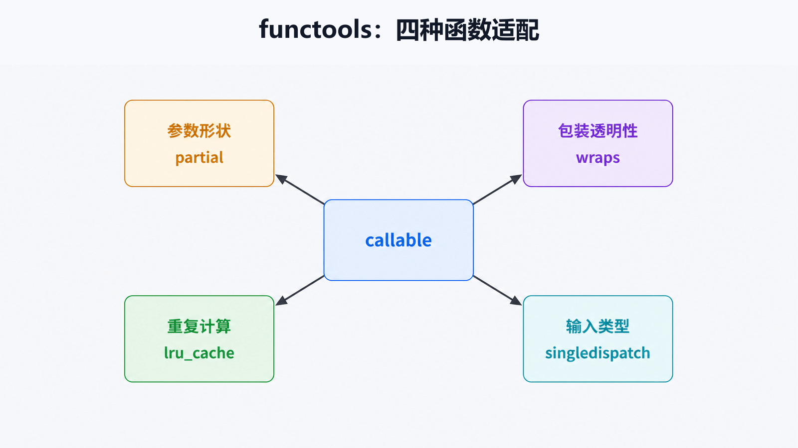

# Python functools 详解：保持函数契约的适配

## 前置知识与学习目标

你需要理解函数是一等对象、闭包和装饰器。本文只解决：**如何改变函数的调用方式或执行策略，同时保留可调试、可测试的函数契约？**

完成后你应能选择 `partial`、`wraps`、`lru_cache` 或 `singledispatch`，解释它们改变了什么，并识别缓存副作用与错误分派边界。

## 四种不同的适配

- `partial`：预绑定部分参数，生成新的可调用对象；
- `wraps`：包装时复制元数据并设置 `__wrapped__`；
- `lru_cache`/`cache`：按可哈希参数缓存返回值；
- `singledispatch`：按第一个参数的运行时类型选择实现。

<!-- figure-anchor:s53-f01 -->

## 调用契约如何被保留或改变



这四个工具都作用于 callable，但解决的问题不同：参数形状、包装透明性、重复计算和类型分派不能混为“装饰器技巧”。

## partial：把配置变成专用函数

```python
from functools import partial

def calculate_total(qty: int, unit_price: int, *, discount: float) -> float:
    return qty * unit_price * discount

vip_total = partial(calculate_total, discount=0.9)
assert vip_total(2, 100) == 180
```

`partial` 不执行原函数，只保存预绑定参数。它适合回调和依赖注入，不适合隐藏频繁变化的全局状态。

## wraps：让装饰器保持可观测性

```python
from functools import wraps
from time import perf_counter

def timed(func):
    @wraps(func)
    def wrapper(*args, **kwargs):
        started = perf_counter()
        try:
            return func(*args, **kwargs)
        finally:
            print(f"{func.__name__}: {perf_counter() - started:.6f}s")
    return wrapper

@timed
def normalize_sku(value: str) -> str:
    """Normalize an SKU for comparison."""
    return value.strip().upper()

assert normalize_sku(" a-1 ") == "A-1"
assert normalize_sku.__name__ == "normalize_sku"
assert normalize_sku.__wrapped__(" b-2 ") == "B-2"
```

没有 `wraps` 时，日志、帮助系统、测试工具和框架可能只看到 `wrapper`。`__wrapped__` 还允许检查或显式调用原函数。

## 缓存：只缓存纯且有界的计算

```python
from functools import lru_cache

@lru_cache(maxsize=256)
def tax_rate(region: str, policy_version: str) -> float:
    table = {("east", "2026-07"): 0.06, ("west", "2026-07"): 0.05}
    return table[(region, policy_version)]

assert tax_rate("east", "2026-07") == 0.06
print(tax_rate.cache_info())
tax_rate.cache_clear()
```

参数必须可哈希；返回的可变对象会被所有命中者共享。外部数据会变化时，把版本纳入缓存键或明确失效。不要缓存依赖当前时间、用户权限或隐式环境的函数，除非这些因素全部进入键。

## singledispatch：按输入类型扩展

```python
from functools import singledispatch

@singledispatch
def normalize(value):
    raise TypeError(f"unsupported type: {type(value).__name__}")

@normalize.register
def _(value: str) -> str:
    return value.strip()

@normalize.register
def _(value: int) -> int:
    return value

assert normalize(" A ") == "A"
assert normalize(3) == 3
```

它只按第一个参数的类型分派，不按返回类型或多个参数组合分派。若规则由业务值而不是类型决定，普通映射或策略对象更清楚。

## 常见误区与适用边界

- `wraps` 保留元数据，不会自动让装饰器保持原函数签名语义或线程安全。
- `lru_cache` 不是跨进程缓存，每个进程各有一份。
- 实例方法缓存可能把 `self` 留在缓存键中，延长对象生命周期。
- 不要为了“函数式”而堆叠难以调试的装饰器；契约不清时用显式函数或类。

## 三道自检题

1. `partial` 与立即调用函数有什么区别？
2. `wraps` 为什么设置 `__wrapped__`？
3. 哪类函数不适合 `lru_cache`？

<details>
<summary>展开答案</summary>

1. `partial` 保存部分参数并返回 callable，不执行原函数。
2. 让检查、调试和测试工具能访问被包装函数。
3. 有副作用、依赖隐式易变状态、参数不可哈希或返回可变共享对象且无隔离策略的函数。

</details>

## 本篇总结

`functools` 的价值在于显式适配函数契约。先判断要改变的是参数、包装、计算复用还是类型分派，再选择最小工具并保留可观测性。

## 下一篇衔接

系列最后一篇把函数和数据放进基础设施边界：RabbitMQ 负责可靠传递事件，Memcached 只负责可丢失缓存，两者不能互换。

## 资料来源

- [Python functools](https://docs.python.org/3/library/functools.html)
