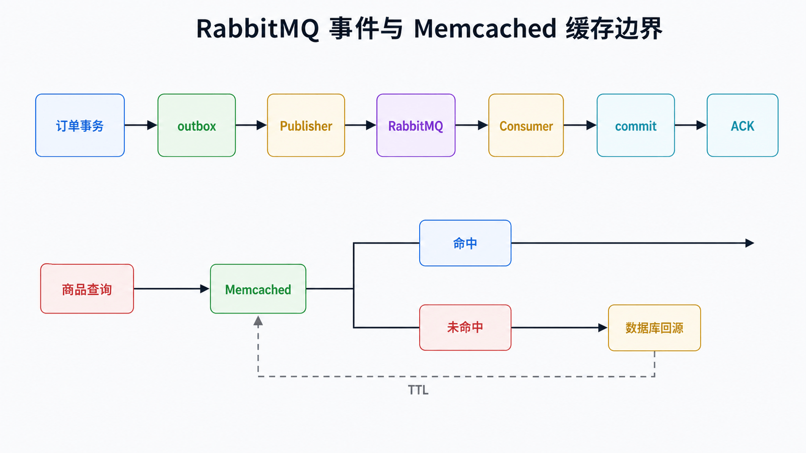
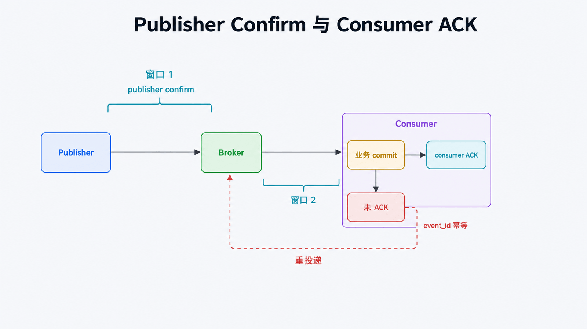

# Python 操作 RabbitMQ 与 Memcached：消息和缓存边界

## 前置知识与学习目标

你需要理解网络服务、序列化和数据库事务。本文只回答：**什么时候数据必须通过消息可靠交付，什么时候只应作为可随时丢弃的缓存？**

完成后你应能区分 RabbitMQ 与 Memcached 的数据语义，解释发布确认、消费 ACK、重投递和缓存回源，并避免把缓存当作事实来源。

## 先按“丢失后果”选择组件

订单已创建事件丢失会让下游漏处理，需要 RabbitMQ 一类消息代理；商品详情缓存丢失只会让下一次请求变慢，适合 Memcached。RabbitMQ 不是长期业务数据库，Memcached 也不是可靠队列。

<!-- figure-anchor:s54-f01 -->

## 同一业务中的两条数据路径



可靠事件路径：数据库事务 → outbox → Publisher → Exchange → Queue → Consumer → 业务提交 → ACK。缓存路径：请求 → Memcached → 命中直接返回；未命中 → 数据库 → 回填 TTL → 返回。两条路径共享业务 ID，但失败语义完全不同。

## RabbitMQ：确认与幂等



```python
import json
import pika

connection = pika.BlockingConnection(pika.ConnectionParameters("localhost"))
channel = connection.channel()
channel.queue_declare(queue="order.created", durable=True)
channel.confirm_delivery()

body = json.dumps({"event_id": "evt-1001", "order_id": "O-1001"}).encode()
channel.basic_publish(
    exchange="",
    routing_key="order.created",
    body=body,
    properties=pika.BasicProperties(
        content_type="application/json",
        delivery_mode=pika.DeliveryMode.Persistent,
        message_id="evt-1001",
    ),
    mandatory=True,
)
connection.close()
```

持久队列、持久消息和 publisher confirms 共同缩小 Producer → Broker 的丢失窗口，但仍不等于 Consumer 已完成。消费者使用手动 ACK：业务事务提交后 `basic_ack()`；瞬时失败可有限重试或 `basic_nack(requeue=True)`，永久失败进入死信队列。连接关闭时未 ACK 消息会重排队，因此消费者必须以 `event_id` 幂等。

`basic_qos(prefetch_count=N)` 限制未确认在途消息，避免慢消费者内存失控。N 需要根据处理时延、并发度和负载测试确定，不是越大越好。

## Memcached：Cache-Aside

```python
import json
from pymemcache.client.base import Client

cache = Client(("127.0.0.1", 11211), connect_timeout=0.2, timeout=0.5)

def get_product(product_id: str, load_from_db):
    key = f"product:v2:{product_id}"
    try:
        cached = cache.get(key)
    except OSError:
        cached = None  # 缓存故障降级为回源，而不是业务失败

    if cached is not None:
        return json.loads(cached)

    product = load_from_db(product_id)
    if product is None:
        return None

    try:
        cache.set(key, json.dumps(product), expire=300)
    except OSError:
        pass
    return product
```

Key 包含 Schema 版本，TTL 限制陈旧时间。数据库更新后可删除对应 Key；仍要接受并发读写形成的短暂旧值。高并发热点未命中可用请求合并、随机 TTL 或预热缓解击穿，不能用无限 TTL 掩盖失效设计。

## 一致性与失败边界

数据库提交与 RabbitMQ 发布不在同一原子事务中时，使用 outbox 避免“库已写、消息未发”。不要把“先发布再提交数据库”当作解决方案，它会产生幽灵事件。

Memcached 节点重启、淘汰或扩缩容都会丢缓存，业务必须始终能回源。缓存内容仍可能包含敏感数据；网络隔离、鉴权替代方案、Key 设计和日志脱敏都要在应用边界处理。

## 常见误区与适用边界

- publisher confirm 与 consumer ACK 相互独立，分别覆盖链路两端。
- 重投递不是异常边角，而是至少一次交付的正常状态。
- Memcached 的 `add`/`incr` 是原子命令，但不把它变成可靠分布式锁或事务存储。
- 消息堆积看队列长度还不够，还要看最老消息年龄、消费速率、重投递与死信率。

## 三道自检题

1. 为什么持久消息加持久队列仍需要 publisher confirms？
2. 消费者为什么必须幂等？
3. Memcached 故障时业务应如何表现？

<details>
<summary>展开答案</summary>

1. 持久属性不证明 Broker 已接管本次发布，confirm 才反馈 Producer 到 Broker 的接收结果。
2. 未 ACK 消息会在连接丢失等情况下重投递，同一事件可能处理多次。
3. 将其视为缓存未命中并回源事实数据库，允许性能下降但不改变业务正确性。

</details>

## 本篇总结

组件选择先看数据语义：RabbitMQ 承担可重投递的可靠交付，Memcached 承担可丢失的读取加速。用 outbox、确认、幂等、TTL 和回源把失败路径写进设计。

## 下一篇衔接

本篇是当前系列的收束。建议用同一个订单导入小项目继续实践：Pydantic 验输入、Celery 调度、Pandas/NumPy 处理、SQLAlchemy 持久化、RabbitMQ 发事件、Memcached 缓存查询，并为每个边界写失败测试。

## 资料来源

- [RabbitMQ Reliability Guide](https://www.rabbitmq.com/docs/reliability)
- [Consumer Acknowledgements and Publisher Confirms](https://www.rabbitmq.com/docs/confirms)
- [RabbitMQ Python tutorial](https://www.rabbitmq.com/tutorials/tutorial-one-python)
- [Memcached Basic Text Protocol](https://docs.memcached.org/protocols/basic/)
- [pymemcache documentation](https://pymemcache.readthedocs.io/en/latest/)
