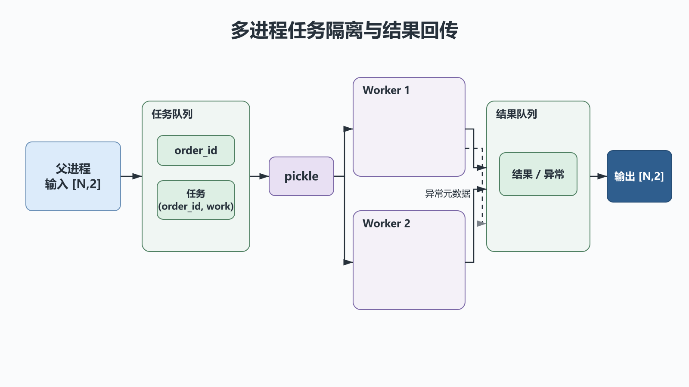
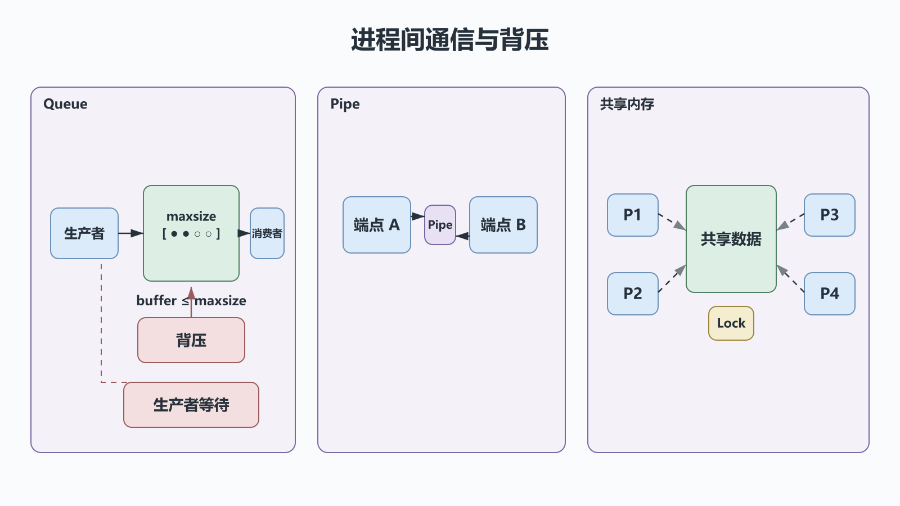

# 并发编程之多进程：隔离、并行与multiprocessing

## 前置知识与学习目标

你需要会编写函数、处理异常，并理解“程序”是静态代码。本篇解决一个问题：**怎样把可独立计算的任务安全地分发到多个 Python 进程，并拿回可验证的结果？**

学完后你应能：

- 区分并发、并行、同步/异步与阻塞/非阻塞；
- 解释进程隔离、序列化和启动方式为何影响程序结构；
- 用进程池完成 CPU 密集型订单计算，并处理失败与退出。

贯穿示例是“订单处理服务”：本篇并行计算订单校验值；后续文章会分别用线程、协程和 `asyncio` 处理外部 I/O。

## 从一个慢任务开始

假设每个订单都要执行独立的 CPU 计算。单进程只能让一个 Python 执行流占用一个核心；进程池可把不同订单送到不同解释器进程。代价是启动、序列化和进程间传输，因此任务太小反而会变慢。

先统一术语：

| 术语        | 讨论的问题                   | 例子                                 |
| ----------- | ---------------------------- | ------------------------------------ |
| 并发        | 多个任务在一段时间内都有进展 | 一个核心交替执行多个任务             |
| 并行        | 多个任务在同一时刻执行       | 多个核心各运行一个进程               |
| 同步/异步   | 调用方何时获得完成通知       | 立即等待结果 / 先提交后收集          |
| 阻塞/非阻塞 | 等待时当前执行流能否继续     | `result.get()` 等待 / `ready()` 轮询 |

这两组维度不能互相替换：“异步提交”仍可能在取结果时阻塞。

## 核心机制：隔离、状态与通信

<!-- figure:s33-f01 -->



每个进程有独立地址空间。父进程中的普通列表不会自动与子进程共享；任务参数和返回值通常要经过 `pickle` 序列化，再通过管道或队列传输。

一个任务通常经历：

1. 父进程创建任务并序列化参数；
2. 工作进程从队列取任务，进入运行态；
3. 系统调用或资源等待会让它阻塞，调度器再运行其他进程；
4. 工作进程序列化结果或异常；
5. 父进程收集结果，关闭并 `join` 工作进程。

`spawn` 会启动全新解释器并重新导入主模块，所以可提交函数必须定义在模块顶层，入口必须放在 `if __name__ == "__main__":` 下。不要依赖平台默认值：Python 版本和操作系统会影响 `spawn`、`fork`、`forkserver` 的可用性与默认选择。

## 最小可运行示例

下面显式选择 `spawn`，让 Windows、macOS 与 POSIX 的行为更接近。输入是 `(order_id, work)`，输出是 `(order_id, checksum)`；某个任务失败时，父进程能定位订单并终止本批处理。

```python
# behavior-test: run
import multiprocessing as mp


def calculate_order(item: tuple[str, int]) -> tuple[str, int]:
    order_id, work = item
    if work < 0:
        raise ValueError(f"{order_id}: work must be non-negative")
    checksum = sum(i * i for i in range(work))
    return order_id, checksum


def run_batch(items: list[tuple[str, int]]) -> list[tuple[str, int]]:
    context = mp.get_context("spawn")
    with context.Pool(processes=min(4, len(items))) as pool:
        results = pool.map(calculate_order, items, chunksize=1)
    return sorted(results)


if __name__ == "__main__":
    orders = [("O-100", 10_000), ("O-101", 12_000)]
    print(run_batch(orders))
```

关键中间状态是“待处理 → 运行中 → 已完成/失败”。`Pool.map` 保留输入顺序并在调用点等待；若希望先处理先完成的结果，可用 `imap_unordered`，但必须把 `order_id` 带回，不能用返回顺序推断身份。

## 进程间通信与背压

<!-- figure:s33-f02 -->



- `Queue`：多生产者/多消费者的消息通道，优先于共享可变状态；设置 `maxsize` 才能形成背压。
- `Pipe`：两个端点之间的低层通道，适合明确的一对一协议。
- `Value`、`Array`、共享内存：减少复制，但同步与生命周期更难，应先证明它们确实必要。
- `Lock`：只能保护使用同一把锁的参与者，不能让普通对象自动跨进程共享。

批量任务应控制单次提交量。大量小对象的序列化、无限任务队列和一次性返回巨大结果，都会让内存或通信成本超过并行收益。

## 常见误区与适用边界

1. **把进程数设得越大越好。** CPU 密集任务通常从接近可用核心数开始压测；容器的 CPU 配额也要算进去。
2. **在子进程里复用父进程的数据库连接。** 连接、锁、线程池等资源应在工作进程中创建并显式关闭。
3. **直接 `terminate()` 正在写队列的进程。** 可能破坏队列、锁或事务；优先用任务超时、停止事件和正常退出。
4. **先 `join` 再读取大队列。** 子进程可能因队列缓冲未排空而无法退出，形成死锁。

多进程适合可分割的 CPU 密集任务、故障隔离或需要独立解释器的工作。大量短 I/O、强共享状态或必须低延迟传递大对象时，线程或 `asyncio` 往往更合适。

## 自检题

1. 为什么 `spawn` 要求目标函数位于模块顶层？
2. `Pool.map` 是“并行”还是“异步”？这两个词为何不能二选一？
3. 子进程要把 500 MB 结果传回父进程时，你会先检查什么？

<details>
<summary>展开答案</summary>

1. 子进程会导入模块并按模块名查找函数；局部函数和闭包通常不能被标准 `pickle` 定位。
2. 工作进程可以并行计算，但 `map` 调用会同步等待整批结果；并行描述执行时刻，异步描述完成通知方式。
3. 检查是否能只返回摘要或文件位置、是否可分块流式处理，以及序列化与内存峰值是否可接受。

</details>

## 本篇总结

多进程用地址空间隔离换取并行与故障边界。可靠实现的关键不是“启动更多进程”，而是明确任务身份、序列化边界、背压、异常传播和正常退出。

## 下一篇衔接

下一篇把订单任务改成网络查询：线程共享同一进程内存，创建成本更低，但共享状态、停止协议和竞态条件会成为主要问题。

## 资料来源

- [Python `multiprocessing` 文档](https://docs.python.org/3/library/multiprocessing.html)
- [Python `concurrent.futures` 文档](https://docs.python.org/3/library/concurrent.futures.html)
