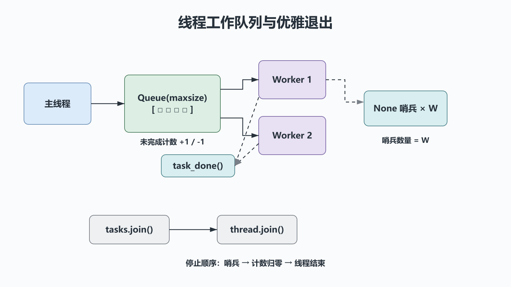

# 并发编程之多线程：共享状态、同步与优雅退出

## 前置知识与学习目标

你应已理解上一章的任务状态与进程隔离。本篇解决：**当订单任务主要等待 I/O 时，如何用线程共享进程资源，同时避免竞态和无法退出？**

学完后你应能解释 `Thread` 的生命周期、区分互斥与通知、使用线程安全队列传递任务，并设计正常停止协议。

## 直觉：共享车间，不共享工位

同一进程中的线程共享模块、堆对象和文件描述符，但每个线程有自己的调用栈。共享让传递对象很便宜，也意味着“读取—判断—写入”可能被别的线程穿插。

本篇继续处理订单：多个工作线程查询远程状态，主线程汇总结果。`queue.Queue` 同时承担任务传递和背压，避免多个线程随意修改同一列表。

## 核心机制与生命周期

`Thread` 的主要状态可概括为“新建 → 运行 → 终止”。`start()` 只能调用一次；`join()` 让调用者等待线程结束，但不会自动停止线程。带超时的 `join(timeout)` 仍返回 `None`，要用 `is_alive()` 判断是否超时。

常用同步原语各自回答不同问题：

| 原语        | 解决的问题                       | 不负责什么       |
| ----------- | -------------------------------- | ---------------- |
| `Lock`      | 同一时刻只允许一个线程进入临界区 | 条件是否已经成立 |
| `Event`     | 广播“停止/开始”等布尔条件        | 计数和任务传输   |
| `Condition` | 等待受锁保护的状态满足谓词       | 自动写出正确谓词 |
| `Semaphore` | 限制同时进入外部资源的数量       | 保证任务最终完成 |
| `Queue`     | 安全地传递任务并提供背压         | 业务结果的幂等性 |

## 最小工作队列

<!-- figure:s34-f01 -->



输入是订单 ID；输出状态写入线程安全的结果队列。`None` 是每个工作线程各自需要收到的停止哨兵。

```python
# behavior-test: run
from __future__ import annotations

from queue import Queue
from threading import Thread
from time import sleep


def fetch_status(order_id: str) -> tuple[str, str]:
    sleep(0.01)  # 模拟阻塞 I/O；生产代码必须设置网络超时
    return order_id, "PAID"


def worker(tasks: Queue[str | None], results: Queue[tuple[str, str]]) -> None:
    while True:
        order_id = tasks.get()
        try:
            if order_id is None:
                return
            results.put(fetch_status(order_id))
        finally:
            tasks.task_done()


def run_batch(order_ids: list[str], workers: int = 3) -> list[tuple[str, str]]:
    tasks: Queue[str | None] = Queue(maxsize=workers * 2)
    results: Queue[tuple[str, str]] = Queue()
    threads = [Thread(target=worker, args=(tasks, results)) for _ in range(workers)]
    for thread in threads:
        thread.start()
    for order_id in order_ids:
        tasks.put(order_id)
    for _ in threads:
        tasks.put(None)
    tasks.join()
    for thread in threads:
        thread.join()
    return sorted(results.get_nowait() for _ in order_ids)


if __name__ == "__main__":
    assert run_batch(["O-100", "O-101", "O-102"]) == [
        ("O-100", "PAID"),
        ("O-101", "PAID"),
        ("O-102", "PAID"),
    ]
```

`tasks.task_done()` 必须与每次成功的 `get()` 配对，包括哨兵；否则 `tasks.join()` 永远等不到未完成计数归零。若 `fetch_status` 会失败，生产实现还应把 `(order_id, error)` 写入独立结果通道，并在主线程决定重试或终止。

## 共享状态与竞态

下面的逻辑不是一个原子业务操作：

```python
if order.status == "PENDING":
    order.status = "PAID"
```

即使某些内置操作在特定 CPython 构建中看似不可分割，也不能把解释器实现细节当成业务锁。应让单一拥有者更新状态，或用 `Lock` 包住完整不变量，更重要的是在数据库层用条件更新或唯一约束保证跨进程一致性。

CPython 的常规构建通常有 GIL，它限制同一解释器中 Python 字节码的并行执行，但不会消除逻辑竞态，也不会阻止线程在 I/O 等待期间并发推进。Python 也提供可选的 free-threaded 构建；因此应依据任务、运行时和实测选择模型，而不是背诵“线程永远不能并行”。

## 守护线程不是清理协议

当只剩守护线程时，解释器可以直接退出；守护线程可能来不及关闭文件、提交事务或刷新队列。可靠服务应使用非守护线程，加上 `Event` 或哨兵请求停止，再 `join` 等待完成。进程退出只是最后的故障边界，不是资源管理方案。

## 常见误区与适用边界

1. **用 `sleep` 等结果。** 用 `join`、`Event`、`Condition` 或队列表达真实条件。
2. **锁住整个网络请求。** 临界区应只覆盖共享不变量，否则所有线程退化为串行。
3. **无限制创建线程。** 连接池、对端限流与内存都会先达到上限；使用固定工作池和有界队列。
4. **在线程间吞掉异常。** 线程异常不会自动在主线程重新抛出；用结果通道或 `ThreadPoolExecutor` 的 `Future` 收集。

线程适合阻塞 I/O 库、需要共享只读大对象或少量后台工作。纯 Python CPU 密集任务通常先考虑多进程；连接数很大且库提供非阻塞接口时，优先评估 `asyncio`。

## 自检题

1. `join(timeout=1)` 返回后怎样确认线程已经结束？
2. 为什么 GIL 不能保护订单“只支付一次”的不变量？
3. 工作队列中为什么需要与线程数相同数量的停止哨兵？

<details>
<summary>展开答案</summary>

1. 调用 `is_alive()`；`join` 本身始终返回 `None`。
2. 业务操作跨越多个字节码、I/O 和数据库事务，也可能有多进程或多实例参与。
3. 一个哨兵只会被一个消费者取走；每个阻塞在 `get()` 的工作线程都要获得退出信号。

</details>

## 本篇总结

线程的价值是低成本共享与隐藏 I/O 等待。可靠性来自任务所有权、有界队列、明确的同步语义、异常传播和优雅退出，而不是侥幸依赖调度顺序。

## 下一篇衔接

下一篇去掉操作系统线程，观察 Greenlet/Gevent 如何在单线程中协作切换，以及“只有在让出点才能并发”的边界。

## 资料来源

- [Python `threading` 文档](https://docs.python.org/3/library/threading.html)
- [Python `queue` 文档](https://docs.python.org/3/library/queue.html)
- [Python free-threading HOWTO](https://docs.python.org/3/howto/free-threading-python.html)
