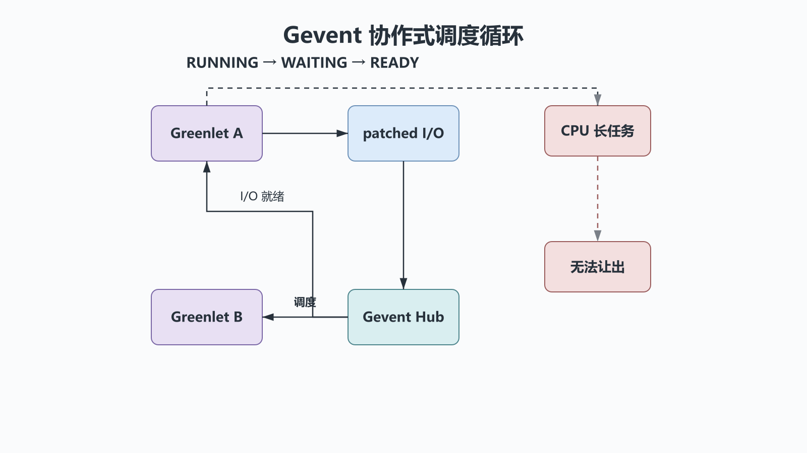

# 并发编程之协程：Greenlet、Gevent与协作式调度

## 前置知识与学习目标

你应理解线程如何在阻塞 I/O 时并发推进。本篇只解决：**Greenlet/Gevent 怎样在一个线程里切换大量 I/O 任务，以及什么时候这种隐式协作会失效？**

学完后你应能区分生成器、Greenlet 与原生协程，指出让出点，限制 Gevent 并发量，并判断维护旧系统还是迁移到 `asyncio`。

## 从订单查询的等待时间切入

订单服务的大部分时间可能都在等待网络。若一个任务等待时主动把控制权交给另一个任务，同一线程也能让多个订单在一段时间内都有进展。这是协作式调度：切换发生在明确或被兼容层接管的让出点，而不是操作系统随时抢占。

## 三个容易混淆的对象

| 对象             | 暂停方式   | 谁负责调度         | 能否直接表示 I/O 完成      |
| ---------------- | ---------- | ------------------ | -------------------------- |
| 生成器           | `yield`    | 调用方             | 不能，它主要是惰性迭代协议 |
| Greenlet         | `switch()` | 应用或 Gevent Hub  | 本身不能，需要事件循环配合 |
| `async def` 协程 | `await`    | `asyncio` 事件循环 | 可以等待兼容的 awaitable   |

“能保存栈状态”不等于“自动获得并发”。只有当前任务到达让出点，其他任务才有机会运行；一个长时间 CPU 循环会卡住整个线程。

## Greenlet：显式切换的最小模型

Greenlet 保存独立的调用栈，`switch()` 把控制权转给另一个 Greenlet。它展示了机制，但不提供套接字轮询、超时和任务池。生产代码一般通过 Gevent 使用，而不是手写切换网络协议。

```python
from greenlet import greenlet


def first() -> None:
    print("O-100: prepare")
    second_greenlet.switch()
    print("O-100: persist")


def second() -> None:
    print("O-101: prepare")
    first_greenlet.switch()


first_greenlet = greenlet(first)
second_greenlet = greenlet(second)
first_greenlet.switch()
```

输出顺序由代码中的切换点决定：`O-100: prepare`、`O-101: prepare`、`O-100: persist`。

## Gevent：Hub、事件与兼容层

<!-- figure:s35-f01 -->



Gevent 的 Hub 负责监听 I/O 和计时器，Greenlet 在 `gevent.sleep()` 或已被 Gevent 接管的阻塞调用处让出。`monkey.patch_all()` 会替换部分标准库对象，使同步风格代码在这些调用处协作；它必须在导入被修补模块之前执行，否则可能只修补到一部分引用。

```python
from gevent import monkey

monkey.patch_all()  # 必须早于 requests 等网络库导入

import gevent
from gevent.pool import Pool


def fetch_status(order_id: str) -> tuple[str, str]:
    gevent.sleep(0.01)  # 模拟可协作的网络等待
    return order_id, "PAID"


def run_batch(order_ids: list[str]) -> list[tuple[str, str]]:
    pool = Pool(size=20)
    jobs = [pool.spawn(fetch_status, order_id) for order_id in order_ids]
    gevent.joinall(jobs, timeout=2, raise_error=True)
    if any(not job.ready() for job in jobs):
        raise TimeoutError("batch did not finish")
    return sorted(job.value for job in jobs)


print(run_batch(["O-100", "O-101"]))
```

输入是订单 ID 列表，输出是与身份绑定的状态列表。`Pool(size=20)` 限制同时在途任务；`timeout` 只是停止等待，业务还要决定是否杀掉未完成 Greenlet、重试或记录未知状态。

## 调用链与失败边界

主路径是：应用函数 → 被修补的 I/O → Gevent Hub 注册就绪事件 → 当前 Greenlet 挂起 → 其他 Greenlet 运行 → I/O 就绪后恢复。

以下调用可能破坏这条路径：

- 未被修补的 C 扩展执行阻塞 I/O；
- CPU 密集函数长期不让出；
- 修补前已缓存原始 `socket` 或 `time.sleep` 引用；
- 同时混用多个事件循环或依赖线程局部状态的库。

在接入第三方库前，应查明它是否与 Gevent 兼容，并用并发压测验证“一个慢请求不会冻结全部请求”。

## 常见误区与适用边界

1. **把协程等同于并行。** 单线程 Gevent 不会让两个 Python CPU 循环同时运行。
2. **无限 `spawn`。** Greenlet 虽轻量，任务对象、响应体、连接和对端配额仍有限。
3. **在任意位置调用 monkey patch。** 修补时机与全局副作用必须在进程入口明确记录。
4. **把超时当取消。** 等待超时后，底层操作可能仍在继续；要设计资源清理和幂等重试。

Gevent 适合已有同步调用栈、依赖已验证兼容库的维护型系统。新建 Python 服务通常优先选择标准库 `asyncio` 和原生异步客户端，因为让出点、取消与类型边界更显式。

## 自检题

1. 为什么生成器不是网络并发框架？
2. 某个 Greenlet 执行 5 秒纯计算时，其他 Greenlet 会怎样？
3. 为什么 `monkey.patch_all()` 要放在入口早期？

<details>
<summary>展开答案</summary>

1. `yield` 只定义值和控制权的交接，不负责监听 I/O 就绪、超时或调度任务。
2. 同一线程无法获得控制权，都会停顿，除非计算函数主动让出或被移到线程/进程。
3. 已导入模块可能保存原始阻塞函数引用，晚修补会形成不完整且难排查的混合行为。

</details>

## 本篇总结

Greenlet 提供可切换栈，Gevent 用 Hub 和兼容层把 I/O 等待变成调度点。真正要验证的是让出点、库兼容性、并发上限、超时后的资源状态，而不是 Greenlet 数量。

## 下一篇衔接

协作式调度的根基是“I/O 何时就绪”。下一篇下沉到 Socket、TCP 字节流和多路复用，解释事件循环真正监听的对象。

## 资料来源

- [greenlet 文档](https://greenlet.readthedocs.io/)
- [Gevent 文档](https://www.gevent.org/)
- [Gevent monkey patch API](https://www.gevent.org/api/gevent.monkey.html)
