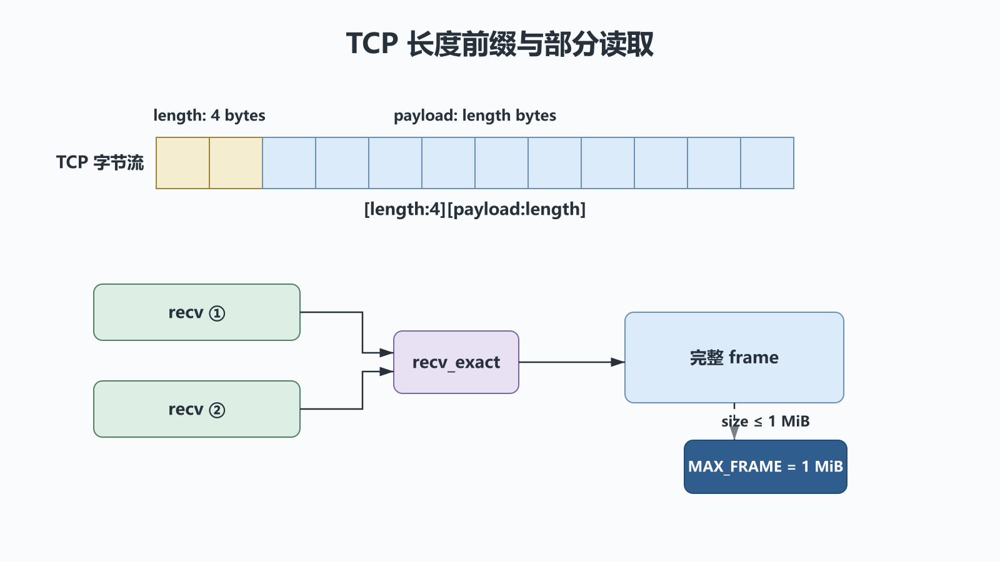
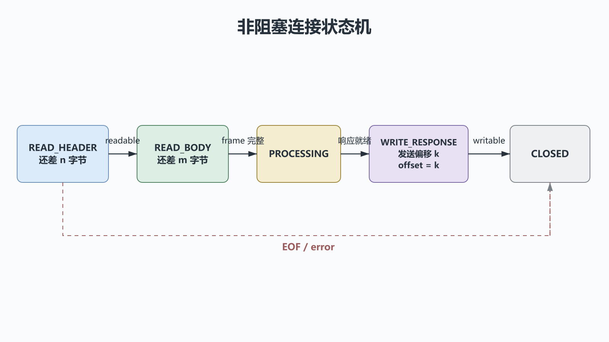

# Python网络编程：Socket、消息边界与IO多路复用

## 前置知识与学习目标

你应理解阻塞等待与协作调度。本篇解决：**TCP 只提供字节流时，订单服务怎样定义消息边界，并用有限资源处理多连接？**

学完后你应能画出客户端/服务端 Socket 生命周期，解释 `recv` 的返回语义，实现长度前缀协议，并根据连接规模选择线程、`selectors` 或 `asyncio`。

## 场景：一次发送不等于一次接收

客户端发送订单 JSON，服务端可能一次只收到半条，也可能一次收到多条。TCP 保证有序可靠的字节流，不保留应用的 `send` 调用边界。协议必须自己定义消息结束位置，常见方案有固定长度、分隔符、长度前缀或自描述格式。

本篇使用 4 字节网络序无符号整数表示正文长度：`[length:4][payload:length]`。正文最大 1 MiB，超过就拒绝，防止恶意长度导致内存耗尽。

<!-- figure:s36-f01 -->



## Socket 生命周期与调用链

TCP 服务端：`socket → bind → listen → accept → recv/send → close`。

TCP 客户端：`socket → connect → send/recv → close`。

`accept()` 返回一个新的“已连接 Socket”；监听 Socket 继续接收其他连接。`recv(n)` 最多返回 `n` 字节：

- 返回非空字节：本次实际读取的数据；
- 返回 `b""`：对端已正常关闭发送方向；
- 抛出超时或系统异常：连接状态未知或失败，不能当作空消息。

## 最小协议与行为验证

`socket.socketpair()` 在本机创建一对已连接 Socket，适合不占端口的最小测试。输入是 UTF-8 文本，线上协议输出是 `4 字节长度 + payload`。

```python
# behavior-test: run
import socket
import struct

MAX_FRAME = 1024 * 1024


def recv_exact(sock: socket.socket, size: int) -> bytes:
    chunks = bytearray()
    while len(chunks) < size:
        chunk = sock.recv(size - len(chunks))
        if not chunk:
            raise EOFError("peer closed before frame completed")
        chunks.extend(chunk)
    return bytes(chunks)


def send_frame(sock: socket.socket, text: str) -> None:
    payload = text.encode("utf-8")
    if len(payload) > MAX_FRAME:
        raise ValueError("frame too large")
    sock.sendall(struct.pack("!I", len(payload)) + payload)


def recv_frame(sock: socket.socket) -> str:
    (size,) = struct.unpack("!I", recv_exact(sock, 4))
    if size > MAX_FRAME:
        raise ValueError("frame too large")
    return recv_exact(sock, size).decode("utf-8")


left, right = socket.socketpair()
try:
    left.settimeout(1)
    right.settimeout(1)
    send_frame(left, '{"order_id":"O-100"}')
    assert recv_frame(right) == '{"order_id":"O-100"}'
finally:
    left.close()
    right.close()
```

`sendall` 只表示本机内核接受了全部待发字节，不表示对端业务已经处理成功。需要业务确认时，协议必须定义响应、请求 ID、超时和幂等重试。

## 阻塞、非阻塞与多路复用

<!-- figure:s36-f02 -->



阻塞 Socket 在操作不能立即完成时挂起当前线程；超时 Socket 在期限后抛出 `socket.timeout`；非阻塞 Socket 则立即报告“现在还不能完成”。

`selectors.DefaultSelector` 把多个 Socket 注册到平台合适的就绪通知机制。一次 `select()` 返回“目前可能读/写”的对象，而不是“整个业务操作已经完成”。每条连接仍需保存状态：

```text
READ_HEADER(还差 n 字节)
  → READ_BODY(还差 m 字节)
  → PROCESSING
  → WRITE_RESPONSE(发送偏移 k)
  → CLOSED
```

这就是事件循环的数据结构基础。写缓冲持续增长说明对端消费太慢，必须暂停读取、限制队列或关闭连接；否则“高并发”会退化为内存泄漏。

## 方案选择

| 方案               | 优点                         | 主要边界                       |
| ------------------ | ---------------------------- | ------------------------------ |
| 每连接一个线程     | 与阻塞库兼容、流程直观       | 线程和栈有成本，共享状态需同步 |
| `selectors` 状态机 | 依赖少、控制精确             | 手写状态、超时和错误恢复复杂   |
| `asyncio`          | 原生协程、任务与取消工具完整 | 整条调用链需要异步兼容         |
| 多进程             | CPU 并行和隔离               | 连接归属、IPC 与部署更复杂     |

性能优化先看指标：并发连接数、请求延迟分位数、事件循环延迟、收发缓冲、错误率和内存。盲目调大 `SO_RCVBUF`、关闭 Nagle 或增加工作数，可能只是移动瓶颈。

## 常见误区与适用边界

1. **把一次 `recv(4096)` 当成一条消息。** 必须实现 framing 和部分读写。
2. **不设置超时和大小上限。** 慢连接与虚假长度会永久占用资源。
3. **收到 EOF 后继续复用连接。** `b""` 表示对端发送方向已关闭，应完成状态迁移。
4. **重试非幂等请求却没有请求 ID。** 超时不等于失败，原请求可能已经生效。

教学示例省略了 TLS、认证、半关闭、心跳、连接池和优雅停机；生产服务优先采用成熟 HTTP/RPC 协议栈。

## 自检题

1. 为什么两次 `send` 可能被一次 `recv` 读到？
2. `select` 报告可写是否表示完整响应已经发送？
3. 客户端超时后为什么不能直接创建新订单？

<details>
<summary>展开答案</summary>

1. TCP 是连续字节流，不保留应用调用边界，分段和合并由协议栈决定。
2. 否。它只表示当前发送缓冲可能接收一些字节，仍要保存发送偏移并处理部分写。
3. 原请求可能已被服务端处理；应使用同一幂等键查询或重试，避免重复业务动作。

</details>

## 本篇总结

可靠网络程序从协议边界开始：消息长度、最大尺寸、连接状态、超时、背压和幂等性必须明确。多路复用只是通知机制，真正的复杂度在每条连接的状态机。

## 下一篇衔接

下一篇回到 Python 对象协议：我们将把订单金额包装成 `Money` 值对象，通过双下划线方法定义合法运算，并为 ORM 的描述符机制铺路。

## 资料来源

- [Python `socket` 文档](https://docs.python.org/3/library/socket.html)
- [Python `selectors` 文档](https://docs.python.org/3/library/selectors.html)
- [Python Socket Programming HOWTO](https://docs.python.org/3/howto/sockets.html)
