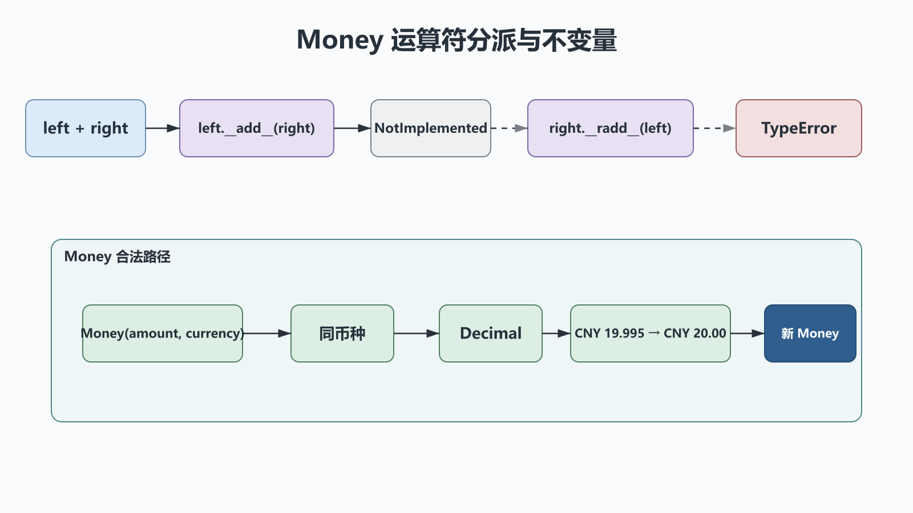

# 二次加工标准类型：包装、对象协议与运算符重载

## 前置知识与学习目标

你需要理解类、组合和 `Decimal` 的基本用法。本篇解决：**怎样让订单金额像内置值一样自然运算，同时守住币种、精度和不可变性约束？**

学完后你应能选择包装而非继承，解释 `a + b` 的特殊方法分派，正确返回 `NotImplemented`，并理解属性访问为何能扩展成下一篇的描述符。

## 场景：裸数字缺少业务语义

`Decimal("10.00") + Decimal("3.00")` 能计算，却不知道两个值是否同币种，也无法阻止把折扣率当金额相加。包装对象把“数值 + 币种 + 舍入规则”放在同一个不变量中。

本篇贯穿对象为 `Money`：内部载体是 `Decimal`，公开运算只接受同币种 `Money`。

## 包装、继承还是工具函数

| 方案         | 适合                           | 风险                                   |
| ------------ | ------------------------------ | -------------------------------------- |
| 工具函数     | 少量无状态转换                 | 调用者仍可绕过约束                     |
| 继承内置类型 | 真正满足替换原则且构造语义兼容 | 内置类型不可变、方法返回基类、边界复杂 |
| 包装/组合    | 需要新增不变量、审计或收窄接口 | 要显式转发所需协议                     |

金额不是“更特殊的 Decimal”；它有币种和业务边界，因此包装更合适。不要用 `__getattr__` 无差别转发所有底层方法，否则会把本应禁止的能力重新暴露出去。

## 特殊方法如何分派

<!-- figure:s37-f01 -->



表达式 `left + right` 大致尝试 `left.__add__(right)`；若返回 `NotImplemented`，解释器可再尝试右侧的反向实现。`NotImplemented` 是协议返回值，不是异常。对于语义上支持但参数非法的同类对象，可以抛 `ValueError`；对于不认识的类型，应返回 `NotImplemented`，让 Python 完成分派或给出一致的 `TypeError`。

特殊方法通常由类型参与查找。把 `obj.__add__` 动态塞进单个实例，不应当作运算符定制方式。

## 最小 Money 值对象

输入接受字符串或 `Decimal`，构造时量化到分；输出仍是不可变 `Money`。中间状态只有经过校验的 `amount` 与大写 `currency`。

```python
# behavior-test: run
from __future__ import annotations

from dataclasses import dataclass
from decimal import Decimal, ROUND_HALF_EVEN

CENT = Decimal("0.01")


@dataclass(frozen=True, slots=True)
class Money:
    amount: Decimal
    currency: str = "CNY"

    def __post_init__(self) -> None:
        normalized = Decimal(self.amount).quantize(CENT, rounding=ROUND_HALF_EVEN)
        currency = self.currency.upper()
        if len(currency) != 3 or not currency.isalpha():
            raise ValueError("currency must be a three-letter code")
        object.__setattr__(self, "amount", normalized)
        object.__setattr__(self, "currency", currency)

    def __add__(self, other: object) -> Money:
        if not isinstance(other, Money):
            return NotImplemented
        if self.currency != other.currency:
            raise ValueError("cannot add different currencies")
        return Money(self.amount + other.amount, self.currency)

    def __mul__(self, factor: object) -> Money:
        if not isinstance(factor, (int, Decimal)):
            return NotImplemented
        return Money(self.amount * Decimal(factor), self.currency)

    __rmul__ = __mul__

    def __str__(self) -> str:
        return f"{self.currency} {self.amount:.2f}"


subtotal = Money(Decimal("19.995")) + Money(Decimal("5"))
assert str(subtotal) == "CNY 25.00"
assert str(2 * Money(Decimal("3.50"))) == "CNY 7.00"
```

`frozen=True` 让值可安全共享和哈希；`slots=True` 收窄实例结构。量化策略属于领域规则，财务系统必须与账务规范一致，不能因为示例使用 `ROUND_HALF_EVEN` 就直接照搬。

## 关键对象协议

- `__repr__` 面向开发和诊断，应尽量无歧义；`__str__` 面向用户展示。
- `__eq__` 与 `__hash__` 必须一致：相等对象要有相同哈希；可变对象通常不应可哈希。
- `__iter__`/`__len__`/`__contains__` 定义容器协议，不应为了“方便”让单个金额伪装成集合。
- `__enter__`/`__exit__` 管理确定性的资源作用域；不要依赖 `__del__` 关闭支付连接或提交事务。
- `__getattr__` 只在常规查找失败后调用；`__getattribute__` 拦截所有实例属性访问，错误实现很容易无限递归。

## 描述符：属性访问的可复用规则

只要一个对象定义 `__get__`、`__set__` 或 `__delete__` 中的相关方法，并作为另一个类的类属性，它就参与描述符协议。`property`、方法绑定和下一篇 ORM 的字段都建立在这个机制上。

数据描述符、实例字典、非数据描述符和类属性有明确的查找优先级。实现校验字段时，应通过 `instance.__dict__` 或 `object.__setattr__` 写真实存储，不能在 `__set__` 内再次给同名属性赋值，否则会递归调用自己。

## 常见误区与适用边界

1. **所有不支持操作都抛 `TypeError`。** 二元运算应先考虑返回 `NotImplemented`。
2. **`__del__` 等价于资源清理。** 回收时机不确定，循环引用和解释器关闭都会影响它；用上下文管理器。
3. **无差别代理底层对象。** 包装的价值正是收窄能力和集中不变量。
4. **重载出“惊喜语义”。** `+` 应保持加法直觉；远程调用、数据库写入等有副作用动作应使用命名方法。

当领域规则很少且调用范围很小，普通函数可能更清楚；不要为展示魔法方法而制造新类型。

## 自检题

1. 为什么 `Money + 1` 应返回 `NotImplemented` 而不是返回原值？
2. 为什么 `Money` 更适合包装 `Decimal` 而非继承它？
3. `__del__` 为什么不能承担支付事务提交？

<details>
<summary>展开答案</summary>

1. 返回原值会静默掩盖错误；`NotImplemented` 允许反向分派，最终由解释器给出一致错误。
2. 金额增加币种和舍入不变量，并需要收窄底层 API，不满足简单的可替换关系。
3. 调用时机和执行环境不确定，异常也难可靠处理；事务必须在显式作用域中提交或回滚。

</details>

## 本篇总结

Python 数据模型是一组协议，不是魔法方法清单。先定义业务不变量和预期语义，再实现最小协议；包装、不可变性和 `NotImplemented` 让对象既自然又可预测。

## 下一篇衔接

下一篇把描述符用于 ORM 字段，把元类用于收集模型元数据，并把表达式安全编译为参数化 SQL。

## 资料来源

- [Python 数据模型](https://docs.python.org/3/reference/datamodel.html)
- [Python `decimal` 文档](https://docs.python.org/3/library/decimal.html)
- [Descriptor Guide](https://docs.python.org/3/howto/descriptor.html)
