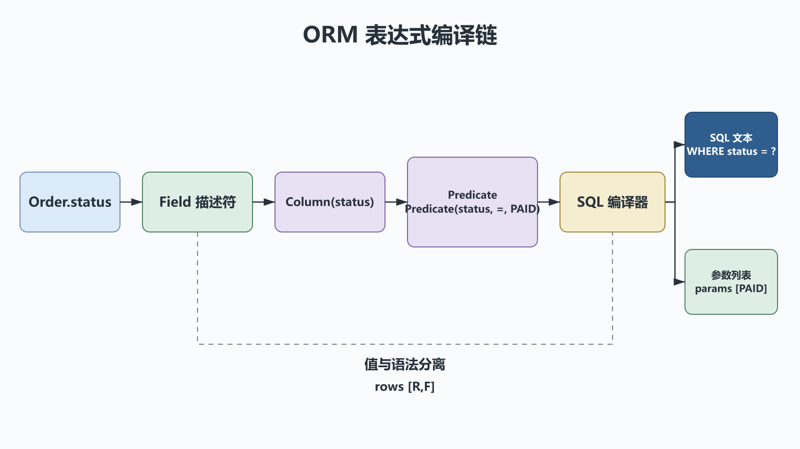

# 自定制ORM：描述符、元类与参数化SQL

## 前置知识与学习目标

你应理解上一章的描述符和对象协议，并会写基本 SQL。本篇解决：**`Order.status == "PAID"` 怎样从 Python 表达式变成安全的 SQL 与参数？**

学完后你应能解释字段注册、类创建、表达式构造和 SQL 编译四个阶段，并明确教学 ORM 与生产 ORM 的边界。

## 直觉：先保存意图，再生成文本

若 `Field.__eq__` 立即拼接用户值，容易产生 SQL 注入和转义错误。正确方向是先构造结构化谓词：

```text
Python: Order.status == "PAID"
IR:     Predicate(column="status", operator="=", value="PAID")
SQL:    SELECT ... WHERE "status" = ?
Params: ["PAID"]
```

值永远进入参数通道；表名、列名和操作符只能来自受控元数据，不能把用户输入当标识符。

## 组件职责与调用链

<!-- figure:s38-f01 -->



| 组件                 | 职责                           | 不负责       |
| -------------------- | ------------------------------ | ------------ |
| `Field` 描述符       | 校验实例值；类访问时生成列引用 | 连接数据库   |
| `ModelMeta` 元类     | 在类创建时收集字段并绑定表名   | 执行查询     |
| `Column`/`Predicate` | 保存查询意图                   | 拼接任意 SQL |
| 编译器               | 生成占位符 SQL 和参数列表      | 事务与连接池 |

调用链是：模块导入创建 `Order` 类 → 元类收集 `Field` → `Order.status` 返回 `Column` → 比较生成 `Predicate` → 编译器输出 `(sql, params)`。

## 最小可运行实现

下面示例采用 SQLite 风格 `?` 占位符，仅用于演示编译。输入是模型类与谓词，输出是 SQL 字符串和参数列表，不会连接数据库。

```python
# behavior-test: run
from __future__ import annotations

from dataclasses import dataclass
from typing import Any


@dataclass(frozen=True)
class Predicate:
    column: str
    operator: str
    value: Any


@dataclass(frozen=True)
class Column:
    name: str

    def __eq__(self, value: object) -> Predicate:  # type: ignore[override]
        return Predicate(self.name, "=", value)


class Field:
    def __init__(self, expected_type: type) -> None:
        self.expected_type = expected_type
        self.name = ""

    def __set_name__(self, owner: type, name: str) -> None:
        self.name = name

    def __get__(self, instance: object | None, owner: type) -> object:
        if instance is None:
            return Column(self.name)
        return instance.__dict__[self.name]

    def __set__(self, instance: object, value: object) -> None:
        if not isinstance(value, self.expected_type):
            raise TypeError(f"{self.name} must be {self.expected_type.__name__}")
        instance.__dict__[self.name] = value


class ModelMeta(type):
    def __new__(mcls, name: str, bases: tuple[type, ...], namespace: dict[str, Any]):
        cls = super().__new__(mcls, name, bases, namespace)
        cls.__fields__ = tuple(
            key for key, value in namespace.items() if isinstance(value, Field)
        )
        cls.__table__ = namespace.get("__table__", name.lower())
        return cls


class Model(metaclass=ModelMeta):
    __fields__: tuple[str, ...]
    __table__: str

    @classmethod
    def select_where(cls, predicate: Predicate) -> tuple[str, list[object]]:
        if predicate.column not in cls.__fields__ or predicate.operator != "=":
            raise ValueError("unsupported predicate")
        columns = ", ".join(f'"{name}"' for name in cls.__fields__)
        sql = (
            f'SELECT {columns} FROM "{cls.__table__}" '
            f'WHERE "{predicate.column}" = ?'
        )
        return sql, [predicate.value]


class Order(Model):
    __table__ = "orders"
    order_id = Field(str)
    status = Field(str)


sql, params = Order.select_where(Order.status == "PAID")
assert sql == 'SELECT "order_id", "status" FROM "orders" WHERE "status" = ?'
assert params == ["PAID"]
```

`Order.status` 是类访问，返回 `Column("status")`；`order.status` 是实例访问，返回实例值。这正是描述符把“声明”和“运行数据”连接起来的地方。

## Shape 与状态变化

编译前后数据形状应保持明确：

```text
Model metadata: tuple[str, ...]          # [F]
Predicate:     (column, operator, value) # 一个节点
SQL params:    list[object]              # [P]
DB rows:       list[tuple[object, ...]]   # [R,F]
```

其中 `F` 是选择的字段数，`P` 是占位参数数，`R` 是返回行数。真正执行前应断言占位符数量与 `P` 一致，并把数据库行显式映射成模型，而不是依赖隐含列顺序。

## 常见误区与适用边界

1. **用 f-string 插入查询值。** 必须交给数据库驱动绑定参数。
2. **认为参数化可以保护表名。** 大多数驱动只参数化值；标识符要从白名单元数据生成。
3. **把 `__getattr__` 当字段系统。** 描述符能在类定义处声明、在实例赋值时校验，边界更清晰。
4. **让教学 ORM 进入生产。** 本实现没有事务、迁移、关系加载、连接池、方言、并发会话、脏数据跟踪和安全审计。

当查询固定且模型很少，直接使用参数化 SQL 往往更透明；需要复杂关系与迁移时应使用成熟 ORM。

## 自检题

1. 为什么查询值不能进入 SQL 字符串？
2. `Order.status` 与 `order.status` 为什么返回不同对象？
3. 参数化查询为什么不能安全接收任意用户表名？

<details>
<summary>展开答案</summary>

1. 字符串拼接把数据误当语法，会产生注入和转义问题；驱动参数绑定保持两条通道分离。
2. 描述符的 `instance` 在类访问时为 `None`，可返回列引用；实例访问时返回存储值。
3. 占位符通常只代表值，不能代表 SQL 标识符；表名必须来自代码控制的白名单。

</details>

## 本篇总结

ORM 的关键不是隐藏 SQL，而是把声明、查询意图、参数和执行生命周期分层。描述符连接类与实例，元类收集模式，表达式树让参数化编译可验证。

## 下一篇衔接

下一篇把同样的“协议边界 + 调用链”思路用于 Web：WSGI 连接服务器与应用，路由选择视图，Jinja2 只负责渲染模板。

## 资料来源

- [Python Descriptor Guide](https://docs.python.org/3/howto/descriptor.html)
- [Python 数据模型：元类](https://docs.python.org/3/reference/datamodel.html#metaclasses)
- [Python DB-API 2.0](https://peps.python.org/pep-0249/)
