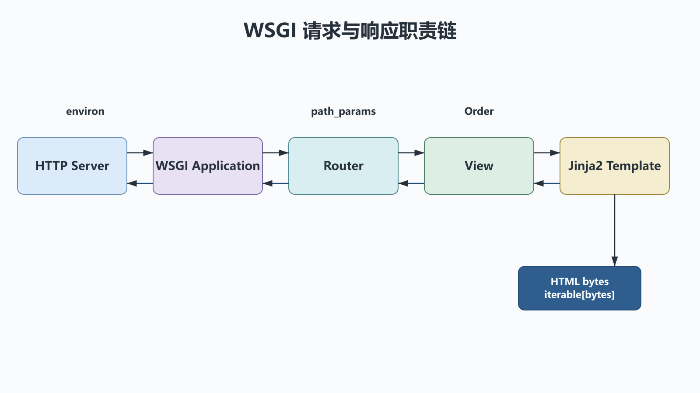

# 自定义Web框架与Jinja2：WSGI调用链、路由与模板边界

## 前置知识与学习目标

你应理解 HTTP 请求/响应、可调用对象和上一章的分层编译思想。本篇解决：**一个请求怎样从 WSGI 服务器经过路由和视图，最终变成安全的响应字节？**

学完后你应能解释 `environ`、`start_response` 和响应迭代器，画出框架调用链，并把业务数据与模板展示分开。

## 真实场景：查询一个订单页面

浏览器请求 `/orders/O-100`。服务器负责 HTTP 与进程管理；框架解析路径并选视图；视图读取订单；模板把数据转成 HTML。任何一层都不应替下一层承担全部职责。

```text
HTTP server → WSGI application → router → view → template
            ← bytes iterable   ← response
```

<!-- figure:s39-f01 -->



## WSGI 的最小契约

WSGI 应用是接收两个位置参数的可调用对象：

```text
application(environ, start_response) -> iterable[bytes]
```

- `environ` 是包含 CGI/WSGI 键的内置字典，请求体通过 `wsgi.input` 字节流读取；
- `start_response(status, headers)` 建立 HTTP 状态和响应头；
- 返回值必须可迭代且元素为 `bytes`，迭代器有 `close()` 时服务器应在结束后调用。

WSGI 是服务器与同步 Python 应用的接口，不是浏览器协议，也不是异步应用协议。长连接、WebSocket 与原生异步服务通常使用 ASGI 等其他接口。

## 最小路由与模板渲染

下面示例使用内存模板，便于行为测试。输入是 `PATH_INFO`，输出为 UTF-8 HTML 字节；未知路径返回 404。Jinja2 默认开启 HTML 自动转义，模板变量不会被当作 HTML 执行。

```python
from collections.abc import Callable, Iterable
from jinja2 import DictLoader, Environment, select_autoescape

StartResponse = Callable[[str, list[tuple[str, str]]], None]

templates = Environment(
    loader=DictLoader(
        {"order.html": "<h1>订单 {{ order_id }}</h1><p>{{ status }}</p>"}
    ),
    autoescape=select_autoescape(default=True),
)


def order_view(order_id: str) -> bytes:
    html = templates.get_template("order.html").render(
        order_id=order_id,
        status="PAID",
    )
    return html.encode("utf-8")


def application(environ: dict, start_response: StartResponse) -> Iterable[bytes]:
    path = environ.get("PATH_INFO", "/")
    prefix = "/orders/"
    if path.startswith(prefix) and path[len(prefix) :]:
        body = order_view(path[len(prefix) :])
        status = "200 OK"
    else:
        body = b"Not Found"
        status = "404 Not Found"
    headers = [
        ("Content-Type", "text/html; charset=utf-8"),
        ("Content-Length", str(len(body))),
    ]
    start_response(status, headers)
    return [body]
```

最小行为测试不需要启动端口：

```python
captured: dict[str, object] = {}


def capture(status: str, headers: list[tuple[str, str]]) -> None:
    captured.update(status=status, headers=headers)


body = b"".join(application({"PATH_INFO": "/orders/O-100"}, capture))
assert captured["status"] == "200 OK"
assert "订单 O-100" in body.decode("utf-8")
```

## 组件边界与状态变化

请求在各层的形状应越来越明确：

```text
environ: dict[str, object]
route match: (view, path_params)
domain data: Order
template context: dict[str, JSON-like value]
response: (status, headers, iterable[bytes])
```

模板只接收展示所需字段。不要把数据库会话、请求对象或带任意方法的领域对象整体暴露给模板。`|safe` 会绕过转义，只能用于由应用生成并经过专门净化的可信 HTML。

## 生产框架还必须解决什么

- URL 解码、方法路由、查询参数和请求体上限；
- 中间件顺序、异常映射、日志与请求 ID；
- Cookie、会话、CSRF、认证和权限；
- 静态文件、流式响应、代理头信任与 TLS 终止；
- 并发模型、超时、优雅停机和部署服务器。

自制框架适合理解协议，不适合直接承载公网支付回调。生产环境应使用维护中的框架和 WSGI/ASGI 服务器，并遵循它们的安全更新。

## 常见误区与适用边界

1. **返回 `str` 而不是 `bytes`。** WSGI 响应体元素必须是字节。
2. **用路径字符串直接拼模板文件名。** 可能产生路径穿越；路由应映射到固定模板。
3. **关闭自动转义解决显示问题。** 这会扩大 XSS 风险；应修正上下文和输出语境。
4. **相信任意 `X-Forwarded-*`。** 只有来自受信代理并经过服务器配置验证的头才可使用。

## 自检题

1. WSGI 中谁负责解析 HTTP，谁负责选择视图？
2. 为什么模板上下文不应直接放数据库会话？
3. `Content-Length` 应按字符串长度还是字节长度计算？

<details>
<summary>展开答案</summary>

1. WSGI 服务器处理 HTTP 并构造 `environ`；应用/框架路由到视图。
2. 它扩大模板能力和资源生命周期，容易产生隐式查询、泄漏与权限边界混乱。
3. 按最终响应体的字节长度计算；UTF-8 中文字符的字符数与字节数不同。

</details>

## 本篇总结

最小 Web 框架的核心是稳定契约：服务器交付请求环境，路由选择视图，视图准备数据，模板只负责转义后的展示，响应再回到字节边界。

## 下一篇衔接

下一篇把订单页面扩展为微信支付接入。重点不再是模板，而是服务端下单、签名/验签、回调解密、金额校验和幂等状态机。

## 资料来源

- [PEP 3333：WSGI v1.0.1](https://peps.python.org/pep-3333/)
- [Jinja Template Designer Documentation](https://jinja.palletsprojects.com/en/stable/templates/)
- [Jinja API](https://jinja.palletsprojects.com/en/stable/api/)
