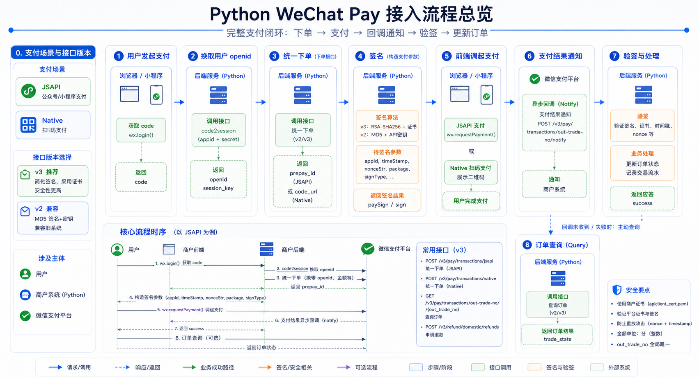

# Python 微信支付 详解

##  简介

这篇文章整理的是微信内网页场景下的支付接入流程，也就是用户在微信里打开页面、选择商品、点击支付，然后直接调起微信支付界面完成付款。

文中的代码和流程保留了原始实践内容，但会按接入顺序重新组织，方便直接查阅和排障。



##  接入场景与前置条件

### 典型需求

```text
微信打开商品列表页面 -> 点击商品 -> 显示付款页面 -> 调用微信支付
```

### 需要准备的能力

微信支付接入通常需要以下信息：

- 公众号 `appid`
- 商户号 `mch_id`
- 商户平台配置的 `key`，用于签名
- `AppSecret`，用于通过 `code` 换取 `openid`

### 重要说明

- 调起微信支付的网页需要在商户平台正确配置授权目录
- 如果你的支付页面是 `http://www.shazuihuo.com/goods/index.html`
- 那么通常需要配置到目录级别，例如：`http://www.shazuihuo.com/goods/`

相关参考：

- [签名算法和校验工具](https://pay.weixin.qq.com/wiki/doc/api/jsapi.php?chapter=4_3)
- [获取 openid / code 相关文档](https://pay.weixin.qq.com/wiki/doc/api/jsapi.php?chapter=4_4)

### 基础配置示例

```python
WPC = {
    'APPID': 'wx53c1xxxxad626eb8',
    'APPSECRET': 'fdd177a7xxxxxxxxxxxxx856eeeb187c',
    'MCHID': '14222000000',
    'KEY': 'd7810713e1exxxxxxxxxxadc9617d0a6',
    'GOODDESC': '商户号中的公司简称或全称-无要求的商品名字',
    'NOTIFY_URL': 'https://www.xxxx.com/service/applesson/wechatordernotice',
}
```

##  核心流程概览

网页内调起微信支付的核心链路如下：

1. 获取 `code`
2. 使用 `code` 换取用户 `openid`
3. 调用微信统一下单接口，获得 `prepay_id`
4. 将支付参数返回前端
5. 前端使用 `WeixinJSBridge.invoke()` 调起支付
6. 支付成功后，再通过订单查询或支付通知确认结果

这条链路里最关键的两个中间值是：

- `openid`
- `prepay_id`

### API v2 与 API v3 的选择

下面的完整示例保留的是历史项目中常见的 API v2/XML/MD5 接入方式，适合维护已有 JSAPI 支付代码时查阅。

如果是新项目，优先使用微信支付 API v3：请求体使用 JSON，接口认证使用 `WECHATPAY2-SHA256-RSA2048` 签名，回调资源使用 AES-256-GCM 解密，不再继续新增 XML 和 MD5 签名封装。

参考：[微信支付 API v3 简介](https://wechatpay-api.gitbook.io/wechatpay-api-v3)

### Native 扫码支付：模式一与模式二

旧版扫码支付笔记中仍有价值的是 Native 支付场景选择，可以合并到这里作为补充：

- **模式一**：商户按微信规则生成二维码，用户扫码后微信回调商户配置的 `product_id` 处理地址，商户再根据商品信息生成支付订单。它适合固定商品或简单收款码，但回调链路更绕。
- **模式二**：商户先调用下单接口，微信返回可生成二维码的 `code_url`，用户扫码后发起支付。它直接绑定具体订单，更适合电商、充值、一次一单的业务。

新项目做扫码支付时，通常优先选模式二；如果是网页内公众号支付，则继续按本文的 JSAPI 链路获取 `openid` 和 `prepay_id`。

##  步骤一：获取 `code`

用户点击购买按钮后，需要先跳到微信授权页。微信处理完成后，会重定向到你的页面，并在 URL 上附带 `code=xxx` 参数。

前端示例：

```javascript
$('#buy').click(function () {
    var param = {
        appid: 'wx53c1xxxxad626eb8',
        redirect_uri: 'https://www.xxxxx.com/wcpay/pay.html',
        response_type: 'code',
        scope: 'snsapi_base',
        state: '1'
    };

    window.location.href =
        'https://open.weixin.qq.com/connect/oauth2/authorize?' + $.param(param);
});
```

这一阶段的目标很明确：**拿到 `code`**。

##  步骤二：获取 `openid`

拿到 `code` 后，下一步在后端通过微信接口换取 `openid`。

这个过程必须放在服务端，因为会使用到 `AppSecret`。

```python
@classmethod
def getOpenID(cls, kwargs):
    param = {
        'code': kwargs['code'],
        'appid': WPC['APPID'],
        'secret': WPC['APPSECRET'],
        'grant_type': 'authorization_code',
    }

    openIdUrl = 'https://api.weixin.qq.com/sns/oauth2/access_token'
    resp = requests.get(openIdUrl, params=param)
    return resp.text
```

调用成功后，返回结果中通常会包含：

- `access_token`
- `refresh_token`
- `openid`
- `scope`
- `expires_in`

而我们真正需要的是其中的 `openid`。

##  步骤三：统一下单

### 为什么要统一下单

网页支付并不是直接把订单丢给前端支付，而是先由服务端调用微信的统一下单接口，换取一个预支付订单号 `prepay_id`。

### 签名算法

统一下单参数需要签名，签名的核心是：

1. 将参数按 key 排序
2. 拼接成查询字符串
3. 在末尾拼接商户平台的 `KEY`
4. 做 MD5 并转大写

```python
@classmethod
def getSign(cls, kwargs):
    keys = sorted(kwargs)
    paras = ['{}={}'.format(key, kwargs[key]) for key in keys if key != 'appkey']
    stringA = '&'.join(paras)

    stringSignTemp = stringA + '&key=' + WPC['KEY']
    sign = MD5(stringSignTemp).upper()
    return sign
```

MD5 函数示例：

```python
import hashlib

def MD5(value):
    md5 = hashlib.md5()
    md5.update(value.encode('utf-8'))
    return md5.hexdigest()
```

### 参数转 XML

```python
@classmethod
def getxml(cls, kwargs):
    kwargs['sign'] = Utility.getSign(kwargs)

    xml = ''
    for key, value in kwargs.items():
        xml += '<{0}>{1}</{0}>'.format(key, value)
    xml = '<xml>{0}</xml>'.format(xml)

    return xml
```

### 统一下单完整示例

```python
code = self.POST.get('code')
openidresp = Utility.getOpenID({'code': code})
openid = json.loads(openidresp).get('openid')

UnifieOrderRequest = {
    'appid': 'wx53c1xxxxad626eb8',
    'body': '公司名称-商品',
    'mch_id': '1397xxxxxx8',
    'nonce_str': '',
    'notify_url': 'https://service.xxxx.com/service/applesson/wechatordernotice',
    'openid': '',
    'out_trade_no': '',
    'spbill_create_ip': '',
    'total_fee': '',
    'trade_type': 'JSAPI',
}

UnifieOrderRequest['nonce_str'] = Utility.getnoncestr()
UnifieOrderRequest['openid'] = openid
UnifieOrderRequest['out_trade_no'] = UnifieOrderRequest['mch_id'] + str(order.id)
UnifieOrderRequest['spbill_create_ip'] = self.request.remote_ip
UnifieOrderRequest['total_fee'] = int(lesson.price * 100)

xml = Utility.getxml(UnifieOrderRequest)

resp = requests.post(
    "https://api.mch.weixin.qq.com/pay/unifiedorder",
    data=xml.encode('utf-8'),
    headers={'Content-Type': 'text/xml'}
)
msg = resp.text.encode('ISO-8859-1').decode('utf-8')
xmlresp = xmltodict.parse(msg)

if xmlresp['xml']['return_code'] == 'SUCCESS':
    if xmlresp['xml']['result_code'] == 'SUCCESS':
        timestamp = str(int(time.time()))
        data = {
            "appId": xmlresp['xml']['appid'],
            "nonceStr": Utility.getnoncestr(),
            "package": "prepay_id=" + xmlresp['xml']['prepay_id'],
            "signType": "MD5",
            "timeStamp": timestamp
        }
        data['paySign'] = Utility.getSign(data)
        data['orderid'] = order.id
        return JsonResponse(self, '000', data=data)
    else:
        msg = xmlresp['xml']['err_code_des']
        return JsonResponse(self, '002', msg=msg)
else:
    msg = xmlresp['xml']['return_msg']
    return JsonResponse(self, '002', msg=msg)
```

这一阶段的输出结果是：后端返回一组前端可以直接用于调起支付的参数。

##  步骤四：前端调起微信支付

统一下单成功后，前端拿到支付参数，再通过 `WeixinJSBridge.invoke()` 触发支付弹窗。

```javascript
try {
    var code = query('code'),
        origin = query('groupid');

    $.post({
        url: orderurl,
        data: {
            origin: origin,
            mobile: phone,
            code: code
        }
    }).then(function (resp) {
        if (resp.code && resp.code == "000") {
            var wepaydata = {
                appId: resp.data.appId,
                nonceStr: resp.data.nonceStr,
                package: resp.data.package,
                paySign: resp.data.paySign,
                signType: "MD5",
                timeStamp: resp.data.timeStamp
            };
            var orderid = resp.data.orderid || 0;

            window.jsApiCall = function () {
                WeixinJSBridge.invoke(
                    'getBrandWCPayRequest',
                    wepaydata,
                    function (res) {
                        WeixinJSBridge.log(res.err_msg);
                        if (res.err_msg == 'get_brand_wcpay_request:ok') {
                            $.get(orderurl, { orderid: orderid }, function (resp) {
                                if (resp.code == '000') {
                                    window.location.href = window.location.href.replace('pay.html', 'success.html');
                                } else {
                                    alert(resp.msg);
                                    if (resp.code == '002') {
                                        window.location.href = window.location.href.replace('pay.html', 'index.html');
                                    }
                                }
                            });
                        }
                    }
                );
            };

            window.callpay = function () {
                if (typeof WeixinJSBridge == "undefined") {
                    if (document.addEventListener) {
                        document.addEventListener('WeixinJSBridgeReady', jsApiCall, false);
                    } else if (document.attachEvent) {
                        document.attachEvent('WeixinJSBridgeReady', jsApiCall);
                        document.attachEvent('onWeixinJSBridgeReady', jsApiCall);
                    }
                } else {
                    jsApiCall();
                }
            };

            window.callpay();
        } else {
            alert(resp.msg);
        }
    }, function (resp) {
        alert(resp);
        alert(JSON.stringify(resp));
    });
} catch (e) {
    alert(e);
}
```

这里要注意一点：前端拿到的 `paySign` 不是微信自动给的，而是由你自己的服务端根据返回参数再次签名生成的。

##  步骤五：订单查询

订单查询的作用是确认支付是否真的成功。

在实践中，它通常用于：

- 前端支付完成后的主动确认
- 异常状态下的补偿查询
- 作为支付结果通知的补充校验

参考文档：

- [订单查询](https://pay.weixin.qq.com/wiki/doc/api/jsapi.php?chapter=9_2)

示例代码：

```python
orderid = self.GET.get('orderid')
orderquery = {
    'appid': WPC['APPID'],
    'mch_id': WPC['MCHID'],
    'nonce_str': Utility.getnoncestr(),
    'out_trade_no': WPC['MCHID'] + orderid
}
xml = Utility.getxml(orderquery)

resp = requests.post(
    "https://api.mch.weixin.qq.com/pay/orderquery",
    data=xml.encode('utf-8'),
    headers={'Content-Type': 'text/xml'}
)
msg = resp.text.encode('ISO-8859-1').decode('utf-8')
xmlresp = xmltodict.parse(msg)

orderPaid = 0
if xmlresp['xml']['return_code'] == 'SUCCESS':
    if xmlresp['xml']['result_code'] == 'SUCCESS':
        if xmlresp['xml']['trade_state'] == 'SUCCESS':
            orderPaid = 1
        else:
            msg = xmlresp['xml']['trade_state_desc']
            return JsonResponse(self, '001', msg=msg)
    else:
        msg = xmlresp['xml']['err_code_des']
        return JsonResponse(self, '001', msg=msg)
else:
    msg = xmlresp['xml']['return_msg']
    return JsonResponse(self, '001', msg=msg)
```

##  常见坑

### 1. 签名校验通过，但前端仍提示签名错误

这种情况经常是商户平台 `KEY` 配置问题。可以尝试重置 `KEY`，并确认前后端使用的是同一套配置。

### 2. 公众号变更后忘记同步修改 `APPID`

如果公众号或支付主体发生变更，要同步更新：

- 后端配置
- 前端支付参数
- 商户平台绑定关系

### 3. `openid` 缺失导致统一下单失败

网页内 JSAPI 支付依赖 `openid`，如果没有成功获取，统一下单时会直接失败。

##  小结

微信网页支付接入可以概括成一句话：

**先拿 `code`，再换 `openid`，然后统一下单拿 `prepay_id`，最后由前端调起支付并校验订单结果。**

如果你要把这篇内容转成项目里的落地清单，优先检查这几项：

- 授权目录是否配置正确
- `APPID`、`APPSECRET`、`MCHID`、`KEY` 是否对应一致
- 服务端签名逻辑是否正确
- 前端是否使用了服务端返回的最新支付参数

附加参考：

- [SDK 与 Demo 下载](https://pay.weixin.qq.com/wiki/doc/api/jsapi.php?chapter=11_1)

---
