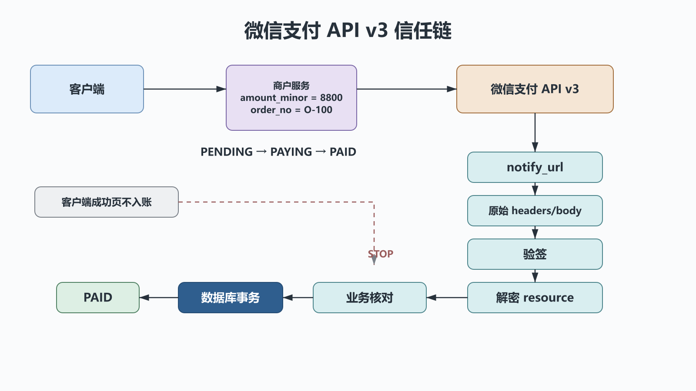
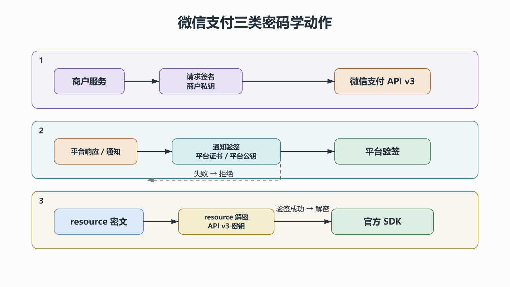

# Python 微信支付：API v3调用链、回调验签与幂等入账

## 前置知识与学习目标

你应理解 HTTPS、非对称签名、数据库事务和上一章的 Web 回调入口。本篇解决：**怎样把微信支付结果可信、且只一次地写入本地订单？**

学完后你应能画出商户服务、微信支付、客户端与数据库的调用链，区分请求签名、响应验签与通知解密，并实现跨支付渠道复用的幂等状态契约。

> 本文是架构与安全边界教程，不保存可用密钥，也不复刻密码学实现。平台接口、证书/公钥模式和官方 SDK 会更新；上线前必须以商户平台当前产品文档、账户配置和沙箱验证为准。

## 贯穿场景与可信边界

订单 `O-100` 金额为 8800 分人民币。客户端只负责展示和调起支付；**客户端成功页不能改变本地订单状态**。可信结果来自服务端查询或经过平台验签、解密和业务核对的服务端通知。

主调用链：

```text
客户端 → 商户服务创建本地订单 → 微信支付下单
客户端 ← 调起参数/支付二维码 ← 商户服务
微信支付 → 商户 notify_url → 验签 → 解密 → 核对 → 数据库事务 → 应答
```

<!-- figure:s40-f01 -->



商户私钥与 API v3 密钥只存在于密钥管理系统和服务端。日志不得记录私钥、API v3 密钥、完整 Authorization、完整解密报文或敏感用户数据。

## 全系列统一的支付状态契约

40–42 篇共用这些领域字段，渠道报文只在适配层转换一次：

```text
order_no: str             商户订单号，全局唯一
provider: str             WECHAT / ALIPAY / UNIONPAY
provider_txn_id: str      平台流水号，渠道内唯一
amount_minor: int         最小货币单位；人民币“分”
currency: str             ISO 风格代码，例如 CNY
status: str               PENDING / PAYING / PAID / CLOSED
event_id: str             可去重的平台事件或稳定报文指纹
```

合法主路径是 `PENDING → PAYING → PAID`，关闭路径是 `PENDING/PAYING → CLOSED`。回调可能重复、乱序或并发到达；已经 `PAID` 的订单不能被普通支付通知改回其他状态。

```python
# behavior-test: run
from dataclasses import dataclass


@dataclass(frozen=True)
class VerifiedPayment:
    provider: str
    event_id: str
    order_no: str
    provider_txn_id: str
    amount_minor: int
    currency: str
    succeeded: bool


def apply_verified_payment(order: dict, event: VerifiedPayment) -> bool:
    """在数据库事务和订单行锁内部调用；True 表示首次入账。"""
    if event.provider != order["provider"]:
        raise ValueError("provider mismatch")
    if event.order_no != order["order_no"]:
        raise ValueError("order mismatch")
    if (event.amount_minor, event.currency) != (
        order["amount_minor"],
        order["currency"],
    ):
        raise ValueError("amount mismatch")
    if order["status"] == "PAID":
        if order["provider_txn_id"] != event.provider_txn_id:
            raise ValueError("paid order has another provider transaction")
        return False
    if order["status"] not in {"PENDING", "PAYING"} or not event.succeeded:
        raise ValueError("illegal state transition")
    order["status"] = "PAID"
    order["provider_txn_id"] = event.provider_txn_id
    return True


order = {
    "provider": "WECHAT",
    "order_no": "O-100",
    "amount_minor": 8800,
    "currency": "CNY",
    "status": "PENDING",
    "provider_txn_id": None,
}
event = VerifiedPayment("WECHAT", "E-1", "O-100", "WX-1", 8800, "CNY", True)
assert apply_verified_payment(order, event) is True
assert apply_verified_payment(order, event) is False
```

数据库还应对 `(provider, event_id)` 和 `(provider, provider_txn_id)` 建唯一约束。读取订单、核对金额、更新状态、写支付流水与 outbox 事件必须在同一事务中完成。

## 微信支付API v3的三类密码学动作

<!-- figure:s40-f02 -->



1. **商户请求签名**：商户用私钥签名请求组成串，平台据此认证商户与报文完整性。
2. **平台响应/通知验签**：商户用当前平台证书或平台公钥验证响应头与原始报文；证书序列号、公钥 ID 和轮换要由官方机制管理。
3. **通知资源解密**：验签通过后，再用 API v3 密钥按官方 SDK 处理 `resource` 的 AEAD_AES_256_GCM 数据。

顺序不可颠倒：**保留原始 headers/body → 验签 → 解密 → 解析 → 业务核对 → 事务入账 → 按协议应答**。不要先把 JSON 重新序列化再验签，也不要自己拼接密码学细节替代官方 SDK。

## 下单与回调字段映射

下单时，本地生成 `order_no` 并先持久化 `PENDING`；金额使用整数分。请求中的 `mchid`、`appid`、`notify_url`、商品描述和产品特定字段来自受控配置。成功返回只表示下单请求被接受，不表示已付款。

通知解密后的关键核对项包括：

| 微信字段          | 领域字段/检查               |
| ----------------- | --------------------------- |
| `out_trade_no`    | `order_no`，必须精确匹配    |
| `transaction_id`  | `provider_txn_id`，唯一保存 |
| `trade_state`     | 只有成功态才进入 `PAID`     |
| `amount.total`    | `amount_minor`，整数分匹配  |
| `amount.currency` | `currency` 匹配             |
| `mchid` / `appid` | 与当前商户配置匹配          |

事件 ID 优先使用平台提供的稳定通知 ID；若当前通知结构没有适用 ID，可对“已验签的原始身份字段集合”生成稳定指纹，但规则必须版本化，不能把到达时间加入指纹。

## 失败边界与恢复

- 验签、解密或商户身份不通过：不读取或修改业务订单，记录安全分类后拒绝。
- 订单不存在、金额/币种不匹配：不得入账；触发安全告警和人工核查。
- 数据库事务失败：回滚且返回可让平台重试的响应，不能先答成功再异步写库。
- 通知长时间未到：主动调用官方查询接口，用同一状态契约对账；查询也要验签和核对。
- 重复通知：唯一约束命中或订单已是同一流水的 `PAID`，返回平台要求的成功应答。

退款使用独立退款单号、退款金额和退款状态，不要把支付 `PAID` 简单改成 `REFUNDED` 来覆盖部分退款历史。

## 常见误区与适用边界

1. **以客户端回跳或前端 SDK 成功回调入账。** 它们只能触发服务端查询。
2. **用浮点数表示金额。** 渠道适配层统一转换为整数最小单位。
3. **验签后不核对金额和商户号。** 签名只能证明报文来自平台，不能证明它属于这张本地订单。
4. **每次重试创建新商户订单号。** 网络超时状态未知，应先用原号查询，避免重复支付意图。

## 自检题

1. 为什么通知解密必须在验签之后？
2. 已验签且 `trade_state` 成功，为什么仍不能直接入账？
3. 数据库已提交但应答丢失时，下一次通知应发生什么？

<details>
<summary>展开答案</summary>

1. 验签先确认密文和头来自可信平台且未被修改，避免处理攻击者构造的数据。
2. 还必须核对商户、应用、订单号、金额和币种，并在本地合法状态迁移中执行。
3. 唯一约束和已支付状态识别为重复，不再次入账，并返回成功应答。

</details>

## 本篇总结

支付接入的核心不是“调通一个 API”，而是建立可信证据链和可重放状态机：服务端签名、原文验签、通知解密、业务核对、事务幂等、查询对账缺一不可。

## 下一篇衔接

下一篇复用同一 `VerifiedPayment` 与订单状态契约，只讨论支付宝的请求签名、同步回跳与异步通知字段差异。

## 资料来源

- [微信支付商户文档（API v3）](https://pay.weixin.qq.com/doc/v3/)
- [微信支付 API v3 Python SDK](https://github.com/wechatpay-apiv3/wechatpay-python)
