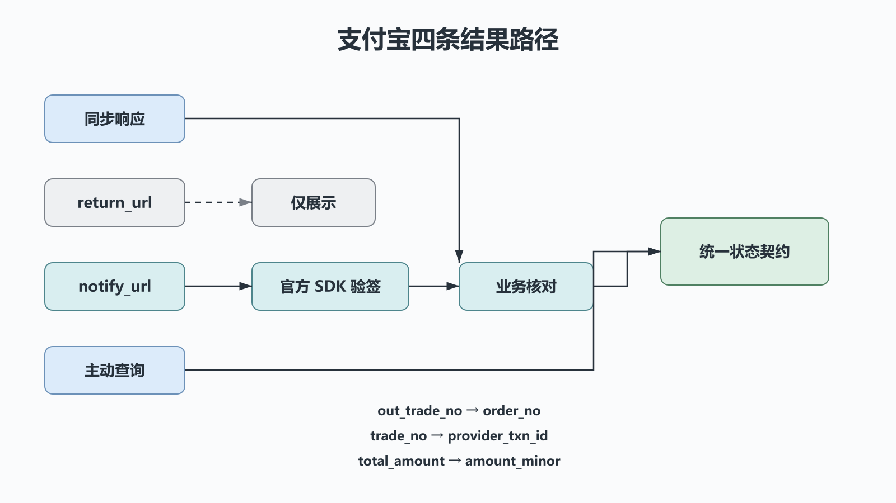

# Python 支付宝支付：签名、异步通知与订单核对

## 前置知识与学习目标

请先掌握上一篇的 `VerifiedPayment`、整数金额、唯一约束和支付状态机。本篇不重复这些机制，只解决：**支付宝的同步回跳、异步通知和查询结果应怎样映射到统一契约？**

学完后你应能选择可信结果源，保留验签原始参数，核对关键身份与金额字段，并正确处理重复通知和状态未知。

> 支付宝产品、密钥/证书模式、接口名和 SDK 会更新。具体参数以应用在开放平台中当前开通的产品文档为准；本文不提供可复制到生产的私钥或手写签名算法。

## 三条返回路径的职责

<!-- figure:s41-f01 -->



1. **接口同步响应**：说明本次网关调用结果，必须用官方 SDK 验证并检查业务响应；不等同最终付款。
2. **`return_url` 同步回跳**：用于改善用户体验，浏览器可伪造、可关闭，不能作为入账依据。
3. **`notify_url` 异步通知**：服务端接收原始表单参数，验签和业务核对后驱动状态机；通知缺失时用查询接口恢复。

可信主路径是 `notify_url` 或服务端主动查询，二者最终都转换为上一篇定义的 `VerifiedPayment(provider="ALIPAY", ...)`。

## 请求构造与签名边界

商户服务先创建本地订单，再调用已开通产品对应的接口。公共参数与业务参数由官方 SDK 按当前规则编码和签名。私钥只在服务端密钥系统中使用；支付宝公钥或证书链按应用配置加载和轮换。

以下名称在不同产品中常见，但不能脱离当前接口文档硬编码：`app_id`、`method`、`charset`、`sign_type`、`timestamp`、`version`、`notify_url`、`biz_content`。`out_trade_no` 必须来自本地唯一 `order_no`，金额从整数分以确定性规则转成接口要求的十进制字符串。

## 异步通知处理顺序

支付宝通知通常是表单字段。必须保留框架解析得到的**原始字段值集合**，在删除/处理签名字段时严格遵循官方 SDK；不要先改编码、金额格式或排序再验签。

```text
原始表单参数
  → 官方 SDK 验签
  → 核对 app_id / seller_id
  → 核对 out_trade_no / total_amount
  → 映射 trade_status
  → 数据库事务内调用 apply_verified_payment
  → 按平台协议返回成功文本
```

关键映射：

| 支付宝字段                 | 领域字段/检查                        |
| -------------------------- | ------------------------------------ |
| `out_trade_no`             | `order_no`                           |
| `trade_no`                 | `provider_txn_id`                    |
| `total_amount`             | 确定性转为 `amount_minor` 后匹配     |
| `trade_status`             | 只有当前产品文档定义的成功终态才入账 |
| `app_id`、`seller_id`      | 与本应用/收款方配置匹配              |
| `notify_id` 或稳定通知身份 | `event_id`，规则依当前协议           |

十进制金额转换不能经过 `float`：

```python
# behavior-test: run
from decimal import Decimal, InvalidOperation


def yuan_to_minor(value: str) -> int:
    try:
        amount = Decimal(value)
    except InvalidOperation as exc:
        raise ValueError("invalid amount") from exc
    minor = amount * 100
    if amount < 0 or minor != minor.to_integral_value():
        raise ValueError("amount must have at most two decimal places")
    return int(minor)


assert yuan_to_minor("88.00") == 8800
```

## 状态、查询与并发

不同支付产品可能出现 `WAIT_BUYER_PAY`、`TRADE_SUCCESS`、`TRADE_FINISHED` 或其他状态。适配层应使用当前产品文档建立白名单映射；未知状态记录并查询，不能凭名称猜测成功。

通知可能与主动查询并发。两条路径都要在同一订单行锁/条件更新和唯一约束下调用统一状态契约：先提交者完成 `PAID`，后到者验证平台流水一致后成为幂等重复。查询超时本身不是失败，订单保持 `PAYING` 或“未知待查”，由定时对账继续收敛。

## 必测失败路径

| 场景                                    | 预期行为                             |
| --------------------------------------- | ------------------------------------ |
| 浏览器只到达 `return_url`               | 展示“处理中”，服务端查询，不直接入账 |
| 验签失败或参数在验签前被改写            | 拒绝并记录安全事件                   |
| `app_id`、`seller_id`、订单或金额不匹配 | 拒绝入账并告警                       |
| 相同 `trade_no` 并发通知                | 只提交一次，重复返回成功             |
| 本地提交成功但应答丢失                  | 重投通知成为幂等重复                 |
| 通知未到或状态未知                      | 使用原 `out_trade_no` 主动查询并对账 |

## 常见误区与适用边界

1. **把回跳页面当后端回调。** 它由用户浏览器承载，不可靠也不可信。
2. **验签前把参数重新拼成自定义字符串。** 使用当前官方 SDK 对原始参数验签。
3. **把 `total_amount` 转成 `float`。** 通过 `Decimal` 精确转为整数分。
4. **失败就换新 `out_trade_no` 重试。** 先查询原订单，避免创建第二个支付意图。

## 自检题

1. 用户看到支付成功页但服务端未收到通知，应怎样处理？
2. 为什么验签通过后还要核对 `seller_id`？
3. 通知和查询同时报告成功时，怎样避免重复入账？

<details>
<summary>展开答案</summary>

1. 页面展示处理中并触发服务端用原订单号查询，不能由页面直接改状态。
2. 签名证明报文来自支付宝，不自动证明收款方就是当前商户应用。
3. 两条路径使用同一事务状态机、订单锁/条件更新和平台流水唯一约束。

</details>

## 本篇总结

支付宝适配层的任务是把不同返回路径收敛为同一个已验证事件。同步回跳只负责体验，异步通知和查询负责事实，金额与身份核对、事务幂等负责本地一致性。

## 下一篇衔接

下一篇继续复用状态契约，重点转向银联全渠道报文、证书验签、`frontUrl`/`backUrl` 和 `queryId` 的恢复语义。

## 资料来源

- [支付宝开放平台文档](https://opendocs.alipay.com/)
- [支付宝开放平台服务端 SDK](https://opendocs.alipay.com/common/02mse3)
