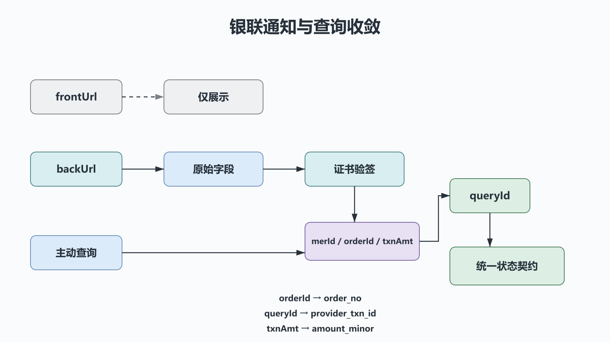

# Python 银联支付：全渠道报文、证书验签与交易恢复

## 前置知识与学习目标

请先掌握第 40 篇的支付状态契约和第 41 篇的回跳/通知差异。本篇解决：**银联全渠道报文怎样通过证书验签、后台通知与查询结果收敛成本地支付事实？**

学完后你应能区分 `frontUrl` 与 `backUrl`，解释报文字段为何必须在验签前保持原样，并使用 `orderId`、`queryId`、金额和商户身份完成核对。

> 银联产品很多，不同产品的版本号、交易类型、必填域、签名方式和 SDK 配置可能不同。必须从开放平台为当前产品下载最新接口规范和 SDK；本文不把某个演示版本号写成通用常量。

## 三个参与面与两条通知路径

<!-- figure:s42-f01 -->



网关支付常见流程：商户服务签名并提交交易报文，浏览器跳转银联页面，银联再分别访问前台和后台地址。

- `frontUrl`：用户浏览器回跳，用于展示，不作为入账依据；
- `backUrl`：银联服务端通知，验签和业务核对后驱动统一状态机；
- 查询接口：通知缺失、超时或状态不明确时的恢复与对账路径。

商户签名证书的私钥只在服务端受控环境使用；验签证书、根证书与中级证书按当前 SDK/规范配置和轮换。

## 请求报文与字段职责

报文通常包含平台协议字段、产品字段与商户字段。以下只说明角色，不代表所有产品都使用同一值：

| 字段                                              | 作用                                    |
| ------------------------------------------------- | --------------------------------------- |
| `version`、`encoding`、`signMethod`、`certId`     | 协议与签名配置，由当前 SDK/产品规范决定 |
| `txnType`、`txnSubType`、`bizType`、`channelType` | 交易与产品语义，不能从其他示例复制      |
| `merId`                                           | 商户身份，通知和查询结果都要核对        |
| `orderId`、`txnTime`                              | 商户订单身份；联合定位原交易            |
| `txnAmt`、`currencyCode`                          | 金额最小单位与币种                      |
| `frontUrl`、`backUrl`                             | 前台体验路径与后台可信通知路径          |

所有值先按当前规范构造，再交给官方 SDK 签名。不要签名后修改字段，也不要把用户可控的任意键加入报文。

## 后台通知处理顺序

银联示例和规范强调：**验签前不要修改接收到的键值对**。框架若自动做字符集转换、合并重复字段或标准化空白，要确认结果仍符合 SDK 的原文规则。

```text
原始通知字段
  → 官方 SDK/证书链验签
  → 核对 merId / orderId / txnAmt / currencyCode
  → 按当前产品规范解释 respCode 和交易状态
  → 映射 queryId 为 provider_txn_id
  → 事务内调用 apply_verified_payment
  → 返回协议要求的 HTTP 成功响应
```

统一字段映射：

| 银联字段                     | 领域字段/检查                                |
| ---------------------------- | -------------------------------------------- |
| `orderId`                    | `order_no`                                   |
| `queryId`                    | `provider_txn_id`，后续撤销/退款的重要关联键 |
| `txnAmt`                     | `amount_minor`，按当前产品单位解释           |
| `currencyCode`               | 适配为 `currency` 并核对                     |
| `merId`                      | 与当前商户配置匹配                           |
| 稳定通知身份或已验签报文指纹 | `event_id`                                   |

`respCode == "00"` 常表示受理成功，但最终语义必须结合当前产品接口的同步应答、后台通知和查询规范。不能把所有接口的 `00` 都机械解释为资金已完成。

## 查询、撤销与退款边界

网络超时后先用原 `orderId`、`txnTime` 等规范要求的身份字段查询。查询明确成功时映射到同一 `VerifiedPayment`；明确失败且允许关闭时再迁移本地状态；未知或处理中继续对账。

撤销和退款不是“再发一次负金额消费”：它们有独立交易类型、商户请求号、金额限制，并通常关联原 `queryId`。部分退款要保留累计退款金额和每笔退款流水，不能覆盖原支付记录。

## 必测失败路径

| 场景                            | 预期行为                           |
| ------------------------------- | ---------------------------------- |
| 只到达 `frontUrl`               | 展示处理中并发起服务端查询，不入账 |
| 通知字段在验签前被改写          | 验签失败，修复解析链而非绕过验签   |
| `merId`、订单、金额或币种不匹配 | 拒绝入账并告警                     |
| 相同 `queryId` 重复/并发通知    | 唯一约束保证只提交一次             |
| 请求超时且无通知                | 查询原交易，不生成第二笔消费       |
| 事务提交后应答丢失              | 重投通知成为幂等重复               |

## 常见误区与适用边界

1. **从旧博客复制固定 `version` 和 `txnType`。** 产品配置必须来自当前规范和测试环境。
2. **验签前删除“看起来没用”的字段。** 任何改动都可能改变签名输入。
3. **把 `frontUrl` 当支付成功通知。** 它经由浏览器，不是可信服务端事实。
4. **只看 `respCode` 不核对交易身份。** 必须同时核对商户、订单、金额、币种和原交易关联。

## 自检题

1. 为什么后台通知字段在验签前必须保持原样？
2. `frontUrl` 到达而 `backUrl` 未到时，本地订单应怎样变化？
3. 为什么退款要保存原 `queryId` 而不能只靠本地订单号？

<details>
<summary>展开答案</summary>

1. 签名覆盖规范定义的字段表示；改值、编码或字段集合会破坏完整性校验。
2. 保持 `PAYING`/未知状态并由服务端查询，不能直接变为 `PAID`。
3. 它是银联侧定位原交易的重要身份，也用于防止关联到错误的平台流水。

</details>

## 本篇总结

银联接入的核心是产品规范驱动，而不是复制固定字段。原文验签、商户与金额核对、`queryId` 关联、事务幂等和查询恢复把多条不可靠路径收敛为一条可信状态。

## 下一篇衔接

支付查询、回调补偿和对账都是高 I/O 工作。下一篇用标准库 `asyncio` 把并发上限、超时、取消和结构化任务生命周期组织成可验证的订单编排器。

## 资料来源

- [中国银联开放平台](https://open.unionpay.com/)
- [银联网关支付消费交易接口示例](https://open.unionpay.com/tjweb/acproduct/APIList?acpAPIId=317&apiservId=451&bussType=0)
- [银联产品接口规范下载区](https://open.unionpay.com/tjweb/acproduct/list.do)
