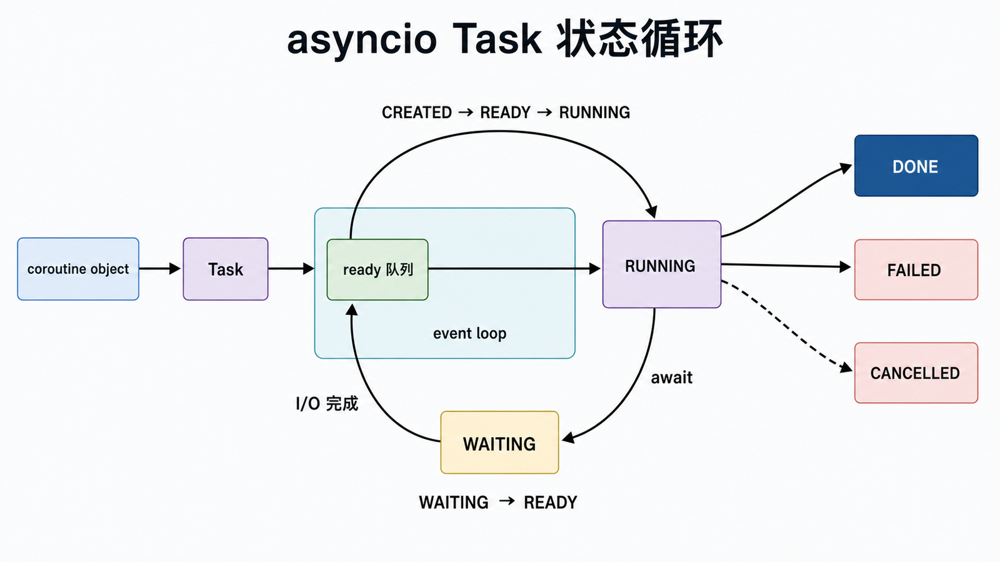
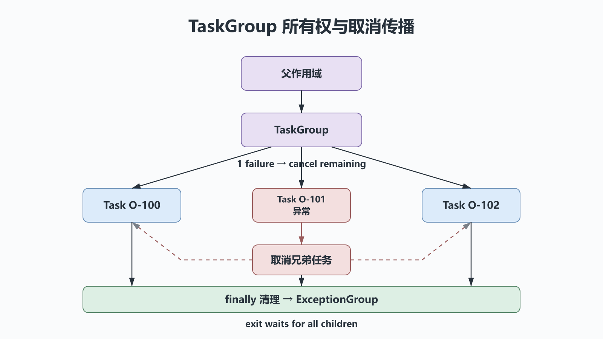

# 并发编程之asyncio：事件循环、结构化并发与异步IO

## 前置知识与学习目标

你应使用 Python 3.11+，并理解第 35 篇的协作式调度、第 36 篇的 I/O 就绪和支付篇的幂等查询。本篇解决：**怎样用标准库把一批订单查询组织成有并发上限、可超时、可取消且不泄漏任务的异步作用域？**

学完后你应能区分协程对象、Task 与 Future，描述事件循环中的状态迁移，使用 `TaskGroup` 和 `Semaphore`，并正确隔离阻塞代码。

## 直觉：`await` 是可见的让出点

调用 `async def` 函数只创建协程对象，并不会立刻执行函数体。协程被 `await`、包装为 Task 或交给 `asyncio.run()` 后才由事件循环推进。

一个 Task 的简化状态：

<!-- figure:s43-f01 -->



```text
CREATED → READY → RUNNING → WAITING(await I/O/timer)
                    ↑             ↓
                    └──── READY ──┘
                 → DONE / FAILED / CANCELLED
```

事件循环从 ready 队列取 Task 运行到下一个 `await`。等待的 Future 完成后，Task 的继续执行回调重新进入 ready 队列。单个事件循环通常在一个线程中运行；任何没有让出的长计算或阻塞调用都会拖住全部 Task。

## 核心对象与职责

| 对象             | 职责                                     | 常见误解             |
| ---------------- | ---------------------------------------- | -------------------- |
| coroutine object | 保存可暂停函数的执行描述                 | 创建后会自动运行     |
| `Task`           | 在事件循环中调度协程并保存结果/异常      | 不保存引用也没关系   |
| `Future`         | 表示未来完成的低层结果                   | 应用层应大量手工创建 |
| event loop       | 调度 ready 回调并接收 I/O/计时器完成通知 | 自动让 CPU 代码并行  |

`asyncio.run(main())` 是普通程序的顶层入口，负责创建并关闭事件循环。不要在已经运行的事件循环内部再次调用它。

## 最小结构化并发示例

<!-- figure:s43-f02 -->



输入是一组订单 ID；每个查询有单任务超时，`Semaphore` 限制在途请求，`TaskGroup` 保证子任务不会逃出作用域。输出按订单 ID 排序，避免把完成顺序误当身份。

```python
# behavior-test: run; requires-python>=3.11
import asyncio


async def fetch_status(order_id: str, limit: asyncio.Semaphore) -> tuple[str, str]:
    async with limit:
        async with asyncio.timeout(0.5):
            await asyncio.sleep(0.01)  # 替换为真正的异步 HTTP 客户端
            return order_id, "PAID"


async def run_batch(order_ids: list[str]) -> list[tuple[str, str]]:
    limit = asyncio.Semaphore(10)
    tasks: dict[str, asyncio.Task[tuple[str, str]]] = {}
    async with asyncio.TaskGroup() as group:
        for order_id in order_ids:
            tasks[order_id] = group.create_task(
                fetch_status(order_id, limit),
                name=f"query:{order_id}",
            )
    return sorted(task.result() for task in tasks.values())


if __name__ == "__main__":
    assert asyncio.run(run_batch(["O-100", "O-101", "O-102"])) == [
        ("O-100", "PAID"),
        ("O-101", "PAID"),
        ("O-102", "PAID"),
    ]
```

如果任一子任务抛出未处理异常，`TaskGroup` 会取消仍在运行的兄弟任务，等待它们结束，再以异常组离开作用域。这种“父作用域拥有子任务”的结构比散落的 `create_task()` 更容易推理。

## 超时、取消与清理

超时通常通过取消当前 Task 实现。取消是正常控制流：

```python
async def persist_once() -> None:
    resource = await acquire_resource()
    try:
        await use_resource(resource)
    finally:
        await release_resource(resource)
```

若捕获 `asyncio.CancelledError` 只为清理，清理后应继续抛出，除非你明确把取消转换为领域结果并理解结构化并发的影响。`shield()` 不能让工作脱离生命周期，它只改变外层取消的传播方式，应少用且保留任务引用。

支付写事务不能因为客户端取消就处于“可能提交、可能未提交”的模糊状态。应让数据库事务自身原子化，并通过幂等键和后续查询恢复，而不是试图用无限 `shield` 保证网络请求。

## 队列、背压与并发上限

`Semaphore` 限制同时执行数，`asyncio.Queue(maxsize=N)` 限制待处理积压。两者含义不同：前者保护连接池/对端配额，后者把生产速度反馈给生产者。

队列消费者必须定义：任务身份、成功/失败结果通道、`task_done()` 配对、停止哨兵或关闭条件。不要无界 `create_task()`；Task 本身、请求体和连接都会占内存。

## 阻塞代码与CPU工作

- 短期兼容阻塞 I/O：`await asyncio.to_thread(func, ...)`，并设置底层超时；线程中的函数不会因外层 Task 取消而被强制终止。
- 需要自定义执行器：`loop.run_in_executor(...)`，明确线程池生命周期。
- CPU 密集：优先进程池或外部工作服务；把长计算放入线程只会把阻塞位置移动掉。

异步库必须贯穿调用链。若底层客户端仍是阻塞的，在 `async def` 中直接调用它会冻结事件循环。

## 可观测性与失败边界

生产指标至少包括在途 Task 数、队列长度、事件循环延迟、超时率、取消率、对端错误分类和连接池等待时间。给 Task 命名并传播 `order_no`/请求 ID，但日志不记录支付密钥和完整敏感报文。

调试时可开启 asyncio debug 模式，查找未等待协程、耗时回调和错误线程调用。Task 的异常必须在结构化作用域或显式结果收集点被观察，不能创建后遗忘。

## 常见误区与适用边界

1. **`await` 等于并发。** 连续 `await` 仍是串行；要在受控作用域内先创建多个 Task。
2. **使用 `time.sleep`。** 它阻塞事件循环；协程内用 `await asyncio.sleep`。
3. **取消等于底层操作停止。** 线程、数据库和远端请求可能继续，需要幂等与查询恢复。
4. **`gather` 与 `TaskGroup` 完全等价。** 它们的异常和兄弟任务生命周期语义不同；相关子任务优先结构化作用域。

`asyncio` 适合大量 I/O 等待且依赖支持异步接口的系统。简单脚本、阻塞库占主导或 CPU 计算为主时，线程/进程可能更清楚。

## 自检题

1. 调用 `fetch_status("O-100", limit)` 后为什么还没有发请求？
2. 一个 Task 在 `to_thread` 外层被取消，线程函数一定停止吗？
3. `Semaphore(10)` 与 `Queue(maxsize=10)` 分别限制什么？

<details>
<summary>展开答案</summary>

1. 调用异步函数只创建协程对象，要被 await 或调度成 Task 才执行。
2. 不一定；取消的是等待它的 Task，运行中的普通线程无法被 asyncio 安全强制终止。
3. Semaphore 限制同时进入临界 I/O 的数量；Queue 限制尚未消费的积压数量并产生背压。

</details>

## 本篇总结

`asyncio` 的核心是显式让出与任务所有权。可靠程序把 Task 放进结构化作用域，用超时和取消表达生命周期，用并发上限和有界队列表达资源边界，再用幂等状态机恢复无法强制停止的外部操作。

## 下一篇衔接

本篇完成了 Python 高级系列的订单处理闭环。继续实践时，可把第 36 篇的帧协议改成 `asyncio` Streams，并把第 40–42 篇的支付查询适配器放入同一个受限 `TaskGroup`，验证超时、重复和对账恢复。

## 资料来源

- [Python `asyncio` 文档](https://docs.python.org/3/library/asyncio.html)
- [Coroutines and Tasks](https://docs.python.org/3/library/asyncio-task.html)
- [Synchronization Primitives](https://docs.python.org/3/library/asyncio-sync.html)
- [Developing with asyncio](https://docs.python.org/3/library/asyncio-dev.html)
