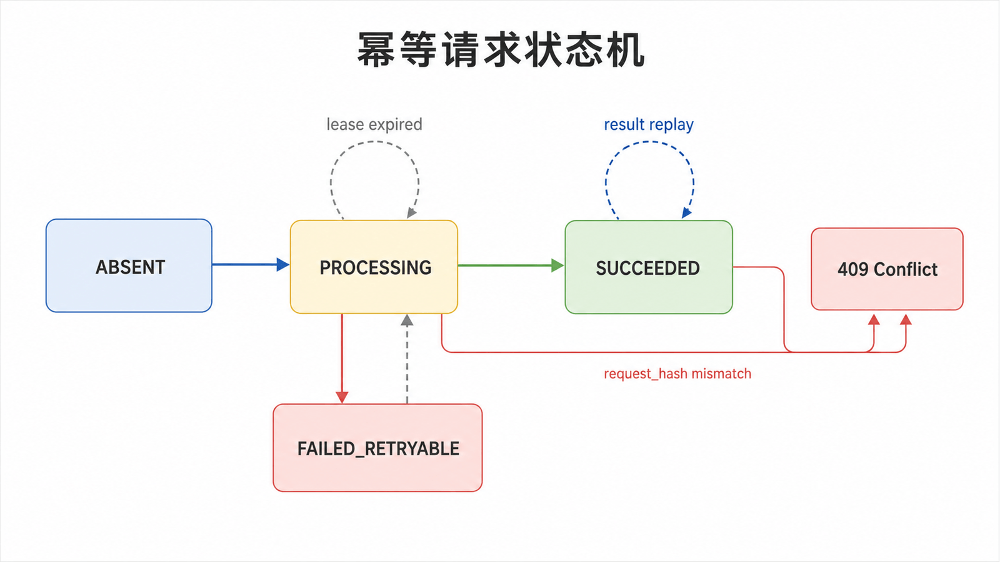
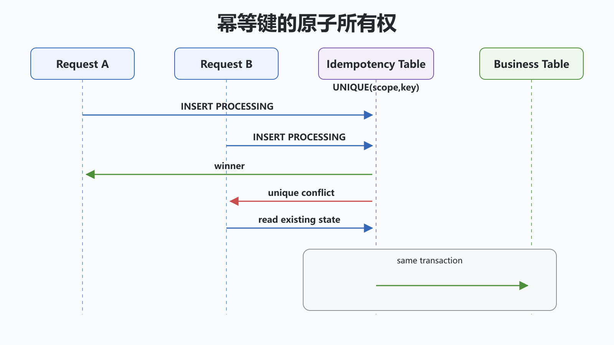

## 前置知识与学习目标

你需要理解 HTTP 重试、数据库唯一约束、事务和消息消费。读完后，你应当能够：

1. 定义幂等键的作用域、请求摘要、状态和过期策略；
2. 解释为什么“先查再写”和普通内存缓存不能抵抗并发；
3. 为同步接口与异步消息设计原子边界、恢复路径和最小测试矩阵。

本篇不是 GoF 模式，而是把前面学到的“稳定协议、状态机与失败边界”迁移到订单接口。

## 场景：客户端不知道订单是否创建成功

客户端发送 `POST /orders` 后网络超时。服务器可能未收到请求，也可能已经提交订单但响应丢失。客户端重试时，系统必须让相同业务意图只产生一次可观察副作用，并返回一致结果。

幂等不是“永远返回 200”，也不是“同一个 URL 只能调用一次”。它要求在明确作用域和保留窗口内，相同幂等键与相同请求语义重复执行时，不重复产生业务效果。

<!-- figure-anchor: s09-f01-idempotency-state-machine -->



## 契约字段与状态机

建议持久化以下字段：

| 字段                 | 作用                                      |
| -------------------- | ----------------------------------------- |
| `scope`              | 租户、用户或接口维度，防止不同主体冲突    |
| `idempotency_key`    | 客户端生成的随机唯一键                    |
| `request_hash`       | 规范化请求摘要，检测同键异文              |
| `status`             | `PROCESSING`、`SUCCEEDED`、可恢复失败状态 |
| `response_code/body` | 成功重放或结果查询                        |
| `owner_token`        | 识别当前处理者，避免无所有权接管          |
| `expires_at`         | 控制保留时间与清理                        |

核心状态变化：首次请求原子创建 `PROCESSING`；业务与幂等结果在同一事务提交为 `SUCCEEDED`；重复请求读取成功响应；同键不同摘要返回冲突；长期 `PROCESSING` 只能按租约与恢复策略接管。

## 为什么先查再写会失败

```text
请求 A: SELECT -> 不存在 ---------------- INSERT
请求 B:          SELECT -> 不存在 ---------------- INSERT
```

两个并发事务都可能看到“不存在”。正确边界是数据库对 `(scope, idempotency_key)` 建唯一约束，再用条件写入或冲突处理决定所有权。唯一约束是最后防线，应用层查询只是优化。

<!-- figure-anchor: s09-f02-idempotency-atomic-boundary -->



## 可运行的单进程状态机示例

下面示例用锁模拟原子登记，只用于理解状态转换；生产环境应把原子性放在数据库或具备等价语义的存储中。

```python
from dataclasses import dataclass
from threading import Lock
from typing import Callable


@dataclass(frozen=True)
class StoredResult:
    request_hash: str
    response: dict[str, str]


class IdempotencyStore:
    def __init__(self) -> None:
        self._results: dict[tuple[str, str], StoredResult] = {}
        self._lock = Lock()

    def execute(
        self,
        scope: str,
        key: str,
        request_hash: str,
        operation: Callable[[], dict[str, str]],
    ) -> dict[str, str]:
        compound_key = (scope, key)
        with self._lock:
            existing = self._results.get(compound_key)
            if existing is not None:
                if existing.request_hash != request_hash:
                    raise ValueError("idempotency key reused with different request")
                return existing.response

            response = operation()
            self._results[compound_key] = StoredResult(request_hash, response)
            return response


store = IdempotencyStore()
calls = 0


def create_order() -> dict[str, str]:
    global calls
    calls += 1
    return {"order_id": "order-1"}


assert store.execute("tenant-1", "key-1", "sha256:a", create_order) == {
    "order_id": "order-1"
}
assert store.execute("tenant-1", "key-1", "sha256:a", create_order) == {
    "order_id": "order-1"
}
assert calls == 1
```

锁覆盖了业务操作，因而吞吐受限，也不能抵抗进程崩溃。生产实现通常需要一张幂等表与订单表同事务提交；若业务操作是远程调用，则要用可恢复状态机、下游幂等键和结果查询，不能假装存在本地原子事务。

## 请求摘要与响应策略

摘要应基于规范化后的业务字段，并排除时间戳、追踪 ID 等非语义字段。相同 key 但摘要不同应返回 `409 Conflict` 或等价业务错误。对成功结果可重放原响应；对确定性客户端错误是否缓存要由契约决定；对超时和未知结果不得直接覆盖为失败。

## 消息链路：outbox、inbox 与至少一次投递

订单事务同时写订单与 outbox 事件；后台发布器反复发送未确认事件。消费者在本地事务中以 `event_id` 写 inbox 唯一记录并执行副作用。即使消息重复投递，唯一约束也只允许一次业务处理。

这提供的是“至少一次投递 + 幂等处理”形成的一次业务效果，不应宣传为基础设施天然的“恰好一次”。

## Redis 锁不是幂等结果表

`SET key token NX PX ttl` 可协助短期互斥，但锁过期后旧处理者仍可能继续执行。释放时必须用 Lua 比较 token 后删除；长任务还要处理续租与 fencing token。只加锁不保存最终响应，重试仍无法获得一致结果。

## 最小测试矩阵

至少验证：两个并发相同请求、同键不同正文、业务事务回滚、提交后响应丢失、处理中进程崩溃、重复与乱序消息、幂等记录过期、数据库暂时不可用。断言不仅是状态码，还包括订单数量、扣款次数、事件数量和最终响应。

## 常见误区与适用边界

1. **用“先查询订单”代替唯一约束**：并发窗口仍存在。
2. **只按 key 去重，不校验请求摘要**：客户端误复用会拿到无关响应。
3. **`PROCESSING` 永不恢复**：崩溃后请求永久卡住。
4. **失败都缓存**：临时故障可能被固化；必须区分确定性失败和未知结果。
5. **锁过期就安全接管**：旧持有者可能仍在运行，需要所有权和 fencing。

## 自检题

<details>
<summary>1. 唯一约束为什么比应用层查询更关键？</summary>

数据库唯一约束能在并发写入的原子边界裁决唯一所有者；查询与写入之间存在竞争窗口。

</details>

<details>
<summary>2. 相同 key 携带不同请求正文应如何处理？</summary>

比较规范化请求摘要并返回冲突，不能复用旧响应，也不能把它当作新请求覆盖旧记录。

</details>

<details>
<summary>3. outbox 为什么仍要求消费者幂等？</summary>

发布器可能在发送成功但确认丢失后重发，消息系统也可能重复投递；消费者必须按事件 ID 去重。

</details>

## 本篇总结

可靠幂等来自明确契约、持久状态机和原子约束。锁只能解决局部互斥，不能替代结果记录、崩溃恢复与消息去重。设计时要把“结果未知”当作一等状态。

## 下一篇衔接

下一篇继续迁移模式思维：订单日志大到无法装入内存时，如何根据数据规模、值域和误差预算选择分桶、外排序、堆、Bitmap 或 Bloom Filter。

## 资料来源

- [HTTP Semantics：幂等方法](https://www.rfc-editor.org/rfc/rfc9110.html#name-idempotent-methods)
- [Python `sqlite3`：事务控制](https://docs.python.org/3/library/sqlite3.html#transaction-control)
- [Python `threading.Lock`](https://docs.python.org/3/library/threading.html#lock-objects)
