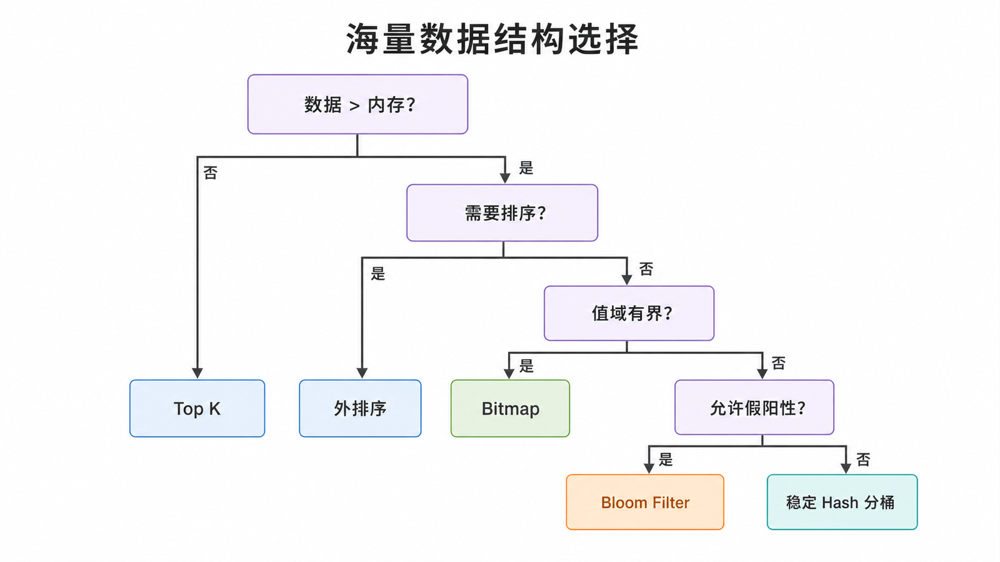
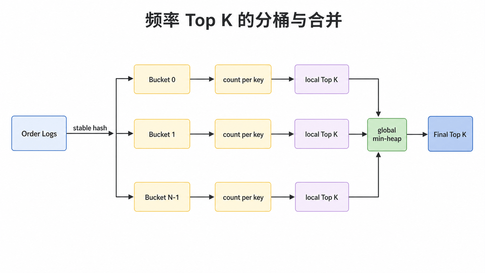
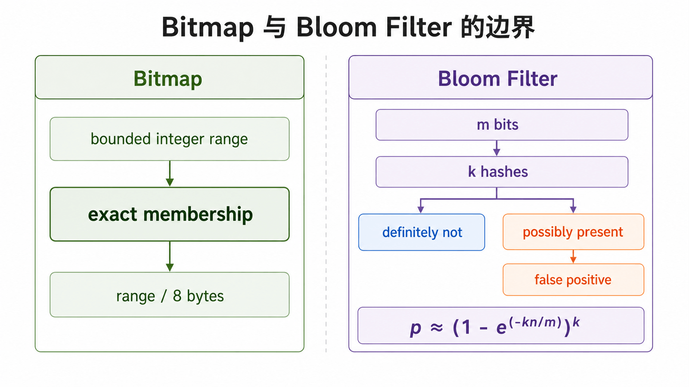

## 前置知识与学习目标

你需要了解 Hash、排序、堆和文件流。读完后，你应当能够：

1. 先根据数据量、内存、值域、误差和磁盘预算选择算法；
2. 解释 Top K、分桶、外排序、Bitmap 与 Bloom Filter 的复杂度和边界；
3. 用流式代码验证核心路径，而不是把全量数据重新装回内存。

本篇不是 GoF 模式，而是系列的算法迁移实践：把“先找变化与约束，再选择结构”的方法应用到订单日志。

## 第一步永远是约束建模

“100 GB 文件找 Top 100”信息不足。至少先问：记录格式与数量 `N`、可用内存 `M`、值域、是否允许近似、输入是否有序、结果是否要求稳定顺序、磁盘空间和机器数量。

<!-- figure-anchor: s10-f01-large-data-decision-tree -->



| 问题         | 常用结构                 | 典型复杂度                     | 精确性   |
| ------------ | ------------------------ | ------------------------------ | -------- |
| 数值 Top K   | 大小为 `K` 的小根堆      | 时间 `O(N log K)`，空间 `O(K)` | 精确     |
| 频率 Top K   | 分桶计数 + 每桶聚合 + 堆 | 取决于唯一键数                 | 精确     |
| 有界整数去重 | Bitmap                   | 空间约为 `range / 8` 字节      | 精确     |
| 任意键存在性 | Bloom Filter             | 固定内存                       | 有假阳性 |
| 全量排序     | 分块排序 + K 路归并      | 时间约 `O(N log N)`            | 精确     |

## Top K：堆里维护什么

找最大 K 个数时，维护大小为 K 的小根堆，堆顶是当前候选中最小值：

```python
import heapq
from collections.abc import Iterable


def largest_k(values: Iterable[int], k: int) -> list[int]:
    if k <= 0:
        return []

    heap: list[int] = []
    for value in values:
        if len(heap) < k:
            heapq.heappush(heap, value)
        elif value > heap[0]:
            heapq.heapreplace(heap, value)
    return sorted(heap, reverse=True)


assert largest_k([7, 1, 9, 3, 8, 2], 3) == [9, 8, 7]
```

如果题目是“频率最高 K 个键”，堆元素必须是 `(frequency, key)`，而不是比较 key 本身。第一阶段要先统计频率；唯一键也放不进内存时，再用稳定 Hash 分桶，让同一个键始终落入同一桶后逐桶聚合。

<!-- figure-anchor: s10-f02-topk-partition-merge -->



Python 内置 `hash()` 默认会跨进程随机化，不能作为需要跨运行复现的持久分桶函数。可使用 SHA-256 等稳定摘要：

```python
from hashlib import sha256


def stable_bucket(key: str, bucket_count: int) -> int:
    if bucket_count <= 0:
        raise ValueError("bucket_count must be positive")
    digest = sha256(key.encode("utf-8")).digest()
    return int.from_bytes(digest[:8], "big") % bucket_count


assert stable_bucket("order-1", 32) == stable_bucket("order-1", 32)
```

分桶不是免费午餐：数据倾斜会让热键桶超出内存，需要二次分桶或专门处理重键。

## 精确去重与近似存在性不能混为一谈

### Bitmap：有界整数集合的精确表示

若用户 ID 位于 `[0, 10^9)`，一位表示是否出现，理论空间约 125 MB。若还要区分“出现一次”和“出现多次”，可用两个 Bitmap 或 2-bit 状态。

### Bloom Filter：只适合快速排除

Bloom Filter 用 `m` 个 bit 和 `k` 个 Hash。查询为“未出现”时结论确定；查询为“可能出现”时存在假阳性，因此不能单独用于两个文件的精确交集或精确去重。给定元素数 `n`，假阳性率近似为：

`p ≈ (1 - e^(-kn/m))^k`

它也不适合普通删除，因为清除共享 bit 会破坏其他元素；需要删除时考虑 Counting Bloom Filter 或外部精确索引。

<!-- figure-anchor: s10-f03-bitmap-bloom-boundary -->



## 外排序：内存只负责一个有界块

外排序包含两个阶段：

1. 每次读取不超过 `M` 的记录，在内存排序后写成有序 run；
2. 用最小堆对多个 run 做 K 路归并，边读边写最终文件。

Python 的 `heapq.merge()` 能惰性归并多个已排序迭代器：

```python
from heapq import merge


def merge_sorted_chunks(*chunks: list[int]) -> list[int]:
    return list(merge(*chunks))


assert merge_sorted_chunks([1, 4, 8], [2, 3, 9], [0, 7]) == [0, 1, 2, 3, 4, 7, 8, 9]
```

真实实现不能把归并结果再 `list()`；应逐条写文件，并限制同时打开的文件数。临时文件要带任务 ID，写完后原子重命名，失败时可恢复或清理。

## 大文件中位数：方法取决于值域

- 值域小且离散：按值域计数或分桶，累计计数定位中位数，精确且高效。
- 值域大：外排序后定位第 `N/2` 项，或多轮范围分桶。
- 允许误差：使用分位数草图；必须报告误差界限。

用两个堆在线维护中位数需要 `O(N)` 内存，不能因为“流式读取”就称为海量数据方案。固定 `bucket_counts[n // width]` 还必须先明确最小值、最大值和负数处理，否则会越界或映射错误。

## 两个大文件求精确交集

可选方案：

1. 两个文件都外排序，再用双指针顺序扫描，空间近似 `O(1)`；
2. 用同一稳定 Hash 规则分别分桶，只比较对应桶，并对结果去重；
3. Bloom Filter 只作为预过滤，所有“可能存在”仍需精确校验。

若输出可能本身非常大，应流式写出，不能积累到列表。

## MapReduce 的真正边界

Map 将记录转换为 `(key, value)`；Shuffle 保证相同 key 到同一 Reduce 分区；Reduce 聚合。分布式实现还要面对序列化、倾斜、失败重试和重复执行，因此 Mapper 与 Reducer 应尽量确定、无副作用，输出使用任务尝试隔离与提交协议。

## 常见误区与适用边界

1. **代码逐行读取就等于低内存**：若同时把所有唯一键、偏移或结果放进集合，空间仍是 `O(N)`。
2. **Bloom Filter 用于精确答案**：假阳性会污染结果，必须二次验证。
3. **分桶使用进程随机 Hash**：重新运行后桶不一致，无法对应合并。
4. **文本行号当字节偏移传给 `seek()`**：行号不是文件位置；应在二进制模式记录 `tell()` 返回的字节偏移。
5. **忽略文件句柄与临时文件清理**：异常路径会耗尽句柄或磁盘。
6. **只报算法，不报假设**：没有值域、误差与资源预算，答案不可验证。

## 自检题

<details>
<summary>1. 数值 Top K 与频率 Top K 的堆元素有什么不同？</summary>

数值 Top K 直接维护数值；频率 Top K 要先得到每个键的频率，再维护 `(frequency, key)` 候选。

</details>

<details>
<summary>2. 为什么 Bloom Filter 不能直接给出精确交集？</summary>

它会把未出现元素误判为“可能出现”；所有阳性结果都需要精确数据源二次验证。

</details>

<details>
<summary>3. 外排序为什么能突破内存限制？</summary>

内存只保存一个有界排序块和归并堆，其余有序 run 放在磁盘并按需读取。

</details>

## 本篇总结

海量数据处理的核心不是背题，而是把输入规模、内存、值域、误差和输出规模变成明确约束。结构选择随后自然出现：堆维护候选，稳定 Hash 缩小问题，Bitmap 做精确有界表示，Bloom Filter 做近似预过滤，外排序用磁盘换内存。

## 下一篇衔接

本篇是系列终章。回到第一篇的四步：描述失败场景、找变化轴或资源约束、建立稳定边界、用复杂度与测试验证代价。面对新问题时，先复用这套分析方法，而不是先搜索模式名称。

## 资料来源

- [Python `heapq`](https://docs.python.org/3/library/heapq.html)
- [Python `hashlib`](https://docs.python.org/3/library/hashlib.html)
- [Python `itertools`](https://docs.python.org/3/library/itertools.html)
- Broder, Mitzenmacher, _Network Applications of Bloom Filters: A Survey_
