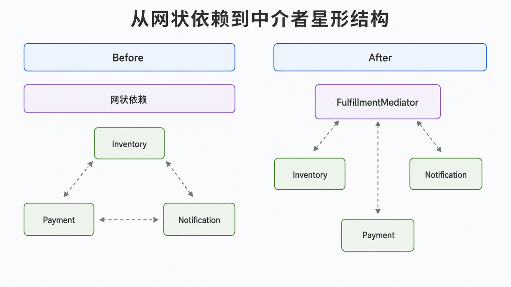
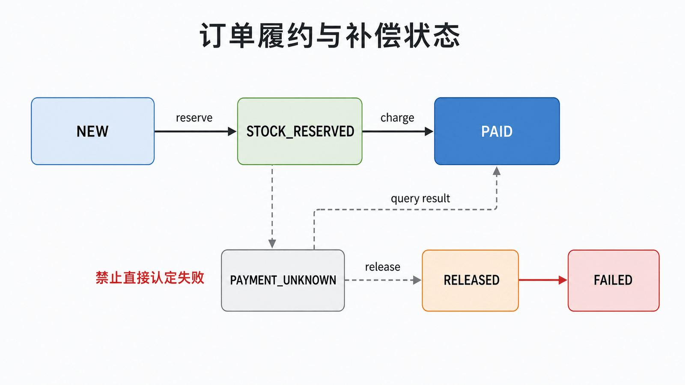

## 前置知识与学习目标

你需要理解组合、命令对象和异常处理。读完后，你应当能够：

1. 把同事对象之间的网状依赖改成经中介者协调的星形依赖；
2. 用明确消息代替脆弱的字符串分支；
3. 识别中介者膨胀为“上帝对象”的信号与拆分边界。

## 场景：订单履约不是简单广播

提交订单时，系统要先预留库存，再扣款，最后通知用户；库存失败不能扣款，扣款失败要释放库存。这不是观察者式的“各自响应事实”，而是一条有顺序、有补偿的协作规则。让库存、支付和通知互相直接调用会形成网状依赖。

中介者让同事对象只认识中介者，由中介者拥有流程规则。

<!-- figure-anchor: s06-f01-mediator-network-to-star -->



## 角色与状态变化

- **Colleague（同事）**：库存、支付、通知等专注单一能力。
- **Mediator（中介者）**：决定调用顺序、传递数据并处理失败。
- **Command/Result（命令与结果）**：显式描述输入、输出和状态。

```python
from dataclasses import dataclass


@dataclass(frozen=True)
class PlaceOrder:
    order_id: str
    sku: str
    quantity: int
    total_cents: int


class Inventory:
    def __init__(self, stock: dict[str, int]) -> None:
        self.stock = stock

    def reserve(self, sku: str, quantity: int) -> None:
        if self.stock.get(sku, 0) < quantity:
            raise ValueError("insufficient stock")
        self.stock[sku] -= quantity

    def release(self, sku: str, quantity: int) -> None:
        self.stock[sku] = self.stock.get(sku, 0) + quantity


class PaymentGateway:
    def charge(self, order_id: str, total_cents: int) -> str:
        if total_cents <= 0:
            raise ValueError("total must be positive")
        return f"payment:{order_id}"


class FulfillmentMediator:
    def __init__(self, inventory: Inventory, payment: PaymentGateway) -> None:
        self.inventory = inventory
        self.payment = payment

    def place(self, command: PlaceOrder) -> str:
        self.inventory.reserve(command.sku, command.quantity)
        try:
            return self.payment.charge(command.order_id, command.total_cents)
        except Exception:
            self.inventory.release(command.sku, command.quantity)
            raise


inventory = Inventory({"coffee": 2})
mediator = FulfillmentMediator(inventory, PaymentGateway())
assert mediator.place(PlaceOrder("order-1", "coffee", 1, 8800)) == "payment:order-1"
assert inventory.stock["coffee"] == 1
```

成功路径是 `NEW → STOCK_RESERVED → PAID`；支付失败路径是 `STOCK_RESERVED → RELEASED → FAILED`。示例只展示进程内补偿：真实跨系统调用还要处理超时后结果未知、重复补偿和重试幂等。

<!-- figure-anchor: s06-f02-mediator-compensation-state -->



## 为什么不用字符串 `execute("sell", n)`

字符串命令容易拼错，参数形状也无法静态检查。专用方法或不可变命令对象能表达合法状态，并把缺失字段尽早暴露。若命令类型很多，可进一步使用命令处理器注册表，但不要把所有业务都塞进一个巨大的 `if/elif`。

## 中介者与观察者的选择

观察者表达“事件发生后，订阅者独立反应”，发布者通常不关心谁先完成；中介者表达“多个对象要按规则共同完成一个用例”，它拥有顺序与决策。一个系统可以同时使用：中介者完成订单事务，成功后再发布 `OrderCreated` 事件。

## 常见误区与适用边界

1. **中介者包含所有领域逻辑**：计算价格等内聚规则应留在领域对象，中介者只编排协作。
2. **只减少连线，不减少耦合**：若同事仍读取彼此内部状态，星形类图只是表面变化。
3. **忽略补偿失败**：释放库存也可能失败，需要可重试命令、状态持久化和告警。
4. **把同步内存流程直接搬到分布式系统**：远程调用存在超时、重复和部分成功。
5. **两个稳定对象也引入中介者**：简单直接调用更清楚。

当中介者同时处理过多用例、拥有大量字段或频繁因无关需求修改时，应按业务流程拆成多个应用服务或工作流处理器。

## 自检题

<details>
<summary>1. 中介者与观察者在控制权上有什么区别？</summary>

中介者拥有协作顺序和决策；观察者的发布者通常只发布事实，订阅者独立处理。

</details>

<details>
<summary>2. 支付超时为什么不能立即认定失败并释放库存？</summary>

超时只说明客户端未收到结果，支付可能已成功；应查询结果、使用幂等键并依据明确状态执行补偿。

</details>

<details>
<summary>3. 中介者何时正在变成上帝对象？</summary>

它处理大量无关用例、保存各领域内部状态、出现巨大分支并因任何需求变化而修改时，应拆分边界。

</details>

## 本篇总结

中介者集中的是对象间协作规则，而不是所有业务逻辑。明确命令、状态与补偿路径，才能让星形依赖真正降低耦合，而不是把复杂度藏到一个类里。

## 下一篇衔接

前几篇都关注对象如何创建、包装和协作。下一篇转向集合访问：如何让调用方顺序读取订单项而不暴露内部存储结构。

## 资料来源

- Gamma 等，《Design Patterns》：Mediator
- [Python `dataclasses`](https://docs.python.org/3/library/dataclasses.html)
- [Python 异常处理](https://docs.python.org/3/tutorial/errors.html)
