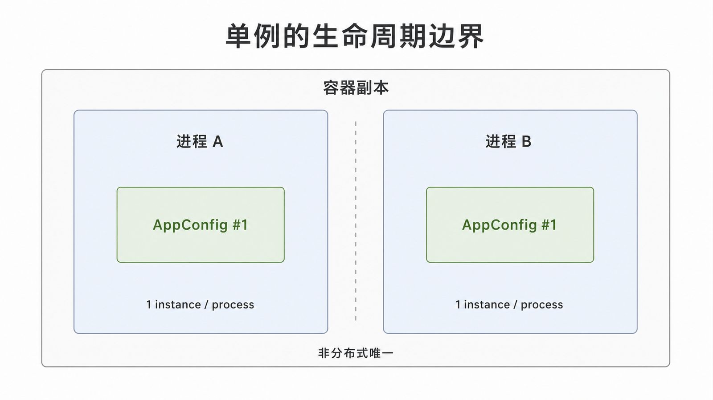
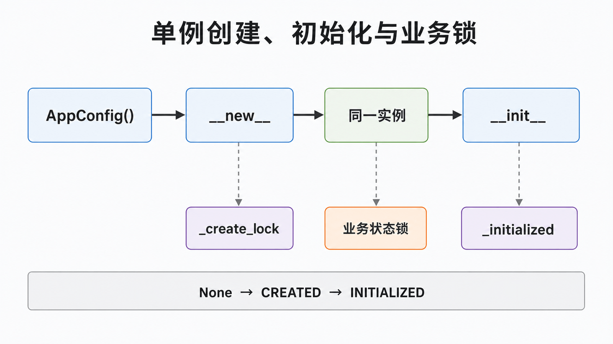

## 前置知识与学习目标

你需要理解类属性、`__new__`、`__init__` 和线程锁。读完后，你应当能够：

1. 区分对象身份唯一、初始化一次和业务操作线程安全；
2. 实现并验证一个进程内单例；
3. 判断模块对象、依赖注入或资源池何时优于单例。

## 场景：订单号配置只能有一份吗

订单服务需要读取统一的编号前缀和重试参数。若每个调用点都重新解析配置，不仅浪费，还可能在运行期读到不同版本。单例试图保证：在一个明确的生命周期范围内，某个类只有一个实例，并提供一致的访问入口。

这里最重要的限定词是“范围”。普通 Python 单例只对当前解释器进程有效；多进程、多个容器和多台机器仍会各自拥有实例。

<!-- figure-anchor: s02-f01-singleton-lifecycle-boundary -->



## 核心机制：创建与初始化是两个阶段

调用 `AppConfig()` 时，Python 先通过 `__new__` 创建或取得对象，再调用 `__init__` 初始化。若 `__new__` 每次返回同一对象，但 `__init__` 每次重置字段，仍会出现状态被重复覆盖的问题。

```python
from __future__ import annotations

from threading import Lock


class AppConfig:
    _instance: AppConfig | None = None
    _create_lock = Lock()

    def __new__(cls) -> AppConfig:
        if cls._instance is None:
            with cls._create_lock:
                if cls._instance is None:
                    cls._instance = super().__new__(cls)
        return cls._instance

    def __init__(self) -> None:
        if getattr(self, "_initialized", False):
            return
        self.order_prefix = "ORD"
        self.max_retries = 3
        self._initialized = True


first = AppConfig()
second = AppConfig()
assert first is second
assert second.order_prefix == "ORD"
```

调用链是：`AppConfig()` → 检查 `_instance` → 必要时加锁创建 → 返回同一对象 → `__init__` 通过 `_initialized` 保证只做一次初始化。

<!-- figure-anchor: s02-f02-singleton-creation-call-chain -->



## 线程安全不等于单例安全

上面的锁只保护“实例创建”。如果单例内部有可变计数器，业务操作仍需单独同步：

```python
from threading import Lock


class Sequence:
    def __init__(self) -> None:
        self._value = 0
        self._lock = Lock()

    def next(self) -> int:
        with self._lock:
            self._value += 1
            return self._value


sequence = Sequence()
assert [sequence.next(), sequence.next()] == [1, 2]
```

即使把 `Sequence` 包成单例，这个业务锁仍不可省略。更进一步，若订单号必须跨进程唯一，应使用数据库序列、具有原子语义的存储或专门的 ID 服务，而不是依赖内存单例。

## 更 Pythonic 的替代方案

Python 模块天然只初始化一次，纯配置可直接定义在模块中。大型应用则常由应用入口创建对象，再显式注入依赖：

```python
from dataclasses import dataclass


@dataclass(frozen=True)
class OrderConfig:
    prefix: str
    max_retries: int


class OrderService:
    def __init__(self, config: OrderConfig) -> None:
        self.config = config


config = OrderConfig(prefix="ORD", max_retries=3)
service = OrderService(config)
assert service.config is config
```

依赖注入让生命周期可见，测试时可以替换配置，也避免任何地方都能偷偷访问全局状态。

## 常见误区与适用边界

1. **单例等于线程安全**：它只约束对象数量，不自动保护可变状态。
2. **单例等于跨进程唯一**：进程、解释器和部署副本都是边界。
3. **把数据库连接做成单例**：连接会断开且不适合并发共享，通常应使用连接池。
4. **构造参数可随意变化**：第一次创建后的参数往往不再生效，容易产生隐蔽错误。
5. **所有全局资源都需要单例类**：模块常量或应用级依赖容器通常更简单。

单例适用于创建代价高、身份确实重要、生命周期清晰且访问策略可测试的进程内协调对象。不适用于租户隔离、请求级状态和分布式唯一性。

## 自检题

<details>
<summary>1. 为什么只重写 `__new__` 仍可能重复初始化？</summary>

因为构造表达式仍会对返回的实例调用 `__init__`；需要让初始化幂等，或把初始化移到受控入口。

</details>

<details>
<summary>2. 单例中的列表被多个线程修改，创建锁够用吗？</summary>

不够。创建锁只保证实例身份；列表操作和复合业务不变量需要自己的同步策略。

</details>

<details>
<summary>3. 分布式订单号为什么不能依赖 Python 单例？</summary>

每个进程和部署副本都有独立内存，无法形成全局原子顺序；应使用具备跨节点一致性语义的外部系统。

</details>

## 本篇总结

单例解决的是限定生命周期内的对象身份，不是并发、可用性或分布式一致性。实现时必须分别验证创建、初始化和业务状态三个层次，并优先考虑模块对象或依赖注入。

## 下一篇衔接

当问题从“只有一个实例”转向“调用方不应知道创建哪种具体对象”时，工厂模式提供更合适的创建边界。

## 资料来源

- Gamma 等，《Design Patterns》：Singleton
- [Python 数据模型：`__new__` 与 `__init__`](https://docs.python.org/3/reference/datamodel.html#basic-customization)
- [Python `threading`：锁对象](https://docs.python.org/3/library/threading.html#lock-objects)
