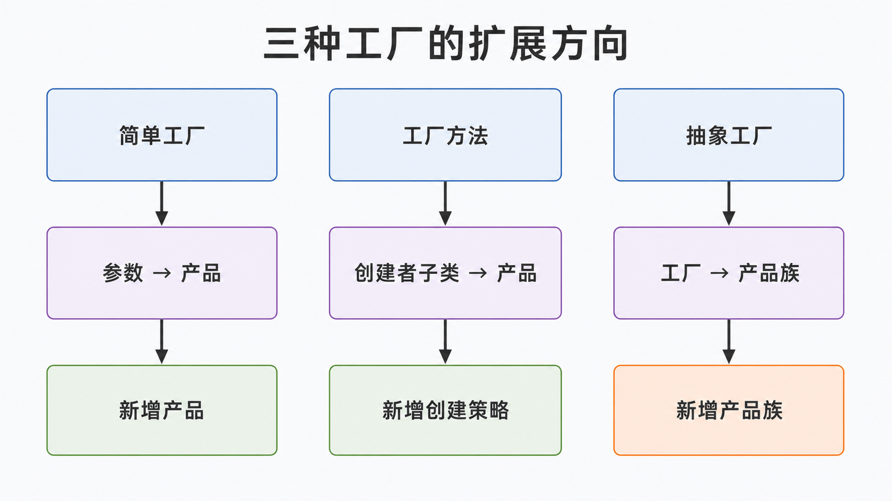
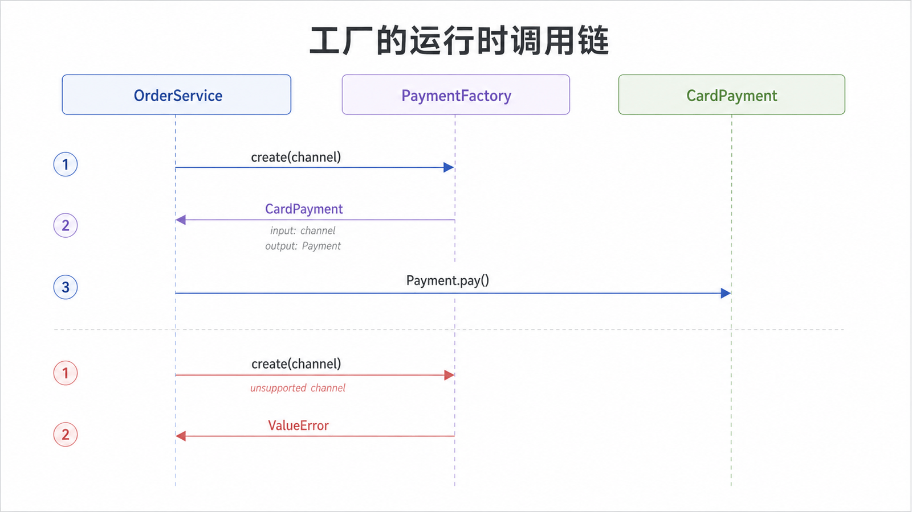

## 前置知识与学习目标

你需要理解抽象基类、组合与依赖反转。读完后，你应当能够：

1. 准确区分简单工厂、工厂方法和抽象工厂；
2. 让订单服务依赖产品协议，而不是具体产品类；
3. 根据“新增产品”和“新增产品族”的变化成本选择方案。

## 场景：订单服务不该认识所有支付 SDK

若订单服务直接写 `if channel == "card": CardPayment()`，每新增渠道都要修改业务核心。工厂把“选择并构造具体对象”的知识移出调用方，让调用方只依赖稳定的 `Payment` 协议。

<!-- figure-anchor: s03-f01-factory-family-comparison -->



## 角色与协作关系

工厂相关术语容易混淆，先固定定义：

| 形式     | 创建入口                   | 主要变化轴       | 典型代价                 |
| -------- | -------------------------- | ---------------- | ------------------------ |
| 简单工厂 | 一个函数或类方法按参数选择 | 产品种类较少     | 新增产品要修改映射       |
| 工厂方法 | 每个创建者子类决定一个产品 | 创建策略独立扩展 | 类数量增加               |
| 抽象工厂 | 一个工厂创建一组相容产品   | 产品族整体切换   | 新增产品种类要改所有工厂 |

简单工厂常用且实用，但不属于 GoF 的 23 个经典模式；GoF 中的 Factory Method 与 Abstract Factory 是两个独立模式。

## 最小实现：用映射构建简单工厂

```python
from abc import ABC, abstractmethod
from dataclasses import dataclass
from decimal import Decimal
from typing import Callable


class Payment(ABC):
    @abstractmethod
    def pay(self, order_id: str, amount: Decimal) -> str:
        raise NotImplementedError


class CardPayment(Payment):
    def pay(self, order_id: str, amount: Decimal) -> str:
        return f"card:{order_id}:{amount}"


class WalletPayment(Payment):
    def pay(self, order_id: str, amount: Decimal) -> str:
        return f"wallet:{order_id}:{amount}"


@dataclass(frozen=True)
class PaymentFactory:
    builders: dict[str, Callable[[], Payment]]

    def create(self, channel: str) -> Payment:
        try:
            return self.builders[channel]()
        except KeyError as error:
            raise ValueError(f"unsupported payment channel: {channel}") from error


factory = PaymentFactory({"card": CardPayment, "wallet": WalletPayment})
payment = factory.create("card")
assert payment.pay("order-1", Decimal("19.90")) == "card:order-1:19.90"
```

输入是渠道字符串，输出满足 `Payment` 契约。失败边界也属于工厂契约：未知渠道必须明确失败，不能默默回退到错误产品。

<!-- figure-anchor: s03-f02-factory-runtime-call-chain -->



## 工厂方法：把创建决定交给子类

当不同创建流程还包含校验、日志或生命周期钩子时，可把骨架放在创建者基类：

```python
from abc import ABC, abstractmethod


class Checkout(ABC):
    @abstractmethod
    def create_payment(self) -> Payment:
        raise NotImplementedError

    def submit(self, order_id: str, amount: Decimal) -> str:
        payment = self.create_payment()
        return payment.pay(order_id, amount)


class CardCheckout(Checkout):
    def create_payment(self) -> Payment:
        return CardPayment()


assert CardCheckout().submit("order-2", Decimal("8.00")) == "card:order-2:8.00"
```

`submit()` 稳定，子类只决定具体产品。这就是“让子类决定实例化哪个类”的准确含义。

## 抽象工厂：保证产品族相容

若测试环境和生产环境需要同时切换支付客户端、退款客户端与签名器，可定义 `PaymentSuiteFactory`，让一个工厂创建整套相容对象。它优化的是产品族切换；如果系统只创建一种产品，抽象工厂通常过重。

## 常见误区与适用边界

1. **传入类再直接实例化就是抽象工厂**：这通常只是参数化构造，不代表产品族。
2. **工厂必须是类**：Python 中函数、字典和可调用对象都可承担工厂角色。
3. **产品接口过大**：调用方只需 `pay()`，就不要暴露 SDK 的全部方法。
4. **隐藏所有依赖**：网络凭据、超时和重试策略仍应显式注入，避免工厂变成服务定位器。
5. **稳定的小分支也抽象**：产品固定且创建简单时，直接构造最清楚。

## 自检题

<details>
<summary>1. 简单工厂为什么不等于工厂方法？</summary>

简单工厂由一个入口按参数选择产品；工厂方法通过创建者的多态覆写决定产品，并复用稳定的创建流程。

</details>

<details>
<summary>2. 什么需求最能说明应使用抽象工厂？</summary>

需要原子地切换一组相互兼容的产品，例如测试与生产环境各自的一套支付、退款和签名组件。

</details>

<details>
<summary>3. 未知渠道为什么应由工厂明确报错？</summary>

选择具体产品是工厂职责；明确失败能把配置错误限制在创建边界，避免错误对象进入业务流程。

</details>

## 本篇总结

工厂隔离的是创建知识。简单工厂适合集中映射，工厂方法适合扩展创建流程，抽象工厂适合切换产品族。选择标准是变化轴，而不是抽象层数。

## 下一篇衔接

工厂解决了对象如何产生。下一篇讨论对象产生之后，如何在不制造子类爆炸的前提下按需叠加价格、日志等职责。

## 资料来源

- Gamma 等，《Design Patterns》：Factory Method、Abstract Factory
- [Python `abc`：抽象基类](https://docs.python.org/3/library/abc.html)
- [Python `typing`：类型协议与可调用对象](https://docs.python.org/3/library/typing.html)
