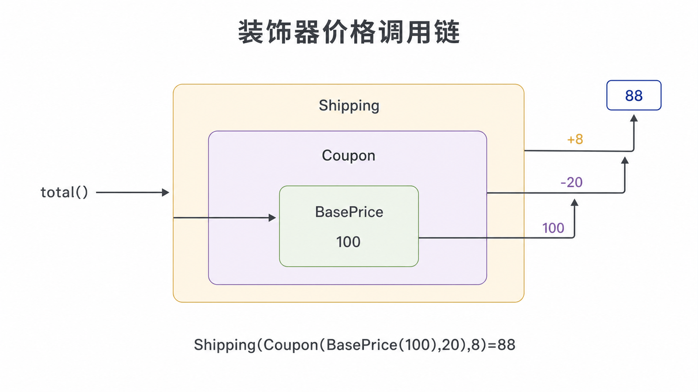
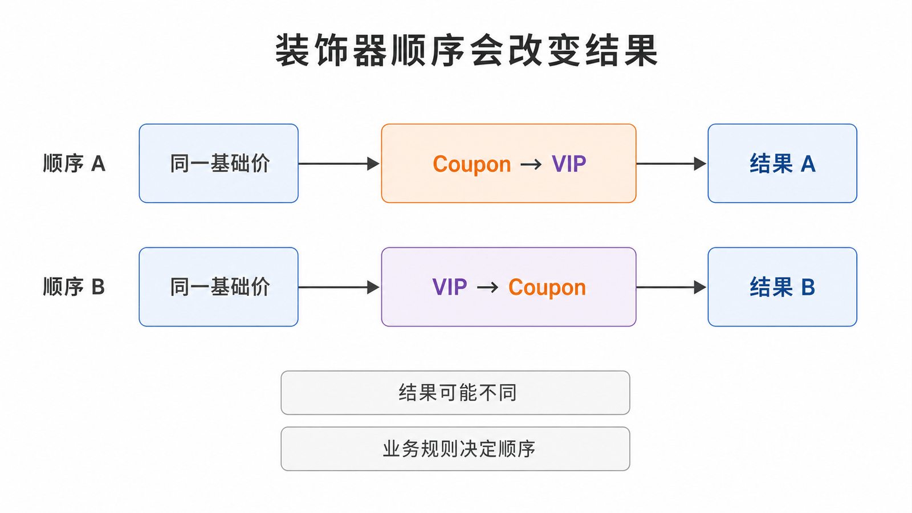

## 前置知识与学习目标

你需要理解组合、抽象接口、闭包与 `@decorator` 语法。读完后，你应当能够：

1. 通过相同接口层层包装对象并解释调用顺序；
2. 区分 GoF 对象装饰器与 Python 函数装饰器；
3. 识别顺序敏感、异常传播和包装层过深的风险。

## 场景：优惠组合不应制造子类爆炸

订单可能应用满减、会员折扣和运费。若为每种组合创建子类，会出现 `VipFreeShippingOrder`、`CouponVipOrder` 等指数增长。装饰器让每项规则都包装同一个 `Price` 接口，并在运行时自由组合。

<!-- figure-anchor: s04-f01-decorator-price-chain -->



## 对象装饰器的角色与调用链

角色包括：组件接口、具体组件、装饰器基类和具体装饰器。装饰器保存一个组件引用，对外仍暴露相同接口。

```python
from abc import ABC, abstractmethod
from dataclasses import dataclass
from decimal import Decimal


class Price(ABC):
    @abstractmethod
    def total(self) -> Decimal:
        raise NotImplementedError


@dataclass(frozen=True)
class BasePrice(Price):
    amount: Decimal

    def total(self) -> Decimal:
        return self.amount


@dataclass(frozen=True)
class Coupon(Price):
    wrapped: Price
    reduction: Decimal

    def total(self) -> Decimal:
        return max(Decimal("0"), self.wrapped.total() - self.reduction)


@dataclass(frozen=True)
class Shipping(Price):
    wrapped: Price
    fee: Decimal

    def total(self) -> Decimal:
        return self.wrapped.total() + self.fee


price: Price = Shipping(Coupon(BasePrice(Decimal("100")), Decimal("20")), Decimal("8"))
assert price.total() == Decimal("88")
```

调用从最外层开始：`Shipping.total()` → `Coupon.total()` → `BasePrice.total()`，返回时再依次应用满减与运费。输入是组件对象，输出仍是 `Price`，因此客户端无需知道层数。

## 顺序是业务语义，不是实现细节

若会员折扣按“优惠后金额”计算，`Vip(Coupon(base))` 与 `Coupon(Vip(base))` 的结果可能不同。应把顺序写成业务规则并用测试锁定，而不是依赖注册顺序的偶然性。

<!-- figure-anchor: s04-f02-decorator-order-effect -->



## Python 函数装饰器：同一思想，不同对象

Python 的 `@` 语法把函数传给高阶函数，再用包装函数替换原函数：

```python
from functools import wraps
from time import perf_counter
from typing import Callable, ParamSpec, TypeVar

P = ParamSpec("P")
R = TypeVar("R")


def timed(func: Callable[P, R]) -> Callable[P, R]:
    @wraps(func)
    def wrapper(*args: P.args, **kwargs: P.kwargs) -> R:
        started = perf_counter()
        try:
            return func(*args, **kwargs)
        finally:
            print(f"{func.__name__} took {perf_counter() - started:.6f}s")

    return wrapper


@timed
def submit(order_id: str) -> str:
    return f"submitted:{order_id}"


assert submit("order-1") == "submitted:order-1"
assert submit.__name__ == "submit"
```

`functools.wraps` 保留名称、文档与 `__wrapped__`，便于调试、反射和测试。`finally` 确保异常路径也记录耗时，但装饰器不应吞掉业务异常。

对象装饰器包装实现同一业务接口的对象；函数装饰器包装可调用对象。两者都通过组合增加职责，但不要把任何 `@` 语法都等同于 GoF 装饰器。

## 常见误区与适用边界

1. **装饰器与代理完全相同**：结构相似，但装饰器强调叠加职责，代理强调访问控制、远程访问或延迟加载。
2. **装饰顺序无关紧要**：价格、事务、缓存、重试和鉴权常具有顺序效应。
3. **包装器捕获所有异常后返回默认值**：这会破坏原函数契约并隐藏故障。
4. **忘记 `wraps`**：框架注册、日志和测试可能读到错误元数据。
5. **层数无限增长**：调用栈与配置难以观察时，应改用显式规则管道。

## 自检题

<details>
<summary>1. 为什么装饰器可以替代大量组合子类？</summary>

每项职责独立包装同一接口，组合发生在运行时，不需要为每个职责组合声明一个新子类。

</details>

<details>
<summary>2. `@wraps` 解决什么问题？</summary>

它把原函数的重要元数据复制到包装函数，并保留 `__wrapped__`，让调试、反射和工具链看到正确身份。

</details>

<details>
<summary>3. 何时应改用显式规则管道？</summary>

当规则很多、顺序需配置、需要逐步追踪中间值或支持跳过与回滚时，显式管道比深层嵌套更易观察。

</details>

## 本篇总结

装饰器用相同接口包裹对象或函数，把附加职责与核心逻辑分离。真正的工程难点是顺序、失败语义和可观察性，而不是 `@` 语法本身。

## 下一篇衔接

装饰器沿一条调用链叠加职责。下一篇把视角转向一对多协作：订单状态变化后，如何通知库存、通知和审计模块。

## 资料来源

- Gamma 等，《Design Patterns》：Decorator
- [Python `functools.wraps`](https://docs.python.org/3/library/functools.html#functools.wraps)
- [Python 函数定义与装饰器语法](https://docs.python.org/3/reference/compound_stmts.html#function-definitions)
