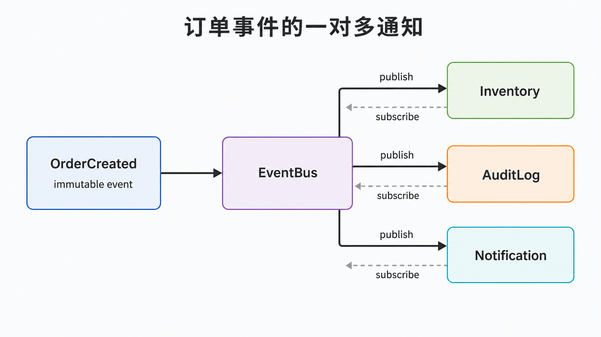
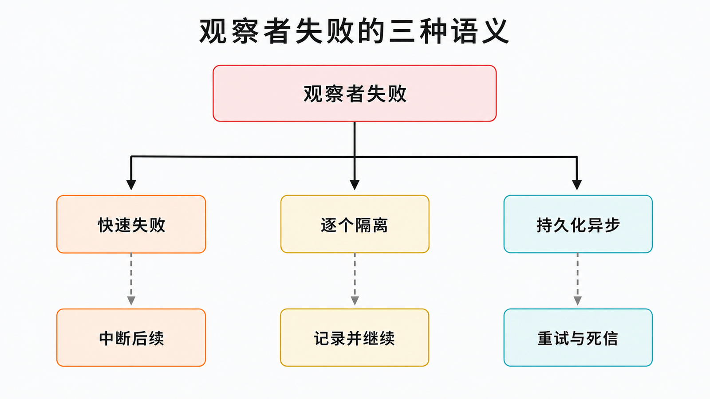

## 前置知识与学习目标

你需要理解回调、异常处理和同步/异步调用。读完后，你应当能够：

1. 建模主题、事件与观察者的一对多依赖；
2. 明确通知顺序、失败传播和取消订阅语义；
3. 区分进程内观察者与消息系统的可靠性能力。

## 场景：订单创建后有多个独立反应

订单创建后，需要预留库存、发送通知和写审计日志。订单服务若直接实例化这三个模块，就会随接收者增加而膨胀。观察者模式让发布者只发布事件，订阅者通过共同协议独立响应。

<!-- figure-anchor: s05-f01-observer-notification-flow -->



## 角色、事件与最小实现

- **Subject（主题/发布者）**：维护订阅关系并发出事件。
- **Observer（观察者/订阅者）**：实现统一的处理协议。
- **Event（事件）**：不可变事实，携带订阅者真正需要的数据。

```python
from dataclasses import dataclass
from typing import Protocol


@dataclass(frozen=True)
class OrderCreated:
    order_id: str
    total_cents: int


class Observer(Protocol):
    def update(self, event: OrderCreated) -> None: ...


class EventBus:
    def __init__(self) -> None:
        self._observers: list[Observer] = []

    def subscribe(self, observer: Observer) -> None:
        if observer not in self._observers:
            self._observers.append(observer)

    def unsubscribe(self, observer: Observer) -> None:
        self._observers.remove(observer)

    def publish(self, event: OrderCreated) -> None:
        for observer in tuple(self._observers):
            observer.update(event)


class AuditLog:
    def __init__(self) -> None:
        self.events: list[str] = []

    def update(self, event: OrderCreated) -> None:
        self.events.append(event.order_id)


bus = EventBus()
audit = AuditLog()
bus.subscribe(audit)
bus.publish(OrderCreated("order-1", 8800))
assert audit.events == ["order-1"]
```

复制订阅者元组可以避免观察者在回调中退订时破坏当前遍历，但它不提供线程安全。若多个线程并发订阅与发布，需要锁或更合适的队列。

## 同步通知的状态与失败语义

上例是同步通知：发布者必须等所有观察者返回。若第二个观察者抛出异常，后续观察者不会执行。工程上必须显式选择：

1. **快速失败**：任一观察者失败就中断，适合所有操作必须共同成功的本地流程；
2. **逐个隔离**：记录失败后继续通知，适合互相独立的附加动作；
3. **异步持久化**：先可靠记录事件，再由消费者重试，适合跨进程与最终一致场景。

<!-- figure-anchor: s05-f02-observer-failure-semantics -->



不要把数据库提交后的普通内存回调称为“可靠事件”：进程可能在提交后、回调前崩溃。跨系统可靠发布通常需要 outbox、消息代理、消费者幂等与死信处理，这些会在幂等性文章展开。

## 观察者与发布-订阅的边界

两者都解耦发送方与接收方，但术语侧重点不同。经典观察者通常由主题直接维护观察者引用；消息系统中的发布-订阅常通过 broker、topic 和持久化日志进一步解耦空间与时间。后者并不自动保证“恰好一次”，可靠性取决于确认、重试与去重协议。

## 常见误区与适用边界

1. **事件只传一个可变主题对象**：订阅者可能看到不同时间点的状态；优先传不可变事件快照。
2. **依赖订阅顺序完成业务事务**：隐式顺序很脆弱，需要强顺序时用显式编排。
3. **失败被静默吞掉**：至少记录观察者、事件 ID 和错误，并建立重试或补偿路径。
4. **忘记退订**：长生命周期主题持有短生命周期观察者，可能造成内存泄漏。
5. **把本地回调当消息队列**：它没有跨进程持久化、消费确认和积压治理。

## 自检题

<details>
<summary>1. 为什么事件对象应尽量不可变？</summary>

它代表已经发生的事实；不可变可以避免一个观察者修改后影响其他观察者，也便于重放和审计。

</details>

<details>
<summary>2. 同步观察者失败时有哪些可选策略？</summary>

快速失败、逐个隔离或转为持久化异步处理；必须根据事务一致性和副作用重要性明确选择。

</details>

<details>
<summary>3. 为什么消息代理不等于恰好一次处理？</summary>

确认丢失和消费者崩溃会导致重投；业务侧仍需用事件 ID 或业务键实现幂等。

</details>

## 本篇总结

观察者模式解耦一对多通知，但真正的契约还包括事件快照、调用顺序、失败传播、订阅生命周期和可靠性边界。事件总线只是结构，不自动提供一致性。

## 下一篇衔接

观察者适合发布事实，让多个接收者各自反应。下一篇处理更强的“协调”问题：库存、销售与采购之间存在规则和方向时，如何用中介者集中协作协议。

## 资料来源

- Gamma 等，《Design Patterns》：Observer
- [Python `typing.Protocol`](https://docs.python.org/3/library/typing.html#typing.Protocol)
- [Python `queue`：线程安全队列](https://docs.python.org/3/library/queue.html)
