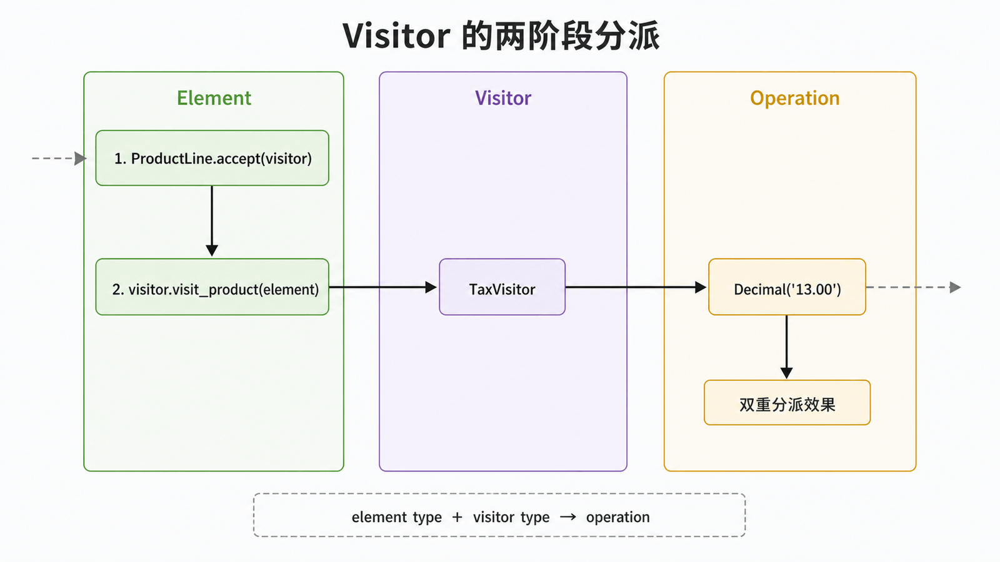
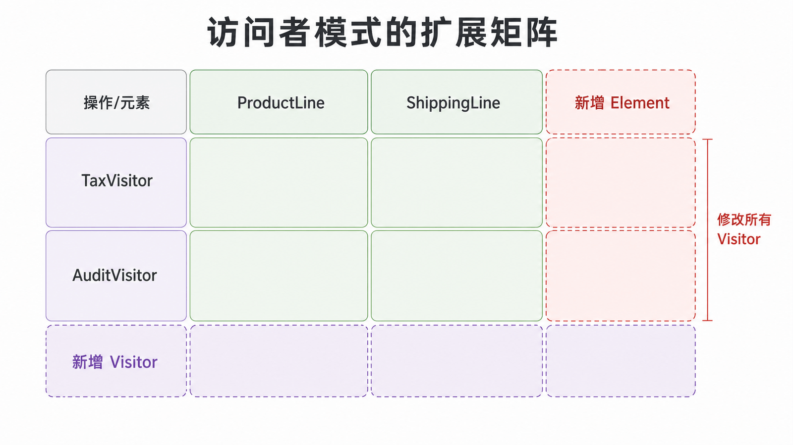

## 前置知识与学习目标

你需要理解多态、抽象基类和迭代器。读完后，你应当能够：

1. 解释 `element.accept(visitor)` → `visitor.visit_xxx(element)` 的两阶段分派；
2. 判断系统更常新增“元素类型”还是“元素操作”；
3. 比较经典访问者与 `singledispatch` 等 Python 方案。

## 场景：订单元素稳定，操作持续增加

订单包含商品行与运费行。财务需要计算应税额，审计需要输出说明，风控需要校验规则。如果把所有操作都塞进元素类，每新增一种操作都要修改整个数据结构。访问者把一组相关操作集中到独立对象中。

<!-- figure-anchor: s08-f01-visitor-double-dispatch -->



## 角色与两阶段分派

- **Element** 声明 `accept(visitor)`；
- **ConcreteElement** 在 `accept` 中调用对应的访问方法；
- **Visitor** 为每种元素类型声明操作；
- **ObjectStructure** 保存并遍历元素，通常直接使用迭代器。

```python
from __future__ import annotations

from abc import ABC, abstractmethod
from dataclasses import dataclass
from decimal import Decimal


class Visitor(ABC):
    @abstractmethod
    def visit_product(self, element: ProductLine) -> Decimal:
        raise NotImplementedError

    @abstractmethod
    def visit_shipping(self, element: ShippingLine) -> Decimal:
        raise NotImplementedError


class Element(ABC):
    @abstractmethod
    def accept(self, visitor: Visitor) -> Decimal:
        raise NotImplementedError


@dataclass(frozen=True)
class ProductLine(Element):
    subtotal: Decimal

    def accept(self, visitor: Visitor) -> Decimal:
        return visitor.visit_product(self)


@dataclass(frozen=True)
class ShippingLine(Element):
    fee: Decimal

    def accept(self, visitor: Visitor) -> Decimal:
        return visitor.visit_shipping(self)


class TaxVisitor(Visitor):
    def visit_product(self, element: ProductLine) -> Decimal:
        return element.subtotal * Decimal("0.13")

    def visit_shipping(self, element: ShippingLine) -> Decimal:
        return Decimal("0")


elements: list[Element] = [ProductLine(Decimal("100")), ShippingLine(Decimal("8"))]
tax = sum((element.accept(TaxVisitor()) for element in elements), Decimal("0"))
assert tax == Decimal("13.00")
```

第一次分派由运行时元素决定调用哪个 `accept`；第二次由具体 `accept` 选择 `visit_product` 或 `visit_shipping`。因此最终操作同时取决于访问者类型和元素类型，形成双重分派效果。

<!-- figure-anchor: s08-f02-visitor-extension-matrix -->



## 扩展矩阵：访问者优化哪一边

访问者把“操作”放在行，把“元素类型”放在列：新增一个访问者，只需实现所有列；新增一个元素列，则所有访问者都必须增加方法。它适合元素集合稳定、操作集合经常扩展的系统，例如编译器 AST、文档树和报表导出。

Python 不支持按多个运行时参数原生重载函数，但可以用 `functools.singledispatch` 按第一个参数类型注册实现。它减少样板代码，却不会消除扩展矩阵：新增元素后，仍需决定每个操作如何处理它。

## 常见误区与适用边界

1. **元素也频繁新增却使用访问者**：每加一种元素都要修改所有访问者，成本很高。
2. **把普通遍历称为访问者**：遍历是 Iterator 的职责，访问者解决的是按元素类型分派操作。
3. **访问者直接修改元素私有状态**：这会破坏封装；优先通过只读属性或明确领域方法。
4. **所有 `visit()` 都只接收基类**：若内部再写巨大 `isinstance` 分支，就失去了显式分派契约。
5. **简单数据转换也建完整类体系**：少量稳定类型用普通函数或 `match` 更直接。

## 自检题

<details>
<summary>1. 访问者为什么适合“元素稳定、操作多变”？</summary>

新增操作只需增加一个访问者并集中实现；元素类无需为每项新操作增加方法。

</details>

<details>
<summary>2. 新增 `DiscountLine` 会影响哪些代码？</summary>

要实现新的 `accept`，并为每个现有访问者增加 `visit_discount`；这正是元素扩展的主要代价。

</details>

<details>
<summary>3. 迭代器与访问者如何配合？</summary>

迭代器负责依次提供元素，访问者负责根据具体元素类型执行操作；两者解决不同问题。

</details>

## 本篇总结

访问者把稳定数据结构上的多种操作集中管理，并通过两阶段调用形成双重分派效果。它优化操作扩展，却牺牲元素扩展，选择前必须看清变化方向。

## 下一篇衔接

至此完成经典模式主线。下一篇把模式思维迁移到真实工程边界：订单创建接口遭遇重试、并发与进程崩溃时，如何用状态机和原子约束实现幂等。

## 资料来源

- Gamma 等，《Design Patterns》：Visitor
- [Python `functools.singledispatch`](https://docs.python.org/3/library/functools.html#functools.singledispatch)
- [Python `abc`：抽象基类](https://docs.python.org/3/library/abc.html)
