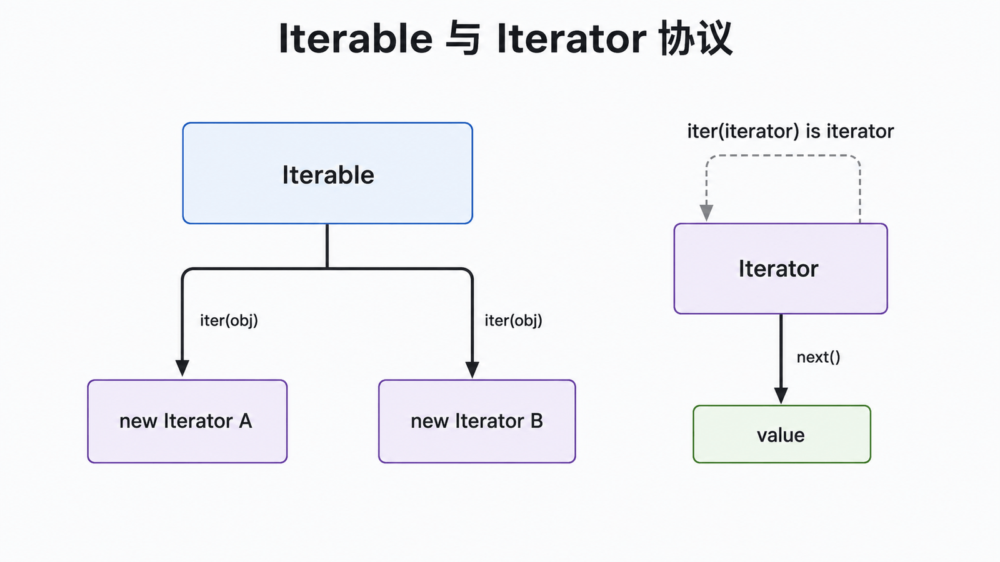
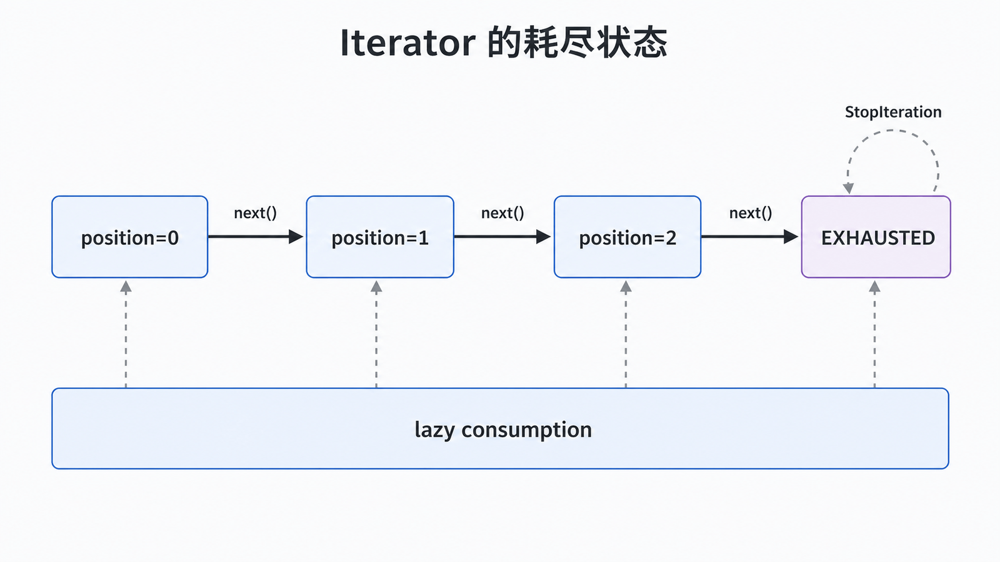

## 前置知识与学习目标

你需要了解 `for` 循环、生成器和异常。读完后，你应当能够：

1. 区分 Iterable（可迭代对象）与 Iterator（迭代器）；
2. 解释 `iter()`、`next()` 和 `StopIteration` 的调用链；
3. 正确处理惰性计算、一次性消费与无限迭代器。

## 场景：遍历订单项但不暴露存储结构

订单项可能保存在列表、数据库分页结果或远程流中。客户端只想“逐个读取”，不应依赖内部索引、分页游标或缓存策略。迭代器模式把遍历协议与集合表示分离。

<!-- figure-anchor: s07-f01-iterable-iterator-protocol -->



## Python 迭代协议

- **Iterable**：`iter(obj)` 能返回迭代器；通常实现 `__iter__()`。
- **Iterator**：同时实现 `__iter__()` 与 `__next__()`；`__iter__()` 返回自身。
- **结束信号**：`__next__()` 没有元素时抛出 `StopIteration`，`for` 循环负责捕获。

```python
from collections.abc import Iterator
from dataclasses import dataclass


@dataclass(frozen=True)
class OrderLine:
    sku: str
    quantity: int


class OrderLines:
    def __init__(self, lines: list[OrderLine]) -> None:
        self._lines = tuple(lines)

    def __iter__(self) -> Iterator[OrderLine]:
        return iter(self._lines)


lines = OrderLines([OrderLine("coffee", 2), OrderLine("milk", 1)])
assert [line.sku for line in lines] == ["coffee", "milk"]
assert [line.sku for line in lines] == ["coffee", "milk"]
```

`OrderLines` 是可重复遍历的 Iterable：每次 `iter(lines)` 都创建新 Iterator。它没有把内部元组暴露给调用方。

## 一次性迭代器的状态变化

```python
iterator = iter(["coffee", "milk"])
assert iter(iterator) is iterator
assert next(iterator) == "coffee"
assert next(iterator) == "milk"

try:
    next(iterator)
except StopIteration:
    exhausted = True

assert exhausted
assert list(iterator) == []
```

状态从 `position=0` 变到 `1`、`2`，再进入 `EXHAUSTED`。耗尽后不会自动复位。生成器、`map()`、`filter()`、`zip()` 和多数 `itertools` 结果都是一次性 Iterator。

<!-- figure-anchor: s07-f02-iterator-state-machine -->



## 惰性流水线与空间复杂度

```python
from collections.abc import Iterable, Iterator
from itertools import islice


def valid_order_ids(rows: Iterable[str]) -> Iterator[str]:
    for row in rows:
        order_id = row.strip()
        if order_id.startswith("ORD-"):
            yield order_id


source = (f"ORD-{number}" for number in range(1_000_000))
first_three = list(islice(valid_order_ids(source), 3))
assert first_three == ["ORD-0", "ORD-1", "ORD-2"]
```

流水线只在 `list(islice(...))` 消费时拉取前三项，额外空间近似为 `O(1)`，而不是先构造一百万项列表。惰性也意味着错误可能延迟到消费阶段，资源关闭时机必须明确。

## 常用组合工具，而不是函数清单

`itertools` 的价值在于可组合的迭代器构件：

- `chain()` 串联多个数据源；
- `islice()` 对流做有限切片；
- `groupby()` 对**相邻且已按键排序**的数据分组；
- `tee()` 复制消费视图，但两个分支速度差异大会产生缓存；
- `count()`、`cycle()`、`repeat()` 可无限生成，必须配合停止条件。

## 常见误区与适用边界

1. **Iterable 就是 Iterator**：列表可重复遍历，但 `iter(list)` 返回的一次性对象才是 Iterator。
2. **对迭代器先 `list()` 调试再继续使用**：第一次已经耗尽数据。
3. **`groupby()` 会全局归组**：它只合并相邻同键元素，通常要先排序。
4. **`tee()` 免费复制数据流**：分支不同步会在内存中缓存尚未消费的元素。
5. **无限迭代器直接交给 `list()`**：程序会持续运行并耗尽内存。

若业务需要随机访问、长度、回退或多次遍历，具体集合通常比一次性流更合适。

## 自检题

<details>
<summary>1. 为什么列表能遍历两次，而 `iter(list)` 通常不能？</summary>

列表每次创建新的迭代器；迭代器保存当前位置，耗尽后状态不会自动复位。

</details>

<details>
<summary>2. 惰性计算把异常推迟到了哪里？</summary>

推迟到消费者调用 `next()` 或开始 `for` 循环时，因此创建流水线成功不代表消费一定成功。

</details>

<details>
<summary>3. `tee()` 何时可能占用大量内存？</summary>

一个分支远快于另一个分支时，尚未被慢分支消费的元素需要缓存。

</details>

## 本篇总结

迭代器模式稳定“逐个获取”的协议，隐藏集合表示。Python 把可重复的 Iterable 与保存游标的一次性 Iterator 明确区分，惰性带来低内存，也带来延迟错误和生命周期管理责任。

## 下一篇衔接

迭代器让我们稳定地遍历订单元素。下一篇进一步解决：元素类型相对稳定，但报表、校验和导出等新操作不断增加时，如何把操作从数据结构中分离。

## 资料来源

- Gamma 等，《Design Patterns》：Iterator
- [Python 迭代器类型](https://docs.python.org/3/library/stdtypes.html#iterator-types)
- [Python `collections.abc`](https://docs.python.org/3/library/collections.abc.html)
- [Python `itertools`](https://docs.python.org/3/library/itertools.html)
