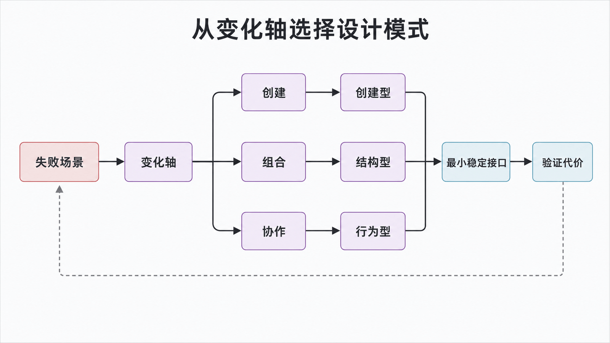
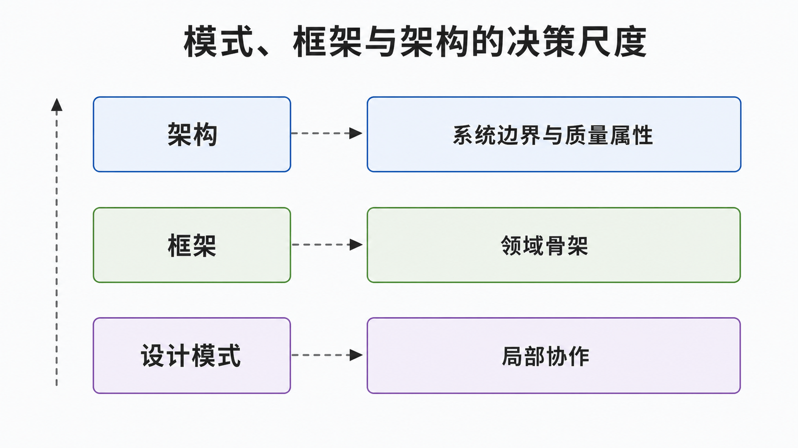

## 前置知识与学习目标

你需要了解 Python 类、对象、继承和组合。读完后，你应当能够：

1. 从“哪里在变化”而不是从模式名称出发分析设计问题；
2. 区分创建型、结构型和行为型模式各自稳定的边界；
3. 解释模式、框架与架构的层级关系，并识别不该使用模式的场景。

本系列贯穿一个订单系统：它要创建不同商品、叠加优惠、发布订单事件、协调库存与支付，并对订单集合执行统计。后续每篇只解决其中一个核心问题。

## 从坏味道开始：变化为什么会扩散

假设 `OrderService.create_order()` 同时负责选择支付渠道、创建商品、计算折扣、扣减库存和发送通知。新增一种渠道时，开发者不得不修改同一个大函数，并重新验证所有分支。真正的问题不是 `if` 本身，而是多个变化原因被压进了同一个模块。

设计模式是经过反复验证的协作结构：它给角色命名，规定依赖方向，并说明何时值得付出额外抽象成本。模式不是可复制的代码模板，更不是“类越多越专业”。

<!-- figure-anchor: s01-f01-pattern-decision-loop -->



## 核心机制：先找变化轴，再选择稳定边界

可以用四步完成模式选择：

1. **描述失败场景**：哪种修改最容易造成连锁改动？
2. **标出变化轴**：变化发生在对象创建、对象组合，还是对象协作？
3. **选择稳定接口**：调用方真正需要的最小能力是什么？
4. **验证代价**：新抽象是否减少了修改面、测试面和认知负担？

三类 GoF 模式对应三种常见变化轴：

| 类别   | 主要问题                     | 稳定的边界         | 本系列示例                     |
| ------ | ---------------------------- | ------------------ | ------------------------------ |
| 创建型 | 对象如何创建、由谁创建       | 产品接口或构造入口 | 单例、工厂                     |
| 结构型 | 对象如何组合而不改变调用契约 | 组件接口           | 装饰器                         |
| 行为型 | 多个对象如何分工、通知和分派 | 协作协议           | 观察者、中介者、迭代器、访问者 |

经典目录通常包含 5 个创建型、7 个结构型和 11 个行为型模式，共 23 个。分类是检索地图，不是必须逐一套用的清单。

## 模式、框架与架构不是同一层级

<!-- figure-anchor: s01-f02-pattern-framework-architecture -->



- **设计模式**描述局部协作结构，例如“主题如何通知多个观察者”。
- **框架**提供可运行的领域骨架，并通过扩展点调用业务代码，例如 Web 框架的路由与中间件。
- **架构**处理系统级边界与质量属性，例如部署单元、数据所有权、可靠性和安全边界。

同一个架构可以使用多个框架，一个框架内部也会组合多个模式。把单例称为“系统架构”，或把 Django 称为“一个设计模式”，都会混淆决策尺度。

## 最小分析示例：订单通知应该用哪个模式

```python
def choose_pattern(change_axis: str) -> str:
    mapping = {
        "creation": "Factory",
        "composition": "Decorator",
        "notification": "Observer",
        "coordination": "Mediator",
        "traversal": "Iterator",
        "new_operation": "Visitor",
    }
    return mapping.get(change_axis, "Keep it simple")


assert choose_pattern("notification") == "Observer"
assert choose_pattern("one_condition") == "Keep it simple"
```

这个函数不是模式实现，而是一份决策提示：若需求只是增加一个稳定条件，直接分支通常更清楚；当通知接收者经常变化、发布者不应依赖具体接收者时，观察者才可能带来收益。

## 常见误区与适用边界

1. **看到 `if` 就上工厂**：稳定且只有两三个分支时，映射表或普通函数更直接。
2. **把继承当成模式的必要条件**：Python 的协议、函数和组合往往比深继承更合适。
3. **只画类图，不画运行时关系**：类图看不出事件顺序、失败传播和状态所有权。
4. **忽略删除成本**：如果需求不会沿某个轴扩展，额外抽象只会增加维护负担。

一个实用判断是：只有当第二个具体变化已经出现，或者变化成本足够高且可被明确验证时，才引入模式。抽象应由证据驱动，而不是由预想驱动。

## 自检题

<details>
<summary>1. 创建型与结构型模式最核心的区别是什么？</summary>

创建型模式隔离“实例如何产生”；结构型模式隔离“已有对象如何组合并保持调用契约”。

</details>

<details>
<summary>2. 为什么“有 23 个经典模式”不能成为使用某个模式的理由？</summary>

模式是否有价值取决于真实变化轴、失败成本和可验证收益；目录只提供共同语言，不能替代问题分析。

</details>

<details>
<summary>3. 新增通知渠道总要修改订单服务，应先检查什么？</summary>

检查订单服务是否直接依赖具体通知对象，以及是否存在稳定的通知协议；若接收者集合独立变化，可考虑观察者。

</details>

## 本篇总结

设计模式的起点是变化和失败，而不是名称。先定位创建、组合或协作的变化轴，再建立最小稳定接口，并用修改面、测试面和认知成本验证它是否值得。

## 下一篇衔接

下一篇从最容易被滥用的创建型模式开始：如何保证进程内对象身份唯一，同时避免把“全局可访问”误当成“线程安全”或“分布式唯一”。

## 资料来源

- Gamma, Helm, Johnson, Vlissides，《Design Patterns: Elements of Reusable Object-Oriented Software》
- [Python 数据模型](https://docs.python.org/3/reference/datamodel.html)
- [Python `abc`：抽象基类](https://docs.python.org/3/library/abc.html)
