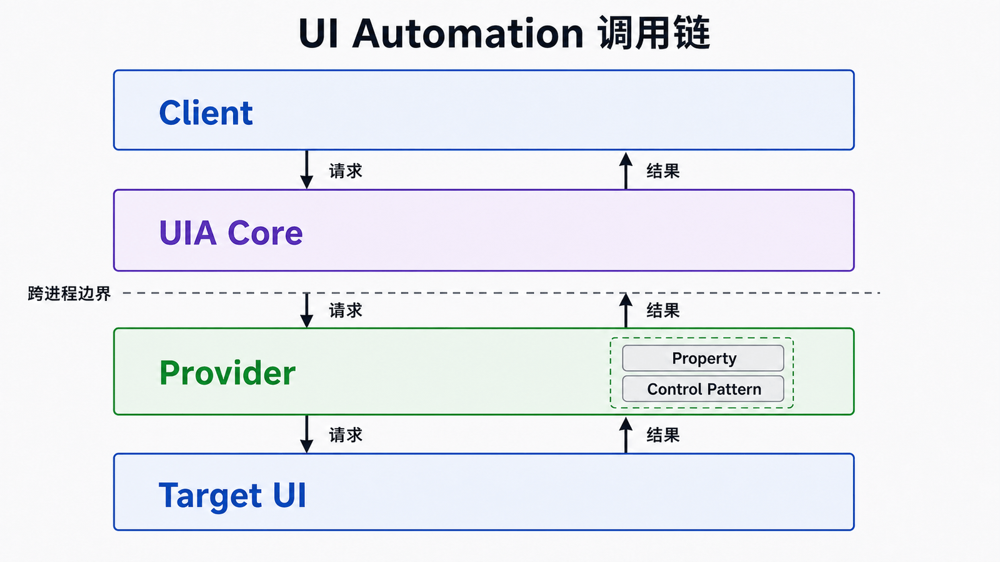
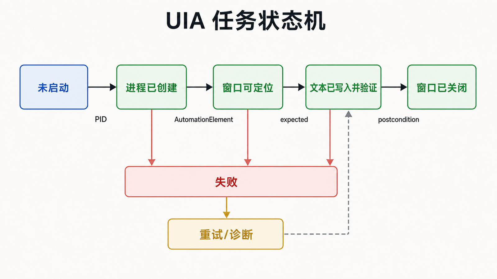

## 前置知识与学习目标

你只需要了解 Windows 窗口、进程和异常的基本概念。本篇解决一个问题：**为什么坐标点击容易失效，而 UI Automation（UIA）能把界面变成可查询、可验证的语义结构？**

读完后，你应该能：

- 解释 UIA 客户端、核心服务和提供程序的职责；
- 区分元素、属性、控件类型和控件模式；
- 把一个桌面任务拆成“定位—动作—验证—清理”；
- 判断 UIA 适用与不适用的边界。

本篇只建立模型，不展开定位条件和 Pattern 的具体代码；这些分别留到第 3、4 篇。

## 从一个不稳定脚本开始

假设要自动化记事本：启动程序，找到编辑区，写入 `Hello, UIA!`，确认文本已出现，再关闭窗口。

坐标脚本会说“点击 `(420, 280)`”。窗口移动、缩放比例变化、菜单展开或远程桌面分辨率变化后，这个坐标就可能指向别处。UIA 的表达是：“在目标进程的窗口子树中，找到语义为文档或编辑框的元素，调用它支持的值接口，再读取状态验证结果。”

两者的关键区别不是“API 更多”，而是**坐标描述像素位置，UIA 描述界面语义和能力**。

## 核心调用链

<!-- figure:s01-f01 -->



UIA 将参与者分成三层：

1. **客户端（Client）**：测试程序、屏幕阅读器或 RPA 脚本，提出查询和操作请求。
2. **UI Automation Core**：跨进程转发请求、组织自动化树并提供查找、缓存和事件机制。
3. **提供程序（Provider）**：由目标应用或系统代理实现，暴露元素的属性、结构和行为。

调用 `FindFirst` 并不是在客户端内存里查一个静态 DOM。客户端持有的是由 UIA Core 协调访问的 `AutomationElement`，属性读取、查找和 Pattern 调用都可能跨越进程边界。界面重绘或 Provider 重建节点后，之前取得的元素可能失效。因此，后续实践始终遵循两个原则：缩小查询范围，动作后从稳定根重新取得证据。

## 四个不能混用的概念

| 概念                | 回答的问题                 | 记事本示例                          |
| ------------------- | -------------------------- | ----------------------------------- |
| `AutomationElement` | “这是树中的哪个节点？”     | 窗口、编辑区、菜单项                |
| Property            | “这个节点现在是什么状态？” | `Name`、`AutomationId`、`IsEnabled` |
| `ControlType`       | “它在语义上是什么控件？”   | `Window`、`Document`、`Button`      |
| Control Pattern     | “它承诺能做什么？”         | `ValuePattern`、`InvokePattern`     |

控件类型不等于控件能力。一个外观像按钮的自定义控件可能没有 `InvokePattern`；同一个元素也可能同时支持多个 Pattern。客户端必须查询实际能力，不能只按类型猜测。

## 自动化树与三种视图

桌面是根元素，顶层应用窗口通常是直接子元素，窗口下面再包含菜单、文档、按钮等节点。UIA 提供三种常见视图：

- **Raw view**：最完整，也最嘈杂；
- **Control view**：保留用户可感知的交互控件，通常是自动化定位的默认视角；
- **Content view**：进一步聚焦向用户传达内容的节点。

自动化树是按需构建的动态结构，不保证与屏幕像素、应用内部对象树一一对应。虚拟列表可能只暴露可见项，自定义绘制区域甚至可能只暴露一个大节点。

## 把任务写成状态机

<!-- figure:s01-f02 -->



贯穿全系列的记事本任务可以拆成五个状态：

```text
未启动 -> 进程已创建 -> 窗口可定位 -> 文本已写入并验证 -> 窗口已关闭
```

每个箭头都需要明确输入、可观察的成功信号和失败边界。只有成功信号成立，任务才进入下一状态；API 没抛异常不等于状态迁移成功。

| 阶段       | 输入           | 成功信号       | 典型失败                   |
| ---------- | -------------- | -------------- | -------------------------- |
| 启动       | 可执行文件路径 | 获得 PID       | 程序不存在、启动被策略阻止 |
| 定位窗口   | PID、超时      | 唯一窗口元素   | 尚未创建、权限层级不同     |
| 定位编辑区 | 窗口根、条件   | 唯一可用元素   | 树结构变化、条件不唯一     |
| 写入并验证 | 元素、文本     | 读取值等于期望 | Pattern 不支持、元素失效   |
| 清理       | 窗口或进程     | 进程退出       | 未保存对话框、关闭被拒绝   |

这个状态机比“依次调用几个 API”更重要：它让重试、日志和测试都有可观察的落点。

## 适用边界与常见误区

UIA 适合 Windows 桌面应用的可访问性树、自动化测试和语义级 RPA。以下情况要谨慎：

- 游戏、画布、自绘或远程画面没有暴露有意义的 UIA 节点；
- 自动化进程与目标进程的完整性级别不同，跨权限操作会受限制；
- 目标控件把大量数据虚拟化，屏幕外元素尚未实体化；
- 业务需要稳定后端接口时，UI 自动化不应替代 API 或数据库集成。

常见误区是把 `Name` 当作永久 ID、缓存元素跨页面长期复用、用固定 `Sleep` 代替状态等待，以及发现 Pattern 不支持后立即退化为坐标点击。正确做法是先改进作用域和定位条件，再设计有验证的降级路径。

## 自检题

1. UIA 客户端为什么不直接持有目标应用的控件对象？
2. `ControlType.Button` 是否保证元素支持 `InvokePattern`？
3. 为什么“动作成功返回”仍不足以判定自动化成功？

<details>
<summary>查看答案</summary>

1. 客户端通常跨进程工作，经 UIA Core 访问目标提供程序；取得的是自动化元素抽象，不是应用内部对象。
2. 不保证。控件类型描述语义角色，Pattern 才描述实际能力，必须查询支持情况。
3. 界面可能异步更新、动作可能被应用忽略，必须用可观察的后置状态验证业务结果。

</details>

## 本篇总结与下一篇

UIA 的核心不是“代替鼠标”，而是用动态语义树表达界面，用 Pattern 表达能力，再用状态验证动作结果。下一篇将搭建唯一主路径的 C# 环境，并用检查工具与冒烟程序确认客户端真的能读到目标树。

## 资料来源

- [Microsoft UI Automation 概览](https://learn.microsoft.com/en-us/windows/win32/winauto/entry-uiauto-win32)
- [UI Automation 规范](https://learn.microsoft.com/en-us/windows/win32/winauto/ui-automation-specification)
- [UI Automation 控件模式概览](https://learn.microsoft.com/en-us/windows/win32/winauto/uiauto-controlpatternsoverview)
