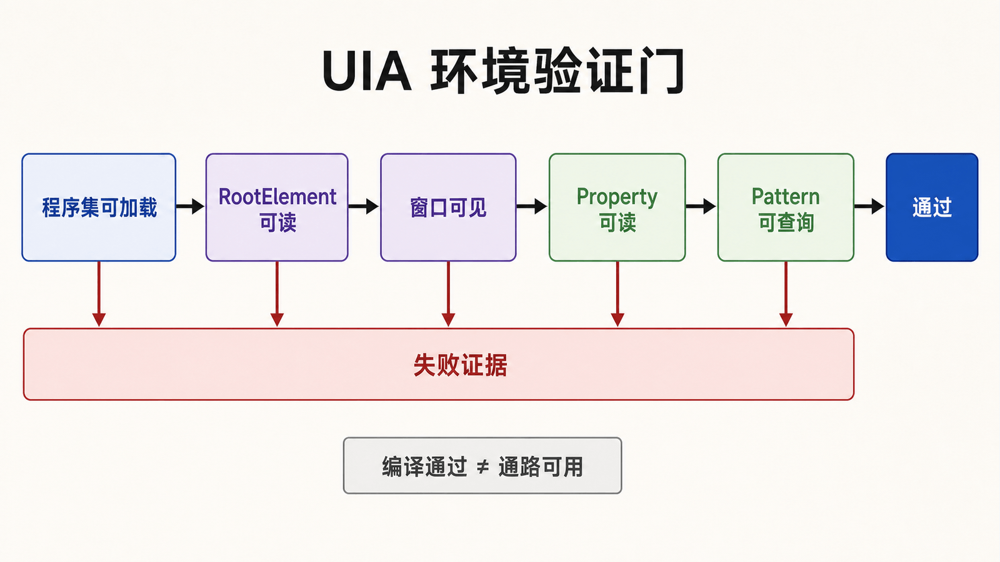
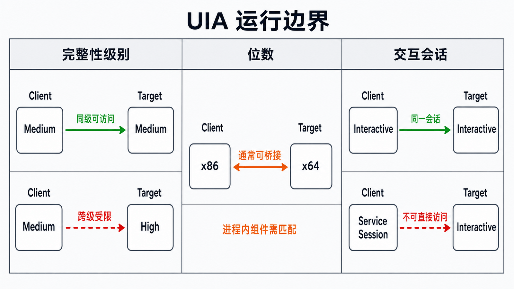

## 前置知识与学习目标

本篇依赖第 1 篇的客户端、自动化树、属性和 Pattern 概念，只解决一个问题：**如何得到一个可复现且能证明“UIA 通路可用”的开发环境？**

完成后你应能创建 C# 项目、安装检查工具、运行冒烟探测，并区分“环境坏了”和“目标控件没有暴露能力”。主路径固定为 Windows 10/11、Visual Studio 2022、`.NET Framework 4.8` 管理客户端 API；FlaUI、Python 包装器和测试框架属于后续选型，不在本篇并列展开。

## 为什么先选一条主路径

UIA 同时有 COM API、`.NET Framework` 管理 API 和第三方封装。如果安装篇同时展示 C#、Python、FlaUI、NUnit 与 xUnit，读者遇到问题时无法判断故障在哪一层。主路径的目标不是“最新语法”，而是最短地验证 Windows 自带 UIA 基础设施。

本系列后续代码统一使用 `System.Windows.Automation`，需要项目引用：

- `UIAutomationClient`
- `UIAutomationTypes`

它们来自 Windows/.NET Framework 组件，不需要额外 NuGet 包。

## 建立项目

在 Visual Studio Installer 中确认安装“**.NET 桌面开发**”工作负载，并在单个组件中保留 `.NET Framework 4.8 SDK`、`.NET Framework 4.8 Targeting Pack` 与一个 Windows 10/11 SDK。随后在 Visual Studio 中创建“控制台应用（.NET Framework）”，目标框架选择 `.NET Framework 4.8`，平台先使用 `Any CPU`。在“添加引用 → 程序集 → Framework”中勾选前述两个程序集。

环境检查按下面的证据链执行，而不是凭“安装完成”判断：

1. 项目属性中的目标框架确实是 `.NET Framework 4.8`；
2. 引用列表中 `UIAutomationClient` 与 `UIAutomationTypes` 均能解析；
3. Windows SDK 的 `bin\<version>\<platform>` 目录中能找到 `Inspect.exe`；
4. 冒烟程序能够编译、启动并读取桌面根元素。

目录保持足够小：

```text
UiaLearning/
├─ UiaLearning.sln
├─ src/UiaProbe/
│  ├─ UiaProbe.csproj
│  └─ Program.cs
└─ tests/UiaProbe.Tests/
```

先不要加入页面对象、重试框架或截图系统。冒烟验证通过后再扩展，才能知道新增故障来自哪一层。

## 最小冒烟程序

<!-- figure:s02-f01 -->



下面的程序只读取桌面直接子元素，不做任何操作。输入是当前桌面的 UIA 根元素；输出是可访问顶层窗口的名称和进程 ID。

```csharp
using System;
using System.Windows.Automation;

internal static class Program
{
    [STAThread]
    private static int Main()
    {
        try
        {
            AutomationElementCollection windows =
                AutomationElement.RootElement.FindAll(
                    TreeScope.Children,
                    new PropertyCondition(
                        AutomationElement.ControlTypeProperty,
                        ControlType.Window));

            Console.WriteLine(
                "top-level windows: {0}", windows.Count);
            foreach (AutomationElement window in windows)
            {
                Console.WriteLine(
                    "pid={0}, name={1}",
                    window.Current.ProcessId,
                    window.Current.Name);
            }
            return 0;
        }
        catch (Exception ex)
        {
            Console.Error.WriteLine(
                "UIA probe failed: {0}", ex.Message);
            return 1;
        }
    }
}
```

成功标准不是“能编译”，而是：退出码为 `0`、窗口数量大于 `0`，并且能看到当前打开的普通桌面应用。不要把某个本地化窗口标题写成固定断言。

## 用 Inspect 建立观察基线

Inspect 随 Windows SDK 提供，不是独立下载；Microsoft 已将它标记为旧工具，并推荐 Accessibility Insights，但 Inspect 仍适合本系列用同一窗口查看 UIA 属性、Pattern 和树路径。启动记事本后，把 Inspect 的光标模式对准编辑区，记录：

- `Name`、`AutomationId`、`ControlType`、`ProcessId`；
- 元素所在的父子路径；
- Supported Patterns；
- 切换焦点或打开菜单后，上述值是否变化。

检查工具显示的是当前时刻的树，不是永久合同。记录这些信息是为了设计定位策略，而不是复制一条脆弱的完整路径。

## 权限、位数与会话边界

<!-- figure:s02-f02 -->



### 完整性级别

普通权限客户端通常不能完整操纵以管理员身份运行的目标。先让两者处于相同完整性级别；不要把“始终以管理员运行”当作默认修复，因为这会扩大自动化程序的权限面。

### 32/64 位

UIA Core 能处理多数跨位数组合，`Any CPU` 足以作为起点。只有在加载进程内组件、特定 COM 服务器或厂商驱动时，才需要固定 `x86`/`x64` 并记录原因。

### 交互式桌面

UI 自动化依赖交互式用户会话。锁屏、服务会话、断开的远程桌面或安全桌面可能让树不可见或不可操作。无人值守运行前必须单独验证会话策略。

## 失败分流

| 现象                                | 先检查                           | 不要立即做            |
| ----------------------------------- | -------------------------------- | --------------------- |
| 编译找不到命名空间                  | 两个程序集引用和目标框架         | 随机安装多个 NuGet 包 |
| 冒烟程序无目标窗口                  | 目标是否在同一会话、权限是否一致 | 增加固定 `Sleep`      |
| Inspect 有元素，代码找不到          | 查询根、范围、视图和条件         | 改成坐标点击          |
| 元素存在但 Pattern 缺失             | Supported Patterns、控件状态     | 强制类型转换          |
| 偶发 `ElementNotAvailableException` | 页面是否重建、是否缓存旧元素     | 无限重试旧引用        |

环境层的判定顺序是：程序集可加载 → 根元素可读 → 目标窗口可见 → 目标元素属性可读 → Pattern 可查询。每一步都应留下日志。

## 最小行为测试

手工打开记事本后运行冒烟程序，验证输出中存在其 PID。然后以管理员身份启动记事本、普通权限运行探测器，观察差异并记录，而不是修改系统策略。测试完成后关闭记事本，确认程序再次运行时不会因为旧元素引用崩溃。

## 常见误区与适用边界

- `Thread.Sleep(500)` 不是环境验证，它只是在当前机器上碰巧等待了半秒；
- Inspect 能看到元素，不代表它支持期望的 Pattern；
- UIA 适合交互式桌面，不适合在 Windows 服务中直接驱动用户界面；
- 第三方封装能改善 API 体验，但不能消除提供程序质量、权限和会话边界。

## 自检题

1. 为什么本系列不在安装篇同时维护三套语言示例？
2. 冒烟程序“编译成功”为什么还不够？
3. 目标以管理员权限运行时，最小风险的第一步是什么？

<details>
<summary>查看答案</summary>

1. 单一主路径能隔离故障层；多技术栈会把环境、封装和业务问题混在一起。
2. 还要验证运行时能读取根元素和真实顶层窗口，证明跨进程 UIA 通路可用。
3. 先让客户端与目标处于相同且尽可能低的完整性级别，而不是默认提升自动化程序。

</details>

## 本篇总结与下一篇

现在已经有一条可观察的主路径：项目引用明确、冒烟程序有退出码、Inspect 提供属性证据，权限和会话也有分流规则。下一篇将把这些观察转换为“作用域 + 条件 + 等待 + 诊断”的稳健定位器。

## 资料来源

- [UI Automation Support for Standard Controls](https://learn.microsoft.com/en-us/windows/win32/winauto/uiauto-supportstandardcontrols)
- [UI Automation Clients Overview](https://learn.microsoft.com/en-us/windows/win32/winauto/uiauto-clientsoverview)
- [Inspect Objects](https://learn.microsoft.com/en-us/windows/win32/winauto/inspect-objects)
- [Accessibility Insights for Windows](https://accessibilityinsights.io/docs/windows/overview/)
