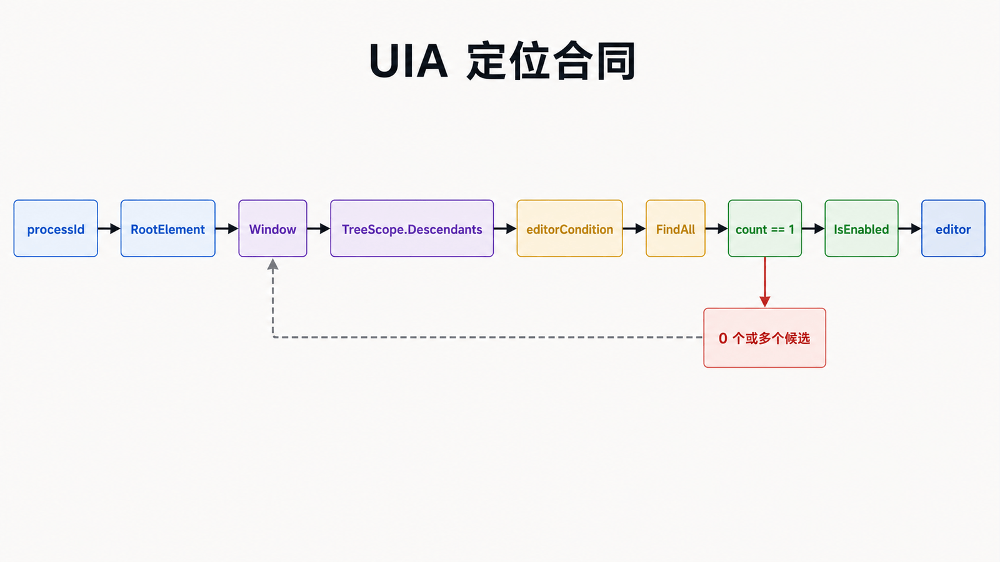
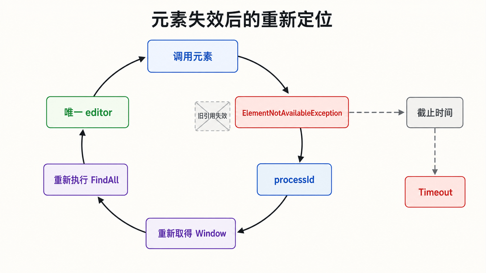

## 前置知识与学习目标

你已经能运行 UIA 冒烟程序，并能用 Inspect 观察属性。本篇只解决：**如何在动态自动化树中稳定找到唯一目标元素？**

读完后，你应能设计“根节点 + `TreeScope` + `Condition` + 等待策略”，解释为什么定位失败，并避免把本地化标题或完整树路径当作永久 ID。本篇不执行控件动作。

## 贯穿场景：定位记事本编辑区

<!-- figure:s03-f01 -->



输入是启动记事本后得到的 PID，输出是唯一、可用的编辑区元素。中间状态依次是：桌面根 → 目标进程窗口 → 窗口子树中的 `Document`/`Edit` 元素。

先按 PID 锁定窗口，再在窗口内部搜索，远比从桌面递归搜索所有 `Edit` 稳定。**作用域通常比条件数量更能决定性能和唯一性。**

## 定位器的四个组成部分

### 根节点

根节点决定搜索边界。优先级通常是：当前对话框或容器 → 应用窗口 → 桌面。除定位顶层窗口外，不要从 `AutomationElement.RootElement` 搜索整个 `Descendants`。

### TreeScope

常用值是：

- `Children`：只查直接子元素，适合顶层窗口；
- `Descendants`：查所有后代，适合已缩小范围的窗口或面板；
- `Subtree`：包含根元素自身及其后代。

不要依赖枚举的数字值，也不要把视觉上的“附近”理解为树中的直接父子关系。

### Condition

稳定性一般从高到低为：

1. 目标进程范围内稳定且唯一的 `AutomationId`；
2. `AutomationId + ControlType`；
3. 稳定语义属性与明确容器的组合；
4. 本地化 `Name`；
5. 兄弟序号或完整树路径。

`Name` 可能随语言、数据和状态变化；序号会被插入的新控件打乱。二者可以作为诊断信息，不应成为默认唯一依据。

### 等待与后置检查

UI 是异步的。定位函数必须有截止时间、轮询间隔、最后一次观察结果，并在超时后返回可诊断错误。无限重试会把真正的结构变化伪装成“运行很慢”。

## 最小可复用实现

下面先按 PID 找顶层窗口，再在其后代中寻找编辑区。不同版本记事本可能暴露为 `Document` 或 `Edit`，因此把实际条件保留在调用端，先用 Inspect 确认。

```csharp
using System;
using System.Diagnostics;
using System.Threading;
using System.Windows.Automation;

public static class UiaFinder
{
    public static AutomationElement WaitForUniqueEditor(
        int processId,
        Condition editorCondition,
        TimeSpan timeout,
        string description)
    {
        Stopwatch clock = Stopwatch.StartNew();
        Exception lastError = null;
        int lastCandidateCount = 0;

        while (clock.Elapsed < timeout)
        {
            try
            {
                AutomationElement window = FindWindowByProcessId(processId);
                if (window != null)
                {
                    AutomationElementCollection candidates =
                        window.FindAll(
                            TreeScope.Descendants,
                            editorCondition);

                    lastCandidateCount = candidates.Count;
                    if (candidates.Count == 1 &&
                        candidates[0].Current.IsEnabled)
                    {
                        return candidates[0];
                    }
                }
            }
            catch (ElementNotAvailableException ex)
            {
                // 树发生变化；下一轮从 PID 重新取得窗口。
                lastError = ex;
            }

            Thread.Sleep(100);
        }

        throw new TimeoutException(
            string.Format(
                "Timed out locating {0}. Last candidate count: {1}. Last error: {2}",
                description,
                lastCandidateCount,
                lastError == null ? "none" : lastError.Message));
    }

    public static AutomationElement FindWindowByProcessId(int processId)
    {
        return AutomationElement.RootElement.FindFirst(
            TreeScope.Children,
            new AndCondition(
                new PropertyCondition(
                    AutomationElement.ProcessIdProperty, processId),
                new PropertyCondition(
                    AutomationElement.ControlTypeProperty, ControlType.Window)));
    }
}
```

调用端提供 PID 与编辑区条件；每轮查询都会重新取得窗口，不会把旧窗口封闭在重试闭包中：

```csharp
Condition editorCondition = new OrCondition(
    new PropertyCondition(
        AutomationElement.ControlTypeProperty, ControlType.Document),
    new PropertyCondition(
        AutomationElement.ControlTypeProperty, ControlType.Edit));

AutomationElement editor = UiaFinder.WaitForUniqueEditor(
    notepad.Id,
    editorCondition,
    TimeSpan.FromSeconds(5),
    "Notepad editor");
```

输入是 `notepad.Id` 与 `editorCondition`；成功输出是唯一且启用的元素；超时异常包含阶段名称、最后候选数和最后一次元素失效错误。窗口或编辑区被重建时，下一轮会从 PID 重新建立查询边界。

## 唯一性检查与失败诊断

上线前不要只用 `FindFirst` 掩盖重复匹配。上面的实现使用 `FindAll`，只有候选数恰好为 `1` 且元素启用时才返回；`0` 表示尚未出现或条件不匹配，大于 `1` 表示定位合同不唯一。

诊断日志至少记录查询根的名称和进程 ID、范围、条件、候选数量，以及每个候选的 `Name`、`AutomationId`、`ControlType` 和 `IsOffscreen`。不要记录用户正在输入的敏感文本。

大量读取属性时，可用 `CacheRequest` 在一次跨进程调用中缓存所需属性；缓存值是快照，只用于同一查询阶段，不能替代实时状态读取。

## 动态树与虚拟化边界

<!-- figure:s03-f02 -->



- 页面切换可能销毁旧元素，捕获 `ElementNotAvailableException` 后应从稳定根重新定位；
- 虚拟列表可能只创建可见项，需要先滚动或使用 `VirtualizedItemPattern`；
- 弹窗可能位于原窗口之外，应回到桌面按 PID 或窗口关系重新定位；
- `IsOffscreen=false` 不等于可点击，还要检查启用状态、遮挡和目标 Pattern。

## 常见误区

- 从桌面 `Descendants` 搜索所有元素，既慢又容易跨应用误匹配；
- 看到一个候选就认为定位器唯一；
- 用固定 `Sleep` 代替带截止时间的状态轮询；
- 把元素对象放入全局缓存，页面更新后继续操作；
- 为提高“成功率”不断追加易变属性，结果定位器更脆弱。

## 自检题

1. 为什么“先按 PID 找窗口”通常比“桌面全树查编辑框”更好？
2. `FindFirst` 返回结果能否证明条件唯一？
3. 元素失效后应该重试原对象，还是从稳定根重新定位？

<details>
<summary>查看答案</summary>

1. PID 先建立应用边界，减少跨进程调用、误匹配和搜索量。
2. 不能；它只返回第一个候选，上线前应使用 `FindAll` 验证候选数量。
3. 从稳定根重新定位。旧对象代表已经变化的树快照，继续重试不会恢复它。

</details>

## 本篇总结与下一篇

稳健定位器不是一个字符串，而是明确的根、范围、条件、等待和诊断合同。下一篇将接收这个唯一元素，查询它实际支持的 Pattern，执行动作并用后置状态证明结果。

## 资料来源

- [UI Automation Tree Overview](https://learn.microsoft.com/en-us/windows/win32/winauto/uiauto-treeoverview)
- [Caching UI Automation Properties and Control Patterns](https://learn.microsoft.com/en-us/windows/win32/winauto/uiauto-cachingforclients)
- [UI Automation Properties Overview](https://learn.microsoft.com/en-us/windows/win32/winauto/uiauto-propertiesoverview)
