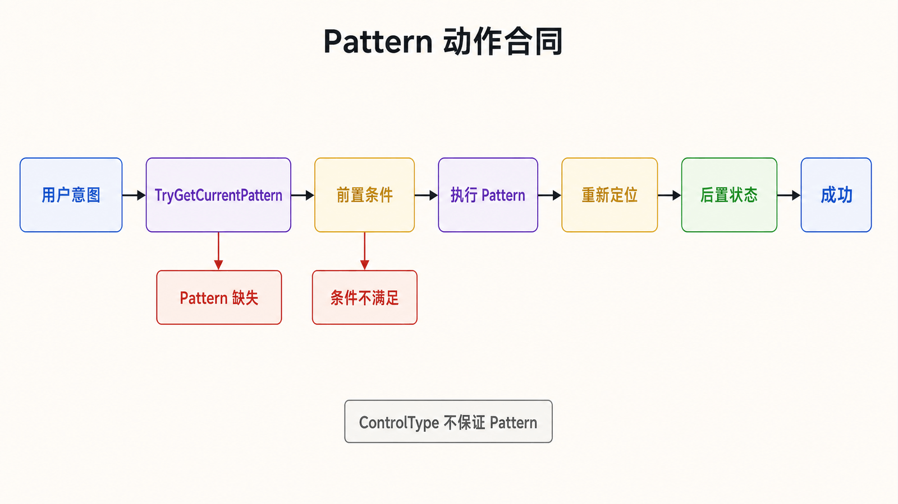
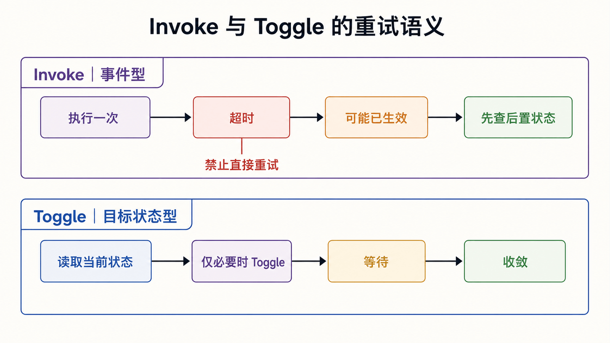
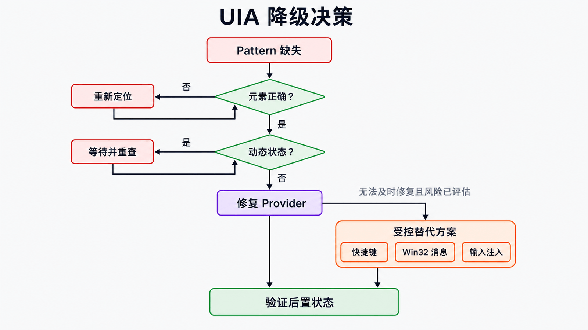

## 前置知识与学习目标

本篇假设第 3 篇的定位器已经返回唯一、当前可用的元素，只解决：**如何选择元素真实支持的行为接口，并确认动作确实生效？**

完成后你应能把控件意图映射为 Pattern，在调用前检查能力与状态，在调用后等待业务后置条件，并知道什么时候不能退化为键鼠模拟。

## 从“点击”改为“调用能力”

<!-- figure:s04-f01 -->



UIA 的动作模型是 Pattern-first：先询问元素支持什么能力，再调用对应接口。常见映射如下：

| 意图         | 首选 Pattern            | 关键前置条件            | 典型后置条件               |
| ------------ | ----------------------- | ----------------------- | -------------------------- |
| 激活按钮     | `InvokePattern`         | 元素启用且 Pattern 可用 | 页面状态、对话框或事件变化 |
| 写入文本     | `ValuePattern`          | `IsReadOnly=false`      | `Current.Value` 等于期望值 |
| 选择列表项   | `SelectionItemPattern`  | 项可选                  | `IsSelected=true`          |
| 设置复选状态 | `TogglePattern`         | 当前状态可读            | 状态达到 On/Off            |
| 展开菜单     | `ExpandCollapsePattern` | 未处于目标状态          | 状态变为 Expanded          |
| 关闭窗口     | `WindowPattern`         | 窗口允许关闭            | 元素消失或进程退出         |
| 移动/缩放    | `TransformPattern`      | `CanMove`/`CanResize`   | 边界矩形变化               |

注意：移动窗口属于 `TransformPattern`，不是 `WindowPattern`；控件类型也不保证表中 Pattern 一定存在。

## 安全获取 Pattern

不要直接调用 `GetCurrentPattern` 后强制转换。`TryGetCurrentPattern` 能把“不支持”变成明确分支：

```csharp
using System;
using System.Windows.Automation;

public static class UiaActions
{
    public static void Invoke(AutomationElement element)
    {
        if (element == null)
            throw new ArgumentNullException("element");
        if (!element.Current.IsEnabled)
            throw new InvalidOperationException("Element is disabled.");

        object raw;
        if (!element.TryGetCurrentPattern(InvokePattern.Pattern, out raw))
            throw new NotSupportedException("InvokePattern is unavailable.");

        ((InvokePattern)raw).Invoke();
    }
}
```

输入是已重新定位的元素；成功输出不是返回值，而是随后观察到的界面状态。元素随时可能失效，调用端仍需处理 `ElementNotAvailableException` 并重新定位。

## 贯穿示例：写入并验证记事本文本

下面的方法只负责对一个已定位编辑区执行“写入—读取验证”。它不启动程序，也不隐藏定位失败。

```csharp
using System;
using System.Diagnostics;
using System.Threading;
using System.Windows.Automation;

public static void SetValueAndVerify(
    Func<AutomationElement> reacquireEditor,
    string expected,
    TimeSpan timeout)
{
    AutomationElement editor = reacquireEditor();
    object raw;
    if (!editor.TryGetCurrentPattern(ValuePattern.Pattern, out raw))
        throw new NotSupportedException("Editor does not expose ValuePattern.");

    ValuePattern value = (ValuePattern)raw;
    if (value.Current.IsReadOnly)
        throw new InvalidOperationException("Editor is read-only.");

    value.SetValue(expected);

    Stopwatch clock = Stopwatch.StartNew();
    while (clock.Elapsed < timeout)
    {
        try
        {
            AutomationElement currentEditor = reacquireEditor();
            object currentRaw;
            if (currentEditor.TryGetCurrentPattern(
                    ValuePattern.Pattern, out currentRaw) &&
                ((ValuePattern)currentRaw).Current.Value == expected)
            {
                return;
            }
        }
        catch (ElementNotAvailableException)
        {
            // 下一轮从稳定根重新取得元素和 Pattern。
        }

        Thread.Sleep(50);
    }

    throw new TimeoutException("Text was not observable before the deadline.");
}
```

调用端把第 3 篇的定位器作为 `reacquireEditor` 传入。中间状态是 `ValuePattern` 可用且非只读；成功输出是重新取得的元素读值与输入一致。目标应用在写入后重建编辑器时，验证循环不会继续读取旧 Pattern。

## 幂等动作与状态收敛

<!-- figure:s04-f02 -->



“点击一次”和“把复选框设为选中”不是同一个合同。前者是事件，重试可能执行两次；后者是目标状态，可以先读状态、只在必要时切换：

```csharp
public static void SetToggle(
    Func<AutomationElement> reacquireElement,
    ToggleState target,
    TimeSpan timeout)
{
    AutomationElement element = reacquireElement();
    object raw;
    if (!element.TryGetCurrentPattern(TogglePattern.Pattern, out raw))
        throw new NotSupportedException("TogglePattern is unavailable.");

    TogglePattern toggle = (TogglePattern)raw;
    if (toggle.Current.ToggleState != target)
        toggle.Toggle();

    Stopwatch clock = Stopwatch.StartNew();
    while (clock.Elapsed < timeout)
    {
        try
        {
            AutomationElement current = reacquireElement();
            object currentRaw;
            if (current.TryGetCurrentPattern(
                    TogglePattern.Pattern, out currentRaw) &&
                ((TogglePattern)currentRaw).Current.ToggleState == target)
            {
                return;
            }
        }
        catch (ElementNotAvailableException)
        {
            // 下一轮重新定位。
        }

        Thread.Sleep(50);
    }

    throw new TimeoutException("Toggle state did not converge.");
}
```

对可能产生副作用的 `Invoke`，超时后不要盲目重试；先检查后置状态，判断第一次调用是否已经生效。

## 组合框、滚动与虚拟化

组合框通常需要先用 `ExpandCollapsePattern` 展开，再从新出现的列表容器中重新定位项，最后调用项的 `SelectionItemPattern`。不要假设列表项始终是组合框的直接子元素。

滚动时先查询 `ScrollPattern`；虚拟化列表还可能需要 `VirtualizedItemPattern.Realize()`。滚动是为了让元素实体化或进入可视区域，不应成为定位器的固定“滚 N 次”步骤。

## 降级策略与边界

<!-- figure:s04-f03 -->



当 Pattern 缺失时，按以下顺序处理：

1. 用 Inspect 确认是否选错了元素或父子层级；
2. 检查控件是否处于会动态改变 Pattern 的状态；
3. 与应用团队修复或补充 UIA Provider；
4. 在有明确验证和风险评估时，才考虑应用快捷键、Win32 消息或输入注入。

键鼠注入依赖焦点、布局、权限和会话；跨完整性级别还受 UIPI 限制。它不能被包装成“万能点击”后默默使用。

## 失败边界与日志

每个动作至少记录元素标识摘要、Pattern、开始时间、截止时间和后置条件结果。不要记录输入框中的密码、令牌或个人数据。常见失败应区分为：元素失效、Pattern 不支持、控件禁用、只读、超时、权限阻断和后置条件不成立。

清理也要验证：调用 `WindowPattern.Close()` 后，等待窗口元素消失或进程退出；若出现“是否保存”对话框，应由明确的业务策略处理，而不是直接终止进程。

## 自检题

1. 为什么不能根据 `ControlType.Button` 直接假设可以调用 `InvokePattern`？
2. `Invoke()` 超时后为什么不能立即再调用一次？
3. 移动窗口应该使用哪个 Pattern？

<details>
<summary>查看答案</summary>

1. 控件类型描述语义角色，实际能力由 Provider 暴露的 Pattern 决定，而且可能动态变化。
2. 第一次调用可能已产生副作用，只是后置状态尚未被观察到；应先检查状态再决定是否重试。
3. `TransformPattern`，并先检查 `CanMove`；`WindowPattern` 管理窗口视觉状态和关闭等能力。

</details>

## 本篇总结与系列收束

一个可靠 UIA 动作包含：重新定位、查询能力、检查前置状态、执行、等待后置状态和受控清理。至此，四篇内容已经把架构、环境、定位和交互连成完整流程；后续可以在此基础上加入页面对象、结构化日志和端到端测试，而不是继续堆 API 清单。

## 资料来源

- [UI Automation Control Patterns Overview](https://learn.microsoft.com/en-us/windows/win32/winauto/uiauto-controlpatternsoverview)
- [UI Automation Control Patterns for Clients](https://learn.microsoft.com/en-us/windows/win32/winauto/uiauto-controlpatternsforclients)
- [UI Automation and Screen Scaling](https://learn.microsoft.com/en-us/windows/win32/winauto/uiauto-screenscaling)
