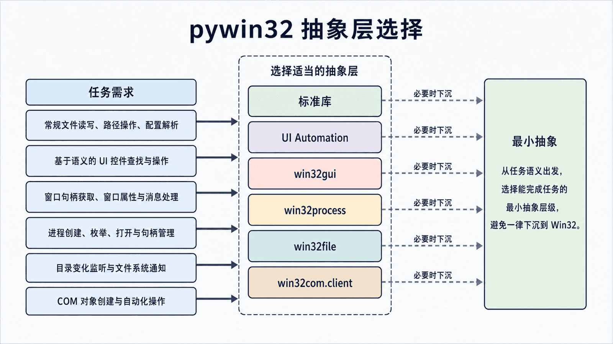
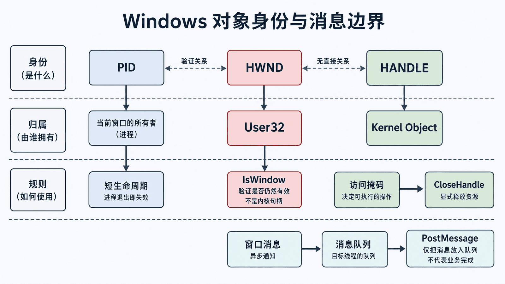

## 前置知识与学习目标

你需要会创建 Python 虚拟环境、处理异常，并理解进程是相互隔离的。本篇只回答：**pywin32 暴露了哪些 Windows 能力，什么时候应该使用它，而不是 UI Automation 或更高层库？**

读完后你应能区分 `pywin32`、`win32com`、窗口句柄和内核句柄，按任务选择模块，并解释权限、会话和资源生命周期为什么是功能的一部分。

> 目录和部分 slug 沿用历史名称 `win32com`，用于保持既有路径稳定；正文统一使用准确术语。`win32com` 只是 `pywin32` 的 COM 子包，不是整个包的同义词。

## 从抽象层选择开始

<!-- figure-anchor:s01-a01 -->

<!-- figure:s01-f01:start -->



<!-- figure:s01-f01:end -->

仍以记事本为贯穿案例：启动、定位窗口、输入文本、验证、关闭。不同抽象层处理的是不同问题：

| 需求                       | 优先选择                          | 原因                           |
| -------------------------- | --------------------------------- | ------------------------------ |
| 按语义定位和操作控件       | UI Automation                     | 能查询元素、属性和行为 Pattern |
| 管理 HWND、窗口样式和消息  | `win32gui`                        | 直接映射 User32 窗口 API       |
| 查询进程/线程归属          | `win32process`                    | 连接 HWND、PID 和进程句柄      |
| 文件通知、设备或特殊句柄   | `win32file`                       | 暴露 Win32 文件与 I/O 能力     |
| 自动化 Excel 等 COM 服务器 | `win32com.client`                 | 创建和调用 COM 对象            |
| 普通文件、进程和注册表任务 | `pathlib`、`subprocess`、`winreg` | 标准库更简单、可测试、可移植   |

pywin32 是“接近 Windows 的工具箱”，不是每个桌面任务的默认答案。

## 包、模块与系统边界

常用模块的职责如下：

- `win32gui`：窗口枚举、属性、位置、消息；
- `win32con`：Win32 常量；
- `win32api`：通用 Win32 函数和句柄辅助；
- `win32process`：进程/线程与窗口归属；
- `win32event`：等待内核对象；
- `win32file`：文件句柄、目录变更、命名管道等；
- `win32com.client`：COM 客户端自动化；
- `pywintypes`：pywin32 的公共类型和异常。

记住“模块对应 API 家族”，比背函数列表更有用。一个完整自动化往往组合标准库、UIA 和少量 pywin32，而不是全部用 pywin32 重写。

## HWND、HANDLE、PID 和消息

<!-- figure-anchor:s01-a02 -->

<!-- figure:s01-f02:start -->



<!-- figure:s01-f02:end -->

### HWND

`HWND` 是当前桌面会话中窗口对象的不透明标识。它可能在窗口销毁后失效，数值也可能被系统复用。每次动作前可用 `win32gui.IsWindow(hwnd)` 验证，不能把它持久化到配置文件长期使用。

### 内核 HANDLE

进程、线程、文件和事件使用内核句柄。句柄伴随访问权限，打开成功后必须关闭。Python 对象被回收并不应成为资源管理策略；用 `try/finally` 明确释放。

### PID

PID 标识进程，但进程退出后也可能被复用。把 PID 与启动时间、可执行路径或当前 HWND 一起验证，才能降低误操作风险。

### 窗口消息

窗口所属线程从消息队列取出消息并交给窗口过程。`SendMessage` 通常同步等待处理，`PostMessage` 只入队后返回。跨进程消息受 User Interface Privilege Isolation（UIPI）和参数编组限制，不是通用远程调用协议。

## 最小示例：按 PID 枚举顶层窗口

输入是 PID，输出是当前可见且有标题的顶层窗口快照：

```python
from dataclasses import dataclass

import win32gui
import win32process


@dataclass(frozen=True)
class WindowInfo:
    hwnd: int
    title: str


def top_level_windows(process_id: int) -> list[WindowInfo]:
    result: list[WindowInfo] = []

    def visit(hwnd: int, _: object) -> bool:
        if not win32gui.IsWindowVisible(hwnd):
            return True
        _, pid = win32process.GetWindowThreadProcessId(hwnd)
        title = win32gui.GetWindowText(hwnd)
        if pid == process_id and title:
            result.append(WindowInfo(hwnd=hwnd, title=title))
        return True

    win32gui.EnumWindows(visit, None)
    return result
```

“列表为空”是正常结果，不应直接索引 `[0]`。窗口可能尚未创建、位于别的会话、没有标题或权限层级不同。第 3 篇会为它加入截止时间、唯一性和句柄再验证。

## 调用链与失败边界

```text
Python 调用 -> pywin32 扩展模块 -> Win32 API -> 对象/目标线程 -> 返回值或 pywintypes.error
```

每一层都有独立失败：参数类型不匹配、API 返回失败、句柄已失效、访问掩码不足、目标线程无响应。`pywintypes.error` 通常保留 Win32 错误码、函数名和系统消息；捕获 `Exception` 后只打印“失败”会丢失这些证据。日志应保留异常对象和目标摘要，但避免记录敏感窗口内容。

## 适用边界与常见误区

- UIA 能提供语义能力时，不要先用坐标或伪造按键；
- 普通进程启动优先 `subprocess`，普通注册表操作优先 `winreg`；
- 不要默认申请 `PROCESS_ALL_ACCESS`，只申请实际操作所需权限；
- 不要把 `PostMessage` 返回成功解释为目标已经完成动作；
- 不要在锁屏、服务会话或安全桌面中假定交互式 UI 可用；
- 位数不是所有问题的根因；必须匹配的是加载到当前进程的原生 DLL 或进程内 COM 组件，进程外 COM 服务器通常可跨 x86/x64 通信。

## 自检题

1. `pywin32` 与 `win32com` 是什么关系？
2. 为什么 HWND 不能长期保存后复用？
3. 普通文件复制为什么通常不应首选 `win32file`？

<details>
<summary>查看答案</summary>

1. `pywin32` 是整个包，`win32com` 是其中用于 COM 的子包。
2. 窗口销毁后句柄失效，其数值还可能被系统分配给新对象；动作前必须重新定位和验证。
3. 标准库接口更简单、可移植且更易测试；只有需要 Windows 特有句柄、通知或标志时才下沉。

</details>

## 本篇总结与下一篇

pywin32 的价值是精确进入 Windows 原生边界。正确顺序是先选抽象层，再选择模块、最小权限和资源生命周期。下一篇将建立隔离环境、验证二进制扩展可加载，并创建可测试的项目骨架。

## 资料来源

- [pywin32 项目与安装说明](https://github.com/mhammond/pywin32)
- [Kernel Objects](https://learn.microsoft.com/en-us/windows/win32/sysinfo/kernel-objects)
- [About Messages and Message Queues](https://learn.microsoft.com/en-us/windows/win32/winmsg/about-messages-and-message-queues)
- [User Interface Privilege Isolation](https://learn.microsoft.com/en-us/windows/security/application-security/application-control/user-interface-privilege-isolation)
