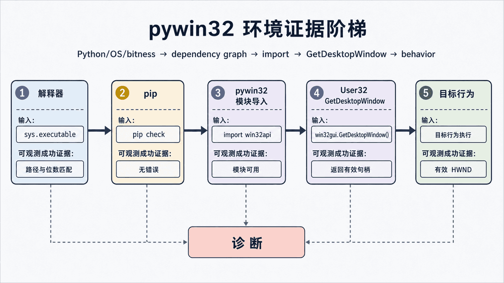
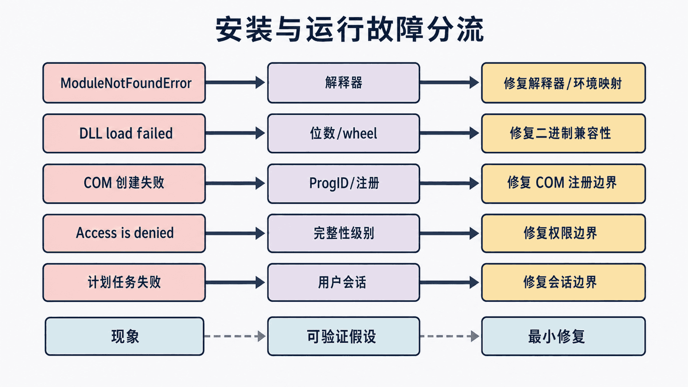

## 前置知识与学习目标

本篇依赖第 1 篇的模块和句柄边界，只回答：**如何确认 pywin32 安装正确，并让环境问题可以复现和分流？**

完成后你应能创建隔离环境、验证 GUI/进程/COM 模块、固定依赖并运行最小测试。贯穿项目仍是记事本自动化，但本篇不发送任何窗口消息。

## 支持矩阵先于安装命令

开始前记录四项信息：Windows 版本、Python 版本、解释器位数、是否处于虚拟环境。Python 与 pywin32 wheel 必须兼容；只有 COM 服务器或进程内组件通常才要求与目标位数严格匹配。

```powershell
python --version
python -c "import platform, struct; print(platform.platform()); print(struct.calcsize('P') * 8)"
python -c "import sys; print(sys.executable); print(sys.prefix != sys.base_prefix)"
```

这些输出是故障报告的一部分，不要只说“安装了最新版”。

## 唯一安装主路径

```powershell
python -m venv .venv
.venv\Scripts\Activate.ps1
python -m pip install --upgrade pip
python -m pip install pywin32 pytest
python -m pip check
python -m pip freeze > requirements.lock.txt
```

`requirements.lock.txt` 精确记录当前解释器和平台解析出的版本，不代表可以直接复制到任意 Python 版本或 CPU 架构。提交时还应记录前文的支持矩阵；重建后运行 `pip check`，确认依赖元数据没有冲突。

普通虚拟环境内不要运行 `pywin32_postinstall`。pywin32 官方只把它用于全局安装中的 COM 对象、服务等注册场景；若项目确实需要全局注册，应在隔离的部署步骤中执行 `python -m pywin32_postinstall -install`，记录解释器路径、权限和回滚方式。

## 分层自检

<!-- figure-anchor:s02-a01 -->

<!-- figure:s02-f01:start -->



<!-- figure:s02-f01:end -->

先验证解释器确实来自 `.venv`，再分别加载模块：

```powershell
python -c "import sys; print(sys.executable)"
python -m pip show pywin32
python -c "import win32api; print(win32api.GetVersionEx()[0])"
python -c "import win32gui, win32process, win32file; print('win32 modules: ok')"
python -c "import win32com.client; print('COM client: ok')"
```

最后运行一个无副作用探测：

```python
import win32gui


def main() -> int:
    desktop = win32gui.GetDesktopWindow()
    if not win32gui.IsWindow(desktop):
        raise RuntimeError("Desktop HWND is unavailable")
    print(f"desktop hwnd={desktop}")
    return 0


if __name__ == "__main__":
    raise SystemExit(main())
```

成功标准是进程退出码为 0、输出一个有效 HWND。该测试只证明 pywin32 到 User32 的最小通路，不证明记事本定位器已经正确。

## 项目骨架与依赖边界

```text
notepad-rpa/
├─ pyproject.toml
├─ requirements.lock.txt
├─ src/notepad_rpa/
│  ├─ __init__.py
│  ├─ windows.py
│  ├─ processes.py
│  └─ workflow.py
└─ tests/
   ├─ test_environment.py
   └─ test_window_selection.py
```

把纯逻辑与系统调用分开：窗口候选排序、超时计算和状态转换可以做单元测试；真正调用 Win32 API 的部分用少量 Windows 集成测试覆盖。这样 CI 没有交互桌面时仍能验证大部分逻辑。

最小环境测试：

```python
import win32gui


def test_desktop_handle_is_valid() -> None:
    hwnd = win32gui.GetDesktopWindow()
    assert hwnd != 0
    assert win32gui.IsWindow(hwnd)
```

## 安装失败分流

<!-- figure-anchor:s02-a02 -->

<!-- figure:s02-f02:start -->



<!-- figure:s02-f02:end -->

| 现象                   | 优先检查                                      | 处理原则                               |
| ---------------------- | --------------------------------------------- | -------------------------------------- |
| `ModuleNotFoundError`  | `sys.executable` 与 `python -m pip --version` | 确认 pip 属于当前解释器                |
| DLL 加载失败           | Python/OS 位数、wheel 是否兼容                | 重建干净 venv，不复制 DLL              |
| COM 创建失败           | ProgID、目标应用安装、位数与注册              | 先区分“模块可加载”和“COM 服务器不可用” |
| `Access is denied`     | 目标完整性级别和请求权限                      | 降低目标权限或申请最小权限             |
| 本机成功、计划任务失败 | 用户会话、工作目录、环境变量                  | 显式记录运行身份和路径                 |

不要用“重装 Python、管理员运行、复制 DLL”作为无差别三连。每一步都应对应一个被验证的假设。

## 日志与安全基线

开发阶段至少记录 Python/pywin32 版本、解释器路径、进程 PID、目标 HWND、Win32 错误码和阶段耗时。不要记录窗口中的密码、注册表密钥内容或完整用户目录。自动化进程默认使用普通用户权限，确有需要再对单个操作提升。

## 常见误区与边界

- IDE 选择的解释器可能与终端不同；始终输出 `sys.executable`；
- 锁定依赖不等于复制 `.venv`，应从清单重建；
- pytest 通过不代表真实交互桌面可用，需要单独的 Windows 集成环境；
- 安装 pywin32 不会自动解决 UIA Provider、UIPI 或目标程序焦点限制。

## 自检题

1. 为什么使用 `python -m pip` 而不是裸 `pip`？
2. pywin32 模块可导入但 COM 创建失败，故障一定在安装吗？
3. 为什么系统调用与纯逻辑要分层？

<details>
<summary>查看答案</summary>

1. 它把 pip 明确绑定到当前 Python 解释器，降低装进错误环境的概率。
2. 不一定；COM 服务器可能未安装、ProgID 错误、注册损坏或位数不匹配。
3. 纯逻辑可在无交互桌面的 CI 中稳定测试，系统边界只需少量集成测试。

</details>

## 本篇总结与下一篇

可复现环境包含支持矩阵、隔离安装、分层自检、依赖锁定和失败分流，而不只是一次成功的 `pip install`。下一篇将基于 PID 选择唯一顶层窗口，并处理句柄失效、消息超时和焦点边界。

## 资料来源

- [pywin32 README](https://github.com/mhammond/pywin32#readme)
- [Python venv 文档](https://docs.python.org/3/library/venv.html)
- [Python Packaging User Guide：安装包](https://packaging.python.org/en/latest/tutorials/installing-packages/)
- [pip check](https://pip.pypa.io/en/stable/cli/pip_check/)
