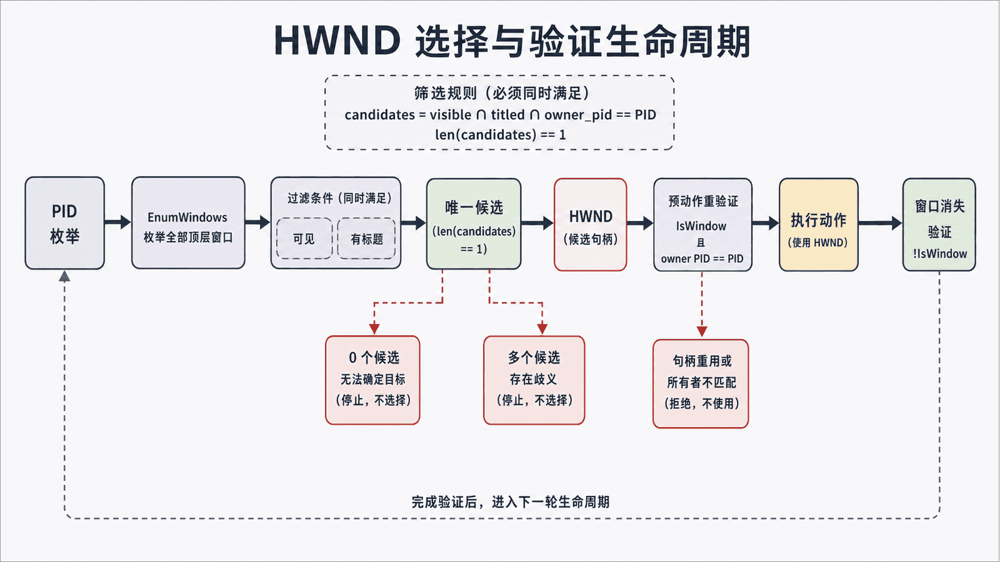
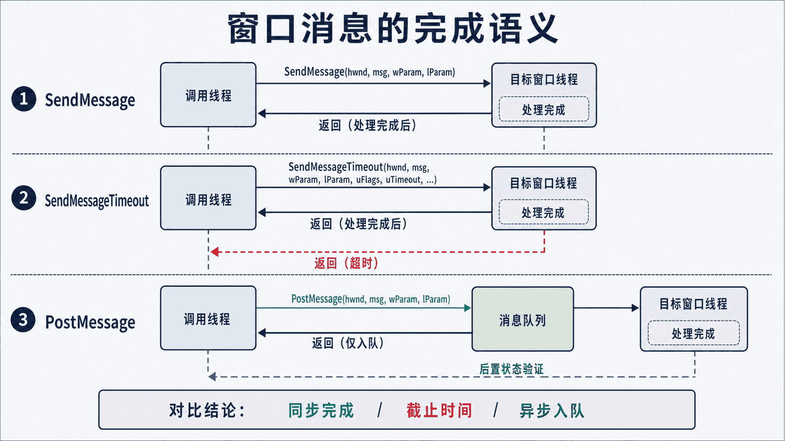

## 前置知识与学习目标

你已经有可用 pywin32 环境，并知道 HWND 是临时标识。本篇解决：**如何得到有效且唯一的目标窗口，并在超时、权限和焦点限制下执行受控操作？**

完成后你应能按 PID 等待窗口、在动作前重新验证句柄、区分同步与异步消息，并用可观察状态判断操作结果。

## 贯穿案例与状态变化

<!-- figure-anchor:s03-a01 -->

<!-- figure:s03-f01:start -->



<!-- figure:s03-f01:end -->

案例输入是 `notepad.exe`，期望状态链为：

```text
进程已启动 -> 唯一顶层窗口出现 -> HWND 仍有效 -> 请求关闭 -> 窗口消失
```

窗口标题不是稳定主键。现代记事本的标题可能包含文件名、未保存标记或本地化文本，因此用启动得到的 PID 建立边界，再把标题作为诊断信息。

## 带截止时间的窗口定位器

```python
from __future__ import annotations

import time
from dataclasses import dataclass

import win32gui
import win32process


@dataclass(frozen=True)
class WindowTarget:
    hwnd: int
    pid: int
    title: str


def windows_for_pid(pid: int) -> list[WindowTarget]:
    found: list[WindowTarget] = []

    def visit(hwnd: int, _: object) -> bool:
        _, owner_pid = win32process.GetWindowThreadProcessId(hwnd)
        title = win32gui.GetWindowText(hwnd)
        if owner_pid == pid and win32gui.IsWindowVisible(hwnd) and title:
            found.append(WindowTarget(hwnd, pid, title))
        return True

    win32gui.EnumWindows(visit, None)
    return found


def wait_for_unique_window(pid: int, timeout: float = 5.0) -> WindowTarget:
    deadline = time.monotonic() + timeout
    last: list[WindowTarget] = []
    while time.monotonic() < deadline:
        last = windows_for_pid(pid)
        if len(last) == 1:
            return last[0]
        time.sleep(0.1)
    raise TimeoutError(f"expected one window for pid={pid}, found={last!r}")
```

输入是 PID 和超时；输出包含 HWND、PID、标题快照。这里把“候选”明确限定为可见、有标题的顶层窗口，与第 1 篇的最小示例保持一致。无标题窗口也是合法窗口；若目标应用以无标题窗口为主，应把筛选条件改成显式类名或业务谓词，而不是悄悄删除 `title` 条件。多个候选不会被静默截成第一个，超时也会带上最后候选。

## 动作前重新验证

拿到 `WindowTarget` 后至少验证三件事：句柄仍存在、仍属于原 PID、窗口尚未销毁。标题变化不一定意味着目标变化。

```python
def assert_current(target: WindowTarget) -> None:
    if not win32gui.IsWindow(target.hwnd):
        raise RuntimeError("window handle is no longer valid")
    _, current_pid = win32process.GetWindowThreadProcessId(target.hwnd)
    if current_pid != target.pid:
        raise RuntimeError("window handle was reused by another process")
```

验证只能缩小竞态窗口，不能彻底消除“检查后立即销毁”。调用仍需处理 `pywintypes.error`。

## 几何与显示状态

`GetWindowRect` 读取边界，`SetWindowPos` 调整位置和大小，`ShowWindow` 改变最小化/最大化状态。显示状态调用成功不保证目标已完成重绘；需要重新读取边界或状态验证。

```python
import win32con


def move_and_verify(target: WindowTarget, x: int, y: int, w: int, h: int) -> None:
    assert_current(target)
    win32gui.SetWindowPos(
        target.hwnd,
        0,
        x,
        y,
        w,
        h,
        win32con.SWP_NOZORDER | win32con.SWP_NOACTIVATE,
    )
    left, top, right, bottom = win32gui.GetWindowRect(target.hwnd)
    actual = (left, top, right - left, bottom - top)
    expected = (x, y, w, h)
    if any(abs(current - requested) > 2 for current, requested in zip(actual, expected)):
        raise RuntimeError("window geometry did not reach the requested state")
```

输入是目标窗口和期望的 `(x, y, width, height)`；中间状态是 API 返回后的实际矩形；输出通过“每个分量误差不超过 2 像素”表达。这个容差只适合演示，DPI、窗口阴影和应用最小尺寸可能需要按目标应用建立更明确的几何合同。

## SendMessage、PostMessage 与超时

<!-- figure-anchor:s03-a02 -->

<!-- figure:s03-f02:start -->



<!-- figure:s03-f02:end -->

- `SendMessage` 同步等待窗口过程处理，目标挂起时可能阻塞调用线程；
- `SendMessageTimeout` 为同步调用增加明确截止时间；
- `PostMessage` 只把消息放入队列，返回成功不代表业务已完成。

对关闭请求，异步发送后等待窗口消失更符合状态模型：

```python
import time
import win32con


def request_close(target: WindowTarget, timeout: float = 3.0) -> None:
    assert_current(target)
    win32gui.PostMessage(target.hwnd, win32con.WM_CLOSE, 0, 0)
    deadline = time.monotonic() + timeout
    while time.monotonic() < deadline:
        if not win32gui.IsWindow(target.hwnd):
            return
        time.sleep(0.05)
    raise TimeoutError("window did not close; a save dialog may be blocking")
```

如果出现保存对话框，“超时”是业务分支，不应直接杀进程。

## 焦点、输入与 UIPI 边界

Windows 会限制后台进程任意抢占前台窗口，`SetForegroundWindow` 可能被拒绝。发送 `WM_KEYDOWN` 也不是可靠文本输入：目标必须正确处理消息，键盘布局、输入法和焦点仍会影响结果。

跨完整性级别消息受 UIPI 限制；自定义消息跨进程还可能需要显式编组。语义控件操作优先 UIA Pattern，文本大量输入优先应用接口或剪贴板加明确验证，输入注入只能作为受控降级。

## 常见误区与边界

- `FindWindow(None, title)` 适合临时探测，不适合作为唯一生产定位器；
- `IsWindow` 为真不代表窗口可见、可交互或属于预期 PID；
- `PostMessage` 成功不等于动作完成；
- 用 `PROCESS_ALL_ACCESS` 不能解决 UIPI；
- HWND 只应在短工作流内缓存，并在每个有副作用动作前再验证。

## 自检题

1. 为什么按 PID 定位仍要检查候选数量？
2. `PostMessage(WM_CLOSE)` 返回后，成功条件是什么？
3. `SetForegroundWindow` 失败为什么不应简单无限重试？

<details>
<summary>查看答案</summary>

1. 一个进程可能有主窗口、对话框和工具窗口，仍需明确业务上唯一的候选。
2. 窗口句柄消失或预期进程/状态发生变化，而不是仅看入队返回值。
3. Windows 有前台激活策略，失败可能是确定性权限/会话边界，无限重试只会制造噪声。

</details>

## 本篇总结与下一篇

窗口操作的可靠性来自 PID 作用域、候选唯一性、句柄再验证、消息截止时间和后置状态。下一篇将沿着 HWND→PID 的关系进入进程对象，用最小访问权限观察、等待和受控终止进程。

## 资料来源

- [About Messages and Message Queues](https://learn.microsoft.com/en-us/windows/win32/winmsg/about-messages-and-message-queues)
- [SendMessage function](https://learn.microsoft.com/en-us/windows/win32/api/winuser/nf-winuser-sendmessage)
- [PostMessage function](https://learn.microsoft.com/en-us/windows/win32/api/winuser/nf-winuser-postmessagea)
