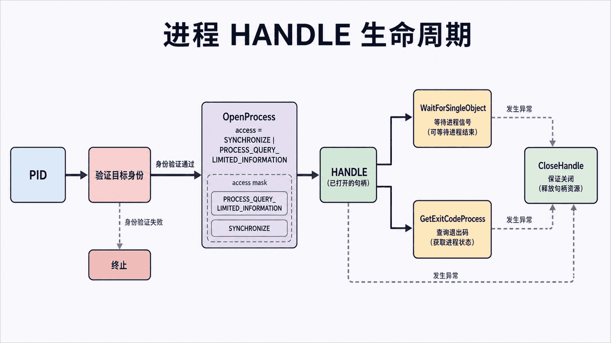
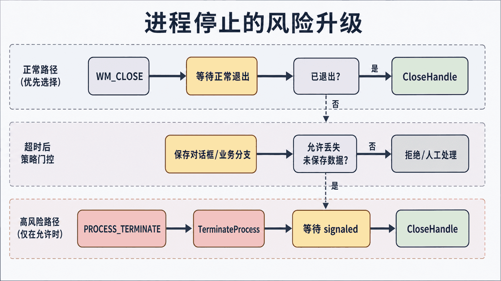

## 前置知识与学习目标

本篇依赖第 3 篇的 HWND、PID 和受控关闭，只回答：**如何用最小权限观察、等待并停止一个 Windows 进程？**

读完后你应能区分 PID 与进程句柄，按操作选择访问掩码，保证句柄释放，并实现“请求正常退出 → 等待 → 必要时终止”的分级策略。线程注入、挂起其他进程线程等高风险操作不在本篇范围。

## 进程不是一个数字

<!-- figure-anchor:s04-a01 -->

<!-- figure:s04-f01:start -->



<!-- figure:s04-f01:end -->

PID 只用于标识当前进程实例，可能在退出后被复用；进程句柄是带访问权限的内核对象引用，可用于查询、等待或终止。一个安全调用链是：

```text
启动得到 PID -> 验证目标身份 -> 以最小权限打开句柄 -> 查询/等待 -> 关闭句柄
```

窗口自动化还要把 HWND 的当前所有者 PID 与预期 PID 比对，避免窗口句柄或 PID 复用导致误操作。

## 启动优先使用 subprocess

普通业务进程启动优先标准库，因为参数、环境变量、标准流和退出码更清楚：

```python
from __future__ import annotations

import subprocess


def start_notepad() -> subprocess.Popen[bytes]:
    return subprocess.Popen(
        ["notepad.exe"],
        stdin=subprocess.DEVNULL,
        stdout=subprocess.DEVNULL,
        stderr=subprocess.DEVNULL,
    )
```

只有需要 Windows 特有创建标志、令牌、桌面或安全属性时，才下沉到 `win32process.CreateProcess`。不要为了“统一使用 pywin32”放弃标准库的清晰合同。

## 最小权限打开与等待

查询退出码和等待终止不需要 `PROCESS_ALL_ACCESS`：

```python
import win32api
import win32con
import win32event
import win32process


def wait_for_exit(pid: int, timeout_ms: int) -> int | None:
    access = win32con.SYNCHRONIZE | win32con.PROCESS_QUERY_LIMITED_INFORMATION
    handle = win32api.OpenProcess(access, False, pid)
    try:
        result = win32event.WaitForSingleObject(handle, timeout_ms)
        if result == win32con.WAIT_TIMEOUT:
            return None
        if result != win32con.WAIT_OBJECT_0:
            raise RuntimeError(f"unexpected wait result: {result}")
        return win32process.GetExitCodeProcess(handle)
    finally:
        win32api.CloseHandle(handle)
```

输入是 PID 和毫秒截止时间；返回整数退出码表示已退出，`None` 表示仍在运行。`finally` 保证查询成功、超时或异常时都释放句柄。

若当前 pywin32/SDK 常量集中没有 `PROCESS_QUERY_LIMITED_INFORMATION`，应升级受支持版本或在边界模块中集中声明并注明来源，不要在业务代码散落魔法数字。

## 访问掩码按动作选择

| 动作         | 典型最小权限                        |
| ------------ | ----------------------------------- |
| 等待退出     | `SYNCHRONIZE`                       |
| 查询有限信息 | `PROCESS_QUERY_LIMITED_INFORMATION` |
| 读取进程内存 | `PROCESS_VM_READ` + 相应查询权限    |
| 终止进程     | `PROCESS_TERMINATE`                 |

访问被拒绝并不意味着应升级到 `PROCESS_ALL_ACCESS`。目标可能处于更高完整性级别、受保护进程或不同用户安全上下文；自动化程序应把这些视为明确边界。

## 分级停止策略

<!-- figure-anchor:s04-a02 -->

<!-- figure:s04-f02:start -->



<!-- figure:s04-f02:end -->

对有窗口的交互式应用，先向其顶层窗口发送 `WM_CLOSE`，等待正常退出；这给应用处理保存和清理的机会。只有业务策略明确允许丢失未保存数据，且正常关闭超过截止时间，才打开带 `PROCESS_TERMINATE` 的句柄调用 `TerminateProcess`。

```python
def terminate_and_wait(pid: int, timeout_ms: int = 3_000, exit_code: int = 1) -> None:
    access = win32con.PROCESS_TERMINATE | win32con.SYNCHRONIZE
    handle = win32api.OpenProcess(access, False, pid)
    try:
        win32process.TerminateProcess(handle, exit_code)
        result = win32event.WaitForSingleObject(handle, timeout_ms)
        if result != win32con.WAIT_OBJECT_0:
            raise TimeoutError(f"process pid={pid} did not reach signaled state")
    finally:
        win32api.CloseHandle(handle)
```

输入是已验证的 PID、截止时间和退出码；成功输出是进程对象进入 signaled 状态。超时或访问拒绝都保留为显式失败，同时 `finally` 保证句柄关闭。即使强制终止 API 已返回，也不要把它等同于清理完成。

## 线程边界

Windows 线程也有 ID、句柄、访问掩码和生命周期，但业务自动化通常不需要创建或控制目标进程的线程。远程线程、挂起/恢复、修改上下文会破坏目标一致性并触发安全软件，属于调试器、注入器或安全研究范畴。

本系列只使用窗口线程归属信息辅助诊断。并发任务优先 Python `threading`、`concurrent.futures` 或 `asyncio`；这些抽象不会要求手工管理原生线程句柄。

## 进程树与 Job Object

单个 PID 不代表整个应用：启动器可能创建子进程后退出。需要把一组进程作为单元限制或清理时，Windows Job Object 比“递归枚举并逐个杀掉”更可靠，但它会引入继承、嵌套和权限规则，应作为独立进阶主题设计和测试。

## 常见误区与失败边界

- 用 PID 作为长期身份，不验证可执行路径或当前窗口所有者；
- 为省事申请 `PROCESS_ALL_ACCESS`；
- 忘记关闭句柄，长时间服务最终耗尽句柄表；
- 把 `STILL_ACTIVE` 当作合法业务退出码使用；
- 直接终止带未保存内容的应用；
- 把远程线程操作写成通用 RPA 技巧。

## 最小行为测试

启动一个可控测试进程，验证短超时返回 `None`；请求正常退出后验证得到退出码；重复多次并监控当前进程句柄数不持续增长。终止分支只能在专用临时进程上测试，不要指向真实用户应用。

## 自检题

1. 查询进程是否退出为什么不需要 `PROCESS_ALL_ACCESS`？
2. `TerminateProcess` 为什么是最后手段？
3. `finally` 关闭句柄解决了什么问题？

<details>
<summary>查看答案</summary>

1. 等待和查询只需 `SYNCHRONIZE` 与有限查询权限，额外权限既无必要又扩大风险。
2. 它不给应用保存和释放业务资源的机会，可能造成数据损坏。
3. 它保证成功、超时和异常路径都释放内核对象，防止长期句柄泄漏。

</details>

## 本篇总结与下一篇

可靠进程管理的核心是身份验证、最小权限、明确等待和句柄释放；安全停止先走应用协议，再考虑强制终止。下一篇把工作流配置写入用户级注册表，并用目录通知观察输出变化，完成窗口—进程—存储的闭环。

## 资料来源

- [Process Security and Access Rights](https://learn.microsoft.com/en-us/windows/win32/procthread/process-security-and-access-rights)
- [Process and Thread Functions](https://learn.microsoft.com/en-us/windows/win32/procthread/process-and-thread-functions)
- [Job Objects](https://learn.microsoft.com/en-us/windows/win32/procthread/job-objects)
