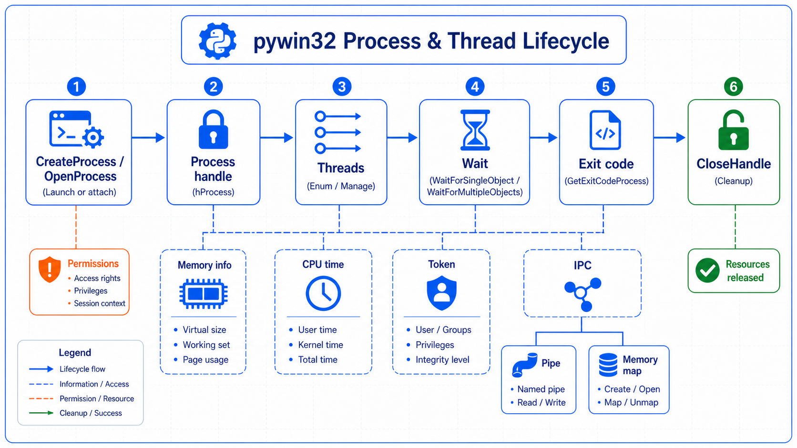

## 概述

进程和线程管理是 Windows 自动化的核心部分。本教程将详细介绍如何使用 pywin32 进行进程和线程的各种操作。



### 进程 vs 线程

```text
┌─────────────────────────────────────────────────────────────┐
│                  进程 vs 线程                                │
├─────────────────────────────────────────────────────────────┤
│                                                              │
│  进程 (Process)          线程 (Thread)                     │
│  ┌─────────────────┐      ┌─────────────────┐            │
│  │   独立内存空间   │      │   共享内存空间   │            │
│  │   系统资源      │      │   轻量级       │            │
│  │   安全边界      │      │   快速创建     │            │
│  │   进程间通信    │      │   通信方便     │            │
│  └─────────────────┘      └─────────────────┘            │
│                                                              │
└─────────────────────────────────────────────────────────────┘
```

## 进程操作

### 创建进程

```python
import win32process
import win32con
import win32api

# 基本创建
process_info = win32process.CreateProcess(
    r"C:\Windows\System32\notepad.exe",  # 程序路径
    "",                                   # 命令行参数
    None,                                 # 进程安全属性
    None,                                 # 线程安全属性
    False,                                # 是否继承句柄
    win32con.CREATE_NEW_CONSOLE,          # 创建标志
    None,                                 # 环境变量
    None,                                 # 当前目录
    win32process.STARTUPINFO()            # 启动信息
)

# 解包返回值
h_process, h_thread, process_id, thread_id = process_info

print(f"进程句柄: {h_process}")
print(f"线程句柄: {h_thread}")
print(f"进程ID: {process_id}")
print(f"线程ID: {thread_id}")

# 关闭线程句柄（进程句柄需要保留以便管理）
win32api.CloseHandle(h_thread)
```

### 带参数创建进程

```python
# 创建带参数的进程
process_info = win32process.CreateProcess(
    r"C:\Windows\System32\cmd.exe",
    "/c dir",  # 命令行参数
    None, None, False,
    win32con.CREATE_NEW_CONSOLE,
    None, None,
    win32process.STARTUPINFO()
)

h_process, h_thread, process_id, thread_id = process_info
win32api.CloseHandle(h_thread)
```

### 打开现有进程

```python
import win32api
import win32con

# 按进程 ID 打开
process_id = 1234
h_process = win32api.OpenProcess(
    win32con.PROCESS_ALL_ACCESS,  # 访问权限
    False,                        # 不继承
    process_id                    # 进程ID
)

print(f"进程句柄: {h_process}")

# 常用访问权限
ACCESS = {
    'all': win32con.PROCESS_ALL_ACCESS,
    'query': win32con.PROCESS_QUERY_INFORMATION,
    'vm_read': win32con.PROCESS_VM_READ,
    'terminate': win32con.PROCESS_TERMINATE,
    'create_thread': win32con.PROCESS_CREATE_THREAD,
    'vm_operation': win32con.PROCESS_VM_OPERATION,
    'vm_write': win32con.PROCESS_VM_WRITE,
}

# 关闭句柄
win32api.CloseHandle(h_process)
```

### 进程权限

```python
import win32security
import win32process

# 获取进程令牌
h_process = win32api.OpenProcess(
    win32con.PROCESS_QUERY_INFORMATION,
    False, 1234
)

# 打开进程令牌
h_token = win32security.OpenProcessToken(
    h_process,
    win32security.TOKEN_DUPLICATE | win32security.TOKEN_ASSIGN_PRIMARY
)

# 获取令牌信息
token_info = win32security.GetTokenInformation(
    h_token,
    win32security.TokenElevation
)

print(f"是否提升: {token_info.Elevation}")

win32api.CloseHandle(h_token)
win32api.CloseHandle(h_process)
```

## 进程信息

### 基本信息

```python
import win32process
import win32api
import win32con

h_process = win32api.OpenProcess(
    win32con.PROCESS_QUERY_INFORMATION,
    False, 1234
)

# 获取进程路径
exe_path = win32process.GetModuleFileNameEx(h_process, 0)
print(f"进程路径: {exe_path}")

# 获取进程镜像基址
modules = win32process.EnumProcessModules(h_process)
for module in modules[:5]:
    module_name = win32process.GetModuleBaseName(h_process, module)
    print(f"模块: {module_name}")

win32api.CloseHandle(h_process)
```

### 内存信息

```python
import win32process

h_process = win32api.OpenProcess(
    win32con.PROCESS_ALL_ACCESS,
    False, 1234
)

# 获取内存信息
mem_info = win32process.GetProcessMemoryInfo(h_process)

print("=" * 50)
print("进程内存信息")
print("=" * 50)

# 转换为 MB
working_set = mem_info['WorkingSetSize'] / 1024 / 1024
peak_working_set = mem_info['PeakWorkingSetSize'] / 1024 / 1024
private_bytes = mem_info['PrivateUsage'] / 1024 / 1024

print(f"工作集大小: {working_set:.2f} MB")
print(f"峰值工作集: {peak_working_set:.2f} MB")
print(f"私有字节: {private_bytes:.2f} MB")

win32api.CloseHandle(h_process)
```

### CPU 信息

```python
import win32process

h_process = win32api.OpenProcess(
    win32con.PROCESS_ALL_ACCESS,
    False, 1234
)

# 获取 CPU 时间
times = win32process.GetProcessTimes(h_process)

creation_time = times['CreationTime']
exit_time = times['ExitTime']
kernel_time = times['KernelTime']
user_time = times['UserTime']

print(f"创建时间: {creation_time}")
print(f"退出时间: {exit_time}")
print(f"内核时间: {kernel_time}")
print(f"用户时间: {user_time}")

win32api.CloseHandle(h_process)
```

## 进程控制

### 终止进程

```python
import win32api
import win32con

h_process = win32api.OpenProcess(
    win32con.PROCESS_TERMINATE,
    False, 1234
)

# 终止进程
win32api.TerminateProcess(h_process, 0)

win32api.CloseHandle(h_process)
```

### 等待进程

```python
import win32api
import win32con
import win32process

# 创建进程
process_info = win32process.CreateProcess(
    r"C:\Windows\System32\cmd.exe",
    "/c ping 127.0.0.1 -n 3",
    None, None, False,
    win32con.CREATE_NEW_CONSOLE,
    None, None,
    win32process.STARTUPINFO()
)

h_process, h_thread, _, _ = process_info
win32api.CloseHandle(h_thread)

# 等待进程结束
print("等待进程结束...")
exit_code = win32api.WaitForSingleObject(
    h_process,           # 进程句柄
    win32con.INFINITE    # 超时时间（毫秒）
)

print(f"进程结束，退出码: {exit_code}")

win32api.CloseHandle(h_process)
```

### 检查进程状态

```python
import psutil

# 使用 psutil 更简单
pid = 1234

# 检查进程是否存在
exists = psutil.pid_exists(pid)
print(f"进程存在: {exists}")

# 获取进程对象
try:
    proc = psutil.Process(pid)
    print(f"进程名: {proc.name()}")
    print(f"进程路径: {proc.exe()}")
    print(f"状态: {proc.status()}")
    print(f"CPU使用率: {proc.cpu_percent()}%")
    print(f"内存使用: {proc.memory_info().rss / 1024 / 1024:.2f} MB")
    
    # 终止进程
    proc.terminate()
    print("进程已终止")
    
except psutil.NoSuchProcess:
    print("进程不存在")
```

## 线程操作

### 创建线程

```python
import win32process
import win32con
import win32api

# 定义线程函数
def thread_func(hwnd):
    print("线程执行中...")
    return 0

# 获取当前进程句柄
h_current = win32api.GetCurrentProcess()

# 创建线程
h_thread = win32api.CreateThread(
    None,                # 安全属性
    0,                   # 堆栈大小
    thread_func,          # 线程函数
    None,                 # 参数
    win32con.CREATE_SUSPENDED,  # 创建标志
    None                  # 线程ID（输出）
)

print(f"线程句柄: {h_thread}")

# 恢复线程
win32api.ResumeThread(h_thread)

# 等待线程结束
win32api.WaitForSingleObject(h_thread, win32con.INFINITE)

# 关闭线程句柄
win32api.CloseHandle(h_thread)
```

### 线程信息

```python
import win32process

h_thread = win32api.OpenThread(
    win32con.THREAD_ALL_ACCESS,
    False, thread_id
)

# 获取线程信息
times = win32process.GetThreadTimes(h_thread)
print(f"线程创建时间: {times['CreationTime']}")
print(f"内核时间: {times['KernelTime']}")
print(f"用户时间: {times['UserTime']}")

win32api.CloseHandle(h_thread)
```

## 进程间通信

### 命名管道

```python
import win32pipe
import win32file
import win32con

# 创建命名管道
pipe_name = r"\\.\pipe\MyPipe"
pipe = win32pipe.CreateNamedPipe(
    pipe_name,
    win32pipe.PIPE_ACCESS_DUPLEX,
    win32pipe.PIPE_TYPE_MESSAGE | win32pipe.PIPE_READMODE_MESSAGE | win32pipe.PIPE_WAIT,
    1,              # 最大实例数
    65536,           # 输出缓冲区大小
    65536,           # 输入缓冲区大小
    0,               # 超时
    None             # 安全属性
)

print("等待客户端连接...")

# 等待客户端连接
win32pipe.ConnectNamedPipe(pipe, None)

# 发送数据
data = b"Hello from server!"
win32file.WriteFile(pipe, data)

# 接收数据
buffer = win32file.ReadFile(pipe, 65536)
print(f"收到: {buffer}")

# 关闭管道
win32pipe.DisconnectNamedPipe(pipe)
win32api.CloseHandle(pipe)
```

### 内存映射文件

```python
import win32file
import win32con
import mmap

# 创建文件映射
file_handle = win32file.CreateFile(
    r"test.txt",
    win32con.GENERIC_READ | win32con.GENERIC_WRITE,
    win32con.FILE_SHARE_READ | win32con.FILE_SHARE_WRITE,
    None,
    win32con.CREATE_ALWAYS,
    win32con.FILE_ATTRIBUTE_NORMAL,
    None
)

# 创建映射
mapping = win32file.CreateFileMapping(
    file_handle,
    None,
    win32con.PAGE_READWRITE,
    0,  # 高位大小
    65536,  # 低位大小
    "MyMapping"  # 映射名称
)

# 映射到内存
view = win32file.MapViewOfFile(
    mapping,
    win32con.FILE_MAP_ALL_ACCESS,
    0, 0, 0
)

# 写入数据
data = b"Hello, Memory Mapped File!"
win32file.RtlCopyMemory(view, data, len(data))

# 读取数据
win32file.UnmapViewOfFile(view)
win32file.CloseHandle(mapping)
win32file.CloseHandle(file_handle)
```

## 实用工具类

### ProcessManager

```python
import win32process
import win32api
import win32con
import psutil

class ProcessManager:
    """进程管理器"""
    
    @staticmethod
    def launch(program, args="", visible=True):
        """启动进程"""
        creation_flags = win32con.CREATE_NEW_CONSOLE if visible else 0
        
        process_info = win32process.CreateProcess(
            program, args,
            None, None, False,
            creation_flags,
            None, None,
            win32process.STARTUPINFO()
        )
        
        h_process, h_thread, pid, tid = process_info
        win32api.CloseHandle(h_thread)
        
        return {
            'h_process': h_process,
            'pid': pid,
            'tid': tid
        }
    
    @staticmethod
    def find_by_name(name):
        """按名称查找进程"""
        for proc in psutil.process_iter(['pid', 'name']):
            if name.lower() in proc.info['name'].lower():
                yield proc.info['pid']
    
    @staticmethod
    def is_running(pid):
        """检查进程是否在运行"""
        return psutil.pid_exists(pid)
    
    @staticmethod
    def terminate(pid):
        """终止进程"""
        proc = psutil.Process(pid)
        proc.terminate()
        proc.wait(timeout=5)
    
    @staticmethod
    def kill(pid):
        """强制终止进程"""
        proc = psutil.Process(pid)
        proc.kill()
    
    @staticmethod
    def get_info(pid):
        """获取进程信息"""
        try:
            proc = psutil.Process(pid)
            return {
                'pid': proc.pid,
                'name': proc.name(),
                'exe': proc.exe(),
                'status': proc.status(),
                'cpu_percent': proc.cpu_percent(),
                'memory_mb': proc.memory_info().rss / 1024 / 1024,
                'create_time': proc.create_time(),
                'threads': proc.num_threads(),
                'parent': proc.ppid()
            }
        except psutil.NoSuchProcess:
            return None
    
    @staticmethod
    def wait_for_exit(pid, timeout=None):
        """等待进程退出"""
        proc = psutil.Process(pid)
        proc.wait(timeout=timeout)
        return proc.exitcode()
```

## 最佳实践

### 资源管理

```python
import win32process
import win32api
import win32con

class ProcessContext:
    """进程上下文管理器"""
    
    def __init__(self, program, args=""):
        self.process_info = win32process.CreateProcess(
            program, args,
            None, None, False,
            win32con.CREATE_NEW_CONSOLE,
            None, None,
            win32process.STARTUPINFO()
        )
        self.h_process, self.h_thread, self.pid, self.tid = self.process_info
        
        # 立即关闭线程句柄
        win32api.CloseHandle(self.h_thread)
    
    def __enter__(self):
        return self
    
    def __exit__(self, exc_type, exc_val, exc_tb):
        self.cleanup()
    
    def cleanup(self):
        """清理资源"""
        if self.h_process:
            win32api.CloseHandle(self.h_process)

# 使用
with ProcessContext(r"C:\Windows\System32\notepad.exe") as proc:
    print(f"进程ID: {proc.pid}")
    # 自动清理
```

### 错误处理

```python
def safe_process_operation(func):
    """进程操作错误处理"""
    try:
        return func()
    except WindowsError as e:
        print(f"Windows错误: {e}")
        return None
    except psutil.NoSuchProcess:
        print("进程不存在")
        return None
    except Exception as e:
        print(f"错误: {e}")
        return None

# 使用
result = safe_process_operation(
    lambda: ProcessManager.launch(r"C:\Windows\System32\notepad.exe")
)
```
