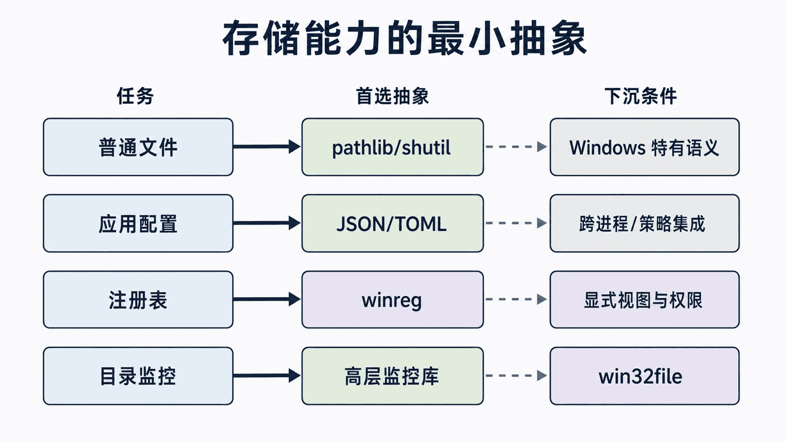
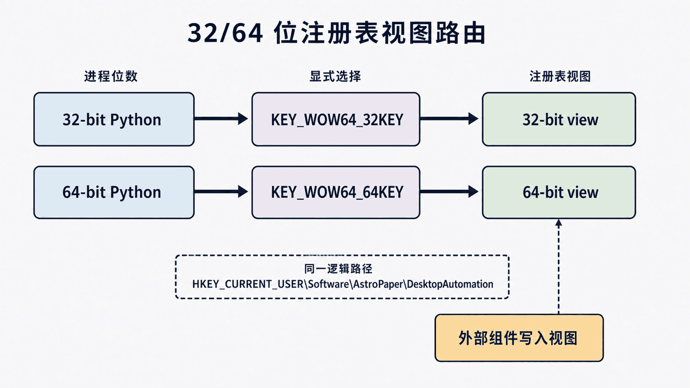
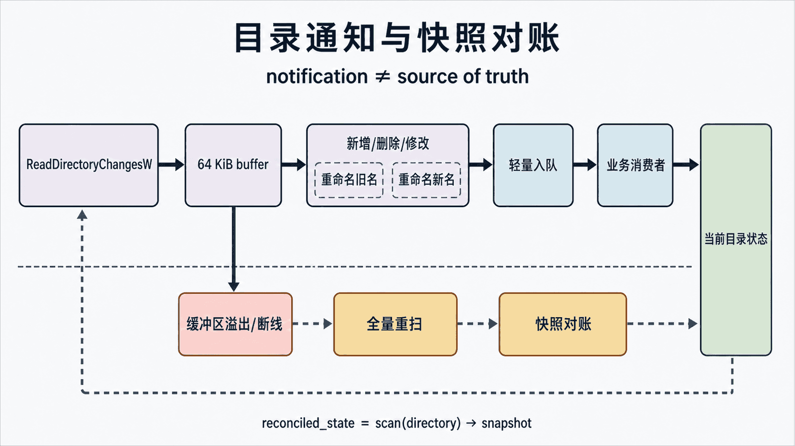

## 前置知识与学习目标

本篇依赖前文的最小权限和句柄释放，只解决：**什么时候使用 Python 标准库，什么时候需要 Windows 的注册表视图与目录通知？**

完成后你应能用 `pathlib` 处理普通文件、用 `winreg` 安全保存当前用户配置、解释 32/64 位注册表视图，并用 `ReadDirectoryChangesW` 获取具体文件变化。示例不会修改系统关键注册表项。

## 先做能力分层

<!-- figure-anchor:s05-a01 -->

<!-- figure:s05-f01:start -->



<!-- figure:s05-f01:end -->

| 任务                     | 首选                 | 下沉到 Win32 的条件                               |
| ------------------------ | -------------------- | ------------------------------------------------- |
| 路径拼接、文本和普通复制 | `pathlib`、`shutil`  | 特殊共享模式、设备路径、原生句柄                  |
| 应用配置文件             | JSON/TOML + 原子替换 | 必须与 Windows 组件共享注册表约定                 |
| 注册表读写               | 标准库 `winreg`      | 需要 pywin32 安全描述符等扩展能力                 |
| 目录监控                 | 高层监控库           | 需要直接控制 `ReadDirectoryChangesW` 缓冲区与标志 |

“Windows 专用项目”也不意味着所有操作都要从标准库下沉。

## 普通文件写入：先保证原子性

贯穿案例要保存记事本自动化输出。写一半崩溃会留下损坏文件，因此先写同目录临时文件，再替换目标：

```python
import os
import tempfile
from pathlib import Path


def atomic_write_text(path: Path, content: str) -> None:
    path.parent.mkdir(parents=True, exist_ok=True)
    fd, temp_name = tempfile.mkstemp(
        dir=path.parent,
        prefix=f".{path.name}.",
        suffix=".tmp",
    )
    temp = Path(temp_name)
    try:
        with os.fdopen(fd, "w", encoding="utf-8", newline="\n") as stream:
            stream.write(content)
            stream.flush()
            os.fsync(stream.fileno())
        os.replace(temp, path)
    except BaseException:
        temp.unlink(missing_ok=True)
        raise
```

输入是目标路径和文本；唯一临时文件避免并发写入共用固定 `.tmp` 名称，`flush` 与 `fsync` 先把文件内容提交给操作系统，再以同目录 `os.replace` 替换目标。在本地文件系统支持原子替换的前提下，读者看到的是旧版本或完整新版本。它仍不是多写者事务：跨卷移动、网络共享、目录元数据持久化和并发覆盖需要额外协议，不能把这个最小实现无限外推。

## 用户级注册表配置

注册表由 hive、key、value name、value type 和 data 组成。普通用户应用优先写 `HKEY_CURRENT_USER`，避免要求管理员权限。

```python
from __future__ import annotations

import winreg


KEY_PATH = r"Software\AstroPaper\DesktopAutomation"
VIEW = winreg.KEY_WOW64_64KEY


def write_output_dir(value: str) -> None:
    access = winreg.KEY_SET_VALUE | VIEW
    with winreg.CreateKeyEx(winreg.HKEY_CURRENT_USER, KEY_PATH, 0, access) as key:
        winreg.SetValueEx(key, "OutputDirectory", 0, winreg.REG_SZ, value)


def read_output_dir(default: str) -> str:
    access = winreg.KEY_QUERY_VALUE | VIEW
    try:
        with winreg.OpenKey(winreg.HKEY_CURRENT_USER, KEY_PATH, 0, access) as key:
            value, value_type = winreg.QueryValueEx(key, "OutputDirectory")
    except FileNotFoundError:
        return default

    if value_type != winreg.REG_SZ or not isinstance(value, str):
        raise TypeError("OutputDirectory must be REG_SZ")
    return value
```

上下文管理器负责关闭 key。读取时同时验证类型，不把任意数据直接当路径使用；后续还要规范化路径并限制到允许目录。

## 32/64 位注册表视图

<!-- figure-anchor:s05-a02 -->

<!-- figure:s05-f02:start -->



<!-- figure:s05-f02:end -->

在 64 位 Windows 上，32 位和 64 位进程可能看到不同视图。代码应显式使用 `KEY_WOW64_64KEY` 或 `KEY_WOW64_32KEY`，并与外部应用的写入视图一致。不要通过“换一个 Python 位数试试”隐式决定业务配置位置。

注册表不是普通配置文件：系统策略、ACL、重定向和审计都会影响结果。机器级 `HKEY_LOCAL_MACHINE` 写入通常需要更高权限，应由安装程序或运维流程管理。

## 目录变更通知

轮询目录会重复扫描，`ReadDirectoryChangesW` 可以返回具体动作和相对路径：

```python
from pathlib import Path

import win32api
import win32con
import win32file


def read_one_batch(directory: Path) -> list[tuple[int, str]]:
    handle = win32file.CreateFile(
        str(directory),
        win32con.FILE_LIST_DIRECTORY,
        win32con.FILE_SHARE_READ
        | win32con.FILE_SHARE_WRITE
        | win32con.FILE_SHARE_DELETE,
        None,
        win32con.OPEN_EXISTING,
        win32con.FILE_FLAG_BACKUP_SEMANTICS,
        None,
    )
    try:
        return win32file.ReadDirectoryChangesW(
            handle,
            64 * 1024,
            True,
            win32con.FILE_NOTIFY_CHANGE_FILE_NAME
            | win32con.FILE_NOTIFY_CHANGE_DIR_NAME
            | win32con.FILE_NOTIFY_CHANGE_LAST_WRITE,
            None,
            None,
        )
    finally:
        win32api.CloseHandle(handle)
```

返回列表项是 `(action, relative_name)`。生产消费者应把 action 映射为新增、删除、修改、重命名旧名/新名，并把相邻重命名事件配对。

## 缓冲区、重命名与恢复策略

<!-- figure-anchor:s05-a03 -->

<!-- figure:s05-f03:start -->



<!-- figure:s05-f03:end -->

目录通知是变化提示，不是永不丢失的事件日志：

- 变化速度超过缓冲区容量时可能溢出；溢出后要全量重扫并重建快照；
- 一个保存动作可能表现为临时文件创建、写入、重命名和删除；
- 重命名通常由旧名和新名两个事件组成；
- 网络共享对缓冲区和断线有额外限制；
- 关闭句柄或取消等待是监控线程的退出协议，不能依赖进程强杀。

示例使用 64 KiB 缓冲区；Microsoft 文档指出网络目录的缓冲区长度不得超过 64 KiB。生产代码还应把“同步阻塞读取如何退出”设计成显式协议，例如由控制线程关闭句柄或改用 overlapped I/O，而不是让工作线程永久卡住。

因此业务层应把通知当作“触发重新核对状态”，而不是直接把每条通知当作唯一事实。

## 安全与失败边界

- 不把密码、令牌或私钥写入普通注册表值；使用 Windows 凭据或受保护存储；
- 读取到的路径必须解析、规范化并验证允许根目录，防止路径穿越；
- 捕获异常时保留 Win32 错误码，但日志不输出敏感数据；
- 删除或覆盖前先验证目标绝对路径仍在预期目录；
- 监控回调中只做轻量入队，耗时处理放到工作线程。

## 最小行为测试

在临时目录启动一次监控，依次创建、修改、重命名和删除文件，断言最终目录快照与预期一致，而不是死板断言每个平台环境下的事件条数。注册表测试只使用专用 HKCU 测试 key，并在 `finally` 中删除测试值。

## 自检题

1. 为什么普通文件写入优先 `pathlib` 而不是 `win32file`？
2. 为什么必须显式选择注册表视图？
3. 目录通知缓冲区溢出后应该怎么做？

<details>
<summary>查看答案</summary>

1. 标准库合同更小、更清晰、更易测试；只有需要 Windows 特有标志或句柄时才下沉。
2. 32 位与 64 位视图可能不同，隐式选择会让不同进程读写到不同位置。
3. 把通知视为不完整，执行全量重扫，与已有快照对账后继续监听。

</details>

## 本篇总结与系列收束

文件与注册表自动化应从最小抽象开始：普通操作用标准库，Windows 特有通知和视图才进入 Win32。至此，pywin32 系列已经连接窗口、进程和存储边界；下一步可在这些明确合同之上组合可观测、可恢复的桌面自动化工作流。

## 资料来源

- [Python winreg 文档](https://docs.python.org/3/library/winreg.html)
- [os.replace](https://docs.python.org/3/library/os.html#os.replace)
- [Obtaining Directory Change Notifications](https://learn.microsoft.com/en-us/windows/win32/fileio/obtaining-directory-change-notifications)
- [ReadDirectoryChangesW function](https://learn.microsoft.com/en-us/windows/win32/api/winbase/nf-winbase-readdirectorychangesw)
