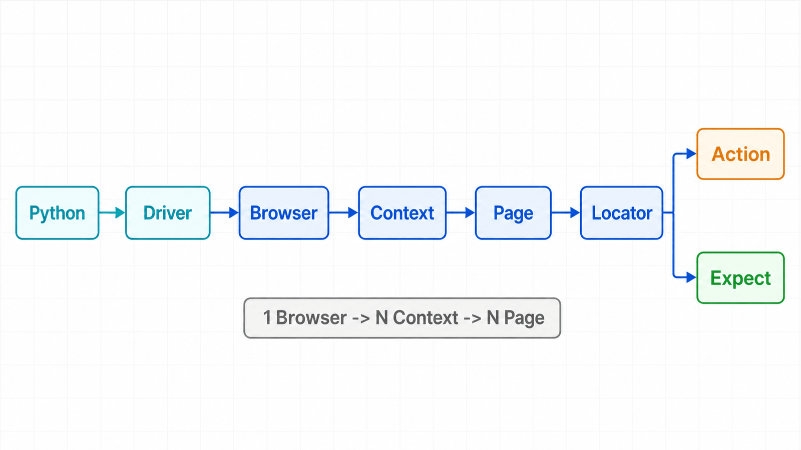

## 前置知识与学习目标

你需要会运行 Python 脚本，并知道 URL、DOM 和 HTTP 请求分别是什么。本系列统一使用 **Python 同步 API**；只有讨论并发边界时才引入异步 API。

学完本篇，你应该能够：

- 解释 Playwright、浏览器进程、`BrowserContext`、`Page` 与 `Locator` 的职责；
- 判断 Playwright 适合端到端测试、动态采集还是业务流程自动化；
- 运行一个资源可正确释放、结果可验证的最小脚本。

贯穿全系列的场景是一套虚构的订单后台：`https://app.example.test`。示例域名不可访问时，代码会使用 `page.set_content()` 构造等价的本地页面。

## 从一个真实问题切入

假设运营每天要登录订单后台，筛选“待审核”订单并导出报表。脚本不仅要“点到按钮”，还必须回答四个问题：操作发生在哪个用户会话？页面重新渲染后是否仍能找到目标？何时算操作成功？失败时留下了什么证据？

Playwright 的价值不是把鼠标动作录成宏，而是用可编程、可等待、可隔离的浏览器对象描述这套过程。

## 核心机制：对象层级与职责

<!-- figure:s01-f01 -->



一次典型执行的调用链是：

```text
Python 脚本
  -> Playwright 驱动与浏览器协议
    -> Browser（浏览器进程）
      -> BrowserContext（隔离会话）
        -> Page（标签页或弹窗）
          -> Locator（可重复求值的元素查询）
            -> Action / Expect（操作与验证）
```

| 对象             | 管理什么                             | 典型生命周期           | 失败时先检查         |
| ---------------- | ------------------------------------ | ---------------------- | -------------------- |
| `Playwright`     | 浏览器类型与驱动连接                 | 整个脚本               | 安装与进程启动       |
| `Browser`        | 一个浏览器进程                       | 一批任务               | 崩溃、版本与资源     |
| `BrowserContext` | Cookie、localStorage、权限等隔离状态 | 一个测试或一个业务账号 | 状态泄漏与凭据       |
| `Page`           | 一个标签页或弹窗                     | 一个页面流程           | 导航、弹窗与页面错误 |
| `Locator`        | 每次操作时重新查找元素的规则         | 某个语义目标           | 唯一性与可操作性     |

`BrowserContext` 类似轻量的无痕配置文件，但它不是新的浏览器进程。多个上下文可以共享一个 `Browser`，同时保持 Cookie、localStorage 等状态隔离。`Locator` 也不是提前缓存的 DOM 节点；页面重渲染后，它会在下一次操作时重新定位。

## 最小可复现示例

下面的例子不依赖外网。输入是一段本地 HTML；关键中间状态是按钮点击后 `status` 文本变化；输出是终端中的 `ready`。

```python
from playwright.sync_api import expect, sync_playwright

HTML = """
<button aria-label="审核订单" onclick="status.textContent='ready'">审核</button>
<p id="status">pending</p>
"""

with sync_playwright() as playwright:
    browser = playwright.chromium.launch()
    context = browser.new_context(locale="zh-CN")
    page = context.new_page()
    page.set_content(HTML)

    page.get_by_role("button", name="审核订单").click()
    status = page.locator("#status")
    expect(status).to_have_text("ready")
    print(status.text_content())

    context.close()
    browser.close()
```

运行前需要安装 Python 包和与该版本配套的浏览器二进制；具体步骤放在第 2 篇。`expect(...).to_have_text()` 会在超时预算内重试，比读取文本后立即 `assert` 更能表达“页面最终进入目标状态”。

## 同步 API 与异步 API 的边界

同步 API 适合顺序业务流程和大多数 pytest 测试，调用结果直接返回。异步 API 适合单进程内调度多个独立 I/O 流程，但每个调用都必须 `await`。两套 API 不应在同一个调用链中混用。

“异步”不会让一个页面上的点击更快，也不会替代上下文隔离。并发数量还受 CPU、内存、目标站点容量和合规规则约束。第 6 篇会专门说明等待与并发。

## 什么时候适用，什么时候不适用

适用：真实浏览器端到端测试、依赖 JavaScript 渲染的页面采集、需要下载/上传/弹窗/网络模拟的 RPA。

不适用：仅调用稳定 HTTP API 时优先使用 HTTP 客户端；桌面原生控件自动化应使用对应平台工具；高并发压测应使用专门的负载测试工具，Playwright 更适合少量真实浏览器的体验测量。

## 常见误区

1. **把 `sleep` 当同步机制。** 固定等待既慢又不可靠，应等待可观察状态。
2. **跨测试复用同一上下文。** 这会造成 Cookie 和页面状态泄漏。
3. **把 `Locator` 当元素快照。** 它是查询计划；若要读取当下值，应显式调用读取方法。
4. **只执行动作，不验证结果。** “没有抛异常”不等于业务成功。
5. **认为无头模式行为永远等同人工浏览。** 字体、GPU、权限和视口差异仍可能改变结果。

## 自检题

1. 为什么多个测试可以共享一个 `Browser`，却通常不应共享一个 `BrowserContext`？
2. 页面重渲染后，`Locator` 为什么通常比缓存的 DOM 句柄可靠？
3. 一个只需调用 JSON API 的任务，为什么不应默认启动浏览器？

<details>
<summary>查看答案</summary>

1. 浏览器进程复用节省启动成本，而上下文承载 Cookie、Storage 和权限；独立上下文能避免状态串扰。
2. `Locator` 在每次动作前重新解析目标，能跟随 DOM 更新；缓存句柄可能已脱离文档。
3. 浏览器成本更高、失败面更大；稳定 API 用 HTTP 客户端更直接、可观测且易重试。

</details>

## 本篇总结

Playwright 的核心不是“模拟点击”，而是用 `Browser -> BrowserContext -> Page -> Locator -> Action/Expect` 建立可隔离、可等待、可验证的浏览器流程。后续所有能力都建立在这条对象链上。

## 下一篇衔接

下一篇把这套心智模型落到可复现环境：为什么 Python 包、浏览器二进制与系统依赖必须作为一个版本合同管理。

## 资料来源

- [Playwright Python：Installation](https://playwright.dev/python/docs/intro)
- [Playwright Python：Isolation](https://playwright.dev/python/docs/browser-contexts)
- [Playwright Python：Locators](https://playwright.dev/python/docs/locators)
