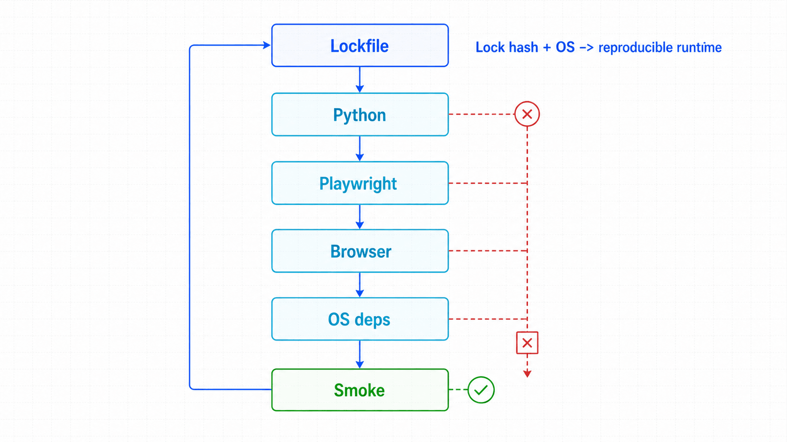

## 前置知识与学习目标

你已经理解 `Browser`、`BrowserContext` 和 `Page` 的层级，并能使用终端。完成本篇后，你应能：

- 解释 Python 包、Playwright 驱动、浏览器二进制和系统依赖之间的版本合同；
- 创建隔离环境并验证 Chromium 能实际启动；
- 设计本地与 CI 使用同一安装入口的项目目录。

## 为什么“pip 安装成功”仍可能不能运行

Playwright Python 包提供 API 和驱动，实际执行页面的是 Playwright 下载并管理的浏览器二进制；Linux 还需要字体、图形和媒体相关系统库。只复制虚拟环境、只缓存浏览器目录，或升级包后不重装浏览器，都可能破坏合同。

<!-- figure:s02-f01 -->



```text
requirements.lock
  -> Python 环境
  -> Playwright 包与驱动
  -> 该版本配套的 Chromium / Firefox / WebKit
  -> 操作系统依赖与字体
  -> 启动验证
```

官方当前系统要求会随版本变化，安装前应以官方 Installation 页面为准，不要把某个历史版本的操作系统清单永久写死在内部文档。

## 推荐目录与唯一安装入口

```text
order-automation/
├── requirements.txt
├── pytest.ini
├── tests/
│   ├── conftest.py
│   └── test_smoke.py
├── src/
│   └── order_bot/
└── artifacts/
```

`requirements.txt` 只保留直接依赖并锁定经验证的版本；升级应通过单独变更完成，而不是每次运行都拉取“最新版”。

```text
playwright==<verified-version>
pytest==<verified-version>
pytest-playwright==<verified-version>
```

`<verified-version>` 是团队测试通过的真实版本，不应原样复制。安装入口保持简单：

```bash
python -m venv .venv

# PowerShell
.venv\Scripts\Activate.ps1

# macOS / Linux
source .venv/bin/activate

python -m pip install --upgrade pip
python -m pip install -r requirements.txt
python -m playwright install chromium
```

Linux CI 或容器可使用：

```bash
python -m playwright install --with-deps chromium
```

只安装实际执行的浏览器能缩小下载量。跨浏览器回归应在 CI 矩阵中明确安装对应浏览器，而不是假设本机缓存存在。

## 最小启动验证

验证目标不是“能 import”，而是浏览器能启动、页面能执行脚本、断言能通过。

```python
from playwright.sync_api import expect, sync_playwright

def main() -> None:
    with sync_playwright() as playwright:
        browser = playwright.chromium.launch()
        page = browser.new_page()
        page.set_content("<h1>environment ready</h1>")
        expect(page.get_by_role("heading")).to_have_text("environment ready")
        print(f"chromium={browser.version}")
        browser.close()

if __name__ == "__main__":
    main()
```

失败边界可按层定位：`ModuleNotFoundError` 属于 Python 环境；“Executable doesn't exist”通常表示浏览器未安装或版本不匹配；Linux 共享库错误属于系统依赖；启动后页面乱码常与字体有关。

## pytest 的最小基线

官方推荐使用 `pytest-playwright` 编写端到端测试。插件提供每个测试独立的 `page` 上下文，避免手工 fixture 错误地共享状态。

```ini
[pytest]
testpaths = tests
addopts = -q --browser chromium
```

```python
from playwright.sync_api import Page, expect

def test_runtime_contract(page: Page) -> None:
    page.set_content("<button>导出订单</button>")
    expect(page.get_by_role("button", name="导出订单")).to_be_visible()
```

运行：

```bash
pytest
```

## 缓存、代理与容器边界

- 浏览器缓存只能加速安装，不能替代锁定依赖；缓存键至少应包含操作系统和依赖锁文件哈希。
- 企业代理应通过受控环境变量或 CI Secret 配置，不要把凭据写入仓库。
- 官方容器镜像方便提供系统依赖，但镜像版本仍应与项目 Playwright 版本匹配。
- 认证状态文件可能包含可复用 Cookie，必须加入 `.gitignore`，不能当普通 fixture 提交。

## 常见误区与不适用边界

1. **全局安装方便。** 它让多个项目互相覆盖依赖，降低复现性。
2. **手工指定浏览器内部版本。** 应让当前 Playwright 版本管理配套二进制。
3. **升级 Python 包但沿用旧缓存。** 应重新执行浏览器安装并运行冒烟测试。
4. **把开发机目录整体复制进容器。** 平台相关二进制和路径通常不可移植。
5. **每次构建都无条件安装全部浏览器。** 只需要 Chromium 的流水线不必支付三套浏览器成本。

## 自检题

1. 为什么 `pip install playwright` 和 `playwright install chromium` 是两个步骤？
2. 浏览器启动报缺少共享库时，应修改 Python 代码吗？
3. CI 浏览器缓存命中后，为什么仍要运行冒烟测试？

<details>
<summary>查看答案</summary>

1. 前者安装 Python API/驱动，后者安装该版本配套的浏览器二进制。
2. 不应；这是系统依赖层问题，应使用 `--with-deps`、受支持镜像或补齐系统库。
3. 缓存只说明文件存在，不能证明版本、权限、系统库和字体合同仍有效。

</details>

## 本篇总结

可复现环境由依赖锁、浏览器二进制、系统依赖和启动验证共同构成。把它们收敛到同一安装入口，才能让本地、容器和 CI 的行为可比较。

## 下一篇衔接

环境稳定后，下一篇进入运行时隔离：如何用 `BrowserContext` 表达账号边界，并安全处理多标签页、弹窗、iframe 与认证状态。

## 资料来源

- [Playwright Python：Installation](https://playwright.dev/python/docs/intro)
- [Playwright Python：Browsers](https://playwright.dev/python/docs/browsers)
- [Playwright Python：Continuous Integration](https://playwright.dev/python/docs/ci)
