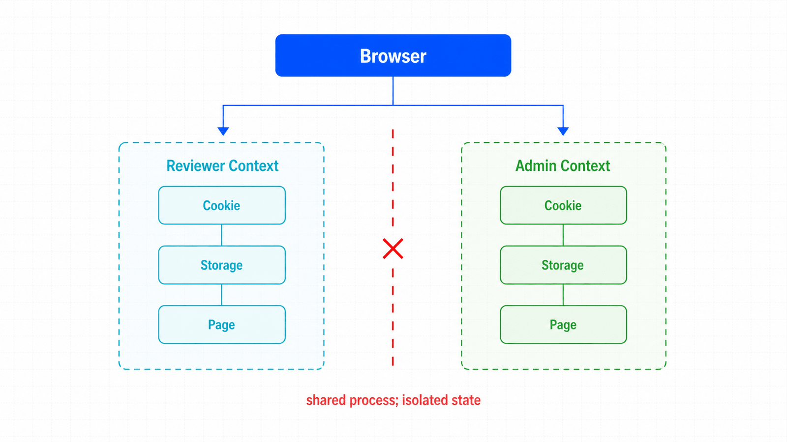
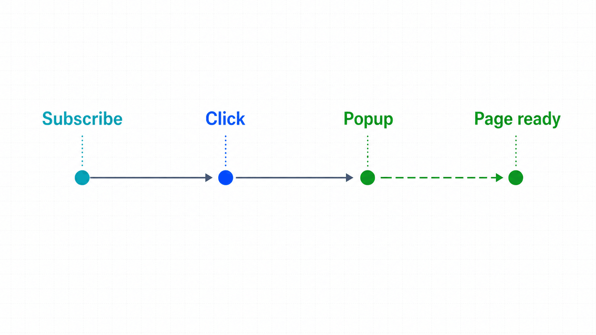

## 前置知识与学习目标

你应已完成环境冒烟测试，并理解对象层级。学完本篇后，你能够：

- 用独立 `BrowserContext` 模拟不同账号，而不启动多个浏览器进程；
- 正确保存与加载认证状态，识别其中的敏感信息；
- 在触发动作前注册新页面、弹窗和下载等事件等待；
- 区分 `Page`、`FrameLocator` 与对话框。

## 真实场景：审核员与管理员同时操作

订单后台中，审核员提交订单，管理员在另一会话批准。两个角色必须共享同一测试进程，却不能共享 Cookie 或 localStorage。一个 `Browser` 下创建两个上下文正好表达这个边界。

<!-- figure:s03-f01 -->



```python
from playwright.sync_api import sync_playwright

with sync_playwright() as playwright:
    browser = playwright.chromium.launch()
    reviewer = browser.new_context(locale="zh-CN")
    admin = browser.new_context(locale="zh-CN")

    reviewer_page = reviewer.new_page()
    admin_page = admin.new_page()
    # 两个页面的 Cookie、Storage 与权限相互隔离。

    reviewer.close()
    admin.close()
    browser.close()
```

每个测试从新上下文开始，比“执行清理脚本后复用上下文”可靠，因为 visited links、Service Worker 或漏删的存储状态不一定能彻底恢复。

## 认证状态：保存、加载与安全边界

登录完成后保存状态：

```python
page.goto("https://app.example.test/login")
page.get_by_label("邮箱").fill("reviewer@example.test")
page.get_by_label("密码").fill("<from-secret-store>")
page.get_by_role("button", name="登录").click()
page.wait_for_url("**/orders")
context.storage_state(path="playwright/.auth/reviewer.json")
```

新建上下文时加载，而不是在已创建的上下文上“恢复”：

```python
context = browser.new_context(
    storage_state="playwright/.auth/reviewer.json",
    locale="zh-CN",
)
```

状态文件可能包含能冒充账号的 Cookie 或请求头，必须放入 `.gitignore`，只使用权限最小化的测试账号，并设置过期与轮换策略。`storage_state` 覆盖 Cookie、localStorage 和可选 IndexedDB；`sessionStorage` 需要单独处理，不要误认为会自动持久化。

## 页面、弹窗与事件时序

一个上下文可包含多个 `Page`。每个页面都可以直接交互，不需要人工式“切换焦点”。关键是先建立事件等待，再执行触发动作，否则快速事件可能已经发生。

```python
with context.expect_page() as page_info:
    reviewer_page.get_by_role("link", name="打开订单详情").click()

detail_page = page_info.value
detail_page.wait_for_load_state("domcontentloaded")
print(detail_page.url)
```

若只关心当前页触发的弹窗，可使用 `page.expect_popup()`。未知来源的新页可监听 `context.on("page", handler)`，但事件回调会分叉控制流，业务步骤优先使用 `expect_*` 形式。

<!-- figure:s03-f02 -->



## iframe 与对话框不是新页面

iframe 属于当前页面的 frame 树，优先用 `frame_locator()` 保持定位器的重试能力：

```python
payment = page.frame_locator("iframe[title='付款信息']")
payment.get_by_label("卡号").fill("4242 4242 4242 4242")
```

JavaScript `alert`、`confirm` 和 `prompt` 是对话框事件，不是 `Page`。明确注册处理器：

```python
page.once("dialog", lambda dialog: dialog.accept("approved"))
page.get_by_role("button", name="确认审批").click()
```

如果监听了 `dialog` 却既不接受也不拒绝，触发动作会等待对话框关闭而卡住。

## 资源生命周期与失败边界

推荐顺序：创建 `Browser`，为每个账号/测试创建上下文，在上下文中创建页面，最后先关闭上下文再关闭浏览器。任务失败时也必须清理：

```python
browser = playwright.chromium.launch()
context = browser.new_context()
try:
    page = context.new_page()
    page.set_content("<h1>订单后台</h1>")
    # 执行业务步骤
finally:
    context.close()
    browser.close()
```

在 pytest 中优先使用插件提供的 `page` fixture，让测试函数结束时自动回收上下文。不要在模块级变量中保存 `Page`。

## 常见误区与适用边界

1. **`browser.new_page()` 等同显式上下文。** 它会隐式创建上下文，简单脚本可用，但复杂流程难以管理状态边界。
2. **在旧上下文调用 `storage_state(path=...)` 就能加载。** 该方法保存当前状态；加载应发生在 `browser.new_context(storage_state=...)`。
3. **新标签页必须 `bring_to_front()` 才能操作。** Playwright 页面无需前台焦点即可工作。
4. **iframe 可用 `page.get_by_*` 直接跨越。** 定位不会自动穿过 frame 边界，应使用 `frame_locator()`。
5. **所有账号共用一份认证状态。** 权限边界被抹平后，测试无法证明角色隔离。

## 自检题

1. 多角色场景为什么应创建多个上下文而不是多个页面？
2. 为什么 `expect_page()` 必须包住触发点击？
3. 认证状态文件为何不能提交到私有仓库？

<details>
<summary>查看答案</summary>

1. 页面共享所属上下文的 Cookie 与 Storage；多个上下文才能表达独立账号。
2. 先订阅事件才能避免新页面在订阅前快速创建而丢失。
3. 私有仓库仍可能被更多人、CI 或日志访问；状态文件可能直接提供账号会话能力。

</details>

## 本篇总结

上下文是会话与权限的隔离单元，页面是交互单元，frame 和 dialog 则有各自边界。正确的创建、事件等待和销毁顺序，是后续定位与交互稳定性的前提。

## 下一篇衔接

下一篇聚焦 `Locator`：如何把“某个 DOM 节点”改写成用户可感知、可维护且具备严格性检查的定位合同。

## 资料来源

- [Playwright Python：Isolation](https://playwright.dev/python/docs/browser-contexts)
- [Playwright Python：Authentication](https://playwright.dev/python/docs/auth)
- [Playwright Python：Pages](https://playwright.dev/python/docs/pages)
- [Playwright Python：Frames](https://playwright.dev/python/docs/frames)
