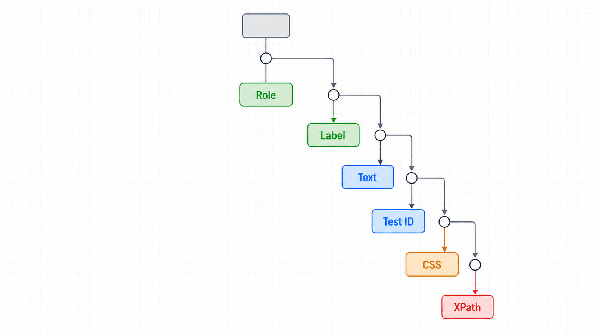
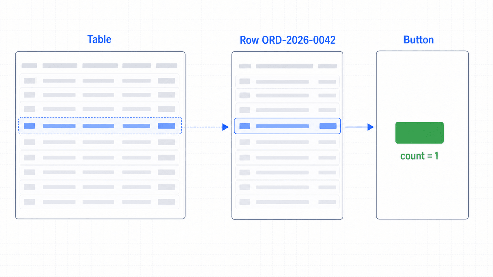

## 前置知识与学习目标

你应理解 `Page` 与 frame 边界。完成本篇后，你应能：

- 按 role、label、text、test id、CSS 的顺序选择稳定定位方式；
- 解释 `Locator` 的延迟求值、自动等待与严格性；
- 用链式定位和 `filter()` 将范围缩到唯一目标；
- 识别 XPath、长 CSS 路径和 `.nth()` 的脆弱边界。

## 场景：列表中有十二个“审核”按钮

订单后台每行都有“审核”。`page.get_by_role("button", name="审核")` 会匹配多个元素，点击时触发严格性错误。这不是障碍，而是定位合同不完整的信号：我们还没有说明要审核哪一笔订单。

<!-- figure:s04-f01 -->



## Locator 的三个关键性质

1. **延迟求值：** 创建 Locator 不立即查询 DOM；执行动作或读取时才定位。
2. **可重试：** 动作前会重新定位，页面重渲染后仍可命中新节点。
3. **严格性：** 对单目标动作，匹配多个元素会报错，迫使测试明确业务语义。

```python
row = page.get_by_role("row").filter(has_text="ORD-2026-0042")
approve = row.get_by_role("button", name="审核")
approve.click()
```

这段代码表达的是“订单 0042 所在行中的审核按钮”，而不是“页面中第三个按钮”。

## 定位策略的决策顺序

| 优先级 | 定位方式                | 适合对象               | 稳定来源                 |
| ------ | ----------------------- | ---------------------- | ------------------------ |
| 1      | `get_by_role(name=...)` | 按钮、链接、标题、表格 | 用户与辅助技术看到的语义 |
| 2      | `get_by_label()`        | 表单控件               | 可访问标签               |
| 3      | `get_by_text()`         | 非交互内容             | 可见文本                 |
| 4      | `get_by_test_id()`      | 文案频繁变化的稳定合同 | 开发与测试共同维护的属性 |
| 5      | `locator("css")`        | 无语义的结构或遗留页面 | DOM 结构                 |
| 最后   | XPath / `.nth()`        | 无法改造的遗留页面     | 位置或层级，最易漂移     |

角色定位应同时给出可访问名称：

```python
page.get_by_role("button", name="导出订单").click()
page.get_by_label("订单编号").fill("ORD-2026-0042")
page.get_by_text("审核成功", exact=True)
```

`get_by_text()` 会规范化空白；交互元素优先用 role，因为它还能暴露错误的 HTML 语义。test id 很稳定，但它不证明用户能看到或理解该控件。

## 链式缩小与关系定位

列表、卡片和表格优先先确定容器，再找容器内的目标：

```python
orders = page.get_by_role("table", name="订单列表")
row = orders.get_by_role("row").filter(has_text="ORD-2026-0042")

expect(row).to_contain_text("待审核")
row.get_by_role("button", name="审核").click()
```

若容器必须包含另一个 Locator，可使用 `has=`：

```python
target = page.get_by_role("row").filter(
    has=page.get_by_role("cell", name="ORD-2026-0042")
)
```

frame 中的 Locator 不能直接从页面链入，必须先进入 `frame_locator()`。Shadow DOM 通常可被 Locator 穿透，但 XPath 不会穿透 Shadow Root，这也是避免 XPath 的原因之一。

<!-- figure:s04-f02 -->



## 严格性与计数验证

先用 `expect(locator).to_have_count(1)` 可以把“唯一性”变成显式合同：

```python
from playwright.sync_api import expect

approve = row.get_by_role("button", name="审核")
expect(approve).to_have_count(1)
approve.click()
```

`.first`、`.last` 和 `.nth()` 能绕开严格性，但只有当顺序本身就是业务规则时才合理，例如“最新一条按创建时间降序显示”的合同已经由测试验证。否则它们只是隐藏歧义。

## 调试与失败边界

- `playwright codegen <url>` 可生成起点，但生成结果仍需按业务语义整理。
- 有头调试配合 `PWDEBUG=1 pytest -s` 可观察 Locator 命中与动作日志。
- 失败信息中的 resolved locator、匹配数量和 actionability 日志比截图更适合定位选择器问题。
- 列表内容持续刷新时，不要先读取所有 `ElementHandle` 再逐个操作；保留 Locator 关系。

## 常见误区与不适用边界

1. **CSS 越精确越稳定。** 长层级选择器对 DOM 重构极其敏感。
2. **文本定位总是首选。** 按钮和链接应优先 role；多语言站点可使用 test id 合同。
3. **严格性错误用 `.first` 修复。** 应先补足订单号、容器或关系语义。
4. **可访问名称等于元素文本。** 它还可能来自 label、`aria-label` 或关联描述。
5. **Locator 能替代可访问性审计。** role 定位只是早期反馈，不是完整合规测试。

## 自检题

1. 为什么 `get_by_role()` 往往比 `.btn-primary` 稳定？
2. 一个 Locator 匹配三个按钮时，为什么直接 `.nth(0)` 通常不合适？
3. test id 与 role 各自保护什么合同？

<details>
<summary>查看答案</summary>

1. role 表达用户可感知的功能，通常不随 CSS 重构变化。
2. 它把未定义的顺序当业务规则；列表插入或排序变化后可能点错对象。
3. test id 保护开发与自动化之间的稳定技术合同，role 保护用户语义与可访问名称合同。

</details>

## 本篇总结

稳定定位的目标不是“写出能匹配的字符串”，而是明确目标的用户语义、所在范围和唯一性。Locator 把这些合同与自动等待、重试结合起来。

## 下一篇衔接

下一篇在稳定 Locator 上执行点击、输入、选择、上传和拖拽，并拆解动作执行前的 actionability 检查。

## 资料来源

- [Playwright Python：Locators](https://playwright.dev/python/docs/locators)
- [Playwright Python：Auto-waiting](https://playwright.dev/python/docs/actionability)
- [Playwright Python：Test generator](https://playwright.dev/python/docs/codegen)
