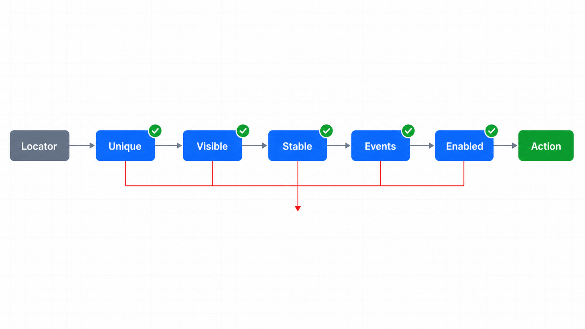
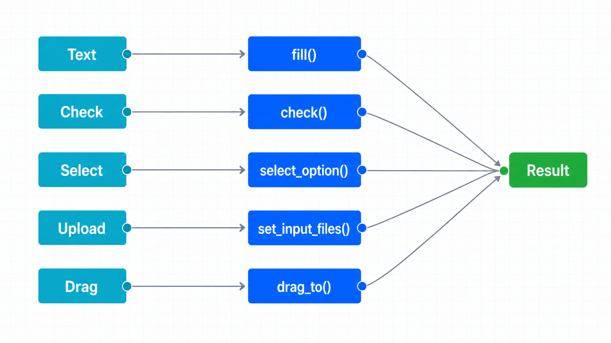

## 前置知识与学习目标

你应能写出唯一、稳定的 Locator。完成本篇后，你可以：

- 解释点击前的可见、稳定、接收事件、启用等检查；
- 为文本、复选框、下拉框、键盘、文件与拖拽选择正确 API；
- 判断 `force=True`、低级鼠标坐标和逐字输入何时才合理；
- 用业务状态而不是“动作无异常”验证结果。

## 点击不是一个瞬时调用

订单后台的“审核”按钮可能正在动画、被遮罩覆盖或处于禁用状态。`locator.click()` 会先解析唯一元素，再等待该动作要求的 actionability 条件，必要时滚入视口，最后发出输入事件。

<!-- figure:s05-f01 -->



```text
Locator 唯一命中
 -> Visible
 -> Stable
 -> Receives Events
 -> Enabled
 -> 滚入视口
 -> 输入事件
 -> 等待关联导航（若发生）
```

不同动作的检查集合不同，例如 `fill()` 要求元素可见、可编辑且启用；断言也有自己的重试机制。超时日志会列出未满足的检查，优先修复页面状态或同步条件，不要立即使用 `force=True`。

## 用专用 API 表达用户意图

```python
# 文本、日期与时间
page.get_by_label("订单备注").fill("资料已核验")
page.get_by_label("审核日期").fill("2026-07-15")

# 复选框与单选框
page.get_by_label("确认已阅读风控提示").check()
page.get_by_label("人工复核").set_checked(True)

# 原生 select
page.get_by_label("审核结果").select_option(label="通过")

# 键盘快捷键
page.get_by_label("订单备注").press("ControlOrMeta+Enter")
```

`fill()` 会设置值并触发 `input` 事件，适合大多数输入框。只有页面依赖真实逐键事件、组合输入或快捷键时才用 `press_sequentially()` 或 `press()`；把每个输入都改成逐字输入只会降低速度并增加失败面。

## 一个可运行的表单状态示例

输入是订单号与审核结果；关键中间状态是复选框已勾选；输出是 `status=approved`。

```python
from playwright.sync_api import expect, sync_playwright

HTML = """
<label>订单号 <input aria-label="订单号"></label>
<label><input type="checkbox" aria-label="确认资料完整">确认资料完整</label>
<button onclick="status.textContent='approved'">提交审核</button>
<p id="status">draft</p>
"""

with sync_playwright() as playwright:
    browser = playwright.chromium.launch()
    page = browser.new_page()
    page.set_content(HTML)

    page.get_by_label("订单号").fill("ORD-2026-0042")
    page.get_by_label("确认资料完整").check()
    page.get_by_role("button", name="提交审核").click()

    expect(page.get_by_label("确认资料完整")).to_be_checked()
    expect(page.locator("#status")).to_have_text("approved")
    browser.close()
```

如果按钮点击成功但业务状态没有变化，问题可能在接口失败或前端逻辑，而不是点击本身。第 6 篇会讨论如何等待精确结果。

## 文件上传与拖拽

原生文件输入使用 `set_input_files()`，无需打开操作系统文件选择器：

```python
from pathlib import Path

invoice = Path("fixtures/invoice.pdf").resolve()
page.get_by_label("上传发票").set_input_files(invoice)

# 清空选择
page.get_by_label("上传发票").set_input_files([])
```

如果点击按钮后才动态创建 `<input type=file>`，可使用 `page.expect_file_chooser()` 包住点击。业务上还要验证文件名、上传进度和服务端结果，而不只是文件输入框有值。

元素间拖拽优先使用：

```python
page.get_by_test_id("order-0042").drag_to(
    page.get_by_test_id("approved-column")
)
```

坐标级 `page.mouse` 适合画布、地图等没有 DOM 语义的控件；它对布局与缩放敏感，应记录视口并配套结果断言。

<!-- figure:s05-f02 -->



## `force=True` 与 JavaScript 注入的边界

强制点击会跳过部分 actionability 检查，可能点击一个真实用户无法点击的元素。只有在验证底层事件处理、已知非关键遮挡或遗留控件无法改造时使用，并在代码旁说明原因。

直接 `page.evaluate("element.click()")` 绕开了真实输入链路，不应作为常规端到端交互。它更适合读取浏览器 API、构造测试前置状态或验证无法通过 UI 表达的底层逻辑。

## 常见误区与适用边界

1. **每次点击前手工 `wait_for_selector()`。** Locator 动作已包含相关自动等待，重复等待会增加时间和认知负担。
2. **输入失败就 `force=True`。** `fill()` 失败通常意味着不可编辑、被禁用或定位错误，强制不会修复业务问题。
3. **上传通过操作系统窗口。** 原生文件输入可直接设置文件；系统窗口超出页面自动化边界。
4. **拖拽只验证没有异常。** 应验证目标列、排序或后端状态确实改变。
5. **用鼠标坐标操作普通按钮。** 坐标与布局耦合，优先 Locator 动作。

## 自检题

1. `click()` 超时日志显示元素被遮罩拦截事件，应先做什么？
2. 为什么普通文本输入优先 `fill()` 而不是逐字键入？
3. 文件输入已显示文件名，是否足以证明上传成功？

<details>
<summary>查看答案</summary>

1. 找到遮罩消失的业务条件或修复页面状态；不要先强制点击。
2. `fill()` 更直接、快速，并正确触发输入事件；逐字键入只用于依赖逐键行为的控件。
3. 不足；还要等待上传请求或成功状态，并验证服务端结果。

</details>

## 本篇总结

可靠交互由“语义 Locator + actionability + 专用输入 API + 业务结果断言”组成。动作只是状态转换的触发器，不是成功证据。

## 下一篇衔接

下一篇拆解时间问题：哪些等待 Playwright 已经完成，哪些事件必须先监听，以及如何把全局超时改造成可诊断的预算。

## 资料来源

- [Playwright Python：Actions](https://playwright.dev/python/docs/input)
- [Playwright Python：Auto-waiting](https://playwright.dev/python/docs/actionability)
- [Playwright Python：Navigations](https://playwright.dev/python/docs/navigations)
