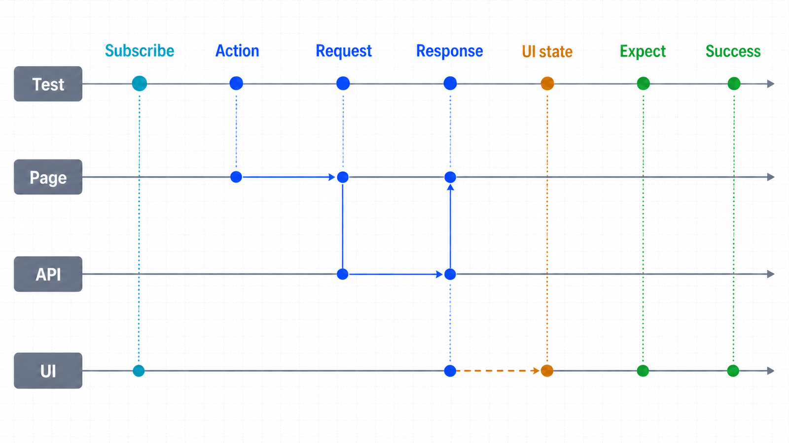
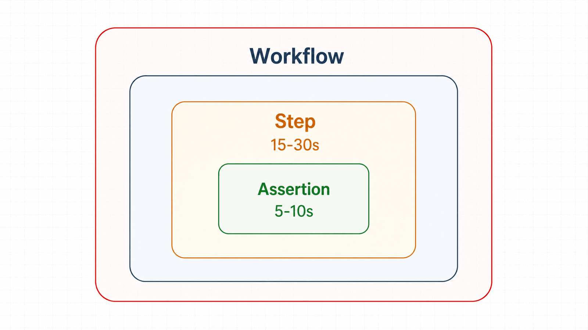

## 前置知识与学习目标

你应理解 Locator 的可操作性检查。完成本篇后，你能够：

- 区分动作自动等待、断言重试、事件等待和自定义业务等待；
- 用“触发动作前订阅事件”消除快速响应竞态；
- 为步骤、断言和整体流程设置分层超时；
- 判断同步 API、异步 API 与并发控制的边界。

## 固定等待为什么会让脚本又慢又不稳定

订单提交可能 80 毫秒完成，也可能因为队列拥塞耗时 4 秒。`time.sleep(2)` 在第一种情况浪费时间，在第二种情况提前结束。正确等待的对象不是时间，而是业务可观察状态：成功提示、目标 URL、特定响应或状态字段。

<!-- figure:s06-f01 -->



## 四层等待模型

| 层级     | 解决的问题                     | 首选方式                                                     |
| -------- | ------------------------------ | ------------------------------------------------------------ |
| 动作等待 | 元素现在能否安全操作           | `locator.click()` / `fill()` 内置等待                        |
| 结果等待 | 页面最终是否达到预期           | `expect(locator/page)` Web-first 断言                        |
| 事件等待 | 某动作是否触发响应、弹窗、下载 | `expect_response()` / `expect_popup()` / `expect_download()` |
| 业务等待 | 多个信号或后台状态何时完成     | `expect.poll`（测试插件能力）或有界轮询                      |

不要在每层重复等待同一信号。例如按钮 `click()` 前通常无需再等待它可见；点击后应等待“审核成功”而不是再次等待按钮。

## 事件必须先订阅，再触发

```python
with page.expect_response(
    lambda response: response.url.endswith("/api/orders/0042/approve")
    and response.request.method == "POST"
) as response_info:
    page.get_by_role("button", name="确认审核").click()

response = response_info.value
assert response.ok, f"status={response.status}"
```

`expect_response()` 的上下文先注册监听，内部点击再触发请求，退出时取得结果。先点击再 `wait_for_response` 会留下竞态窗口；响应足够快时监听永远等不到。

对于 UI 最终状态，继续使用重试断言：

```python
from playwright.sync_api import expect

expect(page.get_by_role("status")).to_have_text("审核成功", timeout=10_000)
```

接口成功不一定意味着 UI 已渲染，UI 成功也不应掩盖异常 HTTP 状态。高风险流程可同时验证两类信号。

<!-- figure:s06-f02 -->



## 导航与 `networkidle` 的边界

`page.goto()` 会等待所选加载状态，但现代应用常在加载事件之后继续请求数据。不要把 `networkidle` 当“页面可用”的通用定义：长轮询、分析脚本和 WebSocket 可能让网络永不空闲，而业务控件早已可用。

```python
page.goto("https://app.example.test/orders", wait_until="domcontentloaded")
expect(page.get_by_role("heading", name="订单列表")).to_be_visible()
```

页面可用性的定义应由业务合同给出，例如标题可见、关键请求成功和表格行出现。

## 超时预算，而不是一个巨大默认值

建议分三层：单个断言 5–10 秒、单个高风险步骤 15–30 秒、完整业务流程有独立总预算。过大的统一超时会让错误很晚才暴露，过小则把正常尾延迟当失败。

```python
page.set_default_timeout(8_000)
page.set_default_navigation_timeout(15_000)
expect(page.get_by_role("status")).to_have_text(
    "审核成功",
    timeout=12_000,
)
```

超时发生时记录：等待的信号、已耗时、当前 URL、关键 Locator 状态、最近响应以及截图/trace。重试应针对可分类的瞬时失败，并有次数上限；定位错误和权限错误重试多少次都不会变好。

## 异步 API 与并发控制

异步 API 的意义是让同一事件循环调度多个独立 I/O 任务：

```python
import asyncio
from playwright.async_api import async_playwright

async def inspect(browser, url: str, semaphore: asyncio.Semaphore) -> str:
    async with semaphore:
        context = await browser.new_context()
        try:
            page = await context.new_page()
            await page.goto(url, wait_until="domcontentloaded")
            return await page.title()
        finally:
            await context.close()

async def main() -> None:
    async with async_playwright() as playwright:
        browser = await playwright.chromium.launch()
        semaphore = asyncio.Semaphore(3)
        titles = await asyncio.gather(
            *(inspect(browser, url, semaphore) for url in ["https://example.com"] * 3)
        )
        print(titles)
        await browser.close()

asyncio.run(main())
```

这里的 Shape 是 `3 个 URL -> 最多 3 个并发 context -> 3 个标题字符串`。并发上限必须考虑内存、站点服务能力、账号限流和合规要求。不要在线程中共享同步 API 对象，也不要在异步函数里调用同步 Playwright。

## 常见误区与不适用边界

1. **遇到偶发失败就加 `sleep`。** 应识别真实完成信号。
2. **`networkidle` 等于业务完成。** 网络安静与界面可用不是同一合同。
3. **所有超时都设为 120 秒。** 这会掩盖错误位置和性能退化。
4. **请求失败统一重试。** 401、参数错误、定位错误通常不可重试。
5. **异步等于无限并发。** 浏览器资源与目标系统都需要背压。

## 自检题

1. 为什么要用 `with page.expect_response(): click()` 而不是先 click？
2. 页面有持续 WebSocket 时，为什么 `networkidle` 可能永远不满足？
3. 一个 401 响应适合自动重试吗？

<details>
<summary>查看答案</summary>

1. 先订阅能消除快速响应发生在监听之前的竞态。
2. 持续连接或请求使“网络空闲”无法代表业务完成。
3. 通常不适合；应刷新认证或终止并报告权限问题，而不是盲目重试。

</details>

## 本篇总结

稳定等待来自对完成信号的精确定义：动作等待保证可操作，断言等待最终状态，事件等待捕获因果关系，超时预算保证失败可诊断。

## 下一篇衔接

下一篇把等待结果组织成自动化测试：如何设计 Web-first 断言、fixture、失败证据和最小回归集。

## 资料来源

- [Playwright Python：Auto-waiting](https://playwright.dev/python/docs/actionability)
- [Playwright Python：Navigations](https://playwright.dev/python/docs/navigations)
- [Playwright Python：Network](https://playwright.dev/python/docs/network)
