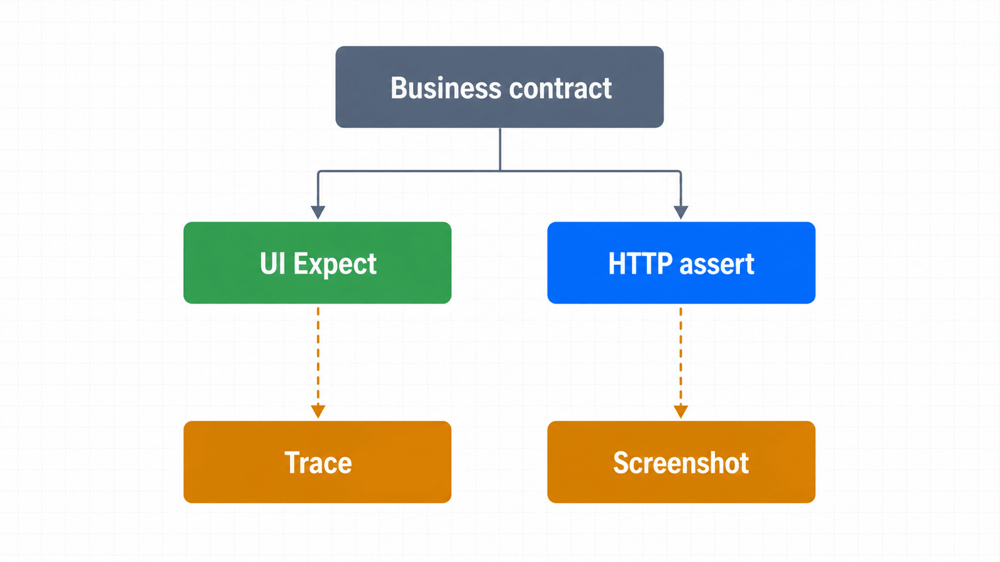
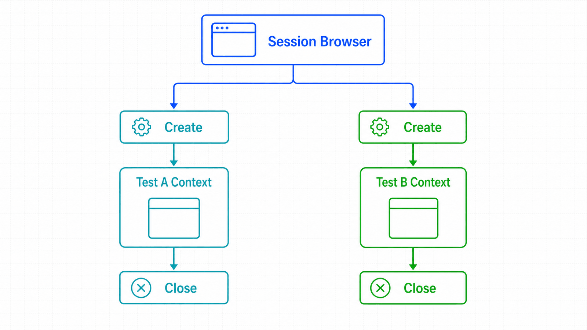

## 前置知识与学习目标

你应能为动作选择精确的完成信号。完成本篇后，你能够：

- 区分会重试的 Playwright `expect` 与立即求值的 Python `assert`；
- 用 pytest 的 `page` fixture 保证每个测试上下文隔离；
- 设计可读的 Given–When–Then 测试和轻量页面对象；
- 在失败时保留 trace、截图和业务标识，而不泄露敏感信息。

## 测试的核心不是步骤，而是合同

订单审核测试要证明：给定一个待审核订单，审核员提交后，订单状态最终变为“已通过”，且页面发出正确请求。只写“填写、点击、关闭浏览器”无法说明成功条件。

<!-- figure:s07-f01 -->



## Web-first 断言与立即断言

```python
from playwright.sync_api import expect

# 会在超时内反复解析 Locator 并检查文本
expect(page.get_by_test_id("order-status")).to_have_text("已通过")

# 立即读取一次；页面稍后更新就会误报
assert page.get_by_test_id("order-status").text_content() == "已通过"
```

页面状态、URL、可见性、数量和值优先使用 `expect`。对已经取得的纯 Python 数据、HTTP 状态码或业务计算，可使用 `assert`。断言应尽量接近用户可见结果，同时为关键请求保留协议级验证。

## 最小端到端测试

```python
from playwright.sync_api import Page, expect

def test_reviewer_can_approve_order(page: Page) -> None:
    # Given
    page.set_content("""
      <button aria-label="审核 ORD-2026-0042"
              onclick="status.textContent='已通过'">审核</button>
      <p data-testid="order-status">待审核</p>
    """)

    # When
    page.get_by_role("button", name="审核 ORD-2026-0042").click()

    # Then
    expect(page.get_by_test_id("order-status")).to_have_text("已通过")
```

输入是一个待审核订单页面；动作是审核；关键状态从“待审核”转为“已通过”；失败会在断言日志中给出实际文本和重试过程。这个代码块可在安装 `pytest-playwright` 后独立运行。

## fixture 与隔离

官方 pytest 插件为每个测试提供新的上下文和 `page`。会话级浏览器可以复用，但测试状态不复用：

```python
def test_a(page):
    page.set_content("<p>clean A</p>")

def test_b(page):
    page.set_content("<p>clean B</p>")
```

需要通用上下文参数时使用插件的 `browser_context_args` fixture，而不是重新定义一个与插件同名的 `page` 并手工管理浏览器。认证状态可通过受控 fixture 加载，但不同角色必须使用不同状态文件。

<!-- figure:s07-f02 -->



## 页面对象只封装业务语言

```python
class OrdersPage:
    def __init__(self, page):
        self.page = page

    def approve(self, order_id: str) -> None:
        row = self.page.get_by_role("row").filter(has_text=order_id)
        row.get_by_role("button", name="审核").click()

    def expect_status(self, order_id: str, status: str) -> None:
        row = self.page.get_by_role("row").filter(has_text=order_id)
        expect(row.get_by_test_id("order-status")).to_have_text(status)
```

页面对象应保留 `Locator`，不要在构造函数中缓存元素句柄；方法名表达业务动作，不要把每个 `click` 再包装一层。断言放在测试还是页面对象都可以，但团队应统一，以便失败信息易定位。

## 正向、负向与软断言

负向断言要定义时间语义。“元素此刻不存在”与“5 秒内始终未出现”不是同一件事。对安全提示、重复提交等关键负向行为，应使用明确超时并避免过短窗口。

软断言允许继续收集多个问题，但最终测试仍失败。它适合同一页面的非依赖检查，不适合登录失败后继续执行后续业务，因为后续错误只是级联噪声。软断言能力依赖支持的 pytest-playwright 版本，使用前锁定并验证插件版本。

## 失败证据与调试路径

推荐证据优先级：断言调用日志 -> trace -> 关键截图 -> 控制台/网络摘要。trace 可回放动作前后 DOM、网络和时间线，通常比单张截图更能解释竞态。

CI 中只在失败或首次重试保留 trace，避免体积失控。截图和日志必须遮蔽密码、令牌、个人信息与完整认证状态。为每次任务记录 `run_id` 和业务订单 ID，便于串联应用日志。

## 常见误区与适用边界

1. **所有检查都用 Python `assert`。** 动态 UI 需要可重试断言。
2. **一个测试覆盖完整一天业务。** 测试过长会增加诊断和清理成本，应按独立业务结果切分。
3. **测试之间依赖执行顺序。** 这会破坏并行和单测重跑。
4. **失败自动重试到通过就算成功。** 重试通过仍是稳定性信号，应统计并治理。
5. **截图包含全部页面最方便。** 可能泄露敏感数据，应按证据最小化原则采集。

## 自检题

1. 页面状态异步更新时，为什么 `expect(...).to_have_text()` 优于读取后 `assert`？
2. 为什么一个测试失败后不应污染下一个测试？
3. trace 与截图相比，额外提供了什么？

<details>
<summary>查看答案</summary>

1. 前者会在预算内重新定位和检查，表达最终一致状态。
2. 独立上下文让失败可单独复现，也允许任意顺序和并行。
3. trace 提供动作时间线、DOM 快照、网络与调用信息，可解释因果过程。

</details>

## 本篇总结

可维护测试由隔离的前置条件、语义动作、Web-first 结果断言和最小失败证据组成。重试不是成功标准，而是需要治理的稳定性指标。

## 下一篇衔接

下一篇处理证据与文件边界：截图、PDF、上传和下载文件在上下文关闭前后如何保存、验证与清理。

## 资料来源

- [Playwright Python：Writing tests](https://playwright.dev/python/docs/writing-tests)
- [Playwright Python：Assertions](https://playwright.dev/python/docs/test-assertions)
- [Playwright Python：Trace viewer](https://playwright.dev/python/docs/trace-viewer)
