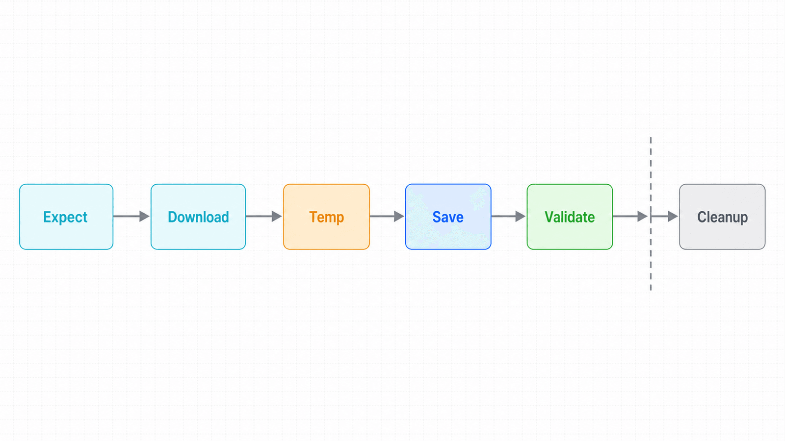
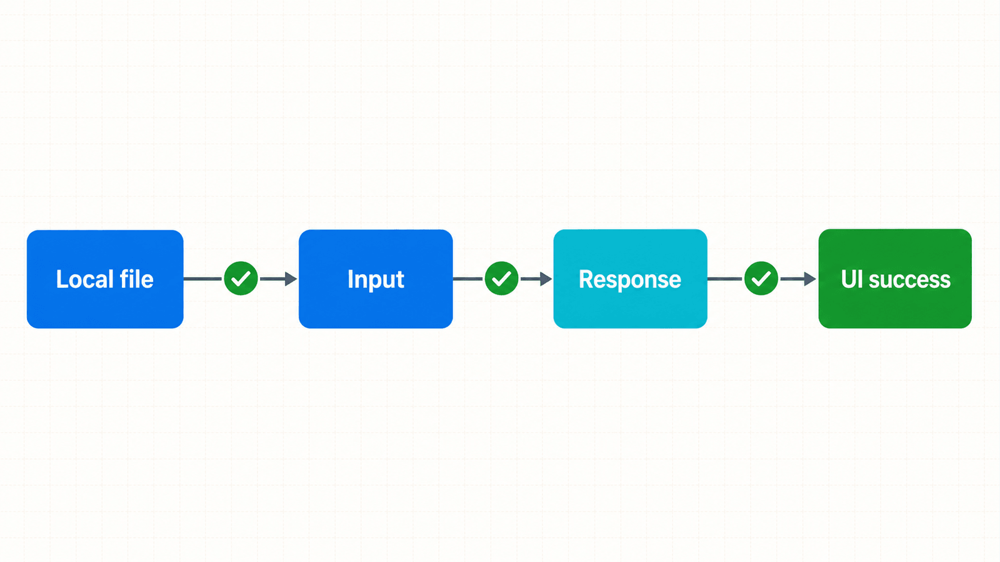

## 前置知识与学习目标

你应掌握事件先订阅后触发的规则。完成本篇后，你能够：

- 选择页面、全页、元素或内存截图，并理解各自用途；
- 在上下文关闭前可靠保存下载文件；
- 上传文件并验证服务端结果，而不仅是本地控件状态；
- 建立路径、命名、哈希、大小和敏感信息的证据合同。

## 场景：导出审核报表并上传回执

订单 RPA 需要导出 CSV、验证列头与记录数，再上传签收回执。文件不是一个“点击结果”，而是一条生命周期：触发 -> 临时下载 -> 持久化 -> 内容校验 -> 归档或清理。

<!-- figure:s08-f01 -->



## 截图是证据，不是唯一真相

```python
page.screenshot(path="artifacts/order-list.png")
page.screenshot(path="artifacts/order-list-full.png", full_page=True)
page.get_by_role("row").filter(has_text="ORD-2026-0042").screenshot(
    path="artifacts/order-0042.png"
)

# 返回 bytes，适合脱敏或上传前处理
image_bytes = page.screenshot()
```

页面截图适合记录当前视口，全页截图适合布局证据，元素截图适合最小化敏感信息。动态图、字体和动画会造成像素差异；功能测试优先语义断言，视觉回归才使用稳定环境下的快照比较。

## 下载：事件、临时文件与持久化

```python
from pathlib import Path

output_dir = Path("artifacts/downloads")
output_dir.mkdir(parents=True, exist_ok=True)

with page.expect_download() as download_info:
    page.get_by_role("button", name="导出 CSV").click()

download = download_info.value
target = output_dir / download.suggested_filename
download.save_as(target)

assert download.failure() is None
assert target.exists() and target.stat().st_size > 0
```

Playwright 默认把下载放在临时目录；产生下载的上下文关闭后，临时文件会被删除。因此必须在关闭前 `save_as()`。`suggested_filename` 来自服务端或浏览器，不能直接作为可信路径：生产代码应去除路径分隔符、限制扩展名并避免覆盖已有文件。

<!-- figure:s08-f02 -->



## 内容校验：从“有文件”到“文件正确”

CSV 报表至少校验：扩展名、MIME/响应头（若可得）、文件大小、UTF-8 解码、列头、记录数、订单 ID 去重和业务日期。高风险文件还应计算 SHA-256，记录到审计日志。

```python
import csv
import hashlib

digest = hashlib.sha256(target.read_bytes()).hexdigest()
with target.open(encoding="utf-8-sig", newline="") as stream:
    rows = list(csv.DictReader(stream))

assert rows
assert {"order_id", "status"} <= set(rows[0])
assert len({row["order_id"] for row in rows}) == len(rows)
print({"rows": len(rows), "sha256": digest})
```

大文件不要一次性 `list()`；应流式读取并设置大小上限。压缩包需防止路径穿越和解压炸弹。

## 上传：控件状态与服务端状态

```python
receipt = Path("fixtures/receipt.pdf").resolve()
assert receipt.suffix.lower() == ".pdf"

with page.expect_response("**/api/orders/0042/receipt") as response_info:
    page.get_by_label("上传回执").set_input_files(receipt)

response = response_info.value
assert response.ok
expect(page.get_by_role("status")).to_have_text("上传成功")
```

如果页面动态创建文件输入：

```python
with page.expect_file_chooser() as chooser_info:
    page.get_by_role("button", name="选择回执").click()
chooser_info.value.set_files(receipt)
```

不要用文件选择器自动化替代 `set_input_files()`；系统窗口不属于页面 DOM，跨平台行为也更脆弱。

## PDF 与浏览器边界

`page.pdf()` 依赖 Chromium 打印能力，不是三种浏览器统一特性。它适合生成打印版文档，不等于屏幕截图；打印 CSS、纸张尺寸、边距和背景色都需要单独验证。若业务要求跨浏览器 PDF，一般应由服务端文档生成链路负责。

## 路径、清理与安全

- 所有产物写入任务专属目录：`artifacts/<run_id>/`，避免并发覆盖。
- 名称包含业务 ID、UTC 时间和稳定类型，不包含用户密码或完整身份证号。
- 成功任务按保留策略清理临时证据；失败证据加密并限制访问。
- 上传前校验真实内容与大小，不能只信文件扩展名。
- 下载文件不自动执行、不直接打开宏文档，并使用杀毒/沙箱流程。

## 常见误区与不适用边界

1. **监听 `page.on("download")` 后主流程立即结束。** 事件回调分叉，文件可能尚未保存；已知动作优先 `expect_download()`。
2. **关闭上下文后再找临时下载。** 临时文件可能已被删除。
3. **文件名来自服务端所以可信。** 必须清洗路径并处理同名冲突。
4. **截图通过就代表业务正确。** 截图缺少结构化状态和网络证据。
5. **PDF 在所有浏览器行为一致。** `page.pdf()` 是 Chromium 边界。

## 自检题

1. 为什么 `download.save_as()` 必须在上下文关闭前执行？
2. 上传控件显示文件名后，还需验证什么？
3. 全页截图为什么不适合替代所有断言？

<details>
<summary>查看答案</summary>

1. Playwright 管理的临时下载会随上下文关闭而删除。
2. 上传响应、服务端状态、文件类型/大小与页面成功提示。
3. 截图是像素证据，无法稳定表达结构化业务结果，且易受动画和环境差异影响。

</details>

## 本篇总结

文件操作的正确抽象是受控生命周期：先订阅事件，持久化到安全路径，再验证内容并按策略清理。截图是诊断证据的一部分，不是业务成功的替代品。

## 下一篇衔接

下一篇把页面交互与文件证据组合成动态数据采集管线，并加入分页、去重、检查点、限速和合规边界。

## 资料来源

- [Playwright Python：Downloads](https://playwright.dev/python/docs/downloads)
- [Playwright Python：Screenshots](https://playwright.dev/python/docs/screenshots)
- [Playwright Python：Actions / Upload files](https://playwright.dev/python/docs/input)
