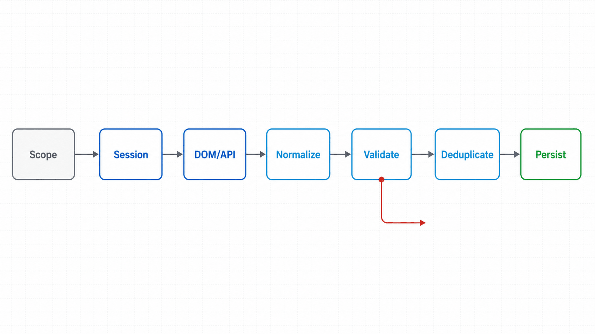
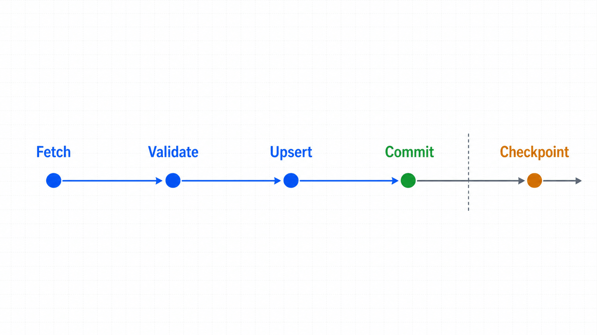

## 前置知识与学习目标

你应掌握 Locator、精确等待和下载生命周期。完成本篇后，你能够：

- 判断任务应读取 DOM、监听公开网络响应还是直接使用授权 API；
- 设计分页、去重、检查点和有界重试；
- 为每条记录保留来源与采集时间，验证输出质量；
- 识别 robots、服务条款、个人信息与访问控制边界。

## 场景：采集授权账号可见的订单列表

订单列表由前端调用 `/api/orders` 后动态渲染。Playwright 可以读取用户实际看到的表格，也可以在同一浏览器会话中等待对应响应。选择依据是合同：如果授权 API 稳定且允许直接调用，HTTP 客户端更轻；如果业务必须验证渲染、权限或交互后的数据，浏览器更合适。

<!-- figure:s09-f01 -->



```text
范围与许可
 -> 浏览器会话
 -> 触发分页/筛选
 -> DOM 或授权响应
 -> 规范化
 -> 质量校验
 -> 去重与检查点
 -> 持久化与审计
```

## DOM 与网络响应的选择

DOM 适合验证“用户最终看到什么”，但可能只包含当前页、格式化文本或虚拟滚动窗口。网络响应通常结构更完整，但其内部接口可能变化，也可能包含页面未展示的敏感字段。

```python
from playwright.sync_api import expect

page.goto("https://app.example.test/orders")
rows = page.get_by_role("row")
expect(rows).not_to_have_count(0)

records = []
for row in rows.all()[1:]:
    cells = row.get_by_role("cell").all_text_contents()
    records.append({"order_id": cells[0], "status": cells[2]})
```

若使用响应，先订阅再触发筛选：

```python
with page.expect_response(
    lambda response: "/api/orders" in response.url and response.ok
) as response_info:
    page.get_by_role("button", name="查询").click()

payload = response_info.value.json()
records = payload["items"]
```

不要从响应中保存超出业务授权范围的字段。浏览器能看到响应不等于组织已授权长期存储其全部内容。

## 分页、无限滚动与终止条件

分页循环必须有明确终止条件和安全上限：

```python
seen: set[str] = set()
records: list[dict] = []

for _ in range(100):  # 安全上限
    for row in page.get_by_role("row").all()[1:]:
        order_id, customer, status = row.get_by_role("cell").all_text_contents()[:3]
        if order_id not in seen:
            seen.add(order_id)
            records.append({"order_id": order_id, "customer": customer, "status": status})

    next_button = page.get_by_role("button", name="下一页")
    if next_button.is_disabled():
        break
    previous_first = records[-1]["order_id"]
    next_button.click()
    expect(page.get_by_role("row").nth(1)).not_to_contain_text(previous_first)
else:
    raise RuntimeError("超过分页安全上限，可能未正确终止")
```

无限滚动应等待“记录数增加”或“终止标记出现”，而不是固定滚动次数。若连续两轮没有新 ID，应记录停机原因并结束。

<!-- figure:s09-f02 -->



## 规范化、质量校验与检查点

每条记录至少附带 `source_url`、`collected_at`、`run_id` 和 schema 版本。写入前校验：必填字段、ID 格式、枚举值、重复率、记录数异常和时间范围。

检查点应记录“已持久化的最后稳定游标”，而不是“刚抓到但尚未落盘的页码”。写入与检查点更新要保持原子顺序：先写去重后的数据，确认成功，再推进游标。重复运行依靠业务主键 upsert，不能靠“希望上一批没有重复”。

## 失败分类、重试与背压

可重试：瞬时 5xx、连接重置、受控超时。不可盲重试：401/403、schema 变化、定位合同失效、验证码或明确限流拒绝。遇到 429 应遵守 `Retry-After`，降低并发，并与站点所有者确认配额。

不要通过伪造身份、绕过访问控制、随机化行为或规避反自动化机制获取未授权数据。本系列只讨论经授权的测试与业务自动化。

## 常见误区与不适用边界

1. **页面能打开就代表允许采集。** 还需核对授权、服务条款、robots 与数据保护要求。
2. **只保存最终 JSON。** 缺少来源、时间和 schema 版本后无法审计。
3. **无限滚动直到不动。** 广告、动画或虚拟列表会使页面高度不可靠，应观察新 ID。
4. **所有异常统一重试十次。** 权限与 schema 错误会制造重复压力。
5. **Playwright 是最高效采集器。** 对稳定授权 API，HTTP 客户端通常更省资源。

## 自检题

1. DOM 数据与网络响应数据各自代表什么合同？
2. 为什么检查点要在数据持久化成功后再推进？
3. 收到 403 时为何不应自动更换代理继续？

<details>
<summary>查看答案</summary>

1. DOM 代表用户最终看到的呈现，响应代表接口返回的结构化数据。
2. 否则崩溃会跳过尚未落盘的数据。
3. 403 是权限/策略信号；绕过它可能违反授权与合规边界，应停止并调查。

</details>

## 本篇总结

动态采集是带治理的数据管线，不是循环滚动。数据源选择、明确终止、质量校验、幂等写入、检查点和访问授权共同决定结果是否可用。

## 下一篇衔接

下一篇把同样的幂等、检查点和失败分类扩展到有副作用的业务流程，构建可恢复的 Playwright RPA 状态机。

## 资料来源

- [Playwright Python：Locators](https://playwright.dev/python/docs/locators)
- [Playwright Python：Network](https://playwright.dev/python/docs/network)
- [Playwright Python：Authentication](https://playwright.dev/python/docs/auth)
