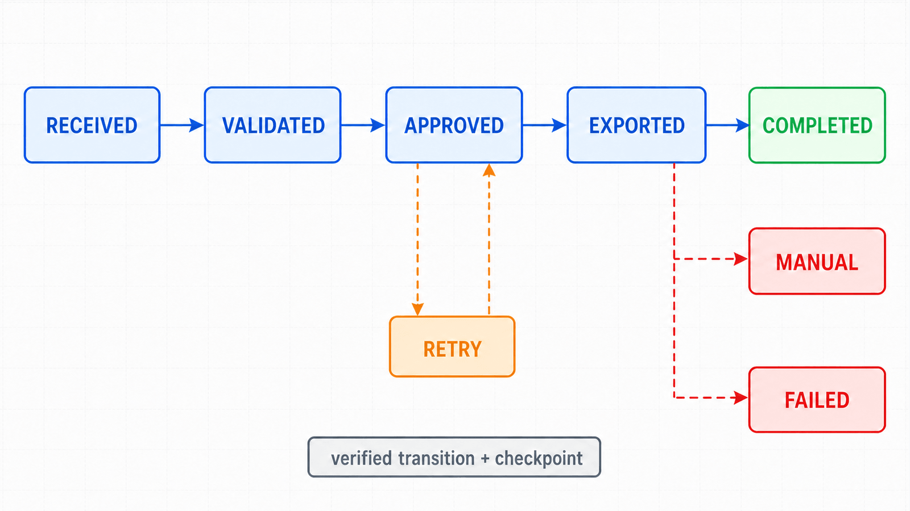
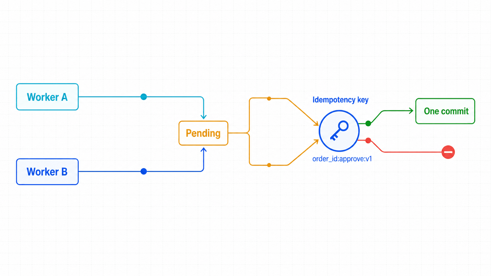

## 前置知识与学习目标

你应掌握上下文隔离、等待、断言、文件与检查点。完成本篇后，你能够：

- 把线性点击脚本建模为显式状态机；
- 用业务幂等键避免重复提交、重复付款或重复通知；
- 区分重试、恢复、补偿和人工介入；
- 为每次运行保留最小但完整的审计事件。

## 场景：审核、导出、归档三步流程

订单流程包含有副作用的操作：审批会改变状态，导出会生成文件，归档会移动记录。脚本在审批成功后崩溃，重启时不能再审批一次，也不能假装整个任务失败。线性脚本缺少恢复语义，状态机能明确“已经完成什么、接下来做什么”。

<!-- figure:s10-f01 -->



```text
RECEIVED
 -> VALIDATED
 -> APPROVED
 -> EXPORTED
 -> ARCHIVED
 -> COMPLETED

任一步骤：
可重试失败 -> RETRY_WAIT
需要人工判断 -> MANUAL_REVIEW
不可恢复失败 -> FAILED
```

## 状态、事件与不变量

状态是已确认的业务事实，事件是引起变化的动作。不变量必须在每次转移前后检查，例如：只有“待审核”订单可进入 `APPROVED`；导出文件哈希存在后才能进入 `EXPORTED`；同一订单和流程版本只能产生一个有效审批事件。

```python
from dataclasses import dataclass
from enum import Enum

class State(str, Enum):
    RECEIVED = "received"
    VALIDATED = "validated"
    APPROVED = "approved"
    EXPORTED = "exported"
    COMPLETED = "completed"
    MANUAL_REVIEW = "manual_review"

@dataclass(frozen=True)
class Job:
    run_id: str
    order_id: str
    state: State
    attempt: int

def idempotency_key(job: Job, step: str, version: int = 1) -> str:
    return f"{job.order_id}:{step}:v{version}"
```

## 幂等：先查业务结果，再决定是否执行

浏览器点击本身不是幂等的。恢复时应读取当前订单状态：若已批准，验证审批人和时间后直接推进检查点；若仍待审核，才执行动作；若状态未知或由他人修改，转人工复核。

```python
def ensure_approved(page, order_id: str) -> None:
    row = page.get_by_role("row").filter(has_text=order_id)
    status = row.get_by_test_id("order-status")

    if status.text_content() == "已通过":
        return
    if status.text_content() != "待审核":
        raise RuntimeError("状态不满足自动审批前置条件")

    row.get_by_role("button", name="审核").click()
    expect(status).to_have_text("已通过")
```

高风险动作最好由服务端接受幂等键；仅靠 UI 状态检查仍存在两个工作进程同时操作的竞态。RPA 调度器还需要按业务键加锁或使用唯一约束。

<!-- figure:s10-f02 -->



## 检查点、审计事件与恢复

每个成功状态转移写入结构化事件：`run_id`、`order_id`、前后状态、步骤、attempt、开始/结束时间、结果摘要和证据引用。先确认业务结果和产物持久化，再提交检查点。

```json
{
  "run_id": "run-20260715-001",
  "order_id": "ORD-2026-0042",
  "from": "validated",
  "to": "approved",
  "attempt": 1,
  "result": "verified",
  "evidence": "trace://run-20260715-001/approve.zip"
}
```

恢复器从最后一个已提交状态继续，并重新验证外部事实。检查点只是线索，目标系统当前状态才是事实来源。

## 重试、补偿与人工介入

| 失败类型 | 例子                 | 策略                         |
| -------- | -------------------- | ---------------------------- |
| 瞬时     | 连接重置、短暂 5xx   | 指数退避 + 抖动 + 次数上限   |
| 认证     | 401、会话过期        | 刷新受控凭据一次，失败则停止 |
| 业务冲突 | 状态已被他人改变     | 人工复核，不覆盖             |
| 数据错误 | 缺少订单号、金额异常 | 终止并隔离输入               |
| 部分成功 | 审批成功、归档失败   | 从已审批状态恢复；必要时补偿 |

补偿不是“反向点击”的通用方案。取消审批、退款或删除文件可能有不同权限与审计要求，必须由业务定义并测试。无法安全自动补偿时，转人工队列并冻结后续副作用。

## 凭据、调度与单实例边界

- 凭据来自 Secret Manager 或受控环境，不写入代码、截图和 trace。
- 同一业务键只允许一个活动任务；调度器触发不等于可以并行重复执行。
- 设置单次运行总预算、步骤预算和熔断阈值。
- 监控成功率、人工介入率、重试率、重复副作用数和恢复时长。

## 常见误区与不适用边界

1. **捕获异常后从第一步重跑。** 可能重复产生业务副作用。
2. **截图证明审批成功。** 应以目标系统状态或受信接口为事实来源。
3. **所有失败都自动补偿。** 补偿本身也是高风险业务动作。
4. **两个调度实例同时处理更快。** 没有业务锁和幂等约束会造成重复。
5. **验证码出现后自动绕过。** 应停止并进入经批准的人工流程。

## 自检题

1. 审批成功后进程崩溃，恢复时第一步是什么？
2. 为什么 UI 状态检查不能完全替代服务端幂等键？
3. 什么情况下应转人工复核而不是重试？

<details>
<summary>查看答案</summary>

1. 查询目标系统当前订单状态，验证审批事实，再从已完成状态继续。
2. 两个并发进程可能同时看到“待审核”并点击；服务端唯一约束才能关闭竞态。
3. 权限错误、业务冲突、输入异常、未知外部状态或高风险补偿都应人工判断。

</details>

## 本篇总结

生产级 RPA 的核心是副作用治理：状态机定义进度，幂等防重复，检查点支持恢复，失败分类决定重试或人工介入，审计事件证明发生过什么。

## 下一篇衔接

下一篇建立性能基线，区分真实浏览器体验测量与负载测试，并用分布、预算和环境标签避免错误结论。

## 资料来源

- [Playwright Python：Isolation](https://playwright.dev/python/docs/browser-contexts)
- [Playwright Python：Authentication](https://playwright.dev/python/docs/auth)
- [Playwright Python：Trace viewer](https://playwright.dev/python/docs/trace-viewer)
