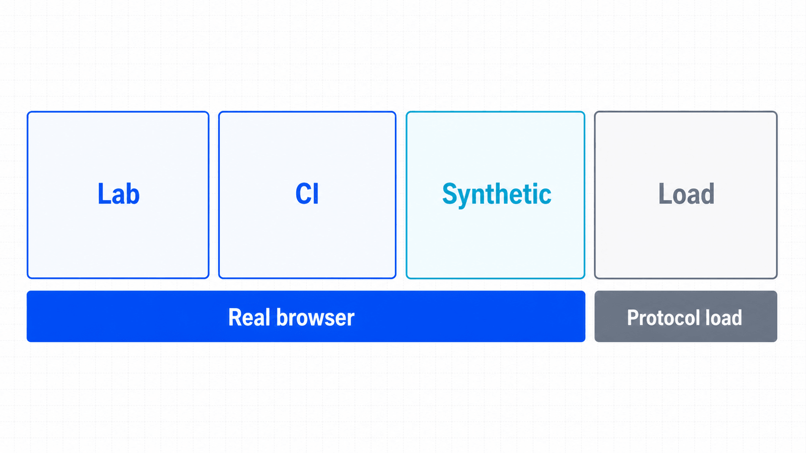
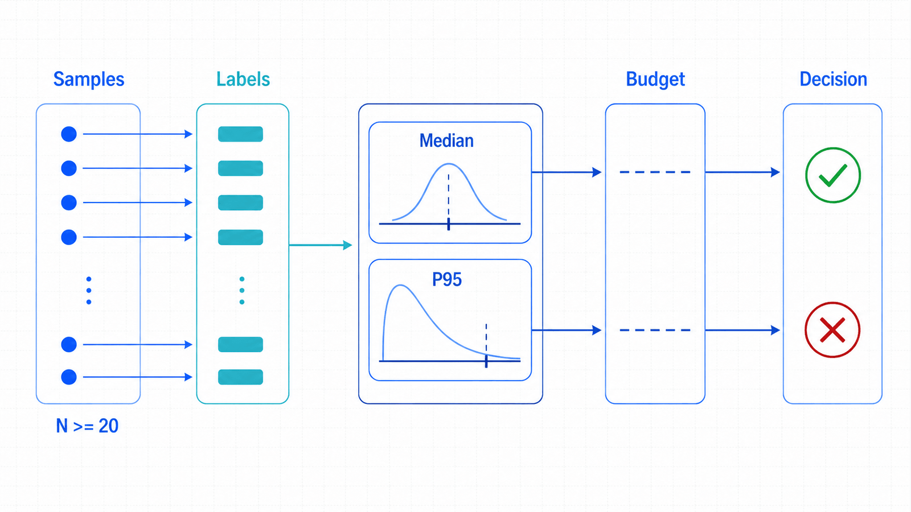

## 前置知识与学习目标

你应掌握等待信号、trace 与结构化运行事件。完成本篇后，你能够：

- 区分单用户体验测量、实验室基准、生产监控和负载测试；
- 采集导航时序、资源摘要与业务步骤时延；
- 用中位数、P95、样本量和环境标签解释结果；
- 设置性能预算并识别缓存、网络与冷启动等混杂因素。

## 首先明确：Playwright 不是负载测试器

Playwright 驱动完整浏览器，适合少量真实用户路径的体验与回归测量。用数百个浏览器制造吞吐既昂贵又难解释。高并发容量测试应由 k6、JMeter、Locust 等专用工具承担，Playwright 可以作为少量浏览器探针验证最终体验。

<!-- figure:s11-f01 -->



| 场景       | 关注对象               | Playwright 角色  |
| ---------- | ---------------------- | ---------------- |
| 实验室基准 | 固定环境中的页面与步骤 | 主测量工具       |
| CI 回归    | 变更前后差异           | 有控制地采样     |
| 生产监控   | 用户真实分布           | 辅助合成探针     |
| 负载/容量  | 系统吞吐、并发与饱和   | 不作为主要施压器 |

## 导航与资源时序

浏览器 Performance API 可在页面上下文返回结构化条目：

```python
page.goto("https://app.example.test/orders", wait_until="load")

timing = page.evaluate("""() => {
  const nav = performance.getEntriesByType('navigation')[0];
  const resources = performance.getEntriesByType('resource');
  return {
    navigation_ms: nav.duration,
    ttfb_ms: nav.responseStart,
    dom_content_loaded_ms: nav.domContentLoadedEventEnd,
    resource_count: resources.length,
    transfer_bytes: resources.reduce(
      (sum, item) => sum + (item.transferSize || 0), 0
    )
  };
}""")
```

`responseStart` 相对于导航起点，不是只包含服务器处理的纯 TTFB；DNS、连接、TLS、缓存等阶段都会影响结果。跨域资源可能因 Timing-Allow-Origin 等限制缺少部分字段。字段缺失应记录为缺失，不能填零。

## 业务步骤时延

用户关心的是“点击审核到看到成功”而不仅是页面 load：

```python
from time import perf_counter
from playwright.sync_api import expect

started = perf_counter()
page.get_by_role("button", name="确认审核").click()
expect(page.get_by_role("status")).to_have_text("审核成功")
approve_ms = (perf_counter() - started) * 1000
```

测量边界必须写清：起点是动作调用前，终点是业务成功状态可见。若终点改成接口返回，指标含义也改变。

<!-- figure:s11-f02 -->



## 样本、分布与环境标签

一次运行不能代表性能。先预热，再收集足够样本，至少报告样本量、median、P95、最大值和失败率。不要只平均成功样本；超时和失败本身是体验的一部分。

每条样本附带：commit、Playwright/浏览器版本、OS、CPU runner、视口、headless/headed、网络条件、缓存状态、时间和目标环境。没有这些标签，跨天或跨机器对比可能没有意义。

性能预算示例：

```json
{
  "scenario": "approve-order",
  "sample_size_min": 20,
  "p95_ms_max": 2500,
  "failure_rate_max": 0.01,
  "environment": "ci-linux-chromium-cold-context"
}
```

CI 共享 runner 噪声较大，宜使用稳定专用 runner 或比较同批基线与候选，而不是把极小变化当回归。预算应结合历史数据和用户目标定期校准。

## 网络条件与缓存控制

Playwright 可监听请求/响应并统计失败，但浏览器级网络模拟能力和 CDP 细节存在浏览器边界。跨浏览器基准应使用外部网络整形或受控实验环境。冷缓存与热缓存是两种不同场景，应分别命名和测量。

不要为了“稳定”而拦截图片后宣称页面性能变好；这改变了被测系统。网络拦截更适合故障实验或隔离第三方依赖，结果必须标注。

## 常见误区与不适用边界

1. **启动 100 个浏览器就是压测。** 资源开销会首先压垮执行机，结果不代表服务器容量。
2. **只报告平均值。** 长尾与失败会被平均值隐藏。
3. **跨机器直接比较毫秒数。** 硬件、浏览器、网络和缓存不同会混淆结果。
4. **页面 load 结束等于业务完成。** SPA 数据和用户状态可能随后才可用。
5. **trace 就是零开销测量。** 追踪和截图会影响时延，基准运行应明确是否启用。

## 自检题

1. 为什么 Playwright 适合体验探针而不适合主要负载施压？
2. P95 比平均值多揭示了什么？
3. 为什么冷缓存和热缓存不能混在同一分布中？

<details>
<summary>查看答案</summary>

1. 完整浏览器成本高，适合真实路径；负载工具能更高效、可控地制造协议级并发。
2. P95 揭示慢端长尾，平均值可能被大量快样本稀释。
3. 两者代表不同用户场景和资源命中路径，混合后指标不可解释。

</details>

## 本篇总结

可信性能结论来自清晰测量边界、重复样本、分布统计、环境标签和预算。Playwright 测量少量真实浏览器路径，容量与吞吐交给专用负载工具。

## 下一篇衔接

下一篇利用网络监听与路由做可控故障实验：观察、修改、模拟或中止请求，同时避免作用域和 Service Worker 陷阱。

## 资料来源

- [Playwright Python：Evaluating JavaScript](https://playwright.dev/python/docs/evaluating)
- [Playwright Python：Network](https://playwright.dev/python/docs/network)
- [Playwright Python：Trace viewer](https://playwright.dev/python/docs/trace-viewer)
